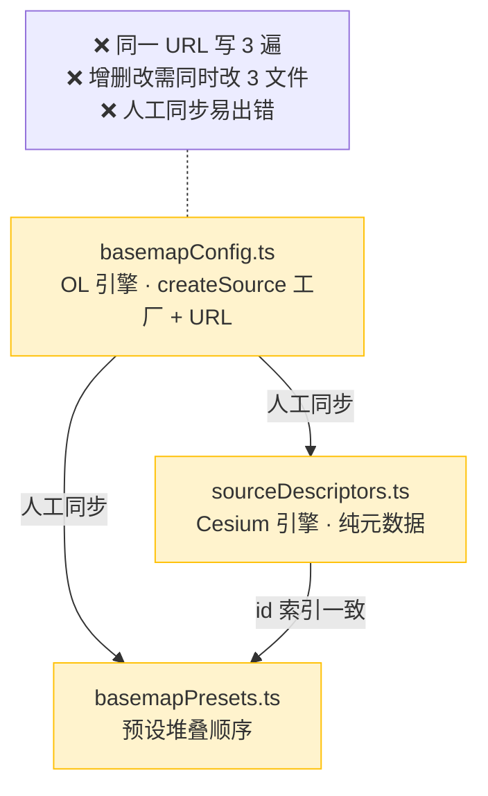
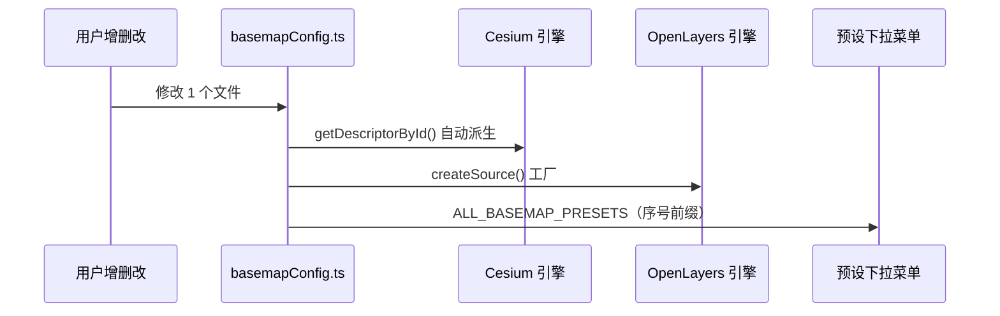

# 底图配置架构重构方案：单一真相源 + Cesium 自动派生

> **任务等级**：L3（架构级）
> **日期**：2026-08-02
> **状态**：待批准

---

## 1. 核心症状

当前底图配置分散在 3 个文件中，通过「人工保持同步」的方式维护一致性：

| 文件 | 引擎 | 内容 | 行数 |
|---|---|---|---|
| `basemapConfig.ts` | OpenLayers | `createSource` 工厂 + URL | ~1267 |
| `sourceDescriptors.ts` | Cesium | 纯元数据（id/name/category/url） | ~887 |
| `basemapPresets.ts` | 无引擎依赖 | 预设堆叠顺序 | ~215 |

**痛点**：
- 增删改一个底图需同时改 3 个文件，人工同步易出错
- `sourceDescriptors.ts` 是 `basemapConfig.ts` 的真子集（字段完全重复）
- 文件头注释写着「三个文件必须同步」本身就是架构负债

---

## 2. 根本原因

历史演化路径：
1. 先有 `basemapConfig.ts`（OL 专用，含 createSource 工厂）
2. 引入 Cesium 时，Cesium 不需要工厂函数只需要元数据，于是复制一份 → `sourceDescriptors.ts`
3. 为了优化登录页打包体积，抽离 `basemapPresets.ts`

结果：同一份知识（底图 URL / id / name）存在 3 处，违反 SSOT 原则。

---

## 3. 目标架构

### 调整前（3 文件人工同步）



### 调整后（1 文件 + 自动派生）

```mermaid
graph TD
    A[basemapConfig.ts<br/>唯一真相源 · plaintext URL + 元数据 + 工厂] -->|自动派生<br/>getDescriptorById()| B[Cesium ImageryProvider]
    A -->|序号前缀| C[ALL_BASEMAP_PRESETS<br/>人工配置 + 序号前缀]
    A -->|createSource 工厂| D[OpenLayers XYZ/OSM/WMS]

    style A fill:#d4edda,stroke:#28a745
    style B fill:#d1ecf1,stroke:#17a2b8
    style C fill:#d1ecf1,stroke:#17a2b8
    style D fill:#d1ecf1,stroke:#17a2b8

    note1["✅ URL 只写 1 次<br/>✅ Cesium 自动派生<br/>✅ Presets 序号对齐 URL 参数"]
    note1 -.- A
```

### 数据流对比



---

## 4. 关键发现（分析阶段已完成）

### 4.1 代理 URL 机制（已读后端 `proxy.py` 确认）

后端路由是 **path-based**，不是 query-based：
```
/proxy/{target_url:path}              ← 通用流式代理
/proxy/gcj2wgs/{target_url:path}      ← GCJ→WGS 纠偏
/proxy/wgs2gcj/{target_url:path}      ← WGS→GCJ 纠偏
/tiles/ships66/{z}/{x}/{y}.png        ← 专用海图代理
```

前端代理函数（`publicRuntime.ts`）：
```ts
tileProxyUrl('mt1.google.com/vt/lyrs=s&x={x}&y={y}&z={z}')
→ 'https://domain.com/proxy/mt1.google.com/vt/lyrs=s&x={x}&y={y}&z={z}'

gcj2wgsProxyUrl('http://webst01.is.autonavi.com/...')
→ 'https://domain.com/proxy/gcj2wgs/http://webst01.is.autonavi.com/...'
```

**关键结论**：`{x}/{y}/{z}` 保留在 path 里，Cesium `UrlTemplateImageryProvider` 完全可以解析。代理函数是纯字符串拼接，对 Cesium 天然兼容。

### 4.2 当前 URL 已经是 plaintext

`basemapConfig.ts` 中的 URL 实际上已经是 plaintext（不含环境变量动态拼接），因为：
- `TILE_PROXY_BASE_URL` 在应用启动时确定，不会运行时变化
- `buildTiandituUrl()` 只是字符串拼接，结果在运行时确定
- `buildGoogleTileUrl()` 使用 `activeGoogleTileHost`（响应式 ref）— **这是唯一真正的运行时动态**，但用户已确认该机制已废弃

### 4.3 影响范围分析

删除 `sourceDescriptors.ts` 需要同步修改的引用点：

| 文件 | 当前 import | 修改后 |
|---|---|---|
| `constants/index.ts` | re-export sourceDescriptors | 删除相关导出 |
| `cesium/constants/basemapProviderFactory.ts` | `getDescriptorById` + `TileSourceDescriptor` | 改为从 basemapConfig 派生 |
| `cesium/composables/layers/layerUtils.js` | `getDescriptorById` | 改为从 basemapConfig 派生 |

---

## 5. 实施方案

### 阶段一：改造 `basemapConfig.ts`

#### 5.1.1 新增 `url` 字段到 `LayerSourceDefinition`

当前：
```ts
export type LayerSourceDefinition = {
    id: string;
    name: string;
    category: LayerCategory;
    group: LayerGroup;
    defaultVisible?: boolean;
    createSource: (ctx: LayerFactoryContext) => TileSourceInstance;
};
```

改为：
```ts
export type LayerSourceDefinition = {
    id: string;
    name: string;
    category: LayerCategory;
    group: LayerGroup;
    defaultVisible?: boolean;
    /** plaintext URL 模板（含 {x}/{y}/{z}/{s}/{tiandituTk} 等占位符） */
    url: string;
    /** 最大缩放级别 */
    maxZoom?: number;
    /** 瓦片像素比（@2x HD 瓦片设为 2） */
    tilePixelRatio?: number;
    /** 子域名列表 */
    subdomains?: string[];
    /** 运行时需要替换的占位符列表 */
    needsContext?: ('tiandituTk' | 'customUrl')[];
    /** 非标准适配器 ID */
    nonStandardAdapter?: string;
    /** WMS 专属参数 */
    wms?: { layers: string; version?: string; srs?: string; format?: string; styles?: string; transparent?: boolean; };
    /** WMTS 专属参数 */
    wmts?: { layer: string; style: string; matrixSet: string; format: string; version: string; };
    /** OL source 工厂（仅 OL 引擎使用） */
    createSource: (ctx: LayerFactoryContext) => TileSourceInstance;
};
```

#### 5.1.2 删除废弃的 Google 主机切换机制

删除：
```ts
export const GOOGLE_MANUAL_HOST = 'gac-geo.googlecnapps.club';
export const activeGoogleTileHost = ref(GOOGLE_MANUAL_HOST);
export const buildGoogleTileUrl = (pathAndQuery: string) =>
    `https://${activeGoogleTileHost.value}${pathAndQuery}`;
```

对应的 `imagery_gac` 改为直接硬编码 URL：
```ts
{
    id: 'imagery_gac',
    name: 'Google(gac)',
    category: 'imagery',
    group: '影像',
    url: 'https://gac-geo.googlecnapps.club/maps/vt?lyrs=s&x={x}&y={y}&z={z}',
    maxZoom: 20,
    createSource: () => prioritizeTileSourceRequest(new XYZ({ url: 'https://gac-geo.googlecnapps.club/maps/vt?lyrs=s&x={x}&y={y}&z={z}', maxZoom: 20 })),
}
```

#### 5.1.3 为每个 definition 补充 `url` 字段

对每个图层定义，将 `createSource` 中的 URL 提取到顶层 `url` 字段。示例：

```ts
{
    id: 'imagery_google',
    name: 'Google原版',
    category: 'imagery',
    group: '影像',
    url: 'https://mt1.google.com/vt/lyrs=s&x={x}&y={y}&z={z}',
    maxZoom: 20,
    createSource: () => prioritizeTileSourceRequest(new XYZ({ url: 'https://mt1.google.com/vt/lyrs=s&x={x}&y={y}&z={z}', maxZoom: 20 })),
},
{
    id: 'label_tianditu',
    name: '天地图注记',
    category: 'label',
    group: '注记',
    url: 'https://t{s}.tianditu.gov.cn/cia_w/wmts?SERVICE=WMTS&REQUEST=GetTile&VERSION=1.0.0&LAYER=cia&STYLE=default&TILEMATRIXSET=w&FORMAT=tiles&TILEMATRIX={z}&TILEROW={y}&TILECOL={x}&tk={tiandituTk}',
    subdomains: ['0','1','2','3','4','5','6','7'],
    needsContext: ['tiandituTk'],
    createSource: ({ tiandituTk }) => withSkipHighResTile(prioritizeTileSourceRequest(new XYZ({ url: buildTiandituUrl('/cia_w/wmts?...', tiandituTk) }))),
},
{
    id: 'imagery_amap_wgs',
    name: '高德影像(WGS)',
    category: 'imagery',
    group: '影像',
    url: gcj2wgsProxyUrl('http://webst01.is.autonavi.com/appmaptile?style=6&x={x}&y={y}&z={z}'),
    createSource: () => prioritizeTileSourceRequest(new XYZ({ url: gcj2wgsProxyUrl('http://webst01.is.autonavi.com/appmaptile?style=6&x={x}&y={y}&z={z}') })),
}
```

> **注意**：代理函数调用结果（如 `gcj2wgsProxyUrl('...')`）在模块加载时求值，结果是一个 plaintext 字符串。Cesium 可以直接使用这个结果。

#### 5.1.4 新增 `getDescriptorById` 函数（从 basemapConfig 派生）

```ts
/**
 * 根据 id 获取 Cesium 兼容的图层描述符
 * 从 LAYER_SOURCE_DEFINITIONS 自动派生，无需人工维护
 */
export function getDescriptorById(id: string): TileSourceDescriptor | undefined {
    const def = LAYER_SOURCE_MAP.get(id);
    if (!def) return undefined;
    return {
        id: def.id,
        name: def.name,
        category: def.category,
        group: def.group,
        serviceType: inferServiceType(def),  // 从 url/wms/wmts 推断
        url: def.url,
        maxZoom: def.maxZoom,
        tilePixelRatio: def.tilePixelRatio,
        subdomains: def.subdomains,
        nonStandardAdapter: def.nonStandardAdapter,
        needsContext: def.needsContext,
        wms: def.wms,
        wmts: def.wmts,
    };
}
```

#### 5.1.5 删除 `sourceDescriptors.ts` 文件

#### 5.1.6 更新 `index.ts` 导出

```ts
// 删除
export type { TileSourceDescriptor } from './sourceDescriptors';
export { TILE_SOURCE_DESCRIPTORS, getDescriptorById, getAllDescriptorIds } from './sourceDescriptors';

// 改为
export type { TileSourceDescriptor } from './basemapConfig';
export { getDescriptorById, getAllDescriptorIds } from './basemapConfig';
```

### 阶段二：改造 Cesium 侧引用

#### 5.2.1 `cesium/constants/basemapProviderFactory.ts`

```ts
// 修改前
import type { TileSourceDescriptor } from '@ol/basemap/constants/sourceDescriptors';
import { getDescriptorById } from '@ol/basemap/constants/sourceDescriptors';

// 修改后
import type { TileSourceDescriptor } from '@ol/basemap/constants/basemapConfig';
import { getDescriptorById } from '@ol/basemap/constants/basemapConfig';
```

#### 5.2.2 `cesium/composables/layers/layerUtils.js`

```ts
// 修改前
import { getDescriptorById } from '@ol/basemap/constants/sourceDescriptors';

// 修改后
import { getDescriptorById } from '@ol/basemap/constants/basemapConfig';
```

### 阶段三：Presets 加序号前缀

#### 5.3.1 修改 `basemapPresets.ts`

```ts
/** 完整 preset 列表，label 带序号前缀（与 URL 参数 l 索引一致，从 0 开始） */
export const ALL_BASEMAP_PRESETS: BasemapPresetDefinition[] = BASEMAP_PRESETS.map((preset, index) => ({
    ...preset,
    label: `${index} ${preset.label}`,
}));

/** URL 图层选项列表（与 ALL_BASEMAP_PRESETS 同序） */
export const URL_LAYER_OPTIONS = ALL_BASEMAP_PRESETS.map((preset) => preset.id);
```

#### 5.3.2 更新消费方

`basemapResolver.ts` 中改为使用 `ALL_BASEMAP_PRESETS`：
```ts
import { ALL_BASEMAP_PRESETS } from './basemapPresets';

const BASEMAP_PRESET_MAP = new Map(ALL_BASEMAP_PRESETS.map(item => [item.id, item]));
```

---

## 6. 影响范围

### 6.1 文件改动清单

| 文件 | 操作 | 改动说明 |
|---|---|---|
| `basemapConfig.ts` | **修改** | 新增 url 字段、getDescriptorById；删除 Google 切换机制 |
| `sourceDescriptors.ts` | **删除** | 由 basemapConfig 自动派生 |
| `basemapPresets.ts` | **修改** | 新增 ALL_BASEMAP_PRESETS（序号前缀） |
| `basemapResolver.ts` | **修改** | 使用 ALL_BASEMAP_PRESETS |
| `constants/index.ts` | **修改** | 更新导出源 |
| `cesium/.../basemapProviderFactory.ts` | **修改** | import 路径变更 |
| `cesium/.../layerUtils.js` | **修改** | import 路径变更 |

### 6.2 不改动的文件

- `publicRuntime.ts` — 代理函数保留（仍被 basemapConfig 内部使用）
- 后端 `proxy.py` — 零改动
- 其他消费 `URL_LAYER_OPTIONS` / `BASEMAP_OPTIONS` / `resolvePresetLayerIds` 的文件 — 接口不变

---

## 7. 风险与缓解

| 风险 | 概率 | 缓解措施 |
|---|---|---|
| Cesium 不支持某些 URL 格式（如 MFF 非标准） | 已知 | `buildMffCesiumUrl` 已返回 null，行为不变 |
| 代理 URL 在 Cesium 中 path 解析异常 | 低 | 代理函数结果是 plaintext，`{x}/{y}/{z}` 在 path 中清晰可见 |
| 自动兜底 preset 导致 UI 列表变长 | 低（未实现） | 后续可选实现 |
| `serviceType` 推断逻辑错误 | 低 | 显式标注 serviceType 字段，不从 URL 推断 |

---

## 8. 验证方案

### 8.1 Agent 已执行（实施后）
- `tsc --noEmit` 零新报错
- `npm run build` 构建通过
- 检查所有 `getDescriptorById` 调用点 import 路径正确

### 8.2 待用户实机验证
- OL 引擎：切换所有底图预设，确认瓦片正常加载
- Cesium 引擎：切换所有底图预设，确认瓦片正常加载
- 代理图层（高德 WGS、Google 后端代理）：确认纠偏/代理生效
- 天地图图层：确认 token 注入正常
- 自定义 URL（custom）：确认输入 URL 后正常加载
- 自动兜底 preset：在 UI 底部可见「Other: xxx」选项（未实现，本次不包含）

---

## 9. DoD（完成定义）

- [ ] 代码改动完成，遵守分层边界
- [ ] `tsc --noEmit` 零新报错
- [ ] 维护日志已创建
- [ ] 根 README.md 三处版本号已更新
- [ ] CHANGELOG.md 已追加条目
- [ ] `frontend-structure.md` 结构树已同步（sourceDescriptors.ts 删除）
- [ ] 门禁脚本通过（CheckStructureTree / CheckConfigRegistry）
- [ ] 未执行 Git 写操作
- [ ] 已输出交接块

---

*方案结束。请审阅并批准/修改后，进入实施阶段。*
