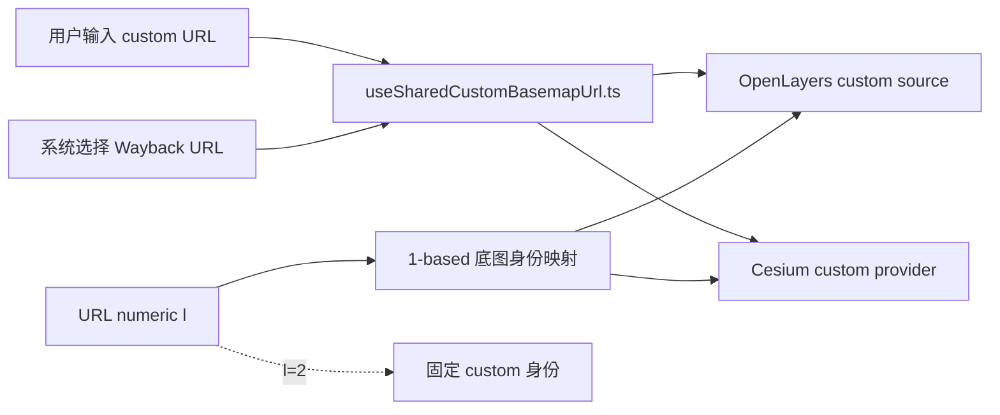
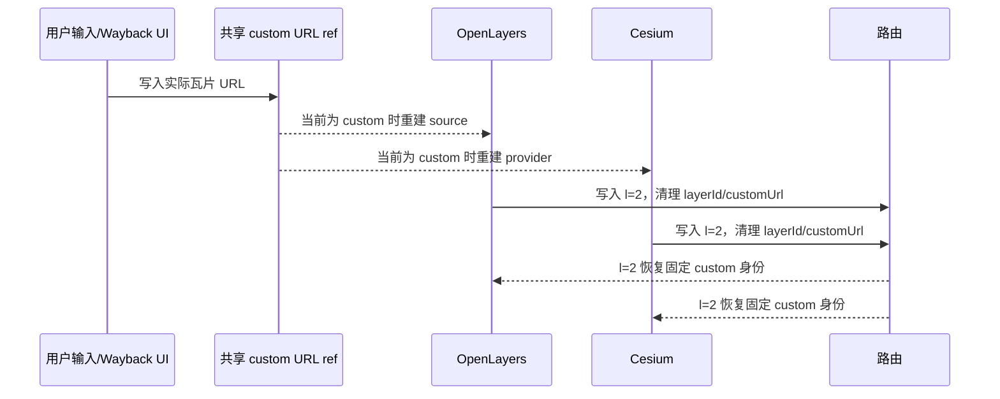

# 双引擎底图身份与 custom/Wayback URL 共享方案

- **方案日期**：2026-08-20
- **修订日期**：2026-08-21
- **任务等级**：L3（原始跨引擎方案）；V3.5.27 以 L2 修复 URL 契约
- **状态**：已实施

## 1. 背景与问题分析

OL 与 Cesium 都支持固定的 `custom` 底图身份，ESRI Wayback 快照也复用该身份。此前实现把两个不同概念混在同一条路由中：

1. `l` 本应只表示底图身份，却曾出现字符底图 ID 与 0-based 数字索引并存。
2. 实际 custom/Wayback 瓦片 URL 曾通过 `customUrl` 查询参数、`HomeView` prop/event 和两个引擎本地状态多层中转。
3. OL 与 Cesium 因此可能恢复出不同底图，Cesium 相机写回还会重新生成字符参数或实际 URL。
4. Wayback 是运行时目录数据，不应为每个快照注册新底图 ID，也不应污染静态底图注册表。

V3.5.27 将“底图身份”和“custom 实际 URL”拆成两条独立状态链路。

## 2. 最终契约

### 2.1 公开 URL 参数

公开路由只使用 1-based 数字 `l`：

```text
l=1 -> local_tiles_preset
l=2 -> custom / Wayback
l=3 -> imagery_tianditu_preset
...
```

约束：

- `l=2` 永久表示固定身份 `custom`，OL 与 Cesium 使用同一映射。
- 路由不再携带实际 custom/Wayback URL。
- `layerId` 与 `customUrl` 只作为历史链接字段识别或清理；后续任意 URL 写回都会删除它们。
- 合法数字 `l` 的优先级高于旧 `layerId`。
- 管理员配置 `default_basemap_index` 仍是内部 0-based 数组索引，不属于公开 URL 契约。

### 2.2 实际 custom/Wayback URL

实际瓦片 URL 由以下模块作为运行时唯一状态源：

```text
frontend/src/domains/common/basemap/useSharedCustomBasemapUrl.ts
```

该模块提供模块级唯一 Vue `ref`：

- 用户手动输入 custom URL 时写入该 `ref`。
- 用户选择 Wayback 快照时把快照 `xyz_url` 写入同一 `ref`。
- OL 与 Cesium 直接 import 同一 composable，不经过路由、父组件 prop 或子组件 update event。
- `localStorage` 键 `webgis_custom_basemap_url` 负责同一浏览器的刷新与跨会话恢复。
- 旧 Cesium 键 `cesium_custom_xyz_basemap_url` 仅用于读取兼容。

## 3. 数据模型与职责边界

```ts
type BasemapSelection = {
    id: string;                 // 静态预设 ID，或固定的 'custom'
    customUrl?: string;         // 仅供 UI 事件/卷帘比较等运行时场景使用
    source: 'preset' | 'custom';
};
```

职责划分：

- `basemapPresets.ts`：静态预设顺序与 ID。
- `basemapOptions.ts`：1-based URL 数字与底图 ID 的双向纯函数映射。
- `basemapRegistry.ts`：选择规范化、旧链接兼容与历史年份分组；不序列化实际 custom URL。
- `useSharedCustomBasemapUrl.ts`：custom/Wayback 实际 URL 的运行时 SSOT 与本地持久化。
- `useMapState.js` / `useCesiumUrlTracking.js`：只读写数字 `l`，并清理旧 `layerId/customUrl`。
- OL/Cesium 图层模块：监听共享 URL；当前底图为 `custom` 时重建各自 source/provider。

## 4. 数据流



详细时序：



## 5. 引擎切换规则

- OL → Cesium：根据当前数字 `l` 映射底图身份；若为 `l=2`，Cesium 从共享 `ref` 创建 custom provider。
- Cesium → OL：同样根据数字 `l` 映射；若为 `l=2`，OL 从共享 `ref` 创建 custom source。
- 相机或视图变化只更新视图参数与数字 `l`，不得把 `customUrl` 或字符 `layerId` 写回地址栏。
- Cesium 当前处于 `custom` 时，共享 URL 变化会立即强制重建 provider，确保 Wayback/用户输入即时生效。

## 6. 历史影像与卷帘

- Wayback 目录只提供日期、年份、展示元数据和 `xyz_url`，不注册动态底图 ID。
- 点击任意 Wayback 快照固定切换到 `id='custom'`，并把 `xyz_url` 写入共享 store。
- 历史影像列表按年份折叠，条目显示日期。
- 卷帘左右两侧可以各自保存比较用 custom URL；这是分析工具局部状态，不改变主引擎只有一个共享 custom URL 的规则。

## 7. 持久化与分享边界

- 同一浏览器、同一站点：共享 URL 通过 `localStorage` 恢复，OL/Cesium 可继续使用最近一次 custom/Wayback URL。
- 跨设备或只复制分享链接：链接只携带 `l=2`，不会携带本机实际 custom URL。这是避免敏感或超长图源地址进入公开 URL 的预期边界。
- 若目标浏览器没有保存过 custom URL，`l=2` 只能恢复 custom 身份，用户仍需输入或选择一次 Wayback URL。

## 8. 兼容策略

- 读取旧 `layerId` 链接用于兼容，但下一次写回会迁移为数字 `l` 并删除 `layerId`。
- 旧 `customUrl` 不再用于恢复共享 URL，下一次写回会删除该字段。
- 旧 Cesium localStorage 键只读兼容；新写入统一使用 `webgis_custom_basemap_url`。
- 不兼容把 `l=custom` 等字符值当作合法公开参数；参数校验只接受 `1..URL_LAYER_OPTIONS.length` 的整数。

## 9. 用户决策

用户最终确认：

1. `l=2` 就是 custom/Wayback。
2. OL 与 Cesium 的 `l` 必须完全同步且始终为数字。
3. custom/Wayback 实际 URL 只保存在一个共享状态文件中，由两个引擎直接消费。
4. URL 不再承担实际 custom URL 的跨引擎共享职责。
