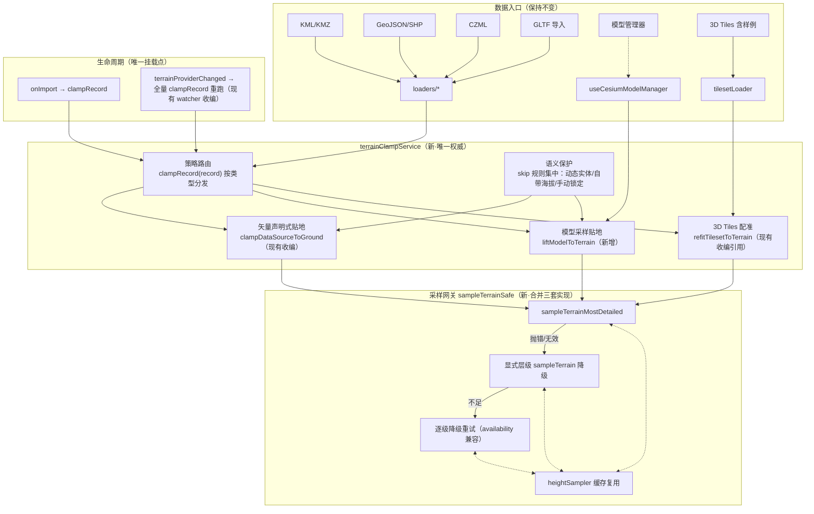

# Cesium 导入数据贴地策略统一重构方案

> 状态：**已批准并实施**（2026-08-22 用户批准，随合并版本 V3.5.26 交付；勘误见维护日志——① 本项目 ArcGIS/天地图 provider 均已实现 availability；② 方案中「glTF 维持采样抬升、Entity 化立项 TODO」的中期裁决被第四轮迭代取代，最终以 Entity ModelGraphics heightReference 落地，详见维护日志「四轮收敛」节）
> 日期：2026-08-22
> 关联：`Docs/TODO/bugfix-optimization-plan.md`

---

## 1. 问题陈述

Cesium 场景默认开启天地图世界地形（V3.5.27 起），但**导入数据（含样例数据）默认不贴地或贴地行为不一致**。现有贴地措施零散分布在 6+ 处，策略互相矛盾、兜底方式危险。

## 2. 现状盘点（逐文件核实）

### 2.1 已有机制

| 数据路径 | 现有贴地机制 | 位置 |
|---|---|---|
| KML/KMZ/CZML | `clampDataSourceToGround()` 统一实体贴地 | `loaders/kmlLoader.js:177`、`czmlLoader.js:34` |
| GeoJSON/SHP | `GeoJsonDataSource.load({clampToGround:true})` + 统一贴地补硬 | `geojsonLoader.js:35,48`、`shpLoader.js:52,64` |
| GLTF（数据导入域） | 嵌入坐标时单点采样抬升；采样失败**关闭全局地形** | `gltfLoader.js:37-58` ⚠️ |
| 3D Tiles | 「贴地 2.0」叶子包围盒基底 × 地形中位数配准 + 手动滑杆 | `tilesetLoader.js:126-400` |
| 样例 3D Tiles | 同走 `fitTilesetToTerrain()`（baimo 远程源 rootJsonUrl 本地不存在→静默退化运行时树遍历） | `tilesetLoader.js:1132-1250` |
| 地形切换 | `terrainProviderChanged` 监听 → 矢量重贴 + tileset 重配准（幂等） | `useCesiumDataImport.js:60-110` |
| 高度采样器 | `useCesiumHeightSampler`（缓存 + 批量采样 + 进度） | `terrain/useCesiumHeightSampler.js` |

### 2.2 发现的问题（按严重度）

| # | 问题 | 位置 | 严重度 |
|---|---|---|---|
| P1 | **危险兜底**：GLTF 单点采样失败/无结果 → 直接 `viewer.terrainProvider = new EllipsoidTerrainProvider()` 关闭**全局**地形，并连锁触发 refit watcher 二次扰动 | `gltfLoader.js:52-56` | 🔴 高 |
| P2 | **双模型路径不一致**：模型管理器添加模型完全无贴地（`height ?? 0` 直接 `fromDegrees`），与数据导入域 GLTF 行为割裂 | `useCesiumModelManager.js:75` | 🔴 高 |
| P3 | **三套高度采样实现并存**：① `useCesiumHeightSampler`（缓存全、但用 `provider._bottomLevel` 私有字段，脆弱）② `tilesetLoader.sampleTerrainBatch`（兼容链最完善：mostDetailed→显式层级→降级重试，处理 availability provider 抛错）③ `gltfLoader` 内联单点采样（无任何容错降级） | 三处 | 🟡 中 |
| P4 | **isTerrainEnabled 判断脆弱**：`constructor !== EllipsoidTerrainProvider` 引用比较——当前经 cesium-shim 默认 Proxy 取得真类可用，若改为命名导入即失效；且未覆盖未来其他平面 provider | `clampToGround.js:26-29` | 🟡 中 |
| P5 | **语义保留被感知为"没贴地"**：时间动态实体（CZML 轨迹）、自带海拔数据（perPositionHeight=true）、已有非 NONE heightReference 的实体被幂等跳过——设计合理但无 UI 提示，用户不知道哪些跳过了、为什么 | `clampToGround.js:55-66` | 🟢 低 |
| P6 | 分析模块（限高/通视）自建临时实体不在管道内（一次性可视化，影响小） | `modules/analysis/*` | 🟢 低 |

### 2.3 官方 API 基准（来源：cesium-skills patterns.md + Cesium 文档）

- 点/标注/billboard/模型：`heightReference: HeightReference.CLAMP_TO_GROUND`（+ `disableDepthTestDistance` 防地形遮挡）
- 线：Entity `polyline.clampToGround: true`（底层 GroundPolylinePrimitive）
- 面：`heightReference: CLAMP_TO_GROUND` + `perPositionHeight: false`
- 显式采样：`await Cesium.sampleTerrainMostDetailed(provider, cartographics)`（异步，需地形就绪）
- GeoJSON 一把梭：`GeoJsonDataSource.load(url/data, { clampToGround: true })`
- **没有全局「场景级 clampToGround」开关**——Cesium 不存在一键让所有数据贴地的 API，必须按几何类型逐项设置属性，或在加载前采样高度写进坐标。这正是需要统一策略层的原因。

---

## 3. 重构目标

1. **单一事实来源**：贴地能力收敛为一个权威模块，所有数据路径只调它
2. **安全第一**：任何单点失败不得影响全局地形或其他数据
3. **语义尊重**：数据自带海拔/动画轨迹默认保留，但可强制覆盖且对用户可见
4. **时序完备**：导入时贴地 + 地形切换后自动重贴，两条链路全覆盖（现状已基本具备，收编为唯一入口）

## 4. 目标架构



### 4.1 模块落位（遵守 dev-conventions 分层）

```
frontend/src/domains/cesium/composables/terrain/
├── useCesiumHeightSampler.js      # 保留，内部改调 sampleTerrainSafe（对外 API 不变）
├── terrainSampling.js             # ★新增：sampleTerrainSafe 采样网关（纯函数，收编
│                                  #   tilesetLoader.sampleTerrainBatch 的完整兼容链）
└── terrainClampService.js         # ★新增：策略路由 + 语义保护规则集中
    （clampToGround.js 内容并入后删除该文件，避免双入口）
```

## 5. 实施步骤（批准后执行）

| 步骤 | 内容 | 性质 |
|---|---|---|
| S1 | 🔴 删除 gltfLoader「关全局地形」兜底 → 采样失败保持原高 + `message.warning('地形采样失败，模型保持原始高度')` | Bug 修复 |
| S2 | 🔴 `useCesiumModelManager` 接入 `liftModelToTerrain`（低于地表抬至地表，高于地表保留相对偏移） | 补缺口 |
| S3 | 新建 `terrainSampling.js`：迁移 `sampleTerrainBatch` 兼容链为共享纯函数；`heightSampler`/`gltfLoader`/`tilesetLoader` 三处全部改调 | 收敛 |
| S4 | 新建 `terrainClampService.js`：策略路由（vector/model/tileset 三分支）+ 语义保护规则集中；`clampToGround.js` 并入删除；import watcher 改调服务 | 收敛 |
| S5 | `isTerrainEnabled` 强化：`instanceof` + try/catch 包裹，注释说明 shim Proxy 注意事项 | 健壮性 |
| S6 | 结构树同步 + 日志 + 版本号 + 门禁 | 收尾 |

**不做的事**（明确排除）：
- 不改 CZML 动态轨迹的跳过逻辑（动画语义优先是对的）
- 不做「强制贴地」UI 开关（P5 先以日志提示替代，需求确认后再立项）
- 不动分析模块临时实体（P6）
- 不动 OL 引擎（贴地是 Cesium 专属概念）

## 6. 风险评估

| 风险 | 缓解 |
|---|---|
| sampleTerrainSafe 迁移引入回归 | 兼容链逻辑原样搬运 + 三调用方逐一验证；tileset 贴地有既有手动滑杆可兜底 |
| heightSampler 私有字段 `_bottomLevel` 移除影响精度 | 新网关默认 mostDetailed，仅在其不可用时降级——精度只会更好 |
| 模型管理器接入贴地改变既有摆放效果 | 仅当「模型低于地形」才抬升，高于地表不动；行为变化可在面板看到并手调 |
| clampToGround.js 并入导致引用断裂 | 全库 grep 确认仅 6 处引用，逐一改指向新模块 |

## 7. 测试方案（草案）

- Agent 已执行：门禁 ×2 / tsc / eslint / build；三调用方静态走查
- 待用户实机：① 开天地图地形导入 KML/GeoJSON/SHP/CZML 各一份 → 全部贴地；② 导入低于地表的 GLTF → 抬升至地表且地形不被关闭；③ 模型管理器添加模型 → 自动落到地表；④ 切换 ellipsoid↔tianditu↔arcgis → 数据自动重贴；⑤ 样例白膜（武汉建筑）贴地正常

---
*本方案为 L3 施工依据，批准后严格按第 5 节顺序执行，不做超出清单的改动。*
