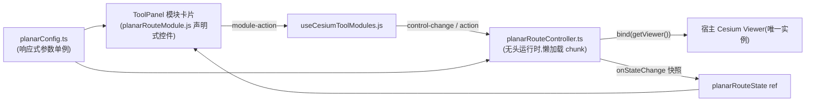

# Cesium 面状航线模块架构

日期：2026-08-22（并入 V3.5.27：浮层整页方案 → toolPanel 模块卡片直驱 + 统一图层管理接入）

## 模块关系

## 1. 架构目标

将独立工程 `planar-wayline` 迁移为 WebGIS Cesium 工具面板中的一个原生模块，与 cloud/wind/player 等模块同范式：

- ToolPanel「模块」页签的面状航线卡片内嵌 **LilGuiControls 参数控件**（采集方式/高度模式/航高/速度/云台俯仰角/主航线角度/重叠率/拍照触发/航线名/五向切换）；
- **动作按钮**驱动交互：设置参考起飞点、导入 KMZ（动态 file input）、保存 KMZ、清除全部；
- 卡片描述行实时显示测区面积/航长/预计用时/照片数，状态徽标显示 待规划/计算中/已生成；
- 复用宿主 Viewer，不创建第二个 WebGL/Cesium 实例；
- 控制器 chunk 首次交互才加载；正射、倾斜、仿地规划与 DJI WPMZ/KMZ 导入导出全量保留。

## 2. 关键约束（踩坑记录）

- **启动期禁触 Cesium**：`planarRouteModule.js` 被 `useCesiumToolModules.js` 静态引用 → `planarConfig.ts` 属启动加载链。其顶层禁止 `import Cesium from 'cesium'` 及任何 `Cesium.*` 求值（CDN 未就绪时 cesium-shim 抛错导致整个 3D 页打不开）。类型用 `import type { Cartesian3 }`；兜底位置经纬度常量在点击回调中惰性转换。`utils/comm.ts` 同理。
- **共享 Viewer 事件隔离**：起飞点拾取使用模块自有的 `ScreenSpaceEventHandler`（planarLine.ts），禁止 `viewer.screenSpaceEventHandler.removeInputAction` 清宿主左键逻辑。
- **UI 自管理 DOM**：测区删除浮层按钮、自相交警告条、起飞点拾取提示均由控制器/工具层创建于 `viewer.container` 内并自带内联样式，不依赖宿主模板。

## 3. 数据流

测区绘制（drawPolygon/turf）进入 wayLineCalc（弓字形）、obliqueRoute（五向）、planarTerrain（仿地采样），计算结果由 useCesiumRenderer 写入宿主 Viewer 实体；planarKmzExport 编码 WPMZ/KMZ，planarKmzImport 解析回填。参数变更统一走 `controller.setParam(id, value)` → 写回 globeConfig → 重规划；状态经 `emitState()` 快照上报驱动卡片徽标/下拉选项。

**统一图层管理**：首次生成有效航线（含 KMZ 导入）时，控制器经 `onWorkingSetChange` 把托管数据源 drawDataSource 以固定 id `planar_route_working`、类型 `wayline` 注册进 loadedDataSources → 元数据店自动建档，数据页签/TOC 可 显隐·透明度·重命名·定位·移除；外部移除时 adapter.remove 先调 `detachForExternalRemoval()` 复位控制器再销毁句柄。起飞点实体同样收敛在 drawDataSource 内，随数据源整体显隐。

## 4. 分包与维护约束

- `planarRouteController` 动态 import（独立懒加载 chunk）；`vendor-planar-route` 收纳 turf/@cesium-extends，不入入口预加载。
- Element Plus 已整体移除：消息用项目自有 `useMessage`，确认弹窗用 `window.confirm`，文件选择用动态 `<input type=file>`，保存命名用面板 text 控件。
- wpml/actionCodec 的中文是写入 KMZ 的文件格式载荷（司空生态约定），**不属于 UI 文案，不做 i18n**。
- 新增控件/动作必须同步四处：planarRouteModule.js（声明）、useCesiumToolModules.js（分发）、控制器 setParam/dispatch、locales 两语言包。
