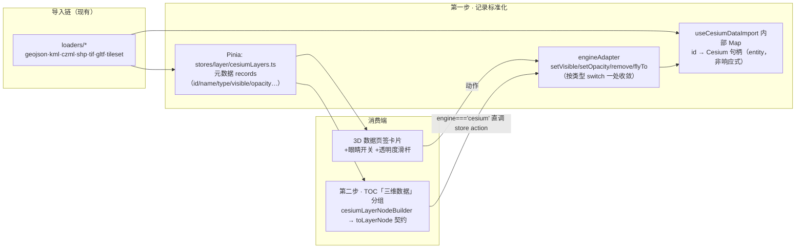

# Cesium 统一图层管理 — 设计文档

> 状态：**已实施（V3.4.33，两步走全量落地）**；决策点拍板：分组内平铺、2D 模式隐藏（随容器清档自动实现）、
> 数据生命周期跟随容器、矢量透明度二期。实施日志：`Docs/LLM_record/26-07-26/2026-07-26-cesium-unified-layer-mgmt-impl.md`
> 关联：[2D 图层体系 basemap-source-system.md](basemap-source-system.md) ·
> [多格式数据导入 multi-format-data-import.md](multi-format-data-import.md) ·
> 返回 [根 README](../../README.md)

---

## 1. 问题与背景

Cesium 侧导入的数据（GeoJSON/KML/CZML/SHP/TIF/GLB/3D Tiles）目前只活在
「3D 高级控制台 → 数据」页签的卡片列表里，能力止步于**定位/删除 + 少量类型特化**
（glTF 重定位、TIF 拉伸、tileset 高程/材质）。而 2D（OL）侧已有成熟的 TOC 图层目录
（树形分组、capabilities 驱动的可见/定位/删除/属性表/样式/导出/编辑）。

**割裂点**：3D 模式下侧栏 TOC 显示的仍是 2D 图层树，Cesium 数据不在其中——
用户需要在两个面板间跳转，且 3D 数据没有可见性开关与不透明度控制。

## 2. 现状盘点（代码坐标）

| 能力 | 2D（OL） | Cesium |
|------|----------|--------|
| 记录列表 | Pinia store + `layerTreeBuilder.toLayerNode` 节点契约 | `useCesiumDataImport.loadedDataSources`（组件内 ref） |
| 树形分组 UI | `domains/common/layer-tree/components/TOCPanel.vue`（capabilities 驱动） | 数据页签卡片平铺列表 |
| 可见性开关 | ✅ | ❌（只能删除） |
| 不透明度 | ✅ | ❌（仅 tileset 有材质模式） |
| 定位 / 删除 | ✅ | ✅ `flyToDataSource` / `removeDataSource` |
| 属性表 / 样式 / 编辑 / 导出 | ✅ | ❌ |
| 类型特化 | — | ✅ glTF 重定位、TIF 拉伸高程、tileset 高程/材质 |

关键既有资产：TOC 树节点是**声明式 capabilities 契约**（`visible/locate/remove/attribute/edit/style/export…`
布尔开关决定右键菜单与按钮），意味着接入新引擎节点**几乎不用改 TOCPanel 本体**。

## 3. 目标与非目标

**目标**
1. Cesium 导入数据获得与 2D 同级的基础管理能力：可见性、不透明度、定位、删除、重命名。
2. 统一入口：3D 模式下侧栏 TOC 出现「三维数据」分组，与 2D 图层同一棵树、同一套交互。
3. 保留既有类型特化能力（重定位/拉伸/高程/材质），在卡片或节点菜单中继续可达。

**非目标（本期不做）**
- 3D 数据属性表、样式编辑器、几何编辑（capabilities 置 false，留扩展位）；
- 2D↔3D 图层互转/同步渲染；URL 状态编码 3D 图层；图层排序拖拽。

## 4. 总体设计（两步走）



核心原则：**元数据入店、句柄留场**——Pinia 只存可序列化元数据；
Cesium 对象（DataSource/Tileset/Model/ImageryLayer）绝不进响应式系统
（避免 Vue 深代理 Cesium 内部结构导致的性能/崩溃问题，项目内 FluidSimulation 已有同类教训），
仍由 `useCesiumDataImport` 内部以 `Map<id, entity>` 持有，store action 经注册的
adapter 回调触达句柄。

## 5. 数据模型

```ts
/** stores/layer/cesiumLayers.ts —— 仅元数据，可序列化 */
interface CesiumLayerRecord {
    id: string;
    name: string;                 // 可重命名
    type: 'geojson'|'kml'|'czml'|'shp'|'tif'|'gltf'|'3dtiles';
    engine: 'cesium';
    visible: boolean;             // 默认 true
    opacity: number;              // 0~1，默认 1；不支持的类型忽略
    createdAt: number;
    // 类型特化元数据（只存数值，句柄不进来）
    heightRange?: { min: number; max: number };   // tileset
    currentHeight?: number;                        // tileset
    materialMode?: string;                         // tileset
}
```

**类型 × 能力矩阵**（adapter 实现依据）：

| type | visible 实现 | opacity 实现 | 备注 |
|------|--------------|--------------|------|
| geojson/kml/czml/shp | `DataSource.show` | ✅ per-entity 原色快照 × alpha（二期已落地） | WeakMap 快照原始色可反复调节；动态颜色属性（isConstant=false）跳过保留 CZML 动画；rAF 合并抗滑杆高频 |
| tif | `ImageryLayer.show` | `ImageryLayer.alpha` ✅ | 另有 heightMesh 需同步 show |
| gltf | `Model.show` | `Model.color = WHITE.withAlpha(a)` ✅ | |
| 3dtiles | `Cesium3DTileset.show` | `Cesium3DTileStyle color alpha` ✅ | 【风险】与现有 `applyTilesetMaterial` 都写 style，需在 adapter 内合成（材质模式 + alpha 单点生成 style），避免互相覆盖 |

## 6. 第一步详设：记录标准化 + 能力补齐（3D 面板内可用）

改动面：
1. **新增 `stores/layer/cesiumLayers.ts`**：records state + `register/unregister/rename/setVisible/setOpacity/patchMeta` actions；
   `registerAdapter(handlers)` 供 CesiumContainer 挂载时注册 `{setVisible, setOpacity, remove, flyTo, …}` 回调，
   卸载时 `unregisterAdapter()`（store action 先改元数据、再调 adapter，无 adapter 时仅元数据——防守时序）。
2. **`useCesiumDataImport.js`**：每个 loader 成功后除 push `loadedDataSources` 外同步 `store.register(record)`；
   `removeDataSource/clearAll` 同步 `unregister`；新增 `setDataSourceVisible(id, v)` / `setDataSourceOpacity(id, a)`
   （内部 switch 即 §5 矩阵）；**兼容期保留 `loadedDataSources` ref 与现有 props 链不动**。
3. **数据页签卡片**：标题行左侧加眼睛开关；支持 opacity 的类型加透明度滑杆；双击标题重命名。

DoD-1：任意导入数据可开关显隐与调透明度（按矩阵）、重命名；刷新 3D 模式往返无状态错乱；卡片既有特化功能不回归。

## 7. 第二步详设：挂进统一 TOC

1. **新增 `stores/layer/cesiumLayerNodeBuilder.ts`**：`records → toLayerNode 契约节点`，
   `sourceType:'cesium-data'`，capabilities 只开 `visible/locate/remove/opacity/rename`
   （attribute/edit/style/export 全 false）；挂在一级分组「三维数据」下（level 1，按 type 二级分组【待评审：平铺 or 按类型分组】）。
2. **树合并**：TOC 树数据源 computed 处，当 `getCurrentMapView() === CESIUM` 时拼接「三维数据」分组
   （2D 模式**隐藏**该分组——记录保留、切回 3D 复现【待评审：隐藏 vs 置灰】）。
3. **动作路由**：TOCPanel 动作处理层按 `node.engine === 'cesium'` 分流，直调 `cesiumLayers` store action
   （项目已有「TOCPanel 直更 Pinia」先例，HomeView 事件链零改动）；2D 节点路径完全不受影响。
4. **CesiumContainer**：`onMounted/onUnmounted` 注册/注销 adapter（复用第一步的 setVisible 等函数引用）。

DoD-2：3D 模式导入数据即时出现在 TOC「三维数据」分组；眼睛/定位/删除/重命名与 2D 图层操作手感一致；
切 2D 分组消失、切回 3D 复现；TOCPanel 对 2D 图层的全部既有行为零回归。

## 8. 风险与对策

| 风险 | 对策 |
|------|------|
| Cesium 对象进响应式导致深代理灾难 | 元数据入店、句柄留场（§4 原则）；record 中禁止出现 entity 字段，CR 检查 |
| tileset opacity 与材质模式互写 style | adapter 内单点合成 style（mode+alpha 二元函数），`applyTilesetMaterial` 收编进 adapter |
| viewer 销毁时序（切 2D/组件卸载） | adapter 注销后 store action 降级为纯元数据操作；CesiumContainer 卸载时不清 records（保留复现）【待评审：切 2D 是否保留 3D 数据】 |
| TIF 的 imageryLayer + heightMesh 双句柄 | adapter 的 setVisible 对 tif 同步两者（现 remove 已有同款处理可参照） |
| TOCPanel 回归风险（2492 行） | 只在数据源 computed 与动作分流两点做加法；DoD-2 含 2D 全行为回归清单 |

## 9. 工作量评估

| 步骤 | 内容 | 预估 |
|------|------|------|
| 第一步 | store + adapter + import 挂钩 + 卡片 UI | 0.5–1 天 |
| 第二步 | nodeBuilder + 树合并 + 动作分流 + 回归 | 1–1.5 天 |

## 10. 待评审决策点汇总

1. 「三维数据」分组内：按类型二级分组，还是平铺列表？（建议：数量少平铺，>8 条自动按类型分组）
2. 2D 模式下该分组：隐藏（建议）还是置灰只读？
3. 切换 2D 时 Cesium 数据：保留记录待复现（建议），还是询问用户清空？
4. 第一期 opacity 是否需要覆盖矢量类（per-entity 材质遍历，成本高，建议二期）？

---

*评审通过后按本文实施；实施日志将按 Force_command 规范落盘 `Docs/LLM_record/`。*
