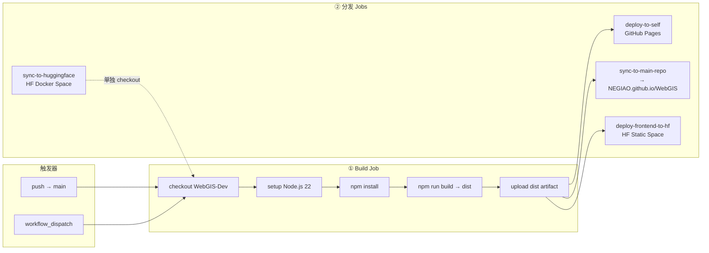

# CI/CD 流水线（Pipeline）

> 本文档详细分析 WebGIS 项目的 CI/CD 流水线架构。
> 整体架构见 [system-architecture.md](system-architecture.md)，域名映射见 [deployment-relationship.md](deployment-relationship.md)

---

## 流水线总览

**工作流文件**：[.github/workflows/deploy.yml](../../.github/workflows/deploy.yml)



---

## 五个 Job 详解

### Job 1：build（构建）

| 步骤 | 说明 |
|------|------|
| `actions/checkout@v4` | 检出 WebGIS-Dev 仓库 |
| `actions/setup-node@v4` | Node.js 22，缓存 `frontend/package-lock.json` |
| `npm install` | 安装前端依赖 |
| `npm run build` | 构建生产产物 → `frontend/dist` |
| `upload-pages-artifact@v5` | 为 GitHub Pages 准备 artifact |
| `upload-artifact@v4` | 为外部同步准备 artifact（`dist-files`） |

**关键设计**：构建只发生一次，后续 Jobs 各自下载 artifact，避免重复构建。

### Job 2：deploy-to-self（GitHub Pages 本仓库部署）

| 配置 | 值 |
|------|-----|
| `needs` | build |
| `environment` | github-pages |
| `actions/deploy-pages@v5` | 官方 Pages 部署 action |

**结果**：`https://negiao.github.io/WebGIS-Dev`

### Job 3：sync-to-main-repo（同步到个人主页仓库 → 触发下游多平台部署）

> **deploy.yml 原始注释**：`为 posit connect cloud 准备最新 build 版本并同步更新`

| 步骤 | 说明 |
|------|------|
| 下载 `dist-files` artifact | 到 `dist-for-sync/` |
| 克隆 `NEGIAO.github.io` 仓库 | 使用 `DEPLOY_TOKEN`（Secrets）|
| 清空并重建 `WebGIS/` 目录 | 确保旧版本文件被清理 |
| 复制 dist 文件 | `cp -R dist-for-sync/. WebGIS/` |
| 创建 `.nojekyll` | 防止下划线文件丢失 |
| 提交并推送 | 仅在有变更时推送 |

**直接结果**：`https://negiao.github.io/WebGIS`（主页仓库的 GitHub Pages）

**间接触发**：主页仓库收到推送后，**自动触发**以下平台的构建部署：
- **Cloudflare Pages** → `negiao.cc.cd` / `negiao.pages.dev` / `webgis.negiao.cc.cd` / `webgis-dev.pages.dev`
- **Posit Connect Cloud** → `negiao-pages.share.connect.posit.cloud` / `negiao-webgis.share.connect.posit.cloud`
- **Vercel** → `negiao.vercel.app`

**关键设计**：WebGIS-Dev 只负责"把 dist 推到主页仓库"，主页仓库自身配置了 Cloudflare / Posit / Vercel 的自动部署，实现关注点分离。

### Job 4：deploy-frontend-to-hf（Hugging Face Static 部署）

| 步骤 | 说明 |
|------|------|
| 下载 `dist-files` artifact | 到 `dist-to-hf/` |
| 删除大体积目录 | `tiles/`、`tileset/`、`public/tileset/` |
| 初始化 Git + LFS | 追踪 webp/png/jpg/glb/b3dm/i3dm/pnts/cmpt/bin 等二进制 |
| 注入 HF Space 元数据 | `title: WebGIS-Frontend` / `sdk: static` |
| Force push 到 HF | `NEGIAO/Web` 的 `main` 分支 |

**结果**：`https://negiao-web.static.hf.space`（或类似 HF Static Space URL）

**LFS 策略**：所有二进制资源（图片、3D 模型、瓦片、云纹理）走 Git LFS，避免仓库膨胀。

### Job 5：sync-to-huggingface（全栈单容器部署）

| 步骤 | 说明 |
|------|------|
| 验证全栈资产 | 检查 `deploy/Dockerfile`、`nginx.conf`、`.env`、`backend/app.py`、`frontend/package-lock.json` 存在 |
| 组装 Space 上下文 | `git archive HEAD deploy backend frontend` 解包到 `hf_deploy/`（只取已追踪文件，天然排除 node_modules/dist/噪音） |
| 注入 HF 约定文件 | `deploy/Dockerfile` + `Dockerfile.dockerignore` 拷到 Space 根；生成 `sdk: docker` 元数据 README |
| LFS 追踪二进制 | webp/png/glb/b3dm/wasm/geojson/ShareData 等（HF 要求二进制走 LFS/Xet） |
| Force push 到 HF | `NEGIAO/WebGIS` 的 `main` 分支 |

**结果**：`https://negiao-webgis.hf.space`（HF Docker Space 自动构建单容器镜像：nginx 前端静态 + FastAPI 同容器，单端口 7860）

**关键设计**：Space 根与本仓库根同构（`{Dockerfile, deploy/, backend/, frontend/, README.md}`），`deploy/Dockerfile` 内 COPY 路径在两侧完全一致；镜像内自行 `npm ci + vite build + uv sync`，构建上下文经 dockerignore 白名单压到最小。

---

## 并发与幂等

| 配置 | 说明 |
|------|------|
| `concurrency.group: "pages"` | 同组工作流互斥 |
| `cancel-in-progress: true` | 新推送自动取消正在进行的部署 |
| `git diff --staged --quiet` | 无变更时跳过推送，避免空提交 |

---

## Secrets 清单

| Secret | 用途 | 权限 |
|--------|------|------|
| `DEPLOY_TOKEN` | 推送 NEGIAO.github.io 仓库 | 仅该仓库写权限 |
| `HF_TOKEN` | 推送 Hugging Face Spaces | Web + WebGIS 两个 Space |

---

## 部署时序

```
push to main
    │
    ▼
┌──────────────────────────────────────────────────────┐
│  build job                                           │
│  ┌─────────┐  ┌──────────┐  ┌────────────────────┐  │
│  │ checkout │→│ npm install │→│ npm run build → dist │ │
│  └─────────┘  └──────────┘  └────────────────────┘  │
└──────────────────────────────────────────────────────┘
    │
    ├──► deploy-to-self ──────────────────► GitHub Pages
    │
    ├──► sync-to-main-repo ───────────────► NEGIAO.github.io
    │       └── 主页仓库自动触发下游部署：
    │           ├── Cloudflare Pages ─────► negiao.cc.cd / negiao.pages.dev
    │           ├── Posit Connect Cloud ──► negiao-pages.share.connect.posit.cloud
    │           └── Vercel ───────────────► negiao.vercel.app
    │
    ├──► deploy-frontend-to-hf ──────────► HF Static Space
    │
    └──► sync-to-huggingface ────────────► HF Docker Space
            (git archive 全栈 → 单容器镜像)
```

---

*本文档随 CI/CD 配置变化更新；日常改动见维护日志。*
*基线版本：V3.5.5*
