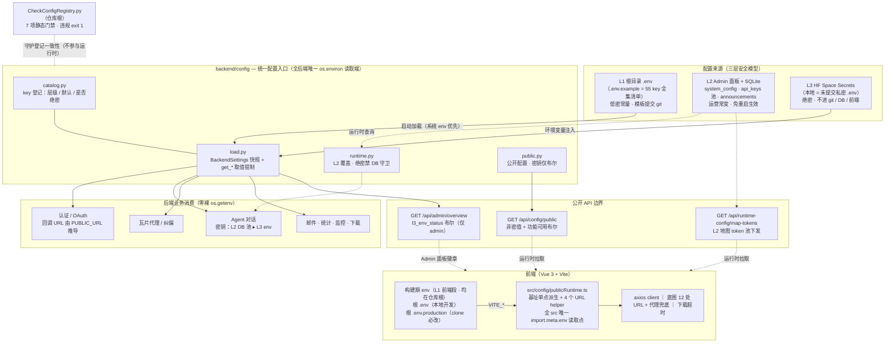
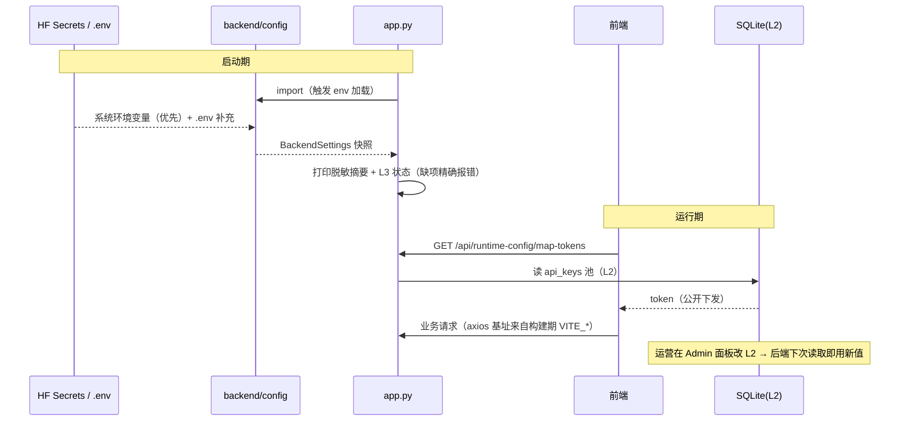

# 三层配置架构（L1/L2/L3）— 系统运行全景

> 状态：已全量落地（V3.4.6 → V3.4.13，配置架构计划阶段 0–6 完成）
> 使用手册：[Docs/Guide/configuration.md](../Guide/configuration.md) ·
> 落地路线与各阶段记录：[configuration-architecture-plan.md](../Guide/configuration-architecture-plan.md) ·
> 返回 [根 README](../../README.md)

本文回答一个问题：**一份配置从哪里来、经过谁、最终被谁消费，以及绝密为什么到不了不该到的地方。**

---

## 1. 总体架构图

部署拓扑：GitHub Pages（前端静态产物）⇄ HF Space Docker（后端 :7860，SQLite 持久化于 `/data`）；
本地：`LocalDev.bat` → vite :5173 ⇄ docker compose :7860（`env_file: ../.env` + 强制 `APP_ENV=development`）。

---

## 2. 三层来源的职责与边界

| 层 | 位置 | 放什么 | 谁改 | 生效方式 |
|----|------|--------|------|----------|
| **L1** | 根 `.env`（模板 `.env.example`） | URL、端口、TTL、Agent 非密默认、`VITE_*` | 部署者 | 重启 / 重新构建 |
| **L2** | `system_config` / `api_keys`(+备份池) / `announcements`（SQLite） | 地图 token、Agent 模型/配额/提示词、默认底图、公告、联系方式 | 运营（admin 面板） | 即时（后端动态读取） |
| **L3** | HF Space Secrets（本地 = 未提交 `.env`） | `SUPER_USER`、OAuth Client Secret、`SMTP_PASSWORD`（账号在 L1，分开存取）、`AGENT_API_KEY`、`AMAP_WEB_SERVICE_KEY`、Supabase、`LOG` | 部署者（仅平台侧） | 重启容器 |

硬性边界：L3 真值不进 git、不进 DB、不进前端；`VITE_*` 永远不承载 secret；
根 `.env.example` 是 L1+L2+L3 全部 key 的唯一登记目录（L2/L3 只登记不写真值）。

## 3. backend/config 统一入口

四个模块、两条优先级链：

| 模块 | 职责 |
|------|------|
| `catalog.py` | 55 key 元数据登记（层级/默认值/secret 标记），与根 `.env.example` 一一对应；部署拓扑默认常量单源 |
| `load.py` | 启动加载 env 文件 → 冻结 `BackendSettings`（lru_cache 快照）；`get_str/get_int/get_float/get_bool`（缺省回退 catalog 默认、数值越界钳制）；`masked_summary()` 脱敏摘要 |
| `runtime.py` | L2 覆盖读取 `get_effective_str`：`system_config(DB) ▸ L1 env ▸ default`；**catalog 标记为绝密的 key 走 DB 直接抛 `ValueError`** |
| `public.py` | `build_public_config()`：非密值 + 功能可用布尔（oauth_google/github、email、agent_env_key、amap、supabase），无任何明文 |

L1/L3 加载顺序（`load.py`）：**系统环境变量 ▸ 根 `.env` ▸ `backend/.env` ▸ catalog 默认**。
系统环境变量优先，保证 HF Secrets / Docker 注入值永远不被仓库文件覆盖。

约束：除本包外，后端业务代码禁止 `os.getenv` / `os.environ`；新增 key 必须先登记
根 `.env.example` + `catalog.py` 再写代码（由门禁脚本强制）。

## 4. 关键业务链路

**OAuth 回调推导**：`redirect_uri = {BACKEND_PUBLIC_URL}/api/auth/oauth/{provider}/callback`，
前端回跳 = `{FRONTEND_PUBLIC_URL}/#/oauth/callback`（成功）/ `#/register`（失败）。
部署者只配两个 PUBLIC_URL；`*_OAUTH_REDIRECT_URI` / `FRONTEND_OAUTH_*` 仅作可选覆盖。
缺 CLIENT_ID/SECRET 时 503 精确报缺失 key 名。

**管理员密码**：账号固定 `admin`；密码链 = `SUPER_USER`（L3） ▸ 开发环境兜底 `123456` ▸ 生产缺失则禁用并日志说明。角色按用户名归一化，不信任 DB 角色字段。

**Agent 密钥解析**：`api_keys.agent_api_key`（L2 池，含备份与旧名 `agent_token` 兼容） ▸ env `AGENT_API_KEY`/`AGENT_TOKEN`（L3）。模型/配额/提示词等参数以 `system_config`（L2）覆盖 L1 默认，免重启。

**SMTP（账号/凭证分开存取的范例）**：主机/端口/发件账号为 L1，凭证 `SMTP_PASSWORD` 单独为 L3；
`email_service` 调用时读取 settings，Secrets 更新重启即生效。

**别名收敛**：Supabase（`NEXT_PUBLIC_SUPABASE_URL`、`SUPABASE_SERVICE_ROLE_KEY` 等）与高德
（`AMAP_KEY`/`GAODE_KEY`）的历史别名在 loader 内解析，业务代码只见规范字段。

## 5. 前端消费（两条腿）

**构建期**：Vite 的 `envDir` 指向仓库根——本地开发读根 `.env`、生产构建读根
`.env.production`（clone 用户唯一必改：`VITE_BACKEND_URL`），前端不再维护独立 env 文件；
Vite 只把 `VITE_*` 前缀项注入构建产物，根 `.env` 中的后端/绝密变量不会泄漏 →
`src/config/publicRuntime.ts` 单点派生
`BACKEND_BASE_URL` / `TILE_PROXY_BASE_URL` / `TILE_PROXY_MODE` / `DOWNLOAD_REQUEST_TIMEOUT_MS`
及 `backendUrl/tileProxyUrl/gcj2wgsProxyUrl/backendTilesUrl` 四个 helper。
axios 基址、`basemapConfig`/`sourceDescriptors` 12 处底图源 URL、瓦片代理兜底、下载超时全部由此拼接；
src 内已无任何硬编码部署域名。

**运行期**：`/api/runtime-config/map-tokens` 拿地图 token 池；`/api/config/public` 拿公开配置与功能布尔；
admin 登录后 `/api/admin/overview` 的 `l3_env_status` 驱动「环境密钥状态」只读徽章卡片。

## 6. 启动与请求时序

## 7. 安全不变量（体系保证）

1. 仓库与前端构建产物中无任何 L3 真值（`VITE_*` 无 secret，源码无硬编码密钥/域名）。
2. 绝密只有一条读取路径：环境变量 → `backend/config`；DB 覆盖绝密在代码层直接抛错。
3. 前端可见的密钥信息最多是「是否已配置」布尔（public.py / l3_env_status）。
4. 生产缺 L3 快速失败且可定位：503 + 缺失 key 名、启动日志摘要、Admin 面板徽章三重自检。

## 8. 新增配置 key 的固定流程（门禁）

1. 在根 `.env.example` 对应层段登记 key + 注释；
2. 在 `backend/config/catalog.py` 登记元数据（前端 `VITE_*` 只登记清单）；
3. 业务代码经 `config` helper / `publicRuntime` 读取；
4. 提交前运行 `python CheckConfigRegistry.py`（7 项扫描：后端裸 getenv、helper 未登记 key、
   catalog⇄清单双向一致、前端散落 `import.meta.env`、VITE 未登记、硬编码域名；违规 exit 1）。

## 9. 版本足迹

| 版本 | 内容 |
|------|------|
| V3.4.6 | 阶段 0–2：清单统一 + backend/config 全模块收敛 + OAuth 推导 |
| V3.4.8 | 阶段 3：L2 对照表 + Admin L3 状态徽章 |
| V3.4.10 | 阶段 4：前端 publicRuntime 单点 + 硬编码域名清零 + /api/config/public |
| V3.4.11 | 阶段 5（部分）：compose env_file + LocalDev 自动生成根 .env |
| V3.4.13 | 阶段 5/6 收官：HF Secrets 最小集合清单 + 门禁脚本 + 过时文档清理 |

---

*相关代码：`backend/config/`、`frontend/src/config/publicRuntime.ts`、`CheckConfigRegistry.py`；
维护日志见 `Docs/LLM_record/26-07-26/`。*
