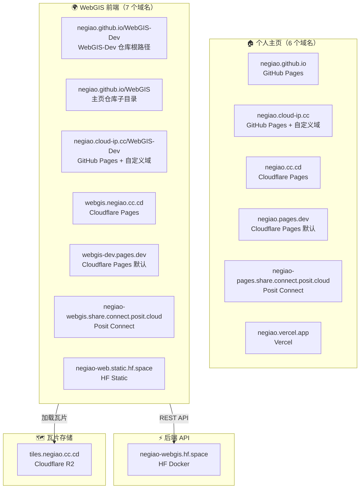

# 部署关系与域名映射（Deployment Relationship）

> 本文档展示 WebGIS 项目所有域名、部署平台与运行时组件之间的对应关系。
> 架构总览见 [system-architecture.md](system-architecture.md)，CI/CD 流水线见 [cicd-pipeline.md](cicd-pipeline.md)

---

## 域名全景图



---

## 域名清单

### 个人主页域名（6 个）

| 域名 | 平台 | 部署来源 | CDN | 国内访问 |
|------|------|----------|-----|----------|
| `negiao.github.io` | GitHub Pages 默认 | 主页仓库直接部署 | ❌ | ⚠️ 不稳定 |
| `negiao.cloud-ip.cc` | GitHub Pages + 自定义域 | 主页仓库直接部署 | ✅ 可配 | ✅ 可访问 |
| `negiao.cc.cd` | Cloudflare Pages | 主页仓库触发 | ✅ Cloudflare | ❌ 被屏蔽 |
| `negiao.pages.dev` | Cloudflare Pages 默认 | 主页仓库触发 | ✅ Cloudflare | ✅ 流畅 |
| `negiao-pages.share.connect.posit.cloud` | Posit Connect 默认 | 主页仓库触发 | ❌ | ✅ 可访问 |
| `negiao.vercel.app` | Vercel 默认 | 主页仓库触发 | ❌ | ❌ 不可访问 |

### WebGIS 前端域名（8 个）

| 域名 | 平台 | 部署来源 | 说明 |
|------|------|----------|------|
| `webgis.negiao.cn` | GitHub Pages（正式域名） | WebGIS-Dev 仓库直接部署 | **CNAME → `negiao.github.io/WebGIS-Dev`**，对外主入口 |
| `negiao.github.io/WebGIS-Dev` | GitHub Pages | WebGIS-Dev 仓库直接部署 | 仓库根路径（默认入口） |
| `negiao.github.io/WebGIS` | GitHub Pages | 主页仓库 `WebGIS/` 子目录 | dist 同步触发 |
| `negiao.cloud-ip.cc/WebGIS-Dev` | GitHub Pages + 自定义域 | 自动跳转 | 跟随个人主页域名 |
| `webgis.negiao.cc.cd` | Cloudflare Pages | 主页仓库触发 | 私有域名挂载 |
| `webgis-dev.pages.dev` | Cloudflare Pages 默认 | 主页仓库触发 | 自动分配 |
| `negiao-webgis.share.connect.posit.cloud` | Posit Connect 默认 | 主页仓库触发 | — |
| `negiao-web.static.hf.space` | Hugging Face Static | WebGIS-Dev 直接推送 | LFS 静态前端 |

### 后端与存储域名（2 个）

| 组件 | 域名 | 平台 | 部署来源 |
|------|------|------|----------|
| 后端 API | `negiao-webgis.hf.space` | Hugging Face Docker | WebGIS-Dev 直接推送（subtree split）|
| 瓦片存储 | `tiles.negiao.cc.cd` | Cloudflare R2 | 手动上传 |

---

## 部署来源矩阵

| 域名 | 直接来源 | 构建产物 | 部署方式 |
|------|----------|----------|----------|
| `negiao.github.io` | NEGIAO.github.io 仓库 | 主页源码 | GitHub Pages 自动部署 |
| `negiao.cloud-ip.cc` | NEGIAO.github.io 仓库 | 主页源码 | GitHub Pages + 自定义域 |
| `negiao.cc.cd` | NEGIAO.github.io 仓库 | 主页源码 | Cloudflare Pages |
| `negiao.pages.dev` | NEGIAO.github.io 仓库 | 主页源码 | Cloudflare Pages 默认 |
| `negiao-pages.share.connect.posit.cloud` | NEGIAO.github.io 仓库 | 主页源码 | Posit Connect |
| `negiao.vercel.app` | NEGIAO.github.io 仓库 | 主页源码 | Vercel |
| `negiao.github.io/WebGIS-Dev` | WebGIS-Dev 仓库 | `frontend/dist` | `actions/deploy-pages` |
| `negiao.github.io/WebGIS` | NEGIAO.github.io 仓库 | `frontend/dist`（同步）| GitHub Pages 子目录 |
| `negiao.cloud-ip.cc/WebGIS-Dev` | NEGIAO.github.io 仓库 | `frontend/dist`（同步）| GitHub Pages + 自定义域 |
| `webgis.negiao.cc.cd` | NEGIAO.github.io 仓库 | `frontend/dist`（同步）| Cloudflare Pages |
| `webgis-dev.pages.dev` | NEGIAO.github.io 仓库 | `frontend/dist`（同步）| Cloudflare Pages 默认 |
| `negiao-webgis.share.connect.posit.cloud` | NEGIAO.github.io 仓库 | `frontend/dist`（同步）| Posit Connect |
| `negiao-web.static.hf.space` | WebGIS-Dev 仓库 | `frontend/dist`（LFS）| `git push --force` |
| `negiao-webgis.hf.space` | WebGIS-Dev 仓库 | `backend/` 子树 | `git subtree split` + HF Docker |
| `tiles.negiao.cc.cd` | — | 瓦片文件 | Cloudflare R2 手动上传 |

---

## 前后端通信链路

### API 通信

```
WebGIS 前端（任意域名）
    │
    │  fetch(https://negiao-webgis.hf.space/api/...)
    │
    ▼
Hugging Face Docker 后端
    ├── /api/auth/*       鉴权
    ├── /api/spatial/*    空间分析
    ├── /api/agent/*      AI 助手
    ├── /api/admin/*      管理
    └── /proxy/*          瓦片代理
```

### 瓦片加载链路

```
WebGIS 前端（任意域名）
    │
    │  直连：https://tiles.negiao.cc.cd/tiles/{z}/{x}/{y}.png
    │
    ▼
Cloudflare R2 瓦片存储（成功 → 直接返回）
    │
    │  失败 → 走代理
    │
    ▼
后端瓦片代理：https://negiao-webgis.hf.space/proxy/...
    │
    ▼
上游瓦片服务（Google / 高德 / 天地图 等）
```

**代理模式**：`VITE_TILE_PROXY_MODE=fallback`（直连失败才走代理，减少后端负载）

---

## 平台能力对比

### 功能对比

| 能力 | GitHub Pages | Cloudflare | Hugging Face | Posit Connect | Vercel |
|------|:------------:|:----------:|:------------:|:-------------:|:------:|
| 静态托管 | ✅ | ✅ | ✅ | ✅ | ✅ |
| Docker 后端 | ❌ | ❌ | ✅ | ❌ | ❌ |
| 全球 CDN | ✅ | ✅ | ✅ | ✅ | ✅ |
| 自定义域名 | ✅ | ✅ | ❌ | ❌ | ❌ |
| DNS 托管 | ❌ | ✅ | ❌ | ❌ | ❌ |
| 对象存储 | ❌ | R2 | ❌ | ❌ | ❌ |
| 自动 HTTPS | ✅ | ✅ | ✅ | ✅ | ✅ |
| 国内可访问 | ⚠️ 不稳定 | ✅ 速度快 | ✅ 可访问 | ✅ 可访问 | ❌ 不可访问 |
| 免费额度 | 1 GB | 无限 | 有限（旧用户免费）| 有限 | 100 GB |

### 优缺点对比

| 平台 | 优点 | 缺点 |
|------|------|------|
| **GitHub Pages** | 全球知名、与 GitHub 深度集成、零配置 | 只能部署静态页面；国内访问不稳定 |
| **Cloudflare** | 功能丰富（DNS + CDN + R2）、国内访问速度快 | 部分自定义域名（.cc.cd）在国内被屏蔽 |
| **Hugging Face** | 免费 Docker 部署后端（旧用户）、国内可访问 | 资源有限；48h 无人访问自动休眠（需 UptimeRobot 保活）|
| **Posit Connect** | 国内可访问、支持静态 + 轻量 Python | 功能受限，只能部署静态或轻量架构 |
| **Vercel** | 部署极快、全球 CDN、开发体验好 | 国内无法访问 |

### 域名能力对比

| 域名 | 可配 DNS | 可配 CDN | 只能托管 | 说明 |
|------|----------|----------|----------|------|
| `negiao.github.io` | ❌ | ❌ | ✅ GitHub Pages | GitHub 默认域名 |
| `negiao.cloud-ip.cc` | ✅ 大部分记录 | ✅ | ❌ 全能 | 国内可访问，可在其网站配置 DNS |
| `negiao.cc.cd` | ✅ Cloudflare | ✅ Cloudflare | ❌ 全能 | 托管到 Cloudflare，但国内被屏蔽 |
| `negiao.pages.dev` | ❌ | ❌ | ✅ Cloudflare | Cloudflare 默认域名 |
| `negiao-pages.share.connect.posit.cloud` | ❌ | ❌ | ✅ Posit | Posit 默认域名 |
| `negiao.vercel.app` | ❌ | ❌ | ✅ Vercel | Vercel 默认域名 |

> **关键结论**：`cloud-ip.cc` 和 `cc.cd` 是两个**可配 CDN 的自定义域名**，其余四个默认域名只能托管项目。其中 `cloud-ip.cc` 是国内访问的最佳选择（速度快 + 可配 CDN + 不被屏蔽）。

---

## 中国大陆访问策略

```
用户在中国大陆
    │
    ├── 访问 negiao.pages.dev（Cloudflare 国内节点）
    │       └── 前端 SPA 加载
    │               ├── API → negiao-webgis.hf.space（跨境，走 Cloudflare 链路优化）
    │               └── 瓦片 → tiles.negiao.cc.cd（国内直接访问）
    │
    └── 访问 negiao.github.io（可能被墙）
            └── 不稳定，但引导至 cloud-ip.cc 域名,仍可用
```

**推荐国内访问路径**：
1. `negiao.cloud-ip.cc` → 个人主页（GitHub Pages + 自定义域 + CDN 可配）
2. `negiao.pages.dev` → 个人主页（Cloudflare 国内节点）
3. `negiao-webgis.hf.space` → 后端 API（HF 国内可访问）
4. `tiles.negiao.cc.cd` → 瓦片存储（Cloudflare R2）

---

*本文档随域名或部署配置变化更新；日常改动见维护日志。*
*基线版本：V3.5.5*
