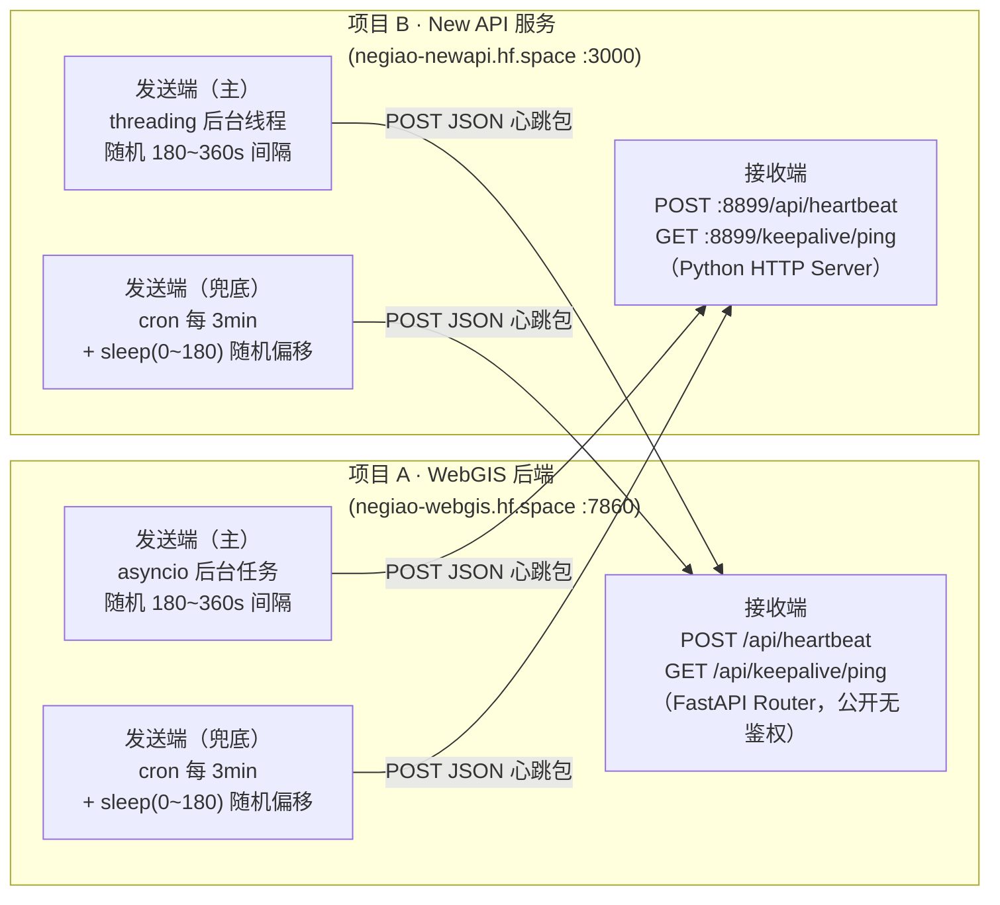

# 双向保活机制（HF Space 互活跃）

> 创建日期：2026-08-05
> 涉及项目：WebGIS 后端（项目 A）+ New API 服务（项目 B）

---

## 背景与设计目标

Hugging Face Spaces 在 **24 小时无外部访问后自动休眠**，首次访问会有 30–60 秒冷启动延迟。本平台部署了两个 HF Space（WebGIS 后端 + New API 服务），通过**双向互探活**机制互相发送模拟真实用户的 HTTP 请求，保持双方始终处于活跃状态，避免自动休眠。

**设计目标：**
- 双方互为主动发送方与接收方，任一端重启后自动恢复互保活
- 请求行为拟人化（随机 UA、随机路径、随机间隔），避免被平台识别为 Bot
- 三层冗余（asyncio 主发送端 + cron 兜底 + 对端互保），任一单点故障不影响整体
- 日志实时输出到 Docker stdout，可在 HF Space 控制面板直接查看运行状态

---

## 整体架构



### 三层冗余说明

| 层级 | 项目 A（WebGIS） | 项目 B（New API） | 故障场景 |
|------|-----------------|-------------------|----------|
| 主发送端 | `asyncio.create_task` 后台任务 | `threading.Thread(daemon=True)` 后台线程 | Python 主进程存活时工作 |
| 兜底发送端 | `cron` 每 3min + `sleep(0~180)` shell 脚本 | 同左 | Python 任务挂了仍有 shell 层保底 |
| 对端互保 | 对端也在主动 ping 本端 | 同左 | 任一端重启后，对端请求将其唤醒 |

---

## 公开探活接口

| 项目 | 方法 | 路径 | 说明 |
|------|------|------|------|
| WebGIS (A) | `POST` | `/api/heartbeat` | 接收 JSON 心跳包，返回 `{"code":200,"data":{"status":"acknowledged","echo":...}}` |
| WebGIS (A) | `GET` | `/api/keepalive/ping` | 兼容探活，返回 `{"status":"ok","service":"webgis","message":"pong"}` |
| New API (B) | `POST` | `:8899/api/heartbeat` | 响应格式一致（Go 二进制无法改路由，由容器内 Python HTTP Server 承载） |
| New API (B) | `GET` | `:8899/keepalive/ping` | 兼容探活 |

> ⚠️ `/api/heartbeat` 与 `/api/keepalive/ping` 已加入启动状态检查中间件的 `allowlist`，**无需鉴权即可公开访问**，避免因 401/403 导致保活失败。

---

## 发送端机制

| 层级 | 项目 A（WebGIS） | 项目 B（New API） | 说明 |
|------|-----------------|-------------------|------|
| 主发送端 | `asyncio.create_task` 后台任务 | `threading.Thread(daemon=True)` 后台线程 | 应用启动后 15s 开始运行 |
| 间隔 | `random.randint(180, 360)` 秒 | `random.randint(180, 360)` 秒 | 3~6 分钟随机浮动，**严禁死定时** |
| 兜底发送端 | `cron */3 * * * *` + `sleep $(shuf -i 0-180 -n 1)` | 同左 | 等效 3~6min 随机间隔，Python 任务挂了仍有 shell 层保底 |
| 请求方法 | `POST` 对端 `/api/heartbeat` | `POST` 对端 `/api/heartbeat` | 携带含随机噪声字段的 JSON 心跳包 |

### 心跳包结构

```json
{
  "source": "webgis",
  "timestamp": "2026-08-05T14:30:00+08:00",
  "seq": 482719,
  "uptime_hint": 3600,
  "meta": {
    "region": "cn-east",
    "load": 0.1234
  }
}
```

---

## 防检测策略

| 策略 | 实现 |
|------|------|
| **User-Agent 轮换** | 9 个 UA 池：Chrome(Win/Mac/Linux) + Edge(Win/Mac) + Firefox(Win/Mac/Linux)，每次随机选一个 |
| **Accept-Language 轮换** | 4 种语言头随机：`zh-CN,zh;q=0.9,en;q=0.8` / `en-US,en;q=0.9` 等 |
| **完整请求头** | User-Agent + Accept + Accept-Language + Origin + Referer + Content-Type + Connection |
| **随机时间间隔** | 基础间隔 180~360s 随机 + cron 额外 0~180s sleep 偏移，确保每次请求间隔不固定 |
| **随机负载噪声** | 心跳包内 `seq`（6 位随机数）、`load`（0.01~0.35 随机浮点）、`region`（随机区域）每次不同 |

---

## 日志格式规范

所有日志实时输出到 Docker stdout（HF Space 控制面板可直接查看）：

```
[KeepAlive-Send]    [2026-08-05 14:30:00] Sending heartbeat to https://negiao-newapi.hf.space/api/heartbeat ...
[KeepAlive-Success] [2026-08-05 14:30:01] Heartbeat acknowledged by remote. Status: 200
[KeepAlive-Error]   [2026-08-05 14:35:02] Failed to reach remote space. Error code: timeout
```

---

## 变更文件清单

```
backend/
├── api/
│   └── keepalive.py              # 🆕 FastAPI 接收端 Router + asyncio 发送端任务
├── app.py                        # ✏️  挂载 keepalive router + allowlist 加入心跳路径
└── Dockerfile                    # ✏️  安装 curl/cron/shuf，写入 shell 兜底脚本 + entrypoint

hf-newapi-space/HF/
├── keepalive_server.py           # 🆕 Python HTTP Server（接收端）+ 发送端线程
├── start.sh                      # ✏️  启动 cron + keepalive_server 后台并发
└── Dockerfile                    # ✏️  安装 python3/cron/coreutils，写入 cron 兜底脚本
```

---

## 关键设计决策

### 为什么用 Python HTTP Server 给 New API 承载接收端？

`calciumion/new-api` 是编译型 Go 二进制，无法在运行时注入新路由。解决方案是在同一容器内并行运行一个轻量 Python HTTP Server（端口 8899），专门处理探活请求。主服务（Go）与保活服务（Python）互不干扰。

### 为什么需要 cron 兜底层？

asyncio / threading 发送端依赖 Python 主进程存活。如果应用因异常重启或进入降级状态，保活也会中断。cron 是系统级守护进程，独立于应用运行，提供第二层保险。

### 为什么严禁死定时？

HF 平台可能通过流量模式检测 Bot 行为。固定间隔（如精确的 5 分钟）是典型的机器行为特征。使用 `random.randint(180, 360)` + cron 额外 `sleep(0~180)` 双重随机化，确保请求间隔在 3~6 分钟范围内均匀分布。

### 为什么心跳包要带随机噪声？

固定内容的 POST 请求容易被识别为健康检查。加入随机 `seq`、`load`、`region` 字段，使每次请求体内容不同，更接近真实业务请求特征。
