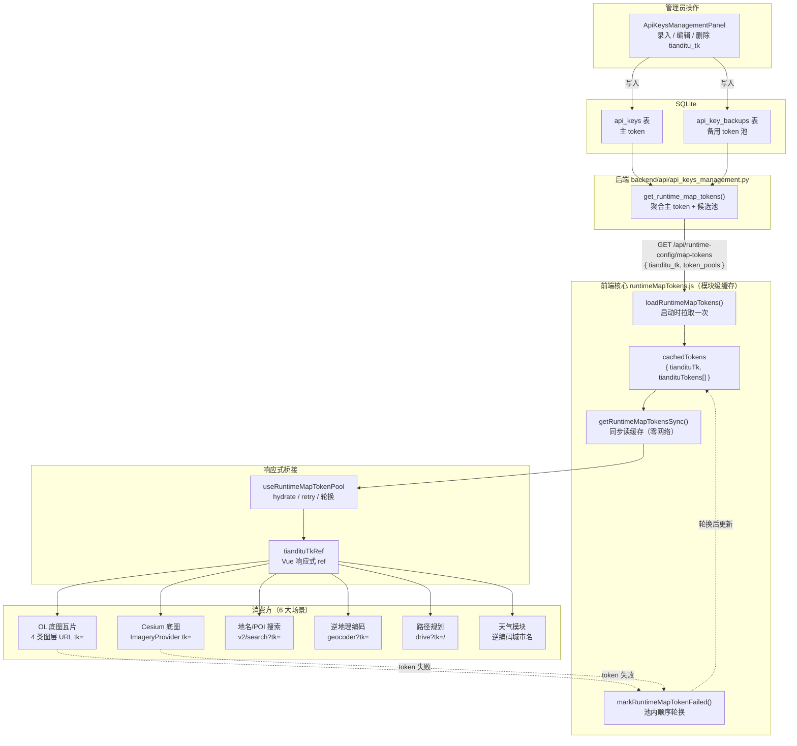
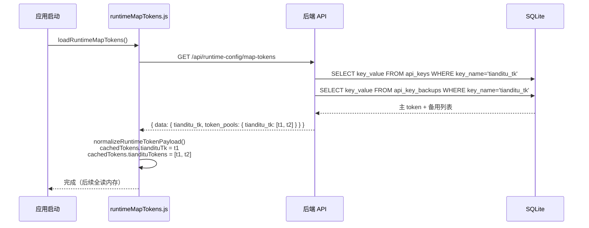
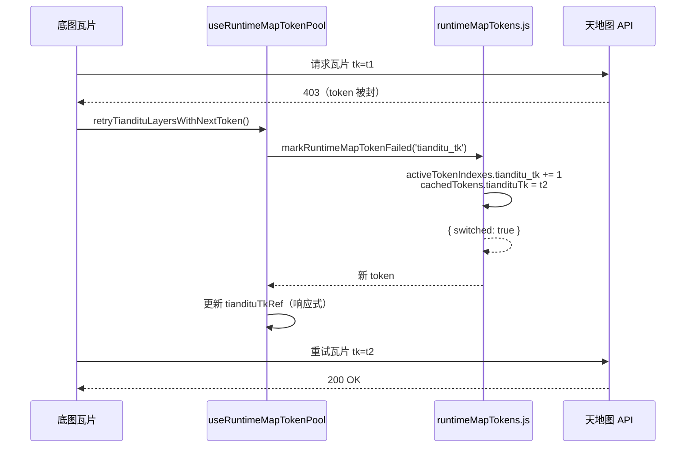
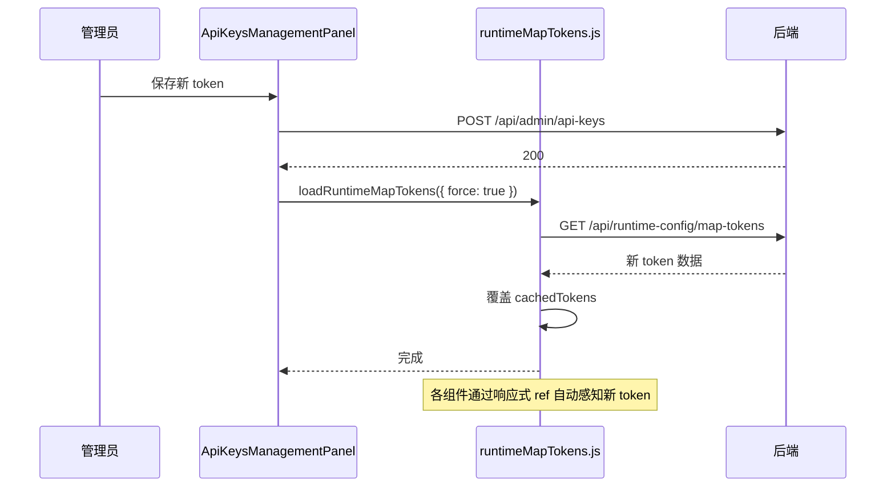

# 天地图 Token 运行时池 — 架构说明

日期：2026-08-02

适用范围：`frontend/src/domains/ol/services/runtimeMapTokens.js`（核心）、
`frontend/src/domains/ol/composables/useRuntimeMapTokenPool.js`（轮换）、
`frontend/src/api/backend/runtime.js`（拉取）、
`backend/api/api_keys_management.py`（后端接口）。

本文说明天地图 `tianditu_tk` 从"管理员在面板录入"到"浏览器直连天地图 API"的全链路：
拉取、缓存、分发、消费、轮换、刷新。

---

## 1. 设计评价

### 做得好的

| 点 | 说明 |
|---|---|
| **一次性拉取 + 内存缓存** | 启动时拉一次，后续全读模块级变量，零网络开销。对高频场景（底图瓦片每秒数十次请求）至关重要——不可能每次拼 URL 都去查库 |
| **多 token 池 + 本地轮换** | 支持主 token + 多个备用 token，失败时毫秒级切换，用户无感。比"失败了再问后端拉下一个"快得多 |
| **响应式 ref 桥接** | 非响应式的 `cachedTokens` 通过 `tiandituTkRef` 桥接到 Vue 响应式系统，token 切换后组件自动感知 |
| **SSOT 清晰** | 前端只有一个读取点 `getRuntimeMapTokensSync()`，后端只有一个出口 `get_runtime_map_tokens`，没有散落各处的 `import.meta.env.VITE_TIANDITU_TK` |
| **后端聚合候选列表** | 后端一次性返回主 token + 备份池，前端无需多次请求拼凑 |

### 可改进的

| 点 | 说明 |
|---|---|
| **轮换无衰减与回退** | 当前是顺序下标递增，永远回不到主 token。如果主 token 只是短暂限流（非封禁），会长期卡在备用 token。建议：失败后记录时间戳，N 分钟后尝试回主 token |
| **缓存无 TTL** | `cachedTokens` 在内存中直到页面关闭或强制刷新。如果管理员在后台换了 token，已打开的页面不会感知，必须手动触发 `force: true`。建议：对高频应用加一个 5–10 分钟的软过期 |
| **多 token 池无优先级感知** | 池内 token 平等轮换，无法表达"主 token 优先、备用仅应急"的语义。当前主 token 只是 `tiandituTokens[0]`，与备用无区别 |
| **失败判定粒度过粗** | `markRuntimeMapTokenFailed` 被调用时并不区分"这个 token 被封"和"网络临时抖动"。一次网络抖动就可能把健康的备用 token 也轮换掉 |
| **无跨标签页同步** | 多个标签页各自维护独立缓存，A 页轮换到 token2 后，B 页仍用 token1（可能继续失败并重复轮换）。建议：`storage` 事件或 BroadcastChannel 同步轮换状态 |

### 总体评价

**7.5 / 10**。核心机制（缓存 + 轮换 + 响应式桥接）设计合理，足以支撑生产环境的高频瓦片请求。
短板主要在**轮换策略的智能化**（无回退、无衰减）和**跨标签页一致性**，属于"能用但不够精致"的层面，不影响功能正确性。

---

## 2. 总体架构图



---

## 3. 生命周期详解

### 3.1 启动拉取（一次性）



**关键代码**（`runtimeMapTokens.js`）：

```js
// 模块级缓存（非响应式，纯内存）
let cachedTokens = { tiandituTk: '', tiandituTokens: [] };
let activeTokenIndexes = { tianditu_tk: 0 };

export async function loadRuntimeMapTokens({ force = false } = {}) {
    if (hasLoadedRuntimeTokens && !force) return getRuntimeMapTokensSync();
    // ... 拉取后端
    cachedTokens = normalizeRuntimeTokenPayload(payload);
    hasLoadedRuntimeTokens = true;
}
```

### 3.2 运行时消费（同步读缓存）

所有消费方通过同一个入口读取，**零异步、零网络**：

```js
// 底图瓦片
const { tiandituTk } = getRuntimeMapTokensSync();
const url = buildTiandituUrl('/img_w/wmts?...', tiandituTk);

// 搜索
const { tiandituTk } = getRuntimeMapTokensSync();
fetch(`https://api.tianditu.gov.cn/v2/search?...&tk=${tiandituTk}`);

// 逆地理编码
const tk = resolveTiandituToken(); // 内部调 getRuntimeMapTokensSync()
```

### 3.3 Token 轮换（本地，不查库）



**关键代码**（`runtimeMapTokens.js`）：

```js
export function markRuntimeMapTokenFailed(keyName) {
    const tokens = cachedTokens.tiandituTokens;
    if (tokens.length <= 1) return { switched: false }; // 池内仅 1 个，无法轮换
    const nextIndex = Math.min(activeTokenIndexes.tianditu_tk + 1, tokens.length - 1);
    activeTokenIndexes.tianditu_tk = nextIndex;
    cachedTokens.tiandituTk = tokens[nextIndex];
    return { switched: true };
}
```

### 3.4 强制刷新（用户改密钥后）



---

## 4. 消费方清单

| 消费方 | 文件 | 使用方式 | 调用路径 |
|---|---|---|---|
| OL 底图（注记） | `basemapConfig.ts` | `buildTiandituUrl(path, tk)` | `MapContainer → LayerControlPanel → createLayer` |
| OL 底图（影像） | `basemapConfig.ts` | 同上 | 同上 |
| OL 底图（矢量） | `basemapConfig.ts` | 同上 | 同上 |
| OL 底图（矢量注记） | `basemapConfig.ts` | 同上 | 同上 |
| Cesium 底图 | `useCesiumLayers.js` | `UrlTemplateImageryProvider.url` | `CesiumContainer → useCesiumLayers` |
| 地名/POI 搜索 | `locationSearch.js` | `fetch(\`...&tk=${tiandituTk}\`)` | `SidePanel → MapPointPickerCard` |
| 逆地理编码 | `geocoding.js` | `axios.get('/geocoder', { params: { tk } })` | `TOCPanel / usePositionCodeTool / useSharedEntryResolver` |
| 天气模块 | `useWeatherData.js` | 逆编码城市名 | `SidePanel → WeatherPanel` |
| 驾车路径规划 | `DrivingPlannerPanel.vue` | `fetch(\`...drive?tk=${token}...\`)` | `SidePanel → DrivingPlannerPanel` |
| 公交路径规划 | `BusPlannerPanel.vue` | 天地图 transit API | `SidePanel → BusPlannerPanel` |
| 地图下载器 | `MapDownloader.vue` | `refreshLayerConfigs(tiandituTk)` | `MapContainer → MapDownloader` |

---

## 5. 后端接口契约

**GET /api/runtime-config/map-tokens**

```json
{
    "status": "success",
    "data": {
        "tianditu_tk": "主 token 或空字符串",
        "cesium_ion_token": "...",
        "token_pools": {
            "tianditu_tk": ["主 token", "备用1", "备用2"],
            "cesium_ion_token": ["..."]
        },
        "is_set": {
            "tianditu_tk": true,
            "cesium_ion_token": true
        }
    }
}
```

- 权限：`require_api_access_or_guest`（登录用户或 guest）
- 来源：`api_keys` 表主 token + `api_key_backups` 表备用（按 `enabled=1` 过滤，主 token 在前）
- 空 token 时 `tianditu_tk = ""`，前端需兜底提示

---

## 6. 关键文件索引

| 文件 | 职责 |
|---|---|
| `frontend/src/domains/ol/services/runtimeMapTokens.js` | **核心**：缓存、拉取、同步读、轮换 |
| `frontend/src/domains/ol/composables/useRuntimeMapTokenPool.js` | 响应式桥接：hydrate / retry / 轮换 |
| `frontend/src/api/backend/runtime.js` | HTTP 客户端：`apiGetRuntimeMapTokens()` |
| `frontend/src/domains/ol/components/MapContainer.vue` | 根组件：初始化 token ref、订阅轮换 |
| `frontend/src/domains/ol/composables/useSharedEntryResolver.js` | 分享链接入口：消费 token 做逆编码 |
| `frontend/src/api/geocoding.js` | 逆地理编码：`resolveTiandituToken()` |
| `frontend/src/api/locationSearch.js` | 地名搜索：`searchWithTianditu()` |
| `frontend/src/domains/ol/basemap/constants/basemapConfig.ts` | 底图：`buildTiandituUrl()` |
| `frontend/src/domains/cesium/composables/layers/useCesiumLayers.js` | Cesium 底图 |
| `frontend/src/domains/common/weather/composables/useWeatherData.js` | 天气 |
| `backend/api/api_keys_management.py` | 后端：聚合 token 池 |
| `frontend/src/domains/common/user/components/ApiKeysManagementPanel.vue` | 管理面板：写入触发刷新 |

---

## 7. 相关文档

- [三层配置架构](../Architecture/configuration-three-tier.md) — L1/L2/L3 总体配置模型
- [底图源系统](../Architecture/basemap-source-system.md) — 底图图层如何构建与消费
- [路径规划](../Architecture/route-planning.md) — 驾车/公交管线的 token 使用
- [配置使用手册](../Guide/configuration.md) — 管理员操作手册
