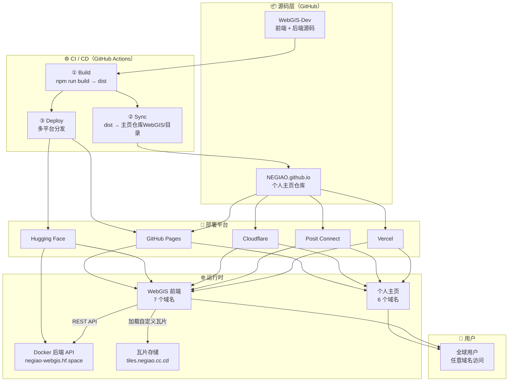

# 系统架构（System Architecture）

> 本文档以**分层架构图**展示 WebGIS 项目的完整工程链路：源码 → CI/CD → 多平台部署 → 运行时 → 用户。
> 各层的详细分解见姊妹文档：[cicd-pipeline.md](cicd-pipeline.md) · [deployment-relationship.md](deployment-relationship.md)

---

## 架构全景



---

## 五层职责说明

### 第一层：源码层

| 仓库 | 角色 | 说明 |
|------|------|------|
| `NEGIAO/WebGIS-Dev` | 主仓库 | 前端（Vue 3 + Vite）+ 后端（FastAPI + Docker）源码 |
| `NEGIAO/NEGIAO.github.io` | 个人主页仓库 | 接收 WebGIS 前端 dist 同步到 `WebGIS/` 子目录，并作为多平台分发的中转站 |

**关键机制**：WebGIS-Dev 的 GitHub Actions 将构建产物 dist 推送到主页仓库后，**主页仓库自身触发** Cloudflare / Posit / Vercel 的部署，形成两级分发架构。

### 第二层：CI/CD 层

**单一工作流文件**：[.github/workflows/deploy.yml](../../.github/workflows/deploy.yml)

触发条件：`main` 分支 push 或手动触发（`workflow_dispatch`）

流水线阶段：
1. **Build** — Node.js 22 构建前端，产出 `frontend/dist`
2. **Sync** — dist 文件同步到 `NEGIAO.github.io` 仓库的 `WebGIS/` 目录（触发主页仓库的下游部署）
3. **Deploy** — 直接部署到 GitHub Pages / Hugging Face（Static + Docker）

> 详细流水线分析见 [cicd-pipeline.md](cicd-pipeline.md)

### 第三层：部署平台

| 平台 | 部署内容 | 部署来源 | 部署方式 |
|------|----------|----------|----------|
| **GitHub Pages** | 个人主页 + WebGIS 前端 | 双仓库均触发 | `actions/deploy-pages` 直接部署 |
| **Cloudflare Pages** | 个人主页 + WebGIS 主页仓库子目录 | 主页仓库触发 | CDN + DNS + R2 |
| **Hugging Face Static** | WebGIS 前端（LFS） | WebGIS-Dev 直接推送 | `git push --force` 到 `NEGIAO/Web` |
| **Hugging Face Docker** | 后端 API | WebGIS-Dev 直接推送 | `git subtree split` 推送 `NEGIAO/WebGIS` |
| **Posit Connect Cloud** | 个人主页 + WebGIS | 主页仓库触发 | 静态托管 |
| **Vercel** | 个人主页 + WebGIS | 主页仓库触发 | 快速部署 |

#### 平台能力对比

| 能力 | GitHub Pages | Cloudflare | Hugging Face | Posit Connect | Vercel |
|------|:------------:|:----------:|:------------:|:-------------:|:------:|
| 静态托管 | ✅ | ✅ | ✅ | ✅ | ✅ |
| Docker 后端 | ❌ | ❌ | ✅ | ❌ | ❌ |
| 全球 CDN | ✅ | ✅ | ✅ | ✅ | ✅ |
| 自定义域名 | ✅ | ✅ | ❌ | ❌ | ❌ |
| DNS 托管 | ❌ | ✅ | ❌ | ❌ | ❌ |
| 对象存储 | ❌ | R2 | ❌ | ❌ | ❌ |
| 国内可访问 | ⚠️ 不稳定 | ✅ 速度快 | ✅ 慢 | ✅ 可访问 | ❌ 不可访问 |
| 免费额度 | 1 GB | 无限 | 有限（旧用户免费） | 有限 | 100 GB |

#### 平台优缺点

| 平台 | 优点 | 缺点 |
|------|------|------|
| **GitHub Pages** | 全球知名、零配置、与 GitHub 深度集成 | 只能部署静态页面；国内访问不稳定 |
| **Cloudflare** | 功能丰富（DNS + CDN + R2）、国内访问速度快 | 部分域名（.cc.cd）在国内被屏蔽 |
| **Hugging Face** | 免费 Docker 部署后端（旧用户）、国内可访问 | 资源有限；48h 无人访问自动休眠（需 UptimeRobot 保活） |
| **Posit Connect** | 国内可访问、支持静态 + 轻量 Python | 功能受限，只能部署静态或轻量架构 |
| **Vercel** | 部署极快、全球 CDN | 国内无法访问 |

### 第四层：运行时

| 组件 | 入口数量 | 说明 |
|------|----------|------|
| **个人主页前端** | 6 个域名 | 静态个人主页，托管在多个平台 |
| **WebGIS 前端** | 7 个域名 | Vue 3 SPA，静态资源 |
| **Docker 后端 API** | 1 个域名 | FastAPI + SQLite + 空间分析 |
| **瓦片存储** | 1 个域名 | Cloudflare R2 对象存储的 XYZ 自定义瓦片服务 |

**前后端通信**：
- 前端通过 `VITE_BACKEND_URL`（构建期注入）调用后端 API
- 自定义瓦片通过 `VITE_TILE_PROXY_BASE_URL` 走后端代理（fallback 模式：直连失败才代理）
- 详见 [frontend/src/config/publicRuntime.ts](../../frontend/src/config/publicRuntime.ts)

### 第五层：用户层

无论用户通过哪个域名访问，最终都到达同一个前端 → 同一个后端 → 同一个瓦片库。

---

## 域名全景

> 完整域名映射、部署来源矩阵见 [deployment-relationship.md](deployment-relationship.md)

### 个人主页域名（6 个）

| 域名 | 平台 | CDN | 国内访问 | 来源 |
|------|------|-----|----------|------|
| `negiao.github.io` | GitHub Pages 默认 | ❌ | ⚠️ 不稳定 | 主页仓库 |
| `negiao.cloud-ip.cc` | GitHub Pages + 自定义域 | ✅ 可配 | ✅ 可访问 | 主页仓库 |
| `negiao.cc.cd` | Cloudflare Pages | ✅ Cloudflare | ❌ 被屏蔽 | 主页仓库 |
| `negiao.pages.dev` | Cloudflare Pages 默认 | ✅ Cloudflare | ❌ 被屏蔽 | 主页仓库 |
| `negiao-pages.share.connect.posit.cloud` | Posit Connect 默认 | ❌ | ✅ 可访问 | 主页仓库 |
| `negiao.vercel.app` | Vercel 默认 | ❌ | ❌ 不可访问 | 主页仓库 |

### WebGIS 前端域名（7 个）

| 域名 | 平台 | 来源 |
|------|------|------|
| `negiao.github.io/WebGIS-Dev` | GitHub Pages | WebGIS-Dev 仓库根路径 |
| `negiao.github.io/WebGIS` | GitHub Pages | 主页仓库 `WebGIS/` 子目录 |
| `negiao.cloud-ip.cc/WebGIS-Dev` | GitHub Pages + 自定义域 | 自动跳转 |
| `webgis.negiao.cc.cd` | Cloudflare Pages | 私有域名挂载 |
| `webgis-dev.pages.dev` | Cloudflare Pages 默认 | 自动分配 |
| `negiao-webgis.share.connect.posit.cloud` | Posit Connect 默认 | 主页仓库触发 |
| `negiao-web.static.hf.space` | Hugging Face Static | WebGIS-Dev 直接推送 |

### 后端与存储域名（2 个）

| 组件 | 域名 | 平台 | 说明 |
|------|------|------|------|
| 后端 API | `negiao-webgis.hf.space` | Hugging Face Docker | FastAPI + SQLite |
| 自定义瓦片存储 | `tiles.negiao.cc.cd` | Cloudflare R2 | XYZ 自定义瓦片对象存储 |

#### 域名能力对比

| 域名 | 可配 DNS | 可配 CDN | 只能托管 |
|------|----------|----------|----------|
| `negiao.github.io` | ❌ | ❌ | ✅ GitHub Pages |
| `negiao.cloud-ip.cc` | ✅ 大部分记录 | ✅ | ❌ 全能 |
| `negiao.cc.cd` | ✅ Cloudflare | ✅ Cloudflare | ❌ 全能 |
| `negiao.pages.dev` | ❌ | ❌ | ✅ Cloudflare |
| `negiao-pages.share.connect.posit.cloud` | ❌ | ❌ | ✅ Posit |
| `negiao.vercel.app` | ❌ | ❌ | ✅ Vercel |

---

## 数据流总结

```
用户请求
    │
    ├── 个人主页域名 ──► 静态个人主页（6 个域名）
    │
    └── WebGIS 前端域名 ──► Vue 3 SPA（7 个域名）
                            │
                            ├── REST API ──────────► HF Docker 后端（FastAPI + SQLite）
                            │                          negiao-webgis.hf.space
                            │
                            └── 瓦片请求 ──────────► tiles.negiao.cc.cd（Cloudflare R2）
                                                      │
                                                      └── 后端代理（fallback 模式）
                                                      negiao-webgis.hf.space/proxy/*
```

---

*本文档随部署架构变化更新；日常改动见维护日志。*
*基线版本：V3.5.5*
