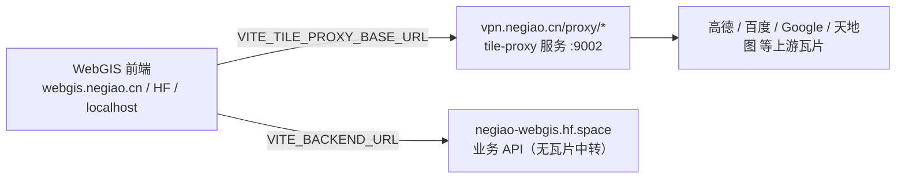

# 瓦片纠偏系统（已迁出本仓库）

日期：2026-09-15  
状态：**实现不在 WebGIS-Dev**。本页只保留业务说明与接入契约，供前端/运维对照。

## 1. 迁出结论

| 项 | 位置 |
|---|---|
| **开源实现** | 独立仓 `tile-proxy`（GCJ-02 / BD-09 ↔ WGS84 逐瓦片纠偏 + 直通代理） |
| **线上入口** | `https://vpn.negiao.cn/proxy/*`（Azure VPS，nginx → 127.0.0.1:9002） |
| **本仓库残留** | 仅 `backend/core/coord_transform.py` 纯坐标数学（无网络 IO，供 `location` 展示 GCJ） |
| **HF Space** | **禁止**挂载任何 `/proxy/*`、`/tiles/*` 中转（平台 Content Policy） |

## 2. 为什么需要纠偏（业务背景）

国内合规图源（高德、百度、天地图等）发布的瓦片不是 WGS84，而是加偏坐标系：

| 坐标系 | 谁在用 | 与 WGS84 的关系 |
|---|---|---|
| WGS84 | GPS、OSM、Esri、前端双引擎统一工作空间 | 基准，无偏移 |
| GCJ-02（火星坐标） | 高德、腾讯、谷歌中国、天地图 | 国测局非线性偏移，城区可达数百米 |
| BD-09 | 百度全系 | GCJ-02 之上再加偏 |
| BD09MC（百度墨卡托） | 百度瓦片网格 | 独立投影 + 独立网格 |

把 GCJ/BD 瓦片按标准 XYZ 直接贴到 WGS84 画布会整城错位。纠偏服务在**服务端逐瓦片重采样**，输出与请求方网格对齐的 256×256 图，前端零改造。

## 3. 对外路由契约（VPS / 开源仓）

| 路由 | 含义 |
|---|---|
| `GET /proxy/gcj2wgs/{完整上游URL}` | GCJ 瓦片 → WGS84 对齐 |
| `GET /proxy/wgs2gcj/{完整上游URL}` | WGS84 → GCJ 对齐 |
| `GET /proxy/bd2wgs/{完整上游URL}` | BD-09 → WGS84（跨网格） |
| `GET /proxy/wgs2bd/{完整上游URL}` | WGS84 → BD-09 网格 |
| `GET /proxy/{host+path}` | 通用直通（浏览器兼容头 / Referer） |
| `GET /health` 或 `GET /tile-proxy/health` | 健康检查 |

CORS：`Access-Control-Allow-Origin: *`（任意前端源）。

前端拼接统一走 `frontend/src/config/publicRuntime.ts` 的 `tileProxyUrl` / `gcj2wgsProxyUrl` / `bd2wgsProxyUrl`，基址来自 `VITE_TILE_PROXY_BASE_URL`（生产默认 `https://vpn.negiao.cn`）。

## 4. 与本仓库的边界

| 仍在 WebGIS-Dev | 不在 WebGIS-Dev |
|---|---|
| 底图 UI / TOC / 双引擎加载 | `/proxy/*` 路由与纠偏管线 |
| `core/coord_transform.wgs2gcj`（点坐标） | 磁盘/内存瓦片缓存、SSRF 出站、httpx 抓取 |
| 前端 `VITE_TILE_PROXY_*` 配置 | 底图批量下载（download） |

## 5. 运维与开源

- **VPS 代码树**：`vpn.negiao.cn` 仓库 `src/backend/tile-proxy/`（push 经 post-receive 部署）
- **开源仓**：独立 `tile-proxy`（FastAPI + `domains/tiles`，可单独部署任意主机）
- **小内存护栏**：单 worker、内存缓存约 3000 条、磁盘缓存上限与按龄清理见开源仓 README

## 6. 历史

实现原在本仓 `backend/domains/tiles/`。因 HF 禁止 Space 上的第三方内容中转，于 2026-09-15 整包迁出；本仓库不再包含纠偏代理业务代码。
