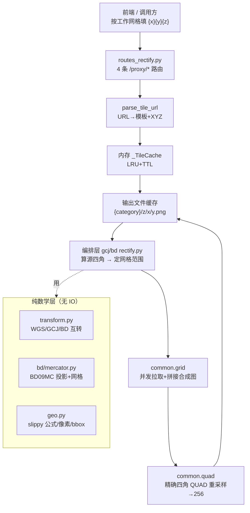

# 瓦片纠偏系统架构说明

日期：2026-09-03

适用范围：`backend/domains/tiles/rectify/`（GCJ-02 / BD-09 瓦片纠偏库）、`backend/domains/tiles/routes_rectify.py`（纠偏代理路由）、`backend/domains/tiles/proxy_shared.py`（共享代理 infra）。

本文是纠偏子系统的长期参考文档，详细说明"为什么偏、怎么纠、代码如何分工"。前端底图源体系见 `basemap-source-system.md`（其 §2 有本模块的文件级索引）；本文不重复，只深入实现与处理。

## 1. 背景：为什么需要纠偏

国内合规图源（高德、百度、天地图等）发布的瓦片不是 WGS84，而是加偏坐标系：

| 坐标系 | 谁在用 | 与 WGS84 的关系 |
|---|---|---|
| WGS84 | GPS、OSM、Esri、前端双引擎的统一工作空间 | 基准，无偏移 |
| GCJ-02（火星坐标） | 高德、腾讯、谷歌中国、天地图 | 国测局非线性偏移，城区可达数百米 |
| BD-09 | 百度全系 | GCJ-02 之上再加偏（极坐标抖动 + 平移） |
| BD09MC（百度墨卡托） | 百度瓦片网格 | 独立投影+独立网格（见 §5），不只是"坐标值偏移" |

后果：把 GCJ/BD 瓦片按标准 XYZ 索引直接贴到 WGS84 画布上，全城错位；把 WGS84 矢量（POI、轨迹、测量）叠到偏移底图上，点位同样错位。本系统在**服务端逐瓦片重采样**，对外永远输出请求方坐标空间对齐的 256×256 PNG，前端零改造成本。

数值参考（天安门 WGS84 116.3975, 39.9087，实测）：WGS→GCJ 偏移约 (＋560m, ＋160m)；GCJ→BD 再偏约 (＋550m, ＋710m)。忽略纠偏等于整图漂移。

## 2. 总览：请求链路与模块分工

依赖铁律（`rectify/__init__.py` 头部声明，调用方只从包根 import）：`bd → common ← gcj`，`common` 禁止 import 兄弟包。对外统一出口见 `__all__`（4 个瓦片函数 + 6 个点位函数 + URL 模板工具 + 缓存目录）。

| 文件 | 职责，一句话 |
|---|---|
| `rectify/__init__.py` | 统一出口 + 依赖方向声明 |
| `common/transform.py` | WGS84/GCJ-02/BD-09 点位互转（国测局算法 + 牛顿迭代逆解） |
| `common/geo.py` | slippy XYZ↔经纬度、全局像素、bbox/四角转换、缓存目录定位、PIL  bytes 互转 |
| `common/url_template.py` | 上游 URL 解析为模板（format/query/path 三模式）+ 回填组装 |
| `common/fetch.py` | 出站抓取：单例 httpx、浏览器头、Referer 白名单、2 次重试 |
| `common/grid.py` | 网格并发拉取（信号量 16）、三层资源护栏、文件缓存、拼接 |
| `common/quad.py` | 精确四角 QUAD 透视重采样（几何无缝原语），调用方自选重采样核 |
| `gcj/rectify.py` | GCJ↔WGS 编排（同网格同分辨率，BILINEAR），z≤9 直通 |
| `bd/mercator.py` | 百度官方 BD09MC 分段多项式投影 + BD 网格数学 |
| `bd/rectify.py` | BD↔WGS 编排（跨网格，BICUBIC），z±1 分辨率对齐 |
| `routes_rectify.py` | 4 条 FastAPI 路由 + 错误码映射（400/504/502） |

## 3. 坐标数学层

### 3.1 `transform.py`：国测局加偏与逆解

- **正向加偏** `wgs2gcj`：标准流程——相对 (105°E, 35°N) 的经纬度多项式 + 三角级数（`_transform_lat/_transform_lon`）求偏移弧度，再经 WGS84 椭球参数（长半轴 6378245.0、扁率 1/298.3）换算成经纬度增量。算法来源 QGIS OffsetWGS84Core（GPLv2+，文件头已注明）。
- **逆向** `gcj2wgs`：无解析逆函数，用**牛顿迭代**（定点迭代形式）：最多 20 次、两次迭代差 `< 1e-6°`（约 0.1 米）即停；不收敛记 warning 日志并返回当前值，绝不抛异常中断瓦片管线。实测天安门闭环误差约 0.02 毫米（远优于设计容差，因为城区偏移场光滑、迭代 3–5 次即收敛）。
- **BD 经 GCJ 中转**：`wgs2bd = gcj2bd∘wgs2gcj`，`bd2wgs = gcj2wgs∘bd2gcj`，其中 GCJ↔BD 是闭式极坐标公式（含 0.0065/0.006 平移与小幅正弦抖动）。实测 BD 闭环误差约 5 厘米——比 GCJ 直接逆解大两个量级，属公式本身精度，来自动物园级应用无妨，厘米级测量不要用 BD 链。
- **境外直通**：`out_of_china`（72.004–137.8347°E，0.8293–55.8271°N）框外直接返回原值——GCJ 偏移只在中国境内有定义，代理全球瓦片时框外零开销、零变形。

### 3.2 `bd/mercator.py`：百度官方投影（最容易踩坑处）

百度墨卡托**不是**标准球面墨卡托，而是百度 JS API v2.0 的 `LL2MC/MC2LL` **分段六阶多项式拟合**：按 `|lat|`（正向，阈值 75/60/45/30/15/0）或 `|mercator_y|`（逆向）选带，每带 10 个系数。系数表来源 `CntChen/tile-lnglat-transform`（自官方 SDK 抽取，含南半球分带 bug 的官方确认修正——`bd_ll2mc` 里 `lat < -75` 的 fallback 即该修正）。

用球面公式代替的代价（文件头实测记录）：北京地区系统性偏差 x 约 15km、y 约 23km（z16 天安门瓦片内容偏西北约 12km）。**任何"百度转 Web 墨卡托近似一下"的捷径在此系统内都是 bug。**

网格定义（与标准 XYZ 处处不同）：原点 (0,0) 居中、Y 轴**向上**、分辨率 `res(z) = 2^(18-z)` m/px（z16 = 4.0 m/px，实测与文档一致）；`bd_lonlat_to_tile_px` 返回瓦片内"距顶"偏移时已做 `from_top = (ty+1)*256 - py` 翻转；`bd_tile_bbox` 返回左上/右下 BD09 经纬度。LL2MC/MC2LL 自闭环实测误差毫米级，可视为精确互逆。

### 3.3 `geo.py`：slippy 网格与"四角逐点"铁律

- 标准 slippy 公式：`xyz_to_lonlat / lonlat_to_xyz / xyz_to_bbox`（x 向东、y 向南）。
- `lonlat_to_global_px`：同公式但保留浮点亚像素——QUAD 重采样要求输入 float，`int()` 截断是旧接缝 bug 的根因之一（见 §6）。
- **四角逐点、永不取极值**：`wgsbbox_to_gcj_corners` 等返回 (LT, RT, LB, RB) 各自转换结果。GCJ 偏移场是非线性的，bbox 取极值会把倾斜四边形压扁，相邻瓦片在共享边上误差反相关 → 1px 级台阶。所有重采样几何必须用四角，极值只允许用来**确定拉取网格范围**。
- `get_cache_dir`：`GCJRE_CACHE` 环境变量优先，否则按 `pyproject.toml` 标记向上找 backend 根 → `data/gcj_rectify_cache`（旧实现 `parents[1]` 硬编码曾误建目录，已改标记查找）。

## 4. 通用管线 common（双向双系共用）

### 4.1 `url_template.py`：把任意上游 URL 变成"填空模板"

客户端传进来的是一条**带真实坐标的完整 URL**（如高德 `...&x=269 anguish...`）。解析按三档从严到宽：

1. **format 模式**（优先）：正则直找 `x=/tilecol=` 等键（兼容 WMTS `tilecol/tilerow/tilematrix` 别名），倒序替换为 `{x}{y}{z}` 占位，回填时字符串替换、**不重组 URL**（避免 `urlencode` 改写特殊字符）。
2. **query 模式**：标准 `parse_qsl`，别名键同样支持，回填只替换三键的值、其余原样保留（含 key 大小写）。
3. **path 模式**：路径数字 token 全量扫描，枚举全部有序三元组，zxy 优先、其次 xyz，按"合法（z≤30 且 x,y ≤ 2^z−1）且 x+y 最大"胜出——判据依据：真实瓦片坐标数值量级必然大于样式/版本数字。专为 Google `maps/vt pb=!1m4!1m3!1i10…` 这类单段内嵌多坐标 URL 设计（三元组非相邻，必须全枚举）。
4. 模板指纹 `cache_key = sha1(template_id)[:16]`，同时是磁盘缓存的顶层目录名——同模板源瓦片跨请求复用，不同模板（哪怕同域名不同样式参数）天然隔离。

### 4.2 `fetch.py`：出站抓取

- 模块级 httpx 单例（连接 8s / 读取 12s / 写入 10s / 池等待 5s；连接池 80/keepalive 15），路由层优先复用 `app.state.http_client`，缺失才建 fallback。
- 请求头：完整浏览器特征（**不广告 br/zstd**，因本面需 httpx 解压）+ 按 Referer 白名单附加防盗链头（含百度）。
- 重试：循环（非递归防栈溢出），最多 2 次、0.5s→1.0s 退避；只重试超时与 `RemoteProtocolError`（= 上游限流掐连接）；事件循环 closed 时重置单例；非 200 直接抛 `RuntimeError`（上游 404/403 不值得重试）。

### 4.3 `grid.py`：网格拉取、护栏、缓存、拼接

- 并发：信号量 16（曾 100，收紧防单请求打爆上游与本机 fd）；单片失败→空白透明片兜底，**不断整流**。
- 三层资源护栏（env 可调，均可在路由层转为 400）：单片字节 ≤8MB（`GCJRE_TILE_MAX_MB`，先判字节再解码）；解码像素硬上限 16M（`GCJRE_MAX_IMAGE_PIXELS`，把 Pillow 默认只告警收紧为抛 `DecompressionBombError`，防解压炸弹）；单请求网格片数 ≤64（`GCJRE_MAX_TILES_PER_REQUEST`，正常纠偏 2×2~3×3）。
- 两级文件缓存：源瓦片 `…/{template_key}/source-{sys}/z/x/y.png`（命中直接返字节，零解码；魔数校验 PNG/JPEG/GIF/WebP，非标准格式转 PNG 后落盘）→ 输出瓦片 `{category}/z/x/y.png`。PNG 原样落盘避免反复编解码损失。
- 拼接：标准 XYZ 按 y 升序向下贴（`_merge_tiles`）；百度 Y 轴向上，行号翻转（`_merge_bd_tiles`，第 0 行是最北 `ty_max`）——翻转错一行整图南北镜像，是 BD 侧最高危的一行代码。

### 4.4 `quad.py`：几何无缝原语

`PIL.Image.QUAD` 透视变换：输出四角 (0,0)/(0,256)/(256,256)/(256,0) 映射到合成图 float 四边形。无缝的充分条件：**共享边端点由同一地理角点经同一函数算出**（bit 级一致）——这就是全系统坚持"四角逐点"的 payoff。退化（边长 <0.5px）、非有限值、整体落图外 → 返回透明瓦片而非抛异常。**调用方自选重采样核**：GCJ 同网格 1:1 用 BILINEAR（核半径小、frac≈0 退化为拷贝，几乎不柔化）；BD 跨网格降采样（约 306→256）用 BICUBIC 保细节。旧 `int()` 截断裁切（`_crop_composite`）与轴对齐 resize（`_crop_resize`、bbox 取极值 `_corners_bbox`）已标记 deprecated 保留作兼容/退化兜底，内部管线禁用。

## 5. 两条编排链：GCJ（同网格）vs BD（跨网格）

这是理解本系统的核心分野：

| | GCJ-02 ↔ WGS84 | BD-09 ↔ WGS84 |
|---|---|---|
| 网格关系 | **同网格**：标准 Web 墨卡托，仅坐标值偏移 | **跨网格**：BD09MC 独立网格（居中原点、Y 向上） |
| 分辨率 | 同 z 同分辨率，1:1 | 不对等：`z_bd ≈ z±1` 才能对齐 |
| 做法 | 同索引换 bbox | 拉覆盖 bbox 的源网格再重采样 |
| 重采样核 | BILINEAR | BICUBIC（306→256 降采样） |
| 低层级 | z≤9 直接返源片（偏差亚像素可忽略） | 同左（逻辑相同） |

**GCJ 双向**（`gcj/rectify.py`）：输出 bbox（WGS 或 GCJ）→ 四角逐点转到源系 → 全局像素 float → 极值定源网格范围 → 拉取拼接 → QUAD → 256。输出缓存分类 `gcj2wgs2 / wgs2gcj2`，源缓存 `source-gcj / source-wgs`。

**BD→WGS**（`get_bd2wgs_tile`）：WGS bbox 四角 →`wgs2bd`→ BD 像素（`z_bd = min(z+1, 18)`，街道底图 18 以上未验证钳制防 404）→ 拉 BD 网格 → Y 翻转 QUAD。**WGS→BD**（`get_wgs2bd_tile`）：注意输入索引按**百度网格**解释（客户端在百度空间工作）→ BD bbox →`bd2wgs`→ 标准像素（`z_src = max(z-1, 2)` 防下穿）→ QUAD。百度世界范围校验：换算后 |lon|>180 或 |lat|>85 直接抛 `ValueError`（路由层转 400），这类索引在百度网格根本不存在，拒绝比透明片诚实。

## 6. 路由层与接入契约

`routes_rectify.py` 暴露 4 端点（`GET /proxy/{gcj2wgs,wgs2gcj,bd2wgs,wgs2bd}/{target_url:path}`）：解析 URL→查内存缓存→调编排→写内存缓存→返 `image/png`。错误码映射固定：模板解析失败/`ValueError`（护栏拒绝、BD 越界）→ 400；httpx 超时 → 504；解压炸弹 → 400；其余 → 502。**挂载顺序是正确性的一部分**：`domains/tiles/__init__.py` 先挂 rectify 再挂 `routes_passthrough` 的 `/proxy/{target_url:path}` 通配，顺序反了纠偏路由会被吞掉。

配套 infra（`proxy_shared.py`）：内存 `_TileCache`（TTL 默认 300s、上限 10 万条，均 env 可调）+ IP 限流（`PROXY_RATE_LIMIT`，默认 0=关闭）+ 私有地址 SSRF 拦截。磁盘缓存目录默认 `backend/data/gcj_rectify_cache`（`GCJRE_CACHE` 可覆盖）。

调用方有三处：① 前端底图经 `/proxy/*`（主流量）；② `api/location.py` 直接 import 点位函数 `wgs2gcj` 做坐标换算（纯数学，无 IO）；③ `tests/tiles/test_url_template.py` 覆盖模板解析（另有 `test_tiles_router.py` 覆盖路由挂载）。

## 7. 配置速查

| 变量 | 默认 | 作用位置 |
|---|---|---|
| `GCJRE_CACHE` | `backend/data/gcj_rectify_cache` | `geo.get_cache_dir`：磁盘缓存根 |
| `GCJRE_MAX_CONCURRENCY` | 16 | `grid`：单请求并发拉取信号量 |
| `GCJRE_TILE_MAX_MB` | 8 | `grid`：单片字节上限（→400） |
| `GCJRE_MAX_IMAGE_PIXELS` | 16M | `grid`：解码像素硬上限（→400） |
| `GCJRE_MAX_TILES_PER_REQUEST` | 64 | `grid`：单请求网格片数上限（→400） |
| `PROXY_TILE_CACHE_TTL_SECONDS` | 300（10–3600） | 内存瓦片缓存 TTL |
| `PROXY_TILE_CACHE_MAX_SIZE` | 100000 | 内存瓦片缓存条目上限 |
| `PROXY_RATE_LIMIT` | 0（关闭） | 每 IP 限流 |

## 8. 已知约束与维护忠告

1. **z≤9 直通是近似**：低层级偏差不足一像素，直接返源片省 4–9 次上游请求； overlay 高精度矢量时若发现低层级错位，先查这里。
2. **BD 街道底图只验证到 z18**，`_BD_MAX_ZOOM` 钳制；要开更高层级先拿天安门实测对齐。
3. **`wgs2bd` 的输入索引是百度网格**，不是标准 XYZ——客户端传错网格，bbox 换算静默错位但不报错，联调先对网格。
4. **deprecated 函数别复活**：`_crop_composite`（int 截断）、`_crop_resize`、`_corners_bbox`（取极值）是历史接缝 bug 的本体，只许作退化兜底。
5. **境外零变形是 feature**：`out_of_china` 直接返回原值，跨国业务不要"优化"掉。
6. **迭代不收敛告警**：`gcj2wgs` 20 次不收敛只记 warning 不抛错；该日志出现即说明输入坐标异常，查上游而非调大迭代数。
7. **单片失败补空白**：上游单片 404/超时只会造成局部缺块透明，整幅可返回；大面积缺块查上游源站与并发/限流配置，不要加重试（重试预算已在 fetch 层用完）。
