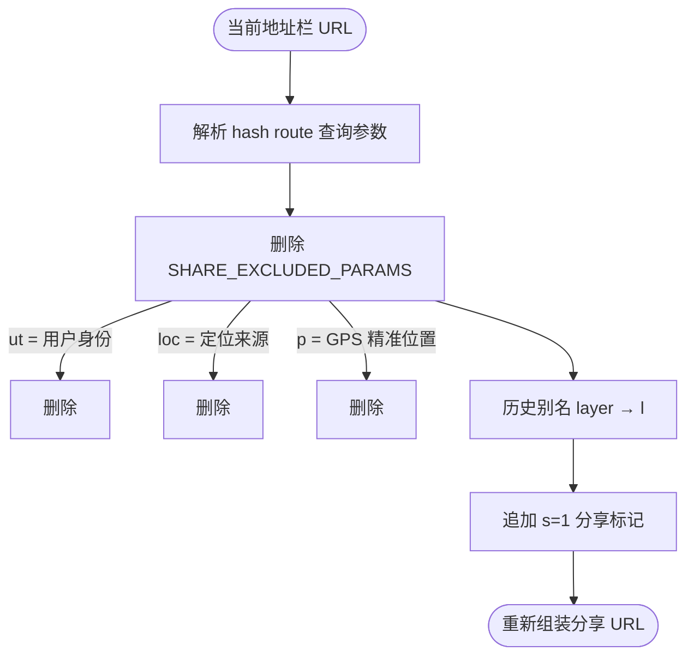

# 实用工具集合架构说明

日期：2026-07-21（后端纠偏/下载 2026-09-15 迁出）

> ⚠️ **底图批量下载与瓦片纠偏后端已迁出本仓库**。
> - 开源实现：独立仓 **`tile-proxy`**（含纠偏；下载能力随该仓/自建部署）
> - 线上纠偏入口：`https://vpn.negiao.cn/proxy/*`
> - 本仓 `location` 仅用 `core/coord_transform.py` 做点坐标 GCJ
> - 详见 [tile-rectify-system.md](tile-rectify-system.md)

适用范围：前端 `frontend/src/domains/ol/drawing/composables/useDrawMeasure.js`、`frontend/src/domains/ol/components/MapControlsBar.vue`、`frontend/src/domains/common/map-view/coordinateFormatter.js`、`frontend/src/domains/ol/utils/coordTransform.js`、`frontend/src/domains/common/compass/services/CompassManager.ts`、`frontend/src/domains/common/compass/stores/useCompassStore.ts`、`frontend/src/domains/common/shell/TopBar.vue`。

本文是长期参考文档，说明 WebGIS 3.0 中"实用工具"功能集合的算法原理、数据结构、前后端交互机制与实现细节，供后续维护、扩展与问题排查时对照。

## 1. 功能定位

本功能集合为 WebGIS 3.0 提供一组相对独立的地图辅助工具，覆盖日常 GIS 操作中最常用的需求：

- **距离/面积测量**：基于测地线算法的交互式量测
- **坐标拾取与格式化**：实时鼠标坐标显示、6 种格式切换、WGS84/GCJ-02 纠偏
- **风水罗盘导航**：矢量/HUD 双模式罗盘，支持陀螺仪方向同步
- **分享链接**：一键生成脱敏视角分享 URL
- ~~在线底图下载 / 后端瓦片纠偏~~ → **已迁出**（开源仓 `tile-proxy` / 自建部署；本仓无 `/api/download`、无 `/proxy/*`）

这些工具彼此解耦，各自通过独立的 composable / service 实现，可单独启用或移除。

## 2. 文件结构

| 文件 | 职责 |
|------|------|
| `domains/ol/drawing/composables/useDrawMeasure.js` | 测量核心：Draw/Snap 交互、ol/sphere 测地线计算、Overlay 提示框 |
| `domains/ol/components/ControlsPanel/MeasurePanel.vue` | 测量 UI 面板：测距/测面工具选择、清除操作 |
| `domains/ol/components/MapControlsBar.vue` | 坐标显示控制条：实时坐标、格式切换、坐标编辑跳转、缩放级别 |
| `domains/common/map-view/coordinateFormatter.js` | 坐标格式化引擎：6 种格式定义、十进制/DMS 互转、坐标解析 |
| `domains/ol/utils/coordTransform.js` | 前端坐标转换：WGS84 ↔ GCJ-02（国测局偏移算法） |
| `domains/common/compass/services/CompassManager.ts` | 罗盘管理器：矢量图层生命周期、Canvas 原生渲染、传感器同步、URL 状态 |
| `domains/common/compass/stores/useCompassStore.ts` | 罗盘 Pinia 状态：模式/位置/旋转/主题/宫位选中 |
| `domains/common/compass/services/urlState.ts` | 罗盘 URL 状态读写：cs 参数编解码桥接 |
| `domains/common/url-state/crypto.js` | BigInt 位打包编解码：经纬度/半径/相机状态 → Base62 短码 |
| `domains/common/shell/TopBar.vue` | 分享链接：私有参数排除、s=1 标记、Native Share / 剪贴板 |
| `backend/core/coord_transform.py` | 点坐标 GCJ/BD 纯数学（本仓残留；`location` 用 `wgs2gcj`） |
| ~~`backend/domains/tiles/**`~~ | **已迁出** → 开源仓 `tile-proxy`；线上 `https://vpn.negiao.cn/proxy/*` |

## 3. 距离/面积测量

### 3.1 算法原理

测量基于 OpenLayers 的 `ol/sphere` 模块，调用 `getLength(line)` 和 `getArea(poly)` 计算**测地线距离与面积**（WGS84 椭球体上的大地测量），而非平面欧氏距离。这保证了在大范围测量时结果与真实地表距离一致。

格式化规则：
- 距离 > 100m 时显示为 km（保留 2 位小数），否则显示 m
- 面积 > 10000m² 时显示为 km²，否则显示 m²

### 3.2 交互机制

`createDrawMeasureFeature()` 工厂函数返回完整的测量交互能力：

1. **激活**：`activateInteraction(type)` 根据类型（`MeasureDistance` / `MeasureArea`）创建 `ol/interaction/Draw`（映射为 LineString / Polygon）+ `ol/interaction/Snap`（吸附已有要素节点）。
2. **实时提示**：`drawstart` 事件中监听草图几何的 `change` 事件，每帧调用 `formatLength` / `formatArea` 更新 `ol/Overlay` 提示框内容与位置（线取末点、面取内部点）。
3. **完成**：`drawend` 事件将提示框转为静态样式（`ol-tooltip-static`），随后重建新的提示框供下次测量使用。
4. **清理**：`clearInteractions()` 移除 Draw/Snap 交互、Overlay、几何监听器和 drawstart/drawend 监听器 key，防止内存泄漏。

### 3.3 UI 面板

`MeasurePanel.vue` 提供两个工具按钮（测距 / 测面），选中后通过 `emit('measure-type', type)` 通知父组件调用 `activateInteraction`。"清除测量结果"按钮触发 `clearAllGraphics()`，移除所有绘制源要素和关联的托管矢量图层。

## 4. 坐标拾取与格式化

### 4.1 显示格式（6 种）

`coordinateFormatter.js` 定义 `COORDINATE_FORMATS` 常量，支持 6 种坐标显示格式：

| 格式 ID | 说明 | 示例 |
|---------|------|------|
| `format_1` | 十进制，经度在前 (E, N) | `114.302400, 34.814600` |
| `format_2` | 十进制，纬度在前 (N, E) | `34.814600, 114.302400` |
| `format_3` | 十进制带方向 (E, N) | `114.302400E, 34.814600N` |
| `format_4` | 十进制带方向 (N, E) | `34.814600N, 114.302400E` |
| `format_5` | 度分秒 (E, N) | `114°18'08.64"E, 34°48'52.56"N` |
| `format_6` | 度分秒 (N, E) | `34°48'52.56"N, 114°18'08.64"E` |

小数位数支持 2/4/6/8 位可选（`DECIMAL_PLACES`），默认 6 位。用户偏好通过 `localStorage` 持久化（键 `gis_coord_format_id` / `gis_coord_decimal_places`）。

**注意**：当前不支持 UTM（通用横轴墨卡托）投影坐标格式。

### 4.2 坐标解析

`parseCoordinate(input, formatId)` 支持自动识别三种输入：
1. **度分秒**：正则匹配 `°'"` + 方向字母，通过 `dmsToDecimal` 转换
2. **十进制带方向**：匹配数值 + E/W/N/S 后缀
3. **纯十进制**：根据 `formatId` 判断经纬度顺序（format_2/4/6 为纬度在前），无格式指示时按数值范围自动推断

### 4.3 MapControlsBar 组件

`MapControlsBar.vue` 是地图右下角的控制条，功能包括：
- **实时坐标显示**：接收父组件传入的 `coordinate` prop（鼠标移动时的经纬度），通过 `formatCoordinate()` 按当前格式渲染
- **坐标编辑跳转**：点击坐标区进入编辑模式，输入坐标回车后 `emit('jump-to', {lng, lat})` 驱动地图飞行
- **一键复制**：优先 Clipboard API，回退 `execCommand('copy')`
- **格式配置菜单**：弹出面板选择显示格式与小数位数
- **主页按钮**：单击重置视图（280ms 延迟），双击定位用户位置

### 4.4 WGS84 / GCJ-02 坐标转换

前端 `coordTransform.js` 实现国测局偏移算法：
- `wgs84ToGcj02(lon, lat)`：正向加偏
- `gcj02ToWgs84(lon, lat)`：逆向求解（线性近似：`lon*2 - mgLon`）

算法使用 WGS84 椭球参数（长半轴 `A = 6378245.0`，偏心率平方 `EE = 0.00669342162296594323`），通过 `outOfChina()` 判断是否在中国境内（经度 72.004~137.8347，纬度 0.8293~55.8271），境外坐标直接返回原值。

点坐标算法在本仓 `backend/core/coord_transform.py`（`wgs2gcj` / `gcj2wgs` 牛顿迭代等）。完整瓦片纠偏与下载实现在开源仓 **`tile-proxy`**，线上入口 `https://vpn.negiao.cn/proxy/*`。

## 5. 风水罗盘导航

### 5.1 双模式架构

罗盘支持两种渲染模式（`CompassMode = 'vector' | 'hud'`）：

- **vector 模式**：罗盘作为 OpenLayers 矢量图层绑定到地理坐标，随地图缩放/平移。使用 `ol/style/Style` 的自定义 `renderer` 回调在地图 Canvas 中原生绘制罗盘图形。
- **hud 模式**：罗盘固定在屏幕位置（SVG 组件渲染），设备旋转时罗盘反向旋转以保持北方指向不变。

### 5.2 CompassManager 核心职责

`CompassManager` 类管理罗盘在地图上的完整生命周期：

1. **矢量图层管理**：`ensureVectorLayer()` 创建 `VectorSource` + `Feature<Point>` + `VectorLayer`（zIndex: 1205，renderBuffer: 50000）
2. **地理坐标同步**：`syncFeatureGeometry()` 将 store 中的经纬度通过 `fromLonLat` 转为投影坐标写入 Point 几何
3. **Canvas 原生渲染**：`createNativeCanvasStyle()` 返回自定义 Style，在 renderer 回调中绘制：
   - 径向渐变背景（提高与底图对比度）
   - 天池核心圆 + 多层同心环（图层环）
   - 分宫扇区线 + 选中高亮（金色半透明填充）
   - 放射性文本（`drawRadialText`：支持径向垂直/环形横向两种对齐）
   - 刻度环（每度一刻度，10° 高亮红色 + 数字标注）
   - 天心十字线（1/3 半径长度）
4. **LOD 优化**：`radiusPx < 95` 时隐藏 ≥24 分宫文本，`< 130` 时隐藏 ≥60 分宫文本；`isCompassVisibleInView()` 在罗盘完全不可见时跳过绘制
5. **传感器同步**：`startDeviceOrientationSync()` 监听 `deviceorientation` 事件，支持 iOS `webkitCompassHeading` 和 Android `alpha` 两种数据源
6. **宫位点选**：非放置模式下点击地图，通过像素距离判断落在哪一层/哪个扇区，写入 `store.selectedPalace`

### 5.3 状态管理（useCompassStore）

Pinia store 管理罗盘全部状态：

| 状态 | 类型 | 说明 |
|------|------|------|
| `enabled` | boolean | 罗盘总开关 |
| `mode` | `'vector' \| 'hud'` | 渲染模式 |
| `position` | `{lng, lat}` | 地理中心坐标 |
| `rotation` | number | 旋转角度 [0, 360) |
| `physicalRadiusMeters` | number | 地理半径（米），默认 1000 |
| `opacity` | number | 不透明度 [0.1, 1] |
| `cid` | string | 当前主题 ID（默认 `ancient-cinnabar`） |
| `selectedPalace` | `SelectedPalace \| null` | 选中宫位信息 |
| `sensorEnabled` | boolean | 陀螺仪开关 |

计算属性 `vectorRenderConfig` / `hudRenderConfig` 分别生成两种模式的渲染配置，HUD 模式通过 `createHudRenderConfig()` 将主题参数按屏幕尺寸压缩。

### 5.4 URL 状态持久化（cs 参数 BigInt 位打包）

罗盘状态通过 URL 参数 `cs` 持久化，编解码在 `utils/url/crypto.js` 中实现：

**编码流程**（`encodeCompassState`）：
1. 经度平移 +180、纬度平移 +90，乘以 1e6 取整（保留 6 位小数精度）
2. 半径乘以 10 取整（精度 0.1m，最大 500000m）
3. BigInt 位打包：`(lngScaled << 28n) | latScaled` 得到位置包，再 `(packedPos << 23n) | radiusScaled`
4. 自定义 Base62 编码（打乱字符表），最少 8 位

**解码流程**（`decodeCompassState`）：反向操作，含范围校验。

`urlState.ts` 桥接层：
- `readCompassUrlState()`：从 hash query 读取 `cs` 参数并解码，`cs=0` 或空值表示罗盘关闭
- `writeCompassUrlState()`：编码后写入 URL（`replaceState`），罗盘未启用时删除 `cs` 参数
- 兼容清理旧版参数（`clng`/`clat`/`crot`/`cid`/`cmode`）

`CompassManager.scheduleUrlSync()` 使用 120ms 防抖写入，`restoringFromUrl` 标志防止恢复阶段的 watcher 回写循环。

## 6. 分享链接

### 6.1 私有参数排除

`TopBar.vue` 定义分享黑名单：

| 参数 | 含义 |
|------|------|
| `ut` | 用户身份（guest/admin/registered） |
| `loc` | 定位授权来源（gps/ip） |
| `p` | 编码后的 GPS 精准位置 |

其余参数（`lng`、`lat`、`z`、`l`、`view`、`cv`、`cs` 等）全部保留，用于还原分享者的视图与位置状态。

### 6.2 分享标记

`buildShareMarkedUrl(rawHref)` 构建分享 URL：
1. 解析 hash route 中的查询参数
2. 删除 `SHARE_EXCLUDED_PARAMS` 中的私有参数
3. 将历史别名 `layer` 归一化为 `l`
4. 追加分享入口标记 `s=1`
5. 重新组装 URL

`syncShareFlagInCurrentUrl()` 在分享成功后同步更新当前地址栏 URL（`replaceState`），使当前页面也带上 `s=1` 标记。

### 6.3 分享渠道

`handleShareView()` 按优先级选择分享方式：
1. **Native Share API**：移动端（Android/iOS）唤起系统分享面板
2. **Clipboard API**：桌面端优先 `navigator.clipboard.writeText`
3. **execCommand 回退**：非 HTTPS 环境降级为隐藏 textarea + `document.execCommand('copy')`

## 7. 在线底图下载（已迁出）

> **状态**：本仓 **不再提供** `/api/download/*`。批量 GeoTIFF 导出实现见开源仓 `tile-proxy`（或历史文档）；HF Space 禁止此类第三方瓦片中转。

历史 API 形态（供对照旧前端/脚本）：`POST /api/download/tasks`、`GET /api/download/tasks/{id}`、`GET .../file`。

## 8. GCJ-02 瓦片纠偏（已迁出）

> **状态**：本仓 **不再包含** 瓦片纠偏管线。  
> - 开源实现：独立仓 `tile-proxy`  
> - 线上入口：`https://vpn.negiao.cn/proxy/*`  
> - 业务与路由契约：[tile-rectify-system.md](tile-rectify-system.md)

本仓仅保留 `core/coord_transform.py` 点坐标换算。

## 9. 局限与升级方向

**现有局限：**

1. **坐标格式无 UTM**：`coordinateFormatter.js` 仅支持地理坐标（经纬度）的 6 种显示格式，不支持 UTM / MGRS 等投影坐标，工程测量场景不便。
2. **前端 GCJ-02 逆转为线性近似**：`coordTransform.js` 的 `gcj02ToWgs84` 使用单次线性逼近（`lon*2 - mgLon`），精度约 1~2m；本仓 `core/coord_transform.py` 的 `gcj2wgs` 为牛顿迭代（约 0.1m），前端未同步。
3. **测量无高程分量**：`ol/sphere` 的 `getLength` / `getArea` 基于椭球面，不考虑地形高程，山区实际地表距离会偏大。
4. **罗盘主题本地化**：`useCompassStore` 的主题配置完全来自本地 JSON（`localThemes`），无远程主题市场接口。
5. **分享链接无短链服务**：`buildShareMarkedUrl` 直接输出完整 URL（含 Base62 编码参数），链接较长，无短链压缩。

**升级方向：**

1. 增加 UTM / MGRS 坐标格式支持（可引入 `proj4js` 或 `mgrs` 库），满足工程测量与军事坐标需求。
2. 前端 `gcj02ToWgs84` 升级为牛顿迭代或查表插值，与 `core/coord_transform.py` 精度对齐。
3. 测量工具接入 DEM 高程数据，提供三维地表距离与坡度信息。
4. 分享链接接入短链服务（如 YOURLS），并支持有效期与访问统计。
5. 罗盘支持远程主题市场与用户自定义主题上传。

> 底图下载 / 瓦片纠偏的演进请在开源仓 `tile-proxy` 跟踪，不在本仓。
