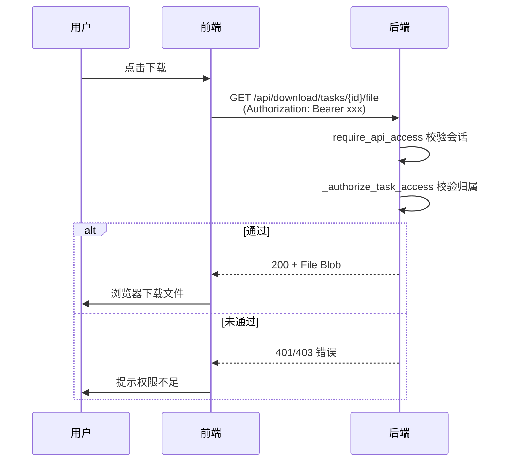

# V3.5.18 下载令牌系统移除（统一使用会话认证）

- **日期与时间**：2026-08-05 17:30
- **任务等级**：L2
- **版本号**：V3.5.18

## 问题分析

### 核心症状
用户反馈："只要有了任务id和足够的api额度，就可以下载，为什么一直报错下载令牌已过期，重新获取任务令牌？？？？？"

### 根本原因
下载令牌系统存在设计缺陷：
1. `_build_status_response` 每次轮询都会生成新令牌，导致令牌不断刷新
2. 前端 `applyTaskResponse` 在 `file_ready=False` 阶段会用空字符串覆盖 `downloadToken`
3. 令牌系统增加了不必要的复杂性，而会话认证（`require_api_access` + `_authorize_task_access`）已经足够安全

### 受影响模块
- 后端下载模块（`backend/download_xyz/download.py`）
- 前端下载 Store（`useDownloadStore.ts`）
- 前端下载面板（`MapDownloader.vue`）
- 前端 API 模块（`api/download.js`）
- 中英文 i18n 文件

### 候选方案对比

| 方案 | 优点 | 缺点 |
|------|------|------|
| A. 修复令牌生命周期 | 保留"浏览器直链下载"特性 | 仍需维护令牌缓存、过期清理等复杂逻辑 |
| B. 移除令牌系统，统一使用会话认证 | 简化架构，减少维护成本，用户体验流畅 | "原生下载"变为 Blob 下载（内存占用略增） |

### 选定方案与理由
**方案 B**：移除令牌系统。理由：
1. V3.5.17 已在 `download_task_file` 端点实现了 `require_api_access` + `_authorize_task_access` 安全校验
2. 令牌系统仅服务于"浏览器直链下载"，但该场景可通过认证 Blob 下载替代
3. 消除令牌过期这一用户困惑的根本来源
4. 减少代码复杂度（删除 ~80 行后端代码 + ~50 行前端代码）

## 修改内容

### 后端（`backend/download_xyz/download.py`）

1. **删除令牌相关函数和变量**：
   - 删除 `_generate_download_token()`
   - 删除 `_validate_download_token()`
   - 删除 `_create_download_token_for_task()`
   - 删除 `_download_tokens`、`_task_token_index` 缓存字典
   - 删除 `DEFAULT_DOWNLOAD_TOKEN_LIFETIME_MINUTES` 常量
   - 删除 `_METADATA_MAX_SIZE` 常量

2. **简化 `download_task_file` 端点**：移除 `token` 参数，仅保留会话认证 + 归属校验

3. **清理 `_build_status_response`**：移除 `download_token` 生成逻辑

4. **清理 `DownloadTaskStatusResponse` 模型**：移除 `download_token` 字段

5. **清理未使用 imports**：`hashlib`、`secrets`

### 前端（`frontend/src/api/download.js`）

- 删除 `apiDownloadTaskFileUrl()` 函数（基于 token 构建 URL）

### 前端（`frontend/src/domains/common/data-import/stores/useDownloadStore.ts`）

- 删除 `downloadToken` ref 声明
- 删除 `applyTaskResponse` 中的 `download_token` 赋值
- 删除 `resetTask()` 中的 `downloadToken` 重置
- 删除 return 中的 `downloadToken` 导出
- 删除 `DownloadTaskResponse` 类型中的 `download_token` 字段

### 前端（`frontend/src/domains/ol/components/MapDownloader.vue`）

- **重写 `triggerNativeDownload()`**：改用 `apiDownloadTaskFile()`（认证客户端）获取 Blob，然后 `triggerBrowserDownload()` 触发下载。移除 fetch HEAD 预校验 + token URL 逻辑
- **简化 `handleDownloadFromList()`**：移除 `downloadToken` 赋值
- **清理 imports**：移除 `apiDownloadTaskFileUrl`、`triggerUrlDownload`
- **清理注释**：更新 watch 中"使用 token 直接下载"为"通过认证客户端下载"

### i18n 清理

- `zh-CN.js`：移除 `missingToken`、`tokenExpired`、`insufficientQuota`
- `en-US.js`：移除 `missingToken`、`tokenExpired`、`insufficientQuota`

## 修改背景
V3.5.17 引入统一 API 配额池后，下载需要配额 + 令牌双重校验，用户体验繁琐。实际上 V3.5.17 已实现会话认证 + 归属校验，令牌系统成为冗余。

## 影响范围
- 下载流程：不再需要"获取令牌 → 用令牌下载"两步，改为"认证下载"一步
- 安全性：无变化（仍要求登录 + 任务归属校验）
- API 响应格式：`DownloadTaskStatusResponse` 不再包含 `download_token` 字段

## 解决方案

### 新的下载流程
```
任务完成 → 前端轮询获得 file_ready=true
         → 自动调用 apiDownloadTaskFile(taskId)（带 Bearer Token）
         → 后端校验会话 + 归属
         → 返回文件 Blob
         → 前端触发浏览器下载
```

### 安全模型


## 性能指标
未实测（架构简化，无性能影响。Blob 下载会占用少量 JS 内存，但 GeoTIFF 文件大小通常在几十 MB 以内，可接受）

## 测试方案

### Agent 已执行
- `python -c "import ast; ast.parse(open('download_xyz/download.py').read())"`：语法通过
- Grep 全局搜索 `download_token`、`apiDownloadTaskFileUrl`、`triggerUrlDownload`：无残留引用

### 待用户实机验证
1. 登录后提交下载任务，确认完成后自动触发下载（不再报"令牌过期"）
2. 从"我的任务"列表点击下载，确认正常
3. 用另一个账号尝试下载别人的任务 ID，确认返回 403
4. 未登录状态下尝试访问 `/api/download/tasks/{id}/file`，确认返回 401

## 变更文件清单

| 文件路径 | 说明 |
|---------|------|
| `backend/download_xyz/download.py` | 删除令牌系统，简化端点 |
| `frontend/src/api/download.js` | 删除 `apiDownloadTaskFileUrl` |
| `frontend/src/domains/common/data-import/stores/useDownloadStore.ts` | 删除 `downloadToken` 状态 |
| `frontend/src/domains/ol/components/MapDownloader.vue` | 重写 `triggerNativeDownload` |
| `frontend/src/locales/zh-CN.js` | 移除 3 个 i18n key |
| `frontend/src/locales/en-US.js` | 移除 3 个 i18n key |

## 遗留与风险
- `downloadMode`（native/progressive）的区分仍然保留，但底层机制相同（均为 Blob 下载）。未来可考虑合并两种模式
- 如需支持"匿名分享链接下载"（无需登录下载文件），需要重新引入令牌系统，但应作为独立功能设计
