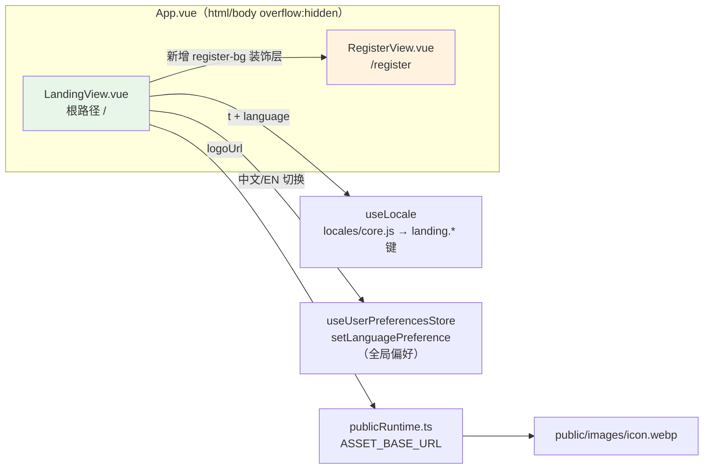

# V3.5.20 宣传主页补全 + 注册页背景增强

## 日期与时间

- 时间：2026-08-15 16:20
- 任务等级：L2（常规）

## 问题分析

### 核心症状

1. 根路径宣传主页（LandingView）**无法滚动**，长页面内容被裁切。
2. LandingView **缺失中英文切换**，全部文案硬编码中文，无 `<script setup>`。
3. LandingView 品牌徽章使用 FontAwesome 图标，而非项目 logo（`public/images/icon.webp`）。
4. 注册页（RegisterView）背景视觉与 Landing 不一致，用户要求「背景参考 landing」。

### 根本原因

| 症状 | 根因 |
|---|---|
| 无法滚动 | `App.vue` 全局样式 `html, body { height: 100%; overflow: hidden }`（为全屏地图布局而设）。LandingView 容器仅 `min-height: 100dvh`，高度随内容增长，超出视口后被 `body` 裁切，且自身无滚动容器 → 无法滚动。注册页能滚动是因为卡片 `max-height: calc(100dvh - 24px)` + `.form-body` 内部 `overflow-y: auto`（内滚方案）。 |
| 无中英文切换 | LandingView 未接入 `useLocale()`（注册页同款 `t()` / LANGUAGE_OPTIONS / `setLanguagePreference`）约定。 |
| 无 logo | 品牌徽章直接内联图标，未引用 `images/icon.webp`（TopBar / favicon 同资源）。 |

### 受影响模块

- `frontend/src/app/LandingView.vue`（根路径页面）
- `frontend/src/app/RegisterView.vue`（登录/注册页，仅背景层）
- `frontend/src/locales/core.js`（i18n 首屏键登记，双语）

### 候选方案对比

| 方案 | 说明 | 结论 |
|---|---|---|
| 改 App.vue 全局样式允许 body 滚动 | 破坏全屏地图布局（HomeView 依赖 overflow hidden），殃及所有页面 | 否决 |
| LandingView 容器自持滚动 | `height: 100dvh + overflow-y: auto`，与全局布局解耦，sticky 导航在容器内正常工作（RegisterView 卡片内滚为同原理的另一种形式） | **选定** |
| landing 文案放懒加载 chunk（zh-CN.js/en-US.js） | 首屏渲染时语言包未就绪，会短暂泄露原始 key（`landing.xxx`） | 否决 |
| landing 文案入 core.js 首包 | LandingView 为根路径静态导入的首屏页，core.js 同步随主包加载，首屏即命中 | **选定**（与 `auth.*` 首屏键同约定） |

### 选定方案与理由

1. **滚动**：`.landing-container` 改为 `height: 100dvh; overflow-y: auto; overflow-x: hidden; scroll-behavior: smooth`。
2. **i18n**：新增 `landing.*` 双语键入 `core.js`（LandingView 是根路径首屏页，必须随主包同步可用）；导航栏加「中文 / EN」切换器，复用 `useUserPreferencesStore.setLanguagePreference`（与注册页、账号中心同一全局开关）。
3. **logo**：品牌徽章渲染 `images/icon.webp`，路径经 `ASSET_BASE_URL`（publicRuntime 唯一入口）解析，与 TopBar 一致。
4. **结构**：9 张功能卡 + Hero 统计条改为数据驱动 `v-for`（图标 + i18n key）。
5. **注册页背景**：加 `register-bg` 装饰层（经纬网格 + 品牌色/强调色光晕），复用 Landing `hero-bg` 视觉语言。

## 修改内容

1. `frontend/src/locales/core.js`：新增 `landing.*` 双语键（导航/Hero/功能卡×9/技术栈/CTA/页脚/语言切换 aria），`zh-CN` 与 `en-US` 两槽位。
2. `frontend/src/app/LandingView.vue`：
   - 新增 `<script setup>`（`useLocale` + `LANGUAGE_OPTIONS` + `switchLanguage` + logo URL + `features`/`heroStats` computed）；
   - 全量文案改 `t('landing.*')`，品牌副标题复用 `t('auth.appPurpose')`（同文案 SSOT）；
   - 品牌徽章改 `icon.webp` 图片；
   - 导航栏新增语言切换器（浅色导航适配样式）；
   - 滚动容器修复（`height: 100dvh + overflow-y: auto`）；
   - 移动端 480px 微调 `btn-primary`。
3. `frontend/src/app/RegisterView.vue`：新增 `register-bg` 背景装饰层（grid + 2 × blob），容器 `position: relative`，卡片 `z-index: 1`。
4. 文档：`README.md`（版本三处 + 版本演进表）、`Docs/Guide/CHANGELOG.md`（V3.5.20 条目）。

### 零散修补（同会话收尾）

- **Hero 首屏拉满全屏**：`.content` 解除 `max-width: 1200px` 限制（改全宽容器）；`.hero-section` 全宽 + `min-height: calc(100dvh - 80px)` + flex 垂直居中，首屏背景网格/光晕铺满全屏；`.hero-inner` 内部限宽 1200 居中；功能/技术栈/CTA 区块各自继承原 1200 限宽居中与横向 padding（含 768px 媒体查询同步调整）。
- **注册页背景再优化**（用户反馈"不太好"后重做）：删除容器自带 2 个 radial-gradient（原与装饰层叠加共 4 层光晕，杂乱）；网格加细加密（42px→28px、透明度 0.07→0.05）且 mask 聚焦顶部（at 50% 0%）；光晕改为大而柔——主光晕 620px/`blur(130px)`/opacity 0.22 顶部中央对称（消除贴边半圆色块感）、副光晕 440px/`blur(120px)`/opacity 0.14 右下角弱托底；768px 以下删除冗余 `background-image: none` 并收窄光晕尺寸。
- **注册页外层锁定不滚动**（用户要求"固定，内部滚动"；⚠️ 上述两项修改提交后文件曾被回滚，本次重新应用并加固）：`.register-container` 由 `min-height + overflow: auto` 改为 `height: 100dvh + overflow: hidden`（外层滚动完全关闭，滚动仅发生在卡片 `.form-body`）；卡片 `max-height` 由 `calc(100dvh - 24px)` 改为 `calc(100dvh - 2 * clamp(10px, 2.6vw, 24px))`（扣除容器上下 padding，避免大屏 24px padding 下卡片居中时头/尾被外层裁切而不可见）；`.form-body` 显式 `min-height: 0`（解除 flex 子项最小内容高限制，确保空间不足时收缩并触发内部滚动）。
- **LandingView 品牌徽章背景调整**（用户反馈 logo 为白色、浅色徽章上看不清）：`.brand-badge` 由浅色半透明底（`var(--primary-light)`）改为品牌绿渐变（`linear-gradient(140deg, brand-primary → brand-primary-dark)`），与注册页绿色头部同色系，白色 logo 对比度达标。
- **CTA 区域重设计**（用户反馈"颜色太重"）：整块实心绿渐变卡改为轻盈版——浅色基底（`var(--bg-primary)`）+ 顶部品牌色光晕渐变 + 细绿边框（`rgba(brand-primary-rgb, 0.22)`），网格缩小（32px→28px）并改为品牌色淡线；新增 2 个柔光晕 blob 呼应 Hero 语言；文案色由纯白改回 `text-primary/text-secondary`；主按钮反转为绿色渐变（页面主按钮同款），绿色只保留在按钮焦点上。

## 修改原因

- LandingView 为上一会话半成品：不可滚动（全局 overflow:hidden 冲突）、无中英文切换、无品牌 logo，作为根路径首屏页必须完整可用。
- 注册页与 Landing 背景同源，保证进入/未登录链路视觉一致。

## 影响范围

- 鉴权链路入口：`/` → LandingView（宣传页）；`/register` → RegisterView（登录/注册）。
- i18n 首屏键表（core.js，随主包体积小幅增长）。
- 不影响 HomeView / 地图全屏布局（未动全局样式）。

## 解决方案

### 变更前后模块关系（Mermaid）

- 滚动方案示意：`landing-container`（固定视口高 + 自滚动）↔ `register-container`（卡片 max-height + form-body 内滚），两者均不依赖 body 滚动。

## 性能指标

- 未实测（纯样式/文案改动）。core.js 首包增加约 5KB 双语 landing 键，均为首屏必需，无额外请求。

## 测试方案

### Agent 已执行

- `npx tsc --noEmit`：通过（0 报错）。
- 静态核对：`/` 路由指向 LandingView 且为静态导入（首屏键入 core.js 的条件成立）；`../stores` / `@common/app/useLocale` / `ASSET_BASE_URL` 导入路径与 RegisterView 完全同构。
- 门禁脚本：`CheckStructureTree.py`、`CheckConfigRegistry.py` 已运行（见门禁结果）。

### 待用户实机验证

1. `npm run dev` 访问 `/#/`：页面可正常向下滚动（Hero → 功能 → 技术栈 → CTA → 页脚），顶部导航 sticky 吸附；品牌徽章显示 icon.webp logo。
2. 点击导航「中文 / EN」：全页文案即时切换；F12 查看 `localStorage.webgis_pref_language` 已更新；刷新保留。
3. 访问 `/#/register`：卡片背后出现与 Landing hero 同款网格 + 绿色光晕背景；登录/注册切换、卡片内滚动正常；缩放窗口到手机宽度无横向溢出。
4. 注册页语言切换与 Landing 联动（同一偏好）。

## 变更文件清单

| 文件 | 说明 |
|---|---|
| `frontend/src/app/LandingView.vue` | i18n 全量接入 + 语言切换器 + icon.webp logo + 滚动容器修复 + 功能卡/统计条 v-for 化 |
| `frontend/src/app/RegisterView.vue` | 新增 Landing 同源背景装饰层（grid + blobs），卡片提升 z-index |
| `frontend/src/locales/core.js` | 新增 `landing.*` 双语首屏键（zh-CN / en-US） |
| `Docs/Guide/frontend-structure.md` | 补录 LandingView.vue（上个会话创建该文件时遗漏登记，结构树门禁拦截后补齐） |
| `README.md` | 版本号三处 V3.5.19 → V3.5.20 + 版本演进表新增行（删最旧行） |
| `Docs/Guide/CHANGELOG.md` | 顶部追加 V3.5.20 完整条目 |

## 遗留与风险

- 移动端（≤768px）注册页保留装饰背景（原样式曾在移动端清除 background-image；DOM 背景层为独立装饰，需实机确认观感，不满意可加 `display: none`）。
- `landing.langToggleAria` 等 aria 文案为新增键，已同时入双语。
- 顺带补录：`frontend-structure.md` 缺失 LandingView.vue 登记（上会话欠账），本次门禁拦截后补齐。

## DoD 自查

- [x] 代码改动完成，遵守分层边界（LandingView/RegisterView 为页面层，i18n 走既有 useLocale 通道）
- [x] 未新增 `.ts` 文件；`tsc --noEmit` 零报错
- [x] 维护日志已按第 6 节创建并写全章节
- [x] 根 `README.md` 三处版本号已更新（简介行 / 版本演进表 / 页脚）
- [x] `Docs/Guide/CHANGELOG.md` 已追加
- [x] 无文件增删；结构树补录 LandingView.vue（门禁强制项）
- [x] 未涉及配置 key → `.env.example` / `catalog.py` 无需登记（但门禁仍跑 ConfigRegistry 确认）
- [x] 门禁脚本已运行且通过（见门禁结果）
- [x] 未执行任何 Git 写操作
- [x] 已输出交接块