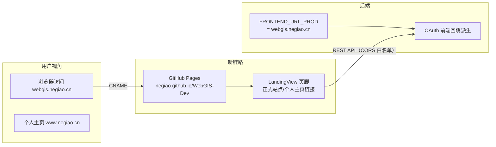

# V3.5.21 正式域名接入：webgis.negiao.cn 全链路落档

> 📌 版本收敛说明：本日志完成时暂定版本号为 V3.5.21；随后用户裁决**本批暂存区改动（V3.5.19 尾补 + V3.5.20 + V3.5.21）统一合并为 V3.5.20 发布**，README/CHANGELOG 已收敛至 V3.5.20。本日志保留原始编号与内容作为事实记录。

## 日期与时间

- 时间：2026-08-15 17:40
- 任务等级：L2（常规）

## 问题分析

### 核心症状

用户购买并启用了正式域名 `webgis.negiao.cn`（前端）与个人主页 `www.negiao.cn`，要求「UI 和我的文档/README 中体现」。此前全链路仍指向 GitHub Pages 默认地址（`negiao.github.io/WebGIS-Dev`），正式域名只存在于 DNS 层，未进 UI、未进文档、未进配置默认值。

### 根本原因

前端长期以 GitHub Pages 默认路径为唯一对外标识：README 在线演示链接、托管表、域名拓扑表、OAuth Homepage URL、后端 `FRONTEND_URL_PROD` 内建默认、`.env` 的 `FRONTEND_PUBLIC_URL` 全部写死 `negiao.github.io/WebGIS-Dev`。域名切换是**全链路**变更，任一环节遗漏都会造成链断（典型：OAuth 回跳失败、README 演示链接 404）。

### 受影响模块

- 前端 UI：`frontend/src/app/LandingView.vue`（页脚）、`frontend/src/locales/core.js`（新键）
- 后端配置：`backend/config/catalog.py`（`FRONTEND_URL_PROD` 内建默认）
- 根配置：`.env`（`FRONTEND_PUBLIC_URL`）
- 文档：README.md、Docs/README_EN.md、oauth-deployment.md、configuration.md、deployment-relationship.md、account-system-ai-quota.md、CHANGELOG

## 修改内容

1. **UI（LandingView 页脚）**：在「隐私 | 服务条款 | GitHub」后新增两项链接——「个人主页」→ `https://www.negiao.cn`、「正式站点」→ `https://webgis.negiao.cn`（新开标签页）；i18n 新增 `landing.homepage`（个人主页/Homepage）、`landing.officialSite`（正式站点/Official Site）双语键入 core.js。
2. **后端代码默认值**：`catalog.py` `FRONTEND_URL_PROD` = `https://webgis.negiao.cn`（OAuth 前端回跳、`FRONTEND_PUBLIC_URL` 缺省值时由此派生）。
3. **根 `.env`**：`FRONTEND_PUBLIC_URL` 同步为正式域名（L1 非密，与 `.env.example` 登记一致——`.env.example` 示例值本就为占位形式，无需改动）。
4. **README.md**：在线演示链接、项目简介（前端托管域名注记）、域名拓扑表「WebGIS 前端」新增 `webgis.negiao.cn` 首行、托管表前端部署列、作者行加个人主页链接。
5. **Docs/README_EN.md**：在线演示链接、域名拓扑表、托管表、作者行同步；页脚版本号由过期的 V3.5.9 顺带校正为 V3.5.21。
6. **oauth-deployment.md**：适用架构说明、GitHub OAuth App 的 Homepage URL、内建默认值说明、`FRONTEND_PUBLIC_URL` 示例。
7. **configuration.md**：部署环境 `.env` 示意、前端 Pages 地址说明。
8. **deployment-relationship.md**：WebGIS 前端域名表 7→8 行，`webgis.negiao.cn` 置顶并注明 CNAME 关系。
9. **account-system-ai-quota.md**：已注册域名列表置顶加入正式域名；「7 个」→「8 个」。
10. **CHANGELOG.md**：V3.5.21 条目。
11. **版本号**：V3.5.20 → V3.5.21（README 三处）。

## 修改原因

正式域名是用户付费购买的品牌资产，是对外访问的主入口；全部入口与文档须以正式域名为第一标识，GitHub Pages 默认地址降级为「平台默认入口」。

### 零散修补

- **注册页品牌徽章 Logo 化**（用户反馈）：`RegisterView.vue` 头部 `brand-badge` 的 FontAwesome 地球图标（`fa-earth-asia`）替换为 `images/icon.webp`（复用 `resolvePublicAssetPath` 既有函数，与 LandingView/TopBar 同一资源）；徽章底色由半透明白改为品牌绿深色渐变（`brand-primary-dark → brand-primary-darker`），白色 logo 在绿色头部上获得足够衬托，新增 `.brand-badge img` 规则（`object-fit: contain`）。LandingView 与 RegisterView 两处徽章现已同资源同风格。

## 影响范围

- 鉴权链路：OAuth 前端回跳基址（`FRONTEND_PUBLIC_URL` 缺省时）指向正式域名——**但生产 HF Space 侧如已显式配置 `FRONTEND_PUBLIC_URL`，以 HF Variables 为准**，需实机确认。
- 前端 UI：Landing 页脚新增两链接。
- 文档/README 全域。

## 解决方案

### 变更前后模块关系（Mermaid）

- 回跳派生规则（未变，值变）：`FRONTEND_PUBLIC_URL` 留空 → `FRONTEND_URL_DEV`/`FRONTEND_URL_PROD` 按 `APP_ENV` 选择。

## 性能指标

- 未实测（纯配置/文案/链接改动，无渲染路径变化；core.js 增加约 0.2KB 双语键）。

## 测试方案

### Agent 已执行

- `npx tsc --noEmit`：通过（0 报错）。
- 门禁脚本：`CheckConfigRegistry.py`（配置登记，通过）；`CheckStructureTree.py`（结构树，通过）。
- 静态核对：`catalog.py` 中 `FRONTEND_URL_PROD` 仅被 `load.py:371` 一处消费（`default_frontend_url`），确认无其他默认值引用点遗漏；LandingView 页脚新增链接为纯静态 `<a>`，无逻辑风险。

### 待用户实机验证

1. 前端部署后访问 `https://webgis.negiao.cn`，页面底部页脚可见「个人主页」「正式站点」链接，点击分别跳转 `www.negiao.cn` / `webgis.negiao.cn`（新标签）。
2. 检查 Hugging Face Space **Variables**：若 `FRONTEND_PUBLIC_URL` 已显式配置为旧 Pages 地址，需改为 `https://webgis.negiao.cn`（否则 OAuth 登录成功仍回跳旧地址）。
3. HF Space 的 `CORS_ALLOWED_ORIGINS`（若已收紧为白名单而非 `*`）需确认包含 `https://webgis.negiao.cn`，否则跨域请求被拒。
4. Google Cloud Console → OAuth 客户端 → **Authorized JavaScript origins**（若启用 OneTap）确认含 `https://webgis.negiao.cn`（对照 account-system-ai-quota.md 第 12.1 节清单）。
5. GitHub/Google OAuth 完整登录一次，确认登录后回跳到 `webgis.negiao.cn/#/oauth/callback`。

## 变更文件清单

| 文件 | 说明 |
|---|---|
| `frontend/src/app/LandingView.vue` | 页脚新增「个人主页」「正式站点」链接 |
| `frontend/src/locales/core.js` | 新增 `landing.homepage` / `landing.officialSite` 双语键 |
| `backend/config/catalog.py` | `FRONTEND_URL_PROD` 默认值 → 正式域名 |
| `.env` | `FRONTEND_PUBLIC_URL` → 正式域名 |
| `README.md` | 旧链接/拓扑表/托管表/作者行 + 版本三处 V3.5.21 |
| `Docs/README_EN.md` | 同上英文版（页脚版本顺带校正） |
| `Docs/Guide/oauth-deployment.md` | Homepage URL / 内建默认 / 变量示例 |
| `Docs/Guide/configuration.md` | 部署示例两处 |
| `Docs/Architecture/deployment-relationship.md` | WebGIS 前端域名表 7→8 行 |
| `Docs/Architecture/account-system-ai-quota.md` | 已注册域名列表 + 计数 |
| `Docs/Guide/CHANGELOG.md` | V3.5.21 条目 |

## 遗留与风险

- 生产 HF Space 侧可能有显式 `FRONTEND_PUBLIC_URL` / `CORS_ALLOWED_ORIGINS` 覆盖（仓库外，无法验证）——已列入待用户操作。
- Google/GitHub OAuth 控制台、Google OneTap origins 为控制台操作（仓库外），需用户在本次切换时同步。
- 个人主页仓库（NEGIAO.github.io）如含指向 WebGIS 的跳转/入口，不在本次仓库范围内，建议用户自行查核。
- ⚠️ 本会话期间工具输出曾出现渲染故障（疑似环境问题，已排除文件损坏）；若后续发现 LandingView/RegisterView/日志文件出现重复内容，属本地编辑器/同步问题，可交回重建。

## DoD 自查

- [x] 代码改动完成，遵守分层边界（UI 改动仅 LandingView 页脚 + core.js 键）
- [x] `tsc --noEmit` 零报错
- [x] 维护日志已按规范创建并写全章节
- [x] 根 `README.md` 版本号三处已更新（简介行 / 演进表 / 页脚）
- [x] `Docs/Guide/CHANGELOG.md` 已追加
- [x] 无文件增删 → 结构树无需变更（门禁已跑确认）
- [x] 涉及配置默认值变更（`FRONTEND_URL_PROD`）但非新增 key → `.env.example`/catalog.py 登记无需新增（门禁已跑确认）
- [x] 门禁脚本已运行且通过（CheckStructureTree / CheckConfigRegistry）
- [x] 未执行任何 Git 写操作
- [x] 已输出交接块

## 交接块

- **本次版本**：V3.5.21（2026-08-15）
- **任务等级**：L2
- **一句话结论**：正式域名 webgis.negiao.cn 与个人主页 www.negiao.cn 全链路落档——UI 页脚入口、后端默认值、根 .env、README/README_EN 与 5 份指南/架构文档同步更新。
- **改动文件**：见「变更文件清单」（12 个文件）。
- **日志路径**：Docs/LLM_record/26-08/2026-08-15/2026-08-15-official-domain-webgis-negiao-cn.md
- **门禁结果**：CheckStructureTree ✅ / CheckConfigRegistry ✅
- **待用户操作**：① HF Space Variables 检查/更新 `FRONTEND_PUBLIC_URL` 与 `CORS_ALLOWED_ORIGINS`（含 webgis.negiao.cn）；② Google OneTap origins / OAuth 控制台校对；③ 实机 OAuth 登录回跳验证；④ 前端部署推送。
- **遗留与风险**：HF 侧覆盖值、OAuth 控制台为仓库外配置，以用户确认收尾；本会话工具输出曾异常，文件均已验证完好。
- **下一步建议**：若需继续，可从 `Docs/Architecture/deployment-relationship.md` 顶部 Mermaid 图核对是否需标注正式域名节点（本次仅改表格未动图）。