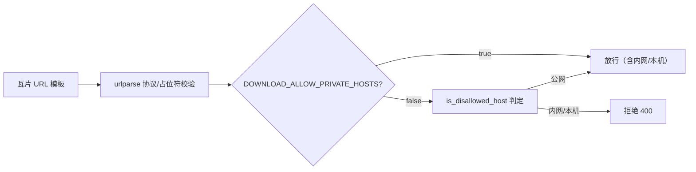

# 2026-08-17 download_xyz 内网瓦片源放行开关（V3.5.26）

## 元信息

- **日期与时间**：2026-08-17 17:40
- **任务等级**：L2（功能增强 + 安全策略扩展，含配置登记）
- **版本号**：V3.5.26（按用户惯例未做 README/CHANGELOG 版本仪式）
- **方案演进说明**：初版曾复用 `PROXY_ALLOWED_HOSTS` 白名单，但发现两个致命问题后按用户确认改为**独立布尔开关**——① `*` 通配被解析为空（防呆，不允许全通配）；② 该 key 同时被 `/proxy/**` 以「收紧语义」（白名单非空=仅允许白名单 host）读取，共用会让前端公网瓦片代理全挂。

## 问题分析

- **核心症状**：用户部署在 HF Space，需要 download_xyz 下载「GCJ 源 → 本机/内网纠偏为 WGS」的瓦片，但 `_validate_tile_template` 对指向内网/本机的模板一律拒绝：`tile_url_template 指向内网或本机地址，已拒绝。`
- **根本原因**：P1-4 SSRF 方案 S1 加固时，三处出站面（agent `override_base_url` / `/proxy/**` / `download_xyz` 模板）共用 `net_guard.is_disallowed_host` 硬判定内网目标，download_xyz 面没有显式放行通道。
- **受影响模块**：`backend/download_xyz/download.py`（瓦片模板校验）；新增配置 key。

## 修改内容

1. **新增配置 `DOWNLOAD_ALLOW_PRIVATE_HOSTS`**（L1 非密，默认 `false`）：
   - 根 `.env.example` 登记（并顺手修正 `PROXY_ALLOWED_HOSTS=*` → 留空——`*` 会被解析为空列表，是无效误导值）；
   - `backend/config/catalog.py` 登记；
   - `download_xyz/download.py` 读取。
2. `_validate_tile_template` 校验调整：`DOWNLOAD_ALLOW_PRIVATE_HOSTS=true` 时**放行内网/本机目标**；默认 `false` 维持既有 `is_disallowed_host` 硬拒绝（fail-closed 不变）。
3. 与 `/proxy/**` 完全解耦：不动 `PROXY_ALLOW_PRIVATE_HOSTS` / `PROXY_ALLOWED_HOSTS`，前端代理面行为零影响。

## 修改原因

用户实际业务：自部署（HF Space）信任环境，瓦片源为本机/内网纠偏服务，需要整体放行内网目标；且不能影响 `/proxy` 面。

## 影响范围

- `download_xyz` 瓦片模板校验：新增独立放行开关；
- `/proxy/**`、agent `override_base_url`：不受影响（保持各自现状）；
- 默认部署（未配置）：行为与之前完全一致。

## 解决方案

独立布尔开关（比白名单更适合「信任环境整体放行」场景，比 `*` 通配明确且不违反防呆设计）。校验流程：

## 性能指标

未实测（模块加载时读一次布尔配置，无运行期开销）。

## 测试方案

| Agent 已执行 | 待用户实机验证 |
|---|---|
| `py_compile` 通过（download.py / catalog.py） | HF 环境 `.env` 配 `DOWNLOAD_ALLOW_PRIVATE_HOSTS=true` 后，创建指向本机/内网纠偏服务（如 `http://localhost:8080/tiles/{z}/{x}/{y}.png`）的下载任务 → 创建成功且正确产出 GeoTIFF |
| 门禁：`CheckConfigRegistry.py` 通过（新 key 双登记核对）；`CheckStructureTree.py` 通过 | 不配开关时创建内网模板 → 仍 400 拒绝（默认安全行为回归） |
| 逻辑审查：proxy 面配置零改动，解耦确认 | 公网模板（天地图/OSM）下载任务回归；前端 `/api/proxy` 瓦片加载回归 |
| 实机验证 `*` 解析为空列表（防呆生效） | |

## 变更文件清单

| 文件 | 说明 |
|---|---|
| `backend/download_xyz/download.py` | 读取新开关，校验放行逻辑 |
| `backend/config/catalog.py` | 登记 `DOWNLOAD_ALLOW_PRIVATE_HOSTS` |
| 根 `.env.example` | 登记新 key；修正 `PROXY_ALLOWED_HOSTS=*` 误导值为留空 |
| 本日志 | 新增 |

## 遗留与风险

- agent `override_base_url` 面仍硬拒绝内网（无开关）；如客户有「Agent 下载自定义底图指向内网」需求，可另立任务同语义放开。
- download_xyz 无 DNS 复判（域名 A 记录指向内网可绕过字面量判定）；proxy 面有 `PROXY_DNS_GUARD`，如需同等加固另立任务。
- 用户在 HF 的 `.env` 若已配 `PROXY_ALLOWED_HOSTS=*`：该值无效（解析为空列表），建议删掉该行以免误导；若用户后续想要代理面放行内网，用 `PROXY_ALLOW_PRIVATE_HOSTS=true`。