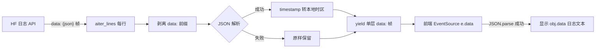

# 2026-08-17 修复 HF 日志流 SSE 帧双重 data 前缀（V3.5.27）

## 元信息

- **日期与时间**：2026-08-17 18:20
- **任务等级**：L2（Bug 修复）
- **版本号**：V3.5.27（按用户惯例未做 README/CHANGELOG 版本仪式）

## 问题分析

- **核心症状**：前端日志组件（`LogMonitor.vue`）在 HF 线上模式显示的日志带着 `data: {"data":"...","timestamp":"..."}` 原始帧外壳，未解析出日志文本；且 timestamp 始终是 UTC 原样（未转北京时间）。
- **根本原因**：后端 `monitor.py` 的 HF 日志转发生成器（L311-323）用 `response.aiter_lines()` 逐行读取上游 SSE 流——**每行文本包含 `data: ` 前缀**（HF 日志 API 帧格式为 `data: {json}`）。代码直接对整行 `json.loads(line)`，带前缀必然 JSONDecodeError，落入 except 分支原样透传；前端 `e.data` 于是是 `data: {...}` 字符串，JSON.parse 也失败 → 原样渲染。
- **佐证**：`_convert_utc_to_local`（L318）从未生效——线上日志 timestamp 始终为 `...Z`（UTC 原样），说明 JSON 解析从未成功过。
- **受影响模块**：`backend/api/monitor.py`（HF 日志流转发）；前端 `LogMonitor.vue` 解析逻辑本身正确（L330-340），无需改动。

## 修改内容

1. `monitor.py` 的 `hf_generator`：对每行先剥离 SSE `data:` 前缀（含空白）得到 payload，再尝试 JSON 解析 + timestamp 本地化；非 JSON 行保持原样。
2. 解析成功时 yield 单层 `data: {json}` 帧（与本地模式一致的前端契约：`e.data` 为可解析 JSON 或纯文本）。

## 修改原因

前端组件契约 = `e.data` 是 JSON（`{"data": 日志文本, "timestamp": ...}`）或纯文本；后端在 HF 模式破坏了该契约，导致日志无法阅读。

## 影响范围

- `LogMonitor` 组件 HF 线上模式（run/build 日志）显示恢复正常；
- 本地模式不受影响（`_local_log_generator` 路径未改动）；
- 非 JSON 行（如 `[monitor] source=local`、错误提示）保持原样，行为不变。

## 解决方案

单点前缀剥离 + 复用既有 JSON 解析分支。数据流：

## 性能指标

未实测（每行多一次字符串前缀判断，可忽略）。

## 测试方案

| Agent 已执行 | 待用户实机验证 |
|---|---|
| `py_compile` 通过 | HF 线上打开日志面板：run/build 日志显示纯文本（无 `data:` 外壳），HTTP 请求行、状态码着色正常 |
| 逻辑审查：剥离逻辑不改变非 JSON 行；本地模式路径零改动 | 时间戳显示为北京时间（不再 UTC） |
| 门禁：`CheckStructureTree.py` / `CheckConfigRegistry.py` 通过（无配置/文件变更） | 断线重连、错误提示帧（`[error]`、`[proxy error]`）显示正常 |

## 变更文件清单

| 文件 | 说明 |
|---|---|
| `backend/api/monitor.py` | `hf_generator` 剥离 SSE 前缀后再解析（约 5 行） |
| 本日志 | 新增 |

## 遗留与风险

- HF 日志 API 若将来改变帧格式（非 `data:` 前缀），剥离逻辑按现状兼容（非 data: 开头的行不做剥离，仍可 JSON 解析）。
- `_sse_escape_data` 对换行压平逻辑不变；长日志单行显示。