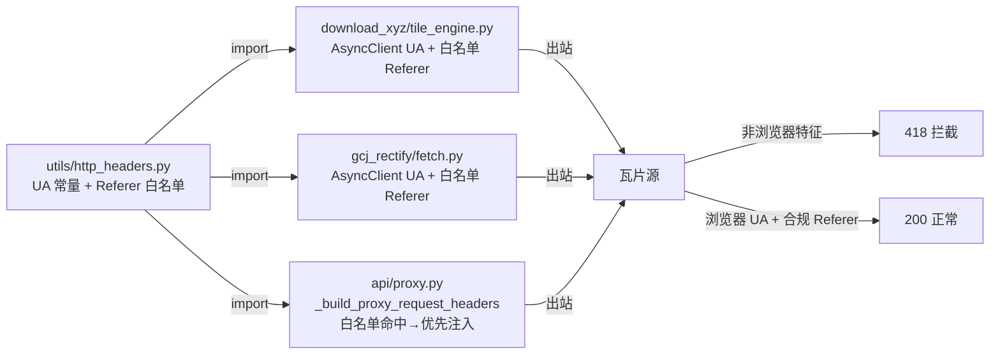

# 2026-08-17 出站浏览器特征头共享化（V3.5.25）

## 元信息

- **日期与时间**：2026-08-17 16:40
- **任务等级**：L2（跨模块重构 + 反爬规避补漏，涉及 4 个文件协同改动）
- **版本号**：V3.5.25（按用户惯例未做 README/CHANGELOG 版本仪式，代码与日志先行）

## 问题分析

- **核心症状**：V3.5.24 修复了 `download_xyz` 的天地图 418，但 UA 常量与 Referer 白名单**硬编码在下载器内部**，其余瓦片出站面仍裸奔：
  - `gcj_rectify/fetch.py`（瓦片纠偏抓取）——httpx 裸客户端，无 UA 无 Referer，天地图瓦片纠偏必然 418；
  - `api/proxy.py`（`/api/proxy/**` 前端瓦片代理）——已有浏览器 UA（`PROXY_USER_AGENT` 配置），但**不附加防盗链 Referer**，且会把客户端 Referer 原样透传。
- **根本原因**：浏览器特征头逻辑没有单一事实来源，三个出站面各自为政（一份配置、一份硬编码、一份裸奔），新增瓦片源反爬适配时需改三处、极易漏。
- **受影响模块**：`download_xyz/tile_engine.py`、`gcj_rectify/fetch.py`、`api/proxy.py`（后端全部瓦片出站面）。

## 修改内容

1. **新增共享模块 `backend/utils/http_headers.py`**：
   - `BROWSER_USER_AGENT`：浏览器 UA 常量（与 V3.5.24 下载器同款 Chrome UA）；
   - `REFERER_BY_DOMAIN`：防盗链 Referer 域名白名单（目前仅 `tianditu.gov.cn` → 天地图官网）；
   - `referer_headers_for(url)`：按域名返回 `{"Referer": ...}`，白名单外返回 `None`。
2. **`download_xyz/tile_engine.py`**：删除内部硬编码的 `_DOWNLOAD_USER_AGENT` / `_REFERER_BY_DOMAIN` / `_referer_headers_for`，改 import 共享模块（行为不变）。
3. **`gcj_rectify/fetch.py`**：模块级 AsyncClient 注入浏览器 UA；`fetch_tile` 按白名单附加 Referer。
4. **`api/proxy.py`**：`_build_proxy_request_headers` 增加目标 URL 白名单 Referer 注入——白名单源（天地图）**优先附加白名单 Referer 且不透传客户端 Referer**；白名单外保持原透传行为不变。

## 修改原因

统一后端全部瓦片出站面的浏览器特征，规避天地图等源的 418 反爬拦截；后续新增反爬适配只需改共享白名单一处。

## 影响范围

- 三处瓦片出站面（download_xyz / gcj_rectify / proxy）行为对齐；
- `/api/proxy/**` 天地图瓦片：Referer 改为天地图官网（此前透传客户端站点 Referer）；其他源 Referer 透传行为不变；
- 非瓦片出站面（external_proxy API 面、OAuth、统计等）不受影响。

## 解决方案

共享常量 + 白名单函数，三处消费。数据流：

## 性能指标

未实测（仅请求头变化，无网络路径变更）。

## 测试方案

| Agent 已执行 | 待用户实机验证 |
|---|---|
| `py_compile` 四个改动文件全部通过 | 天地图底图下载任务成功（下载器回归） |
| 门禁：`CheckStructureTree.py` / `CheckConfigRegistry.py` 通过（backend-structure.md 已同步登记新文件） | 瓦片纠偏（gcj_rectify）对天地图瓦片不再 418 |
| 逻辑审查：proxy 白名单外 Referer 透传逻辑保持原状；gcj_rectify 重试/客户端重置逻辑未触碰 | 前端天地图瓦片经 `/api/proxy/**` 正常加载（Referer 变更回归） |
| | 其他瓦片源（高德/OSM/ArcGIS）下载与代理回归 |

## 变更文件清单

| 文件 | 说明 |
|---|---|
| `backend/utils/http_headers.py` | **新增**：UA 常量 + Referer 白名单 + `referer_headers_for()` |
| `backend/download_xyz/tile_engine.py` | 删除硬编码，改 import 共享模块 |
| `backend/gcj_rectify/fetch.py` | 客户端注入 UA + 白名单 Referer |
| `backend/api/proxy.py` | `_build_proxy_request_headers` 增加白名单 Referer 优先注入 |
| `Docs/Guide/backend-structure.md` | 登记新文件（如结构树门禁要求） |
| 本日志 | 新增 |

## 遗留与风险

- 天地图 Referer 白名单值固定为官网首页；若天地图日后收紧校验（校验具体 referer 页面）需再调整。
- Google（gac 镜像）等严格反爬源仍需精确 UA/频控，不在本次白名单范围，保持现状。
