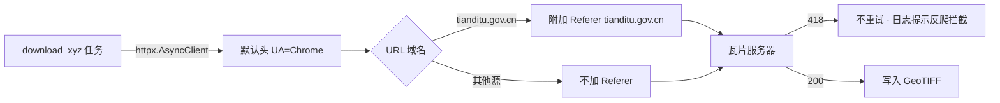

# 2026-08-17 修复天地图瓦片下载 418 拦截（V3.5.24）

## 元信息

- **日期与时间**：2026-08-17 16:10
- **任务等级**：L2（Bug 修复）
- **版本号**：V3.5.24（V3.5.23 之后的下一个修订）

## 问题分析

- **核心症状**：后端底图下载任务拉取天地图瓦片时返回 `418 (attempt 3/3)`，瓦片全部下载失败；同一 tk 在浏览器中可正常加载。
- **根本原因**：`download_xyz/tile_engine.py` 出站请求是**裸请求**——`httpx.AsyncClient()` 零配置创建（L123），`client.get(url, timeout=timeout)`（L385）未带任何浏览器特征头，httpx 默认 UA 为 `python-httpx/x.x.x`。天地图服务端 WAF 对非浏览器 UA / 无 Referer 的请求返回 **418（I'm a Teapot）** 拦截（社区广泛记录的已知行为，非 tk 失效——key 失效通常为 403/401）。叠加 `MAX_CONCURRENCY=10` 并发 + 418 被当作普通失败重试 3 次，进一步放大流量触发限流。
- **受影响模块**：`backend/download_xyz/tile_engine.py`（底图下载出站链路，影响所有基于该引擎的瓦片源：天地图 / 高德 / OSM 等）。

## 修改内容

1. 新增浏览器 UA 常量 `_DOWNLOAD_USER_AGENT`（Chrome 桌面版），注入 `httpx.AsyncClient` 默认请求头。
2. `_fetch_tile_bytes` 中：URL 属于 `tianditu.gov.cn` 域名时附加 `Referer: https://www.tianditu.gov.cn/`（仅天地图需要防盗链特征；其他源不带，避免伪造 Referer 影响高德等源的正常请求）。
3. **418 单独处理**：识别为「服务端策略拦截」，记日志（含拦截原因提示）后直接放弃该瓦片，**不重试**——避免 10 并发 × 3 重试放大撞限流。

## 修改原因

用户实测下载任务日志出现 418 重试 3 次仍失败，底图无法下载。

## 影响范围

- 底图下载链路（`download_xyz` 全部任务）：出站请求带浏览器 UA；天地图瓦片恢复可下载；418 不再消耗重试次数。
- 其他瓦片源：UA 为浏览器更接近真实用户，无害；Referer 仅对天地图附加。
- 前端瓦片代理 `/proxy/**`：不受影响（浏览器出站，本就是浏览器特征）。

## 解决方案

方案对比：

| 方案 | 做法 | 评价 |
|---|---|---|
| **A（选定）** | AsyncClient 注入浏览器 UA + 天地图 URL 附加 Referer + 418 不重试 | 一处创建、一处请求点改造，语义清晰；UA 全局、Referer 按源白名单，不影响其他源 |
| B | 仅加 UA，418 仍重试 | 不够——无 Referer 时天地图仍可能拦截；418 重试浪费流量 |
| C | 对所有源统一伪造 Referer | 高德等有防盗链校验的源可能被无关 Referer 误伤 |

选定 A。数据流（变更后）：

## 性能指标

未实测（418 不再重试后，失败任务耗时从「3 次重试 + 退避」降为「1 次即弃」，并发压力下降）。

## 测试方案

| Agent 已执行 | 待用户实机验证 |
|---|---|
| `python -m py_compile backend/download_xyz/tile_engine.py` 通过 | 重新发起天地图（img_w 或同源）下载任务，观察日志不再出现 418、任务成功产出 GeoTIFF |
| 逻辑审查：Referer 白名单仅含 `tianditu.gov.cn`；418 分支在 200/404 分支之后不改变既有语义 | 高德 / OSM 底图下载任务回归，确认不受 UA 变更影响 |
| 门禁：`CheckStructureTree.py` / `CheckConfigRegistry.py` 通过（未改配置、未增删文件） | （可选）curl 对比：带浏览器 UA + Referer 请求同一瓦片 URL 应返回 200 |

## 变更文件清单

| 文件 | 说明 |
|---|---|
| `backend/download_xyz/tile_engine.py` | UA 常量 + AsyncClient 默认头 + 天地图 Referer + 418 不重试 |
| `README.md` / `Docs/README_EN.md` | 版本号三处更新（V3.5.23 → V3.5.24）+ 演进表首行 |
| `Docs/Guide/CHANGELOG.md` | 顶部追加 V3.5.24 条目 |
| 本日志 | 新增 |

## 遗留与风险

- 若用户代理网络层仍拦截（如企业出口 IP 被天地图拉黑），418 依旧出现——日志已明确提示「服务端拦截」便于排查。
- 天地图免费 tk 有并发/流量配额，大规模下载仍可能触发限流；`MAX_CONCURRENCY=10` 保持原值未调，如需可另立任务降级。
