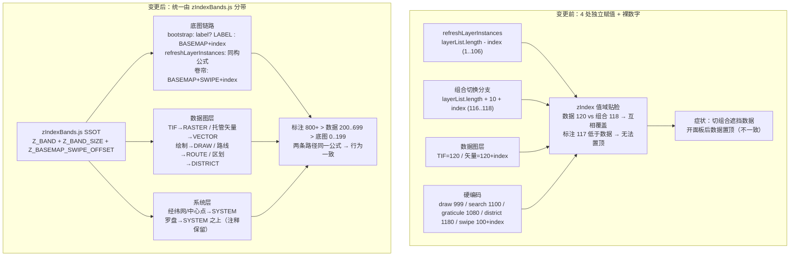

# 2026-08-19 图层 zIndex 分带治理（V3.5.25）

## 日期与时间
2026-08-19（本次会话工作时间，含分析与实施）

## 任务等级
L2（多文件协同，跨模块：底图链路 / 图层管理 / 数据导入 / 绘制 / 搜索 / 路线 / 区划）

## 问题分析

### 核心症状
1. 切换底图组合（如"天地图+标注"）后，用户上传的 TIF 等数据图层被底图遮挡；
2. 打开「图层管理」面板（`LayerControlPanel.vue` 的 `toggleLayerManager`，非 TOC）调整底图顺序后，数据图层又出现在底图之上——同一数据，两条路径表现不一致；
3. 标注瓦片图层（如天地图注记）与底图混排，始终低于数据图层，不符合用户需求「标注置顶」。

### 根本原因
OL 图层 zIndex 由 4 处独立赋值且数值"贴脸"：

| 赋值点 | 旧公式 | 值域 |
|---|---|---|
| `useMapState.js` `refreshLayerInstances` | `layerList.length - index` | 1..106 |
| `useMapState.js` 组合切换分支 | `layerList.length + 10 + index` | 116..118 |
| 数据图层（TIF/矢量托管） | 散落常量 | 120+（TIF 120、托管矢量 120+index） |
| 多处硬编码 | — | 绘制 999 / 搜索 1100 / 经纬网 1080 / 区划 1180 / 卷帘 100+index / 中心点 1090 |

- 数据带底值 120 与组合切换带顶值 118 仅差 2，`LAYER_SOURCE_DEFINITIONS`（106 条）再增 5 个定义即吞掉数据层；
- 标注层混在底图列表（组合模式下仅 117/118），低于数据带 120，违反「标注置顶」需求；
- 两条路径（切换组合 vs 图层管理重排）公式不同 → 同一图层 zIndex 不一致，行为互相矛盾；
- OL 10.9 实测：`Collection` 排序为稳定排序，undefined zIndex 按集合插入序排底——重排后的底图可盖住未设 zIndex 的图层，加剧混乱。

### 受影响模块
底图链路（bootstrap / 切换 / 卷帘 / 图层管理重排）、数据导入（TIF/栅格托管）、托管矢量图层（绘制/搜索/路线/区划/上传）、CompassManager（风水罗盘系统层）。

## 解决方案

### 方案对比
- **方案 A（局部补丁）**：把数据层常量 120 上调。一票否决：治标不治本，底图定义继续增长仍会撞带。
- **方案 B（分带治理，选定）**：设立显示带 SSOT 常量，所有 zIndex 一律由带常量派生，彻底消除裸数字与贴脸碰撞。

### 选型理由
带间隔 100 留足余量（底图带 106 条 + 卷帘预留 50 条），任意带内增长不会跨带；标签判定复用现有 `category === 'label'`，无需新配置 key。

### 分带设计（用户已批准）
| 带 | 值域 | 内容 |
|---|---|---|
| `Z_BAND.BASEMAP` | 0~199 | 底图瓦片/矢量瓦片（0~149）+ 卷帘对比层（150~199，`Z_BASEMAP_SWIPE_OFFSET`） |
| `Z_BAND.RASTER` | 200~299 | 上传 TIF 等栅格数据 |
| `Z_BAND.VECTOR` | 300~399 | 一般托管矢量（上传矢量/搜索/分析） |
| `Z_BAND.DRAW` | 400~499 | 绘制测量图层 |
| `Z_BAND.ROUTE` | 500~599 | 路线（公交/驾车/步骑） |
| `Z_BAND.DISTRICT` | 600~699 | 区划边界 |
| `Z_BAND.LABEL` | 800~899 | 标注瓦片图层（恒置顶于全部数据层） |
| `Z_BAND.SYSTEM` | 900+ | 系统层（经纬网/中心点/定位点） |

分层语义（用户需求）：**标注瓦片图层 > 数据图层（一切用户操纵图层） > 瓦片图层**。

### 变更前后关系图（Mermaid）

## 修改内容
1. **新增 `frontend/src/domains/ol/layer/zIndexBands.js`**：`Z_BAND`（8 带）、`Z_BAND_SIZE = 100`、`Z_BASEMAP_SWIPE_OFFSET = 150`，SSOT 常量，附分带表注释。
2. **`useMapState.js`**：
   - `refreshLayerInstances`：`zIndexBase = layerList.length - index` → `configs.find(cfg.id === item.id)?.category === 'label' ? Z_BAND.LABEL : Z_BAND.BASEMAP + index`；
   - 组合切换分支：删除 `layerList.length + 10` 旧公式，改用同构分带公式（两条路径同一公式 → 行为一致）；
   - 经纬网 `1080` → `Z_BAND.SYSTEM`；中心点 `1090` → `Z_BAND.SYSTEM + 10`。
3. **`useManagedLayerRegistry.js`**：新增 `resolveUserLayerZBand(item)`（district-boundary→DISTRICT；route/bus-route/drive-route→ROUTE；draw→DRAW；`isRasterUploadLayer`（sourceType==='upload' 且 tif/tiff）→RASTER；其余→VECTOR）；`refreshUserLayerZIndex` 改为 `resolveUserLayerZBand(item) + index`。
4. **`useLayerDataImport.js`**：删除本地 `RASTER_LAYER_Z_INDEX = 120`，两处 `zIndex: RASTER_LAYER_Z_INDEX` → `zIndex: Z_BAND.RASTER`。
5. **`useCreateManagedVectorLayer.js`**：两处 `zIndex: 120` → `zIndex: Z_BAND.VECTOR`。
6. **`MapContainer.vue`**：Z_INDEX 常量接入——DRAW、USER_LOCATION=SYSTEM+20、BUS_ROUTE=ROUTE、BUS_PICK=ROUTE+10、SEARCH=VECTOR+50。
7. **`DistrictManager.ts`**：区划层 `1180` → `Z_BAND.DISTRICT`。
8. **`useBasemapSwipe.js`**：两处 `zIndex: 100 + index` → `Z_BAND.BASEMAP + Z_BASEMAP_SWIPE_OFFSET + index`。
9. **`useBasemapLayerBootstrap.js`**：`zIndex: index` → 按 `category === 'label'` 分 `Z_BAND.LABEL` / `Z_BAND.BASEMAP + index`（与 refreshLayerInstances 同构）。
10. **`basemapLayerFactory.js`**：两个工厂默认 `zIndex = 0` → `Z_BAND.BASEMAP`。
11. **`CompassManager.ts`**：罗盘层 `zIndex: 1205` 保留数值（恒顶语义），补注释说明与 zIndexBands 的关系（common 域不反向依赖 ol 域）。

## 修改原因
背景与痛点见「问题分析」；目标为建立可长期演进的分带秩序，使"标注 > 数据 > 底图"成为系统级不变量而非巧合。

## 影响范围
底图链路（初始化/切换/重排/卷帘）、图层管理面板、数据导入（TIF/矢量）、绘制测量、搜索、路线、区划、经纬网与中心点、风水罗盘系统层。

## 性能指标
未实测（纯 zIndex 数值重排，无新增渲染开销；无基准对比数据）。

## 测试方案
### Agent 已执行
- `npx eslint`（11 个改动文件）：0 报错；
- `npx tsc --noEmit`（全仓 TS）：0 报错；
- `npm run build`（vite 生产构建）：成功，34.39s，仅既有 chunk 体积告警；
- OL 10.9 排序语义实证（node 脚本）：undefined zIndex 按集合插入序排底、稳定排序。

### 待用户实机验证
1. 上传 TIF → 切换「天地图+标注」等组合底图 → TIF 应仍显示在底图之上、标注之下；
2. 打开「图层管理」面板调整底图顺序 → 数据图层不应再跳到最顶（旧不一致行为消失）；
3. 切换含标注层的组合（如"矢量+标注"）→ 标注文字应显示在数据图层之上；
4. 绘制/测量、路线规划、区划分析、搜索定位 → 依次验证在底图之上、标注之下的层级。

## 变更文件清单
| 文件 | 说明 |
|---|---|
| `frontend/src/domains/ol/layer/zIndexBands.js` | 新增：zIndex 显示带 SSOT 常量 |
| `frontend/src/domains/ol/composables/useMapState.js` | 底图刷新/组合切换分带公式、经纬网与中心点接入 |
| `frontend/src/domains/ol/layer/composables/useManagedLayerRegistry.js` | 托管图层按类型分带（resolveUserLayerZBand） |
| `frontend/src/domains/ol/data-import/composables/useLayerDataImport.js` | 删除本地常量，TIF 接入 RASTER 带 |
| `frontend/src/domains/ol/layer/composables/useCreateManagedVectorLayer.js` | 托管矢量接入 VECTOR 带 |
| `frontend/src/domains/ol/components/MapContainer.vue` | Z_INDEX 常量接入分带 |
| `frontend/src/domains/ol/services/DistrictManager.ts` | 区划层接入 DISTRICT 带 |
| `frontend/src/domains/ol/basemap/composables/useBasemapSwipe.js` | 卷帘对比层接入预留带（BASEMAP+150+index） |
| `frontend/src/domains/ol/basemap/composables/useBasemapLayerBootstrap.js` | 初始化分带（label 感知，与刷新同构） |
| `frontend/src/domains/ol/basemap/composables/basemapLayerFactory.js` | 工厂默认 zIndex 接入 BASEMAP 带 |
| `frontend/src/domains/common/compass/services/CompassManager.ts` | 罗盘层注释说明（数值保留） |
| `README.md` | 版本号三处 → V3.5.25 |
| `Docs/Guide/CHANGELOG.md` | 追加 V3.5.25 条目 |

## 遗留与风险
- `MapSwipeController.vue:219` 的 zIndex 2000 为 CSS DOM 样式（分割条手柄），非 OL 图层，未纳入本次治理；
- `ExtentPicker.vue` 预览层 zIndex 9999/99999 为临时 UI 预览层（刻意恒顶），未纳入；
- Cesium 域 mobileControls 的 zIndex 为 DOM 样式，不适用；
- `resolveUserLayerZBand` 对未知 sourceType 兜底 VECTOR 带（300），若未来出现语义更高层的新图层类型需显式归类；
- 版本号 V3.5.25 与并行会话可能撞号，后完成者需顺延并在此注明。

## 零散修补（L1）
无。
