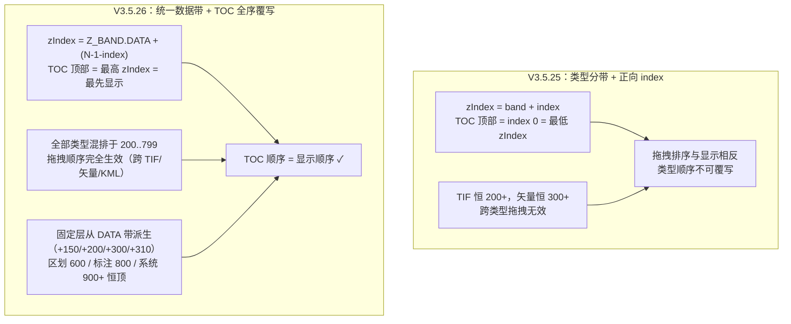

# 2026-08-19 TOC 拖拽顺序覆写图层 zIndex（V3.5.26）

## 日期与时间
2026-08-19（V3.5.25 同一会话的后续任务）

## 任务等级
L2（跨模块：图层注册表 / 数据导入 / 绘制 / 地图初始化常量）

## 问题分析

### 核心症状
用户在 TOC 数据管理中拖拽图层顺序后，显示顺序不生效：TIF（栅格）永远被矢量盖住，
跨类型拖拽无效；且 TOC 顶部的图层实际显示在最底层，与直觉相反。

### 根本原因
V3.5.25 的分带方案 `zIndex = 类型带 + index` 存在两个缺陷：

1. **方向相反**：TOC 渲染顺序 = `order` 升序 = userDataLayers 数组下标升序
   （`useLayerStore.sortedUserLayers`），TOC 顶部 = index 0；而公式给 index 0 分配
   带内最小值 → **TOC 顶部图层 zIndex 最小、显示在最底层**。
2. **类型带不可跨越**：TIF 恒在 RASTER 带（200）、矢量恒在 VECTOR 带（300），
   用户把矢量拖到 upload 组顶部，其 zIndex 仍高于 TIF → **跨类型拖拽无效**，
   拖拽只能同类型内生效，与"统一管理不同类型图层"的产品诉求冲突。

### 受影响模块
useManagedLayerRegistry（refreshUserLayerZIndex）、useLayerDataImport、useCreateManagedVectorLayer、MapContainer Z_INDEX 常量、zIndexBands SSOT。

## 解决方案

### 方案对比
- **方案 A（保留类型带 + 组内反序）**：`zIndex = band + (组内倒数 index)`。跨类型拖拽
  依然无效，未解决核心诉求 → 否决。
- **方案 B（统一数据带 + TOC 全序覆写，选定）**：删除类型分带，全部托管图层落入统一
  数据带 `[Z_BAND.DATA, Z_BAND.DATA + N - 1]`，按 `zIndex = DATA + (N - 1 - index)`
  反向映射——TOC 顶部（index 0）zIndex 最高、最先显示；拖拽跨类型完全生效。
  容量 600 层，位于底图带（含卷帘 0~199）之上、标注带（800）之下。

### 固定层在数据带内的位置（不托管、不随 TOC 排序）
| 固定层 | 值 | 派生 | 语义 |
|---|---|---|---|
| 搜索结果点 | 350 | DATA + 150 | 瞬态 UI，高于一般数据、低于绘制临时层 |
| 绘制中临时图形 | 400 | DATA + 200 | 高于全部已托管数据层（容量 200 层内） |
| 路线层（初始） | 500 | DATA + 300 | 托管后由 refreshUserLayerZIndex 接管 |
| 公交起终点 | 510 | DATA + 310 | 恒高于路线层 |
| 区划边界 | 600 | Z_BAND.DISTRICT | 系统层，数据层 ≤400 层时恒顶于数据 |
| 用户定位 | 920 | SYSTEM + 20 | 系统叠加带，恒顶 |

### 遗留风险根治（用户指定"修复遗漏的风险"）
- **跨带溢出**（同类型 >100 层挤入相邻带）：类型带删除、数据带容量 600 → 消除；
- **未知 sourceType 兜底 VECTOR**（`resolveUserLayerZBand` 删除）：该函数整体移除，
  不再存在兜底分支。

### 变更前后关系图（Mermaid）

## 修改内容
1. **`zIndexBands.js`**：带定义重构——`BASEMAP 0 / DATA 200 / DISTRICT 600 / LABEL 800 /
   SYSTEM 900`；删除 RASTER/VECTOR/DRAW/ROUTE 类型带与 `Z_BAND_SIZE`；注释更新为
   TOC 覆写语义与容量说明（600 层，超限需扩容）。
2. **`useManagedLayerRegistry.js`**：删除 `resolveUserLayerZBand` 与
   `isRasterUploadLayer` 引用；`refreshUserLayerZIndex` 改为
   `zIndex = Z_BAND.DATA + (total - 1 - index)`（TOC 顶部最先显示）。
3. **`useLayerDataImport.js`**：TIF 创建 `zIndex: Z_BAND.RASTER` → `Z_BAND.DATA`（2 处）。
4. **`useCreateManagedVectorLayer.js`**：`zIndex: Z_BAND.VECTOR` → `Z_BAND.DATA`（2 处）。
5. **`MapContainer.vue`**：Z_INDEX 常量全部改从 `Z_BAND.DATA` 派生（数值不变）：
   SEARCH=DATA+150、DRAW=DATA+200、BUS_ROUTE=DATA+300、BUS_PICK=DATA+310、
   USER_LOCATION=SYSTEM+20；注释更新固定层语义。

## 修改原因
见「问题分析」：V3.5.25 分带方案的顺序方向与类型隔离不符合 TOC 统一管理 + 拖拽覆写
的产品诉求；同时根治两项已登记风险。

## 影响范围
图层注册表（托管图层 zIndex 分配）、数据导入（TIF/矢量）、绘制、搜索、路线、TOC
拖拽行为。

## 性能指标
未实测（纯 zIndex 数值重排，无新增渲染开销）。

## 测试方案
### Agent 已执行
- `npx eslint`（5 个改动文件）：0 报错；
- `npx tsc --noEmit`：0 报错；
- `npm run build`：成功（23.62s）。

### 待用户实机验证
1. 上传 1 个 TIF + 1 个矢量（SHP/GeoJSON），在 TOC「上传图层」组内把 TIF 拖到顶部 →
   TIF 应显示在矢量之上（跨类型拖拽生效）；
2. 把某图层拖到上传组底部 → 该图层应显示在最底层（底图之上）；
3. 拖拽后检查其他分组（绘制/路线/搜索）不受影响；标注瓦片（如"矢量+标注"组合）仍
   在全部数据层之上；
4. 绘制图形、路线规划、搜索 POI 显示层级正常（数据带内、标注带下）。

## 变更文件清单
| 文件 | 说明 |
|---|---|
| `frontend/src/domains/ol/layer/zIndexBands.js` | 带定义重构：统一数据带 DATA 200，删除类型带 |
| `frontend/src/domains/ol/layer/composables/useManagedLayerRegistry.js` | 删除 resolveUserLayerZBand；refreshUserLayerZIndex 反向映射 |
| `frontend/src/domains/ol/data-import/composables/useLayerDataImport.js` | TIF 创建 zIndex 接入 DATA 带 |
| `frontend/src/domains/ol/layer/composables/useCreateManagedVectorLayer.js` | 托管矢量创建 zIndex 接入 DATA 带 |
| `frontend/src/domains/ol/components/MapContainer.vue` | Z_INDEX 常量从 DATA 带派生 + 注释 |
| `README.md` | 版本号三处 → V3.5.26 |
| `Docs/Guide/CHANGELOG.md` | 追加 V3.5.26 条目 |

## 遗留与风险
- 数据带容量 600 层；超过后顶部图层将压过标注带（800），需上移数据带或扩容（zIndexBands.js 注释已说明）；
- 数据层 >200 层时 TOC 顶部图层将盖过绘制临时层（400）、>310 层盖过起终点、>400 层盖过区划边界——均为极端场景，可接受；
- `MapSwipeController.vue`（CSS DOM zIndex）与 `ExtentPicker`（刻意恒顶 UI 预览层）不适用本方案，维持原状；
- 版本号 V3.5.26 与并行会话可能撞号，后完成者顺延。

## 零散修补（L1）
无。