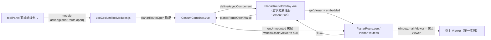

# 2026-08-20 面状航线迁移并接入 CesiumToolPanel

- **日期与时间**：2026-08-20 17:40
- **任务等级**：L3（依赖增删 + 跨模块集成，方案已获用户批准）
- **方案文档**：`Docs/TODO/2026-08-20-planar-route-migration-proposal.md`

---

## 问题分析

- **核心症状**：`planar-wayline`（独立工程）的面状航线编辑器源码已复制到 `frontend/src/domains/cesium/modules/planar-route/`（git 已 staged），但该模块：
  1. 依赖 `element-plus` / `@element-plus/icons-vue` / `@turf/turf` / `@cesium-extends/subscriber` / `gsap` 未安装；
  2. 依赖源工程 `@/utils/BaseInstance` 与 `@/utils/CesiumMap`（initMap 自建 Viewer），目标工程均不存在；
  3. 15 个文件使用 `import * as Cesium from 'cesium'`，与目标工程 CDN 单实例 shim（仅具名导出 + 默认 Proxy）不兼容，`Cesium.Viewer` 等经 `import *` 访问为 `undefined`；
  4. 未接入 toolPanel：无模块定义、无 action 分发、无渲染入口。
- **根本原因**：源工程是独立 Vite 工程（全局注册 Element Plus、自建 Cesium Viewer、路由页面承载），目标工程是「CDN 单 Viewer + 模块工厂 + 懒加载」架构，两套范式需要适配层。
- **受影响模块**：CesiumToolPanel 模块注册中心（`useCesiumToolModules.js`）、`CesiumContainer.vue`（Viewer 宿主与浮层挂载点）、`cesium.d.ts`（默认导出）、`vite.config.js`（分包）、i18n、结构树文档。

## 解决方案（对比与选型）

| 决策点 | 候选 | 选定 | 理由 |
|---|---|---|---|
| Viewer 归属 | A. 共享宿主 Viewer / B. 浮层内 initMap 自建 | **A** | 项目防 Cesium 双实例设计；内存/底图/地形复用；避免双 WebGL 上下文 |
| UI 框架 | A. 新增 element-plus 按需注册 / B. 重写 lil-gui | **A** | 模块 4 个 Vue 组件强依赖 el-*；重写成本高且丢交互 |
| 返回动作 | 源工程 `router?.back()` | **改 `emit('close')`** | 浮层无路由，由容器关闭 overlay |
| svg-icon 图标 | 依赖全局 sprite / 模块内 `?raw` 内联 | **`?raw` 内联** | 目标无 sprite 资源；5 个 svg 随迁，保留 currentColor 语义 |

## 修改内容

1. **依赖**：`package.json` 新增 `element-plus ^2.9.7`、`@element-plus/icons-vue ^2.3.1`、`@turf/turf ^7.2.0`、`@cesium-extends/subscriber ^1.1.1`、`gsap ^3.13.0`（与源工程版本对齐）。
2. **Cesium 导入适配**：模块 15 个文件 `import * as Cesium from 'cesium'` → `import Cesium from 'cesium'`；`src/cesium.d.ts` 补 `export default any;`（对齐 shim 默认 Proxy）。
3. **本地 BaseInstance**：新建 `utils/baseInstance.ts`（`Utilities.downloadBlobFile` + `message` 包装 + `router = null` + `bus` 占位），替换 5 处 `@/utils/BaseInstance` 引用；`AircraftSelect.ts` 清理无效 `id` 导入（`element-plus/es/locale` 残留）。
4. **宿主 Viewer 注入**：`CesiumMap.ts` 改为经 `getViewer` prop 获取宿主 Viewer 并 `emit('loadMap')`（删除 initMap 调用）；`PlanarRoute.vue` 传 `:get-viewer`，根节点加 `embedded` 类（浮层模式背景透明露出宿主球）；`PlanarRouteConfigPanel.vue` 面板自带 `#101010` 底色。
5. **返回动作**：`PlanarRoute.ts` `handleBack` 改为 `emit('close')`；新增 `getViewer` getter（延迟读取避免类字段初始化顺序错误）与 `embedded` computed；`onUnmounted` 末尾 `window.mainViewer = null` 清理全局引用。
6. **模块接入**：
   - 新建 `planarRouteModule.js`（工厂：`{id:'planarRoute', actions:[{id:'open'}]}`）；
   - `useCesiumToolModules.js`：注册模块 + `planarRoute.open` 取反 `planarRouteOpen` + 返回该 ref；
   - 新建 `PlanarRouteOverlay.vue`（懒加载入口，首次挂载调 `installPlanarRouteUI(app)`）；
   - 新建 `planarRouteUI.js`（按需注册 15 个 el-* 组件 + 6 个图标 + `vLoading` 指令 + index.css，幂等）；
   - `CesiumContainer.vue`：`defineAsyncComponent` 挂载浮层、打开时收起 toolPanel、隐藏坐标浮层；
   - ⚠️ **运行时崩溃修复（用户反馈后）**：`watch(planarRouteOpen, ...)` 原位于 `useCesiumToolModules()` 解构之前，触发 TDZ `ReferenceError: Cannot access 'planarRouteOpen' before initialization` 导致 Cesium 页无法启动；已将该 watch 移到解构之后（约 line 886）。
   - 新建 `global.d.ts`：`window.mainViewer` / `window.miniViewer` 类型声明。
7. **图标迁移**：复制源工程 5 个 svg 到 `img/`，新建 `components/Icon.vue` + `Icon.ts`（`svg-icon:` → `?raw` 内联，`:deep(path){fill:currentColor}` 保持配色语义）。
8. **i18n**：`zh-CN.js` / `en-US.js` 新增 `cesium.module.planarRoute.*`（title/description/open/close）。
9. **分包**：`vite.config.js` 新增 `vendor-element-plus` 与 `vendor-planar-route`（turf/@cesium-extends/gsap）独立 chunk，并加入 `SKIP_PRELOAD_CHUNKS` 防入口预加载。

## 修改原因

面状航线是规划类工具的完整实现（测区绘制 / 弓字形航线 / 五向倾斜 / 仿地 / KMZ 导入导出），此前源码已复制但无法编译、无法使用。本次将其按目标工程范式（单 Viewer + 模块工厂 + 懒加载）接入 toolPanel，实现功能可达且不破坏 CDN 单实例架构。

## 影响范围

- **鉴权**：无
- **底图链路**：无（浮层复用宿主底图/地形，不新增 provider）
- **数据库**：无
- **URL 参数**：无新增
- **图层管理**：无（模块实体独立于宿主数据源；`window.mainViewer` 浮层关闭即清空）
- **构建**：新增两个懒加载 chunk；入口包体不变
- **Cesium 类型声明**：`cesium.d.ts` 新增默认导出（向后兼容，不影响既有具名导入）

## 性能指标

- **未实测**（本任务无性能基线）。构建产物（gzip）：`PlanarRouteOverlay` 38.68 KB、`vendor-element-plus` 252.29 KB、`vendor-planar-route` 32.87 KB，均为懒加载 chunk（首次打开浮层时加载），入口预加载清单未增加。

## 测试方案

### Agent 已执行
- `npx tsc --noEmit`：零报错（修复 1 处类字段初始化顺序错误）。
- `npx vite build`：构建成功；确认 `PlanarRouteOverlay` / `vendor-element-plus` / `vendor-planar-route` 独立分包且未入 SKIP_PRELOAD。
- `npx eslint`（新增/改动文件）：通过（修复 1 处 `props` 未使用）。
- `python CheckStructureTree.py`：475/475 通过，0 漏登记 0 幽灵。
- `python CheckConfigRegistry.py`：通过（无新增配置 key）。
- `npm install`（临时 cache 目录）：5 依赖安装成功。
- **eslint 全量清理（2026-08-20 二次会话）**：用户反馈暂存区模块文件 114 个 eslint 错误 → `eslint --fix` 自动修（prefer-const/no-var/部分未用变量）后剩 43 错误 + 7 警告 → 手工逐文件清理（删未用 import/变量、`Function` 类型改 `() => void`、`cb && cb()` 改 `cb?.()`、`hasOwnProperty` 改 `Object.prototype.hasOwnProperty.call`、`catch (e)` 改 `catch (_e)`、空 catch 补注释、v-for 补 `:key`、删 6 处调试 console.log、`const self = this` 与 Icon.vue `v-html` 加带理由的 eslint-disable）→ **`npx eslint src/domains/cesium/modules/planar-route/` 40 个文件 0 错误 0 警告**。
- 二次复查：`npx tsc --noEmit` 零报错；`npx vite build` 构建成功（40.8s，分包体积不变：PlanarRouteOverlay 38.68KB / vendor-element-plus 252.29KB / vendor-planar-route 32.87KB gzip）。

### 待用户实机验证
1. `npm run dev` 启动 → 3D 地图 → toolPanel「模块」页签 → 「面状航线」卡片 → 点「打开面状航线编辑器」。
2. 预期：全屏浮层打开，宿主球作为底图（左侧深色配置面板 + 顶部工具栏），坐标浮层隐藏、toolPanel 收起。
3. 点地图设置参考起飞点 → 左键绘制测区 → 右键删除顶点/删除测区 → 期望生成弓字形航线（正射）或五向切换（倾斜采集）。
4. 保存航线 → 命名 → 下载 .kmz；导入 .kmz → 回填测区/航线/起飞点。
5. 点顶部返回箭头关闭浮层 → 宿主场景无残留实体（测区/航线/起飞点全部消失）、`window.mainViewer` 已清空（控制台 `window.mainViewer` 为 null）、toolPanel 可重新打开。
6. 打开浮层后首次交互会有一次 Element Plus chunk 加载（网络面板可见 vendor-element-plus），无报错。

## 变更文件清单

| 文件 | 说明 |
|---|---|
| `frontend/package.json` | +5 依赖（element-plus 等） |
| `frontend/package-lock.json` | 依赖锁定 |
| `frontend/src/cesium.d.ts` | 补 `export default any` |
| `frontend/src/domains/cesium/modules/planar-route/`（15 个源文件） | `import * as Cesium` → 默认导入；BaseInstance 引用改本地；CesiumMap/PlanarRoute 注入与 close/embedded 适配 |
| `frontend/src/domains/cesium/modules/planar-route/utils/baseInstance.ts` | **新增**：本地组件基类 |
| `frontend/src/domains/cesium/modules/planar-route/global.d.ts` | **新增**：mainViewer/miniViewer 声明 |
| `frontend/src/domains/cesium/modules/planar-route/planarRouteModule.js` | **新增**：模块工厂 |
| `frontend/src/domains/cesium/modules/planar-route/planarRouteUI.js` | **新增**：Element Plus 按需注册 |
| `frontend/src/domains/cesium/modules/planar-route/PlanarRouteOverlay.vue` | **新增**：浮层懒加载入口 |
| `frontend/src/domains/cesium/modules/planar-route/components/Icon.vue` + `Icon.ts` | **新增**：svg-icon 内联图标 |
| `frontend/src/domains/cesium/modules/planar-route/img/`（5 个 svg） | **新增**：图标资源随迁 |
| `frontend/src/domains/cesium/composables/toolModules/useCesiumToolModules.js` | 注册 planarRoute 模块 + action + 返回 planarRouteOpen |
| `frontend/src/domains/cesium/components/CesiumContainer.vue` | 挂载浮层 / 收起 toolPanel / 隐藏坐标浮层 |
| `frontend/src/locales/zh-CN.js` / `en-US.js` | `cesium.module.planarRoute.*` |
| `frontend/vite.config.js` | vendor-element-plus / vendor-planar-route 分包 |
| `Docs/Guide/frontend-structure.md` | planar-route 目录树 |
| `README.md`（三处）/ `Docs/Guide/CHANGELOG.md` | V3.5.30 |
| `Docs/TODO/2026-08-20-planar-route-migration-proposal.md` | **新增**：L3 方案文档 |

## 遗留与风险

- **Element Plus 全量打包**：`vendor-element-plus` gzip 252 KB 偏大（element-plus 根导出含全部组件，Rollup 无法深度 tree-shake）。已独立懒加载 + 不入预加载，首屏零影响；后续可改用 `element-plus/es/components/*` 逐组件 + 样式子路径导入瘦身（列为后续优化项）。
- **仿地（AGL）依赖宿主地形**：宿主未开启地形时 AGL 模式无法采样（与源工程行为一致），ASL / 相对起飞点模式不受影响。
- **Cesium CDN 版本**：源工程 1.135，目标 CDN 为 1.132+；`Terrain.fromWorldTerrain` / `sampleTerrainMostDetailed` 两版本均具备，⚠️ 待实机验证。
- **svg-icon 图标**：`?raw` 内联方案保留外观与颜色语义，但不再随主题换色（源工程同）。
- **`window.miniViewer`**：仅死代码路径引用（planarLine.ts:78，未传 cb 才触发），未实现其创建逻辑。
- **未执行任何 Git 写操作**；npm install 因系统 npm cache 权限问题改用临时 cache 目录完成（不影响项目）。
- **顺带发现（未修，已记录于 TODO）**：`AircraftSelect.vue` 仍存在 `import gsap`（已随依赖修复）；模块 console.log 已全部清理（本会话）→ 该 TODO 条目已消除。

## 收尾修复与最终验证

- `CesiumToolPanel.vue` 为 `planarRoute` 模块补充 `MapPin` 卡片图标及打开/关闭动作图标，保持与其它可展开模块一致。
- 复核 `CesiumContainer.vue` 中 `planarRouteOpen` 的 watch 位于 `useCesiumToolModules()` 解构之后，避免 `<script setup>` 初始化阶段访问未初始化绑定。
- 新增长期架构参考：`Docs/Architecture/cesium-planar-route.md`。
- `frontend/npx tsc --noEmit`：通过。
- `frontend/npm run build`：通过；生成 `PlanarRouteOverlay`、`vendor-element-plus`、`vendor-planar-route` 独立 chunk。
- `python CheckStructureTree.py`：475/475，通过。
- `python CheckConfigRegistry.py`：通过。
