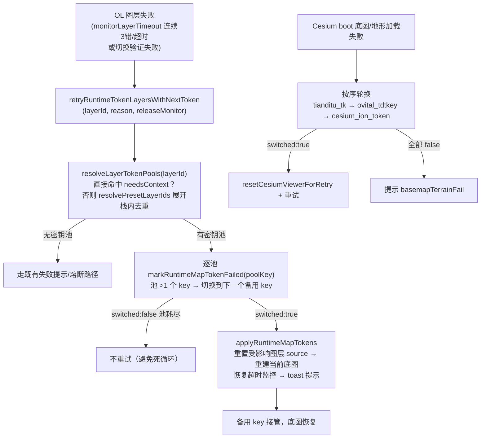

# 2026-08-20 运行时密钥池失败自动轮换（备用 key 闭环）（V3.5.31）

- **日期与时间**：2026-08-20 12:35
- **任务等级**：L2（功能开发，跨 4 文件协同）
- **一句话结论**：V3.5.30 遗留的「失败自动轮换备用 key」决策 2 落地——OL 侧天地图专用重试泛化为
  `retryRuntimeTokenLayersWithNextToken`（按 `needsContext` SSOT 判定密钥池），任何带备用 key 的
  密钥池（天地图/奥维）主 key 失败时自动轮换并重建受影响图层；Cesium boot 失败重试同步纳入奥维池。

---

## 一、问题分析（阶段一）

- **核心症状**：奥维备用 key 只能在密钥管理面板手动维护，主 key 失效后页面不自动切换，备用池形同虚设。
- **根本原因**：V3.5.30 的容灾轮换 `retryTiandituLayersWithNextToken` 为天地图专用——图层匹配靠
  `isTiandituLayerId`（字符串包含 'tianditu'），奥维图层（`Omap_label` / `terrain_omap_contour`）
  永远命中不了该分支，失败后只走提示不轮换。
- **受影响模块**：`useRuntimeMapTokenPool.js`（OL 容灾重试）、`basemapConfig.ts`（密钥池判定 SSOT）、
  `CesiumContainer.vue`（3D boot 重试）、`MapContainer.vue`（两处回调引用）。

---

## 二、修改内容与原因

| # | 修改内容 | 原因 |
|---|---------|------|
| 1 | `basemapConfig.ts` 新增 `RuntimeTokenPoolKey` 类型与 `resolveRuntimeTokenPoolKey(layerId)`：依据图层 `needsContext` 声明返回所属密钥池（`tianditu_tk` / `ovital_tdtkey`），非 token 图层返回 null | 判定逻辑的唯一事实来源。杜绝字符串猜测——`terrain_opentopomap` 含 'omap' 子串，若用 `includes('omap')` 会被误判为奥维 |
| 2 | `useRuntimeMapTokenPool.js`：`retryTiandituLayersWithNextToken` 泛化 → `retryRuntimeTokenLayersWithNextToken`；新增 `resolveLayerTokenPools`（直接图层命中优先，预设展开栈内去重取池）；`resolveAffectedLayerIds` 按池过滤；toast 文案改用 `TOKEN_POOL_LABELS` 池名 | 覆盖 OL 两条失败路径（监控器连续 3 错/无响应 + 手动切换验证失败）。注意 `useBasemapSelectionWatcher` 回调传入的是**预设 ID**（如 `'tianditu'`），直接查 `LAYER_SOURCE_MAP` 会漏判，必须展开预设 |
| 3 | `CesiumContainer.vue` boot：`maxRetryCount` 纳入 `ovitalTdtkeys.length`；底图栈含奥维图层且底图加载失败时，按 天地图 → 奥维 → Cesium Ion 顺序依次轮换；日志/回退 tokens 同步 | 3D 启动失败时奥维底图也能利用备用 key 恢复，与 2D 行为对齐 |
| 4 | `MapContainer.vue`：两处 `retryTiandituLayersWithNextToken` 引用改名 | 同步重命名 |

> 未改动 `markRuntimeMapTokenFailed`：其池长度 ≤1 时返回 `switched:false`，天然避免无备用 key 时的死循环。

---

## 三、解决方案

**方案对比**：
- A（选型）**按 needsContext SSOT 泛化**：判定逻辑收敛到 `basemapConfig` 单一来源，新增密钥池零改容灾代码，天然支持后续 amap_key 等池。
- B 字符串匹配泛化（`includes('ovital') || includes('omap')`）：改动最小，但 `terrain_opentopomap` 含 'omap' 子串会误判，且未来新池仍需改匹配代码。
- C 面板手动轮换（维持现状）：不满足用户诉求，否决。

**实施后数据流（Mermaid）**：

**实施步骤**：
1. `basemapConfig.ts` 导出 `resolveRuntimeTokenPoolKey`；
2. `useRuntimeMapTokenPool.js` 引入该函数，重写图层/预设→池解析与重试主流程；
3. `CesiumContainer.vue` 补奥维轮换分支；
4. `MapContainer.vue` 改名对齐；
5. 类型/lint 验证 + 门禁。

---

## 四、影响范围

- **底图链路**：OL 2D（运行时监控轮换 + 手动切换验证轮换）、Cesium 3D（boot 失败轮换）、`runtimeMapTokens.js`（无改动，仅消费）。
- **密钥池**：`tianditu_tk` 行为不变（回归面）；`ovital_tdtkey` 新增自动轮换能力。
- **配置/数据库**：无新增配置项，无表结构变更。
- **URL 参数**：无影响。

---

## 五、性能指标

未实测（轮换仅在失败路径触发，正常链路零开销；判定为纯内存查表）。

---

## 六、测试方案

| Agent 已执行 | 待用户实机验证 |
|---|---|
| `npx tsc --noEmit` 通过（frontend） | 1. 奥维主 key 失效（改错 key 保存）→ 2D 奥维注记/等高线在连续 3 错后自动切备用 key，toast 提示「奥维 token 已切换到备用项」，图层恢复 |
| `npx eslint` 4 个改动文件零告警 | 2. 奥维备用池 ≥2 个 key，逐一切换后刷新页面，奥维底图仍可加载（备用 key 生效） |
| 代码审查：`opentopomap` 不被误判（判定走 needsContext，无字符串猜测） | 3. 天地图主 key 失效 → 仍按原行为自动切备用（回归） |
| 逻辑审查：池长度 ≤1 时 `markRuntimeMapTokenFailed` 返回 `switched:false`，无死循环 | 4. 3D：奥维底图预设下主 key 失效 → boot 自动轮换奥维池重试成功 |
| 逻辑审查：`useBasemapSelectionWatcher` 传入预设 ID（如 `'tianditu'`）时经 `resolvePresetLayerIds` 展开取池，不直接查表漏判 | 5. 手动切换含奥维图层的预设且主 key 失效 → 切换验证失败后自动轮换并显示成功 |

---

## 七、变更文件清单

| 文件 | 说明 |
|------|------|
| `frontend/src/domains/ol/basemap/constants/basemapConfig.ts` | 新增 `RuntimeTokenPoolKey` 类型 + `resolveRuntimeTokenPoolKey`（needsContext SSOT 判定） |
| `frontend/src/domains/ol/composables/useRuntimeMapTokenPool.js` | 重试泛化：`resolveLayerTokenPools` / `resolveAffectedLayerIds` 按池过滤 / `retryRuntimeTokenLayersWithNextToken` / 池名 toast |
| `frontend/src/domains/cesium/components/CesiumContainer.vue` | boot 重试纳入 ovitalTdtkeys 长度与奥维池轮换分支 |
| `frontend/src/domains/ol/components/MapContainer.vue` | 两处 `retryTiandituLayersWithNextToken` → `retryRuntimeTokenLayersWithNextToken` |
| `Docs/Guide/CHANGELOG.md` | 追加 V3.5.31 条目 |
| `README.md` | 三处版本号 V3.5.31 + 版本演进表（新增 V3.5.31，删除 V3.5.26，恒定 3 行） |
| `Docs/TODO/plan-ovital-tdtkey-l2.md` | 决策 2 标注「已于 V3.5.31 实现」 |
| 本日志 | 任务记录 |

---

## 八、遗留与风险

- **Cesium 运行时瓦片失败不自动轮换**：Cesium 侧仅在 boot 阶段做池轮换；运行中 3D 瓦片加载失败无监控器触发轮换（与天地图在 3D 的历史行为一致）。如需运行中轮换需在 Cesium 图层增加瓦片错误监听，属独立增强。
- **手动切换混合预设的模糊性**：预设栈含多个密钥池时逐池轮换（任一成功即视为已处理）；若某池无备用 key 则该池保持原样，与既有行为一致。
- **toast 文案**：轮换提示现为中文硬编码（沿用原天地图风格），未走 i18n；与既有 `monitorLayerTimeout` 的中文提示风格一致，暂不扩展。
- **并行会话版本号**：本任务取 V3.5.31，若有并行会话已占用请按规则顺延。

---

## 九、DoD 核对

- [x] 代码改动完成，遵守分层边界（判定逻辑收敛 basemapConfig，轮换逻辑在 composable）
- [x] `tsc --noEmit` 无新报错；改动文件 eslint 零告警
- [x] 日志已按规范创建写全章节
- [x] 根 README 三处版本号更新 + 版本演进表恒定 3 行
- [x] CHANGELOG 追加 V3.5.31
- [x] 无文件增删（仅编辑既有文件）→ 结构树无需同步
- [x] 无新增配置 key → 登记无需变更
- [x] 门禁：CheckConfigRegistry / CheckStructureTree 已跑（结果见下）
- [x] 未执行任何 Git 写操作