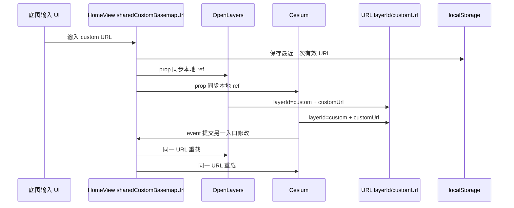

# 双引擎共享 customUrl 与历史影像底图

- **日期与时间**：2026-08-20 20:34
- **任务等级**：L3（跨 OL/Cesium/HomeView/URL/卷帘的共享状态修复；按用户指令直接批准实施）
- **统一版本号**：V3.5.25（与实时在线零轮询重构合并为单一版本）

## 问题分析

核心症状：ESRI Wayback 快照需要动态 URL，不能为每个快照追加底图 ID；`l=1` 只能表示固定 custom 图层。此前 OL 的 `customMapUrl` 和 Cesium 的 `customXyzBasemapUrl` 各自保存 URL，导致一个引擎中输入的 URL 在切换引擎后丢失或不一致，卷帘也拒绝 custom。

根本原因：跨引擎状态所有权错误，URL 参数被当成两个引擎各自的恢复输入，而不是由共同父级维护的单一共享状态；Wayback 动态目录还被错误地设计成运行时注册项。

受影响模块：`HomeView.vue`、OL `MapContainer.vue`/图层控制/卷帘、Cesium `CesiumContainer.vue`/图层 provider/URL tracking、历史影像 UI、URL 选择辅助函数及项目维护文档。

## 方案对比与选型

1. 为每个 Wayback 快照注册稳定 ID：会污染静态/运行时目录，且不能解决两个引擎 custom URL 状态分叉，放弃。
2. 只继续写 `l=1`：能兼容旧链接，但无法表达和恢复具体 URL，放弃。
3. `HomeView` 持有唯一 `sharedCustomBasemapUrl`，OL/Cesium 各自使用本地 `ref` 镜像并通过 prop/event 与父级双向同步；分享链接用 `layerId=custom&customUrl=...` 表达选择，最近一次有效 URL 另存入 `localStorage`，卷帘左右显式携带比较 URL：选定。理由是父级继续作为跨引擎 SSOT，同时避免可写 `computed` 在当前调用栈读到旧 prop 的竞态。

## 修改内容

- 移除 Wayback 动态底图注册链路，固定使用 `layerId=custom`。
- 让 OL、Cesium 使用 HomeView 的同一 `customUrl`；子组件本地 `ref` 保证提交后立即可读，父级 prop 更新时同步镜像并在当前图层为 custom 时重载 source/provider。
- 保留 `l=1` 和 `l=1&customUrl=...` 兼容；仅 custom 选择写入 `customUrl`，普通预设不写该参数，也不销毁共享状态中最近一次有效 URL。
- 最近一次有效 custom URL 通过 `localStorage` 跨会话恢复；`layerId=custom` 缺少 URL 时拒绝反序列化，避免恢复出不可加载的空 custom 图层。
- 历史影像按年份折叠，条目仅显示 `YYYY-MM-DD`。
- 卷帘允许 custom，并保存左右比较 URL。

## 解决方案数据流

## 修改原因

底图身份 `id` 与具体运行时 URL 必须分离。固定 `custom` 可以让 `l=1`、Cesium、OL、卷帘和分享链接采用同一身份；共享 URL 则保证切换引擎不丢失用户刚设置的影像。

## 影响范围

URL 状态、双引擎底图 source/provider、历史影像选择 UI、卷帘比较配置、版本/结构文档。

## 测试方案

### Agent 已执行

- 初始实现阶段曾执行 `npx tsc --noEmit`、结构树门禁、配置登记门禁及暂存 diff 空白检查；这些结果发生在后续代码审查修复之前，仅作为基线记录。
- 最终工作区的验收命令与结果统一记录在 [V3.5.25 暂存区整合与代码审查](../2026-08-21/2026-08-21-v3.5.25-consolidated-code-review.md)，避免将基线结果误写为最终验证。

### 待用户实机验证

- OL 输入 URL，切换 Cesium，确认输入框与图源 URL 不变。
- Cesium 输入另一 URL，切回 OL，确认 OL 输入框和瓦片切换为新 URL。
- 打开 Wayback，按年份展开，条目只显示日期；卷帘左右 custom URL 可分别加载。

## 性能指标

未实测。本主题的状态同步只使用 Vue watch/event 与浏览器存储，不新增轮询；Wayback 目录仅在用户切换到对应页签后懒加载。首屏调度的独立优化见 V3.5.25 综合日志。

## 变更文件清单

- `Docs/Architecture/2026-08-20-unified-basemap-selection.md`
- `Docs/Guide/CHANGELOG.md`
- `Docs/Guide/ESRI_Wayback_Layers_List.md`
- `Docs/Guide/backend-structure.md`
- `Docs/Guide/frontend-structure.md`
- `Docs/Guide/project-structure.md`
- `Docs/LLM_record/26-08/2026-08-20/2026-08-20-shared-custom-basemap.md`
- `README.md`
- `backend/api/historical_imagery.py`
- `backend/app.py`
- `backend/scripts/fetch_wayback_layers.js`
- `backend/scripts/fetch_wayback_layers.py`
- `backend/services/historical_imagery.py`
- `backend/tests/test_historical_imagery.py`
- `frontend/src/api/backend/historicalImagery.js`
- `frontend/src/api/backend/index.js`
- `frontend/src/app/HomeView.vue`
- `frontend/src/domains/cesium/components/CesiumContainer.vue`
- `frontend/src/domains/cesium/composables/layers/layerUtils.js`
- `frontend/src/domains/cesium/composables/layers/useCesiumLayers.js`
- `frontend/src/domains/cesium/composables/layers/useCesiumUrlTracking.js`
- `frontend/src/domains/common/basemap/basemapRegistry.ts`
- `frontend/src/domains/ol/basemap/composables/useBasemapSwipe.js`
- `frontend/src/domains/ol/basemap/constants/basemapConfig.ts`
- `frontend/src/domains/ol/components/ControlsPanel.vue`
- `frontend/src/domains/ol/components/MapContainer.vue`
- `frontend/src/domains/ol/composables/useMapState.js`
- `frontend/src/domains/ol/layer/components/LayerControlPanel.vue`
- `frontend/src/domains/ol/layer/composables/useLayerControlHandlers.js`
- `frontend/src/domains/ol/startup/useStartupTaskScheduler.js`
- `frontend/src/domains/ol/stores/useSwipeConfigStore.ts`

## 遗留与风险

- Cesium 和 OL 的自定义服务类型识别能力不同；共享的是 URL，具体 source/provider 校验仍由各引擎执行。
- 卷帘左右 URL 是比较配置，允许与主引擎共享 URL 不同，这是对比两张 custom 影像所必需的局部参数。
