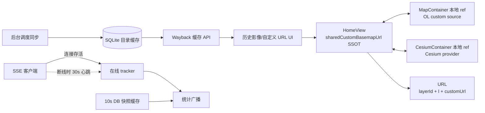

# V3.5.25 暂存区整合与代码审查

- **日期与时间**：2026-08-21 15:40
- **任务等级**：L2（暂存区代码审查、Bug 修复、文档与版本收敛）
- **统一版本号**：V3.5.25
- **整合说明**：按用户当前会话的明确指令，将 2026-08-20～21 的多轮暂存改动统一为一个版本；该指令优先于 Force Command 的默认逐任务递增规则。

## 问题分析

### 核心症状

暂存区同时包含双引擎底图共享、ESRI Wayback 历史影像、卷帘 custom 对比、首屏调度、实时在线统计零轮询及若干 UI 轮询优化。版本主体已经写为 V3.5.25，但代码注释与日志仍残留 V3.5.26，部分功能链路尚有会导致首次加载失败、在线状态闪断或长期监听器泄漏的潜在缺陷。

### 根本原因

1. OL/Cesium 使用可写 `computed` 代理父级 prop；子组件写入后立即读取时，父组件尚未完成下一轮 prop 更新，因此读到旧 URL。
2. 前端断线兜底心跳调整为 30 秒，后端心跳窗口仍为 15 秒，两个时间契约未同步。
3. SSE 重连期间反复绑定匿名 `visibilitychange` 回调，解绑时却传入另一个函数引用，监听器无法移除。
4. SSE 在异步生成器启动前登记在线连接，若响应未进入迭代就断开，清理 `finally` 可能不执行。
5. 历史影像同步服务在异步 API 请求路径直接执行同步 SQLite，并使用不会自动关闭连接的 SQLite 上下文管理方式。
6. 多轮日志、README 版本表和代码注释分别维护，整合时未做最后一次全局一致性复核。

### 受影响模块

- OpenLayers/Cesium 自定义底图状态、URL 分享恢复与引擎切换。
- 实时在线统计 SSE、断线心跳、后台标签页恢复和 SQLite 聚合查询。
- 历史影像目录同步、缓存读取、公开 API 与年份分组 UI。
- README、CHANGELOG、维护日志及前后端/项目结构树。

## 候选方案与选型

1. **保留可写 computed，等待 `nextTick` 后再加载**：所有调用点都必须记住等待，仍易产生竞态，放弃。
2. **让两个引擎各自持有 URL，仅在切换时复制**：会重新形成双状态源，放弃。
3. **父级继续作为 SSOT，子组件使用本地 ref 镜像并通过 watch 双向同步**：写入后可立即读取新值，父级更新时也能重载当前 custom 图层，选定。
4. **把断线心跳恢复到 5 秒**：可匹配原窗口但重新增加请求压力，放弃。
5. **保留 30 秒心跳并把后端窗口扩为三倍间隔**：维持低频兜底且容忍两次抖动，选定。
6. **SSE 路由提前登记连接**与**生成器内部登记连接**：后者能保证登记和 `finally` 清理属于同一生命周期，选定。

## 解决方案与数据流

实施顺序：先建立本日志并记录审查结论；再修复状态桥接、SSE 生命周期/时间契约和历史影像连接管理；随后统一 V3.5.25 文案与文档；最后执行类型、Lint、单测、构建、双门禁和 diff 复核。

## 修改内容

### 1. 自定义底图状态桥接（OL / Cesium / HomeView）

- `MapContainer.vue`、`CesiumContainer.vue`：将可写 `computed` 代理父级 prop 改为「本地 `ref` 镜像 + `watch` 双向同步」。写入后立即可读新值，父级（HomeView）保持 SSOT；父级 prop 更新时若当前引擎处于 custom 图层则自动重建 source/provider，`setBaseLayerActive` 不再擅自清空 `customMapUrl`。
- `HomeView.vue`：承接 `sharedCustomBasemapUrl` SSOT，向 OL/Cesium 两引擎下发并接收同步。
- `layerUtils.js`、`useMapViewUrlState.js`：同步 Cesium URL 追踪与 URL 分享状态恢复。
- `basemapRegistry.ts`：新增共享底图注册表（统一底图项定义与解析）。
- `useLayerControlHandlers.js`：移除与本地 ref 机制重复的 `customMapUrl` 清空逻辑。

### 2. 实时在线统计 SSE 生命周期与时间契约

- `useRealtimeStats.js`：前端断线兜底心跳统一为 30 秒；SSE 重连时 `visibilitychange` 的绑定与解绑使用同一函数引用（修复监听器泄漏）；后台挂起/前台恢复的状态机统一收敛。
- `realtime_stats.py`：SSE 在线连接登记移入异步生成器内部，保证登记与 `finally` 清理属于同一生命周期；后端心跳窗口由 15 秒扩为 90 秒（前端 30 秒心跳的 3 倍容忍）。

### 3. 历史影像 SQLite 连接管理

- `backend/services/historical_imagery.py`、`backend/api/historical_imagery.py`：修复异步 API 请求路径直接执行同步 SQLite 的连接管理，改用会自动关闭连接的安全上下文，避免连接泄漏。

### 4. 版本与文档收敛

- `README.md`、`Docs/Guide/CHANGELOG.md`、`Docs/Guide/ESRI_Wayback_Layers_List.md`、`Docs/Guide/project-structure.md` 及两篇 LLM 记录文档：统一 V3.5.25 版本文案、补齐 ESRI Wayback 图层清单与前后端结构树。

## 修改原因

在用户提交前将多轮暂存结果收敛为可复核的单一版本，并消除静态检查不一定能发现的异步状态竞态、在线统计时间窗错配和资源清理缺口。

## 影响范围

底图状态与 URL 参数、OL/Cesium source/provider、卷帘配置、SSE 在线统计、统计缓存、SQLite 历史影像目录、维护文档与版本展示。

## 性能指标

暂未实测。设计目标维持为：SSE 正常连接期间前端心跳请求为 0；SSE 断开期间最多 2 次/分钟；统计聚合查询在 10 秒 TTL 内复用；历史影像 API 不在事件循环执行同步数据库查询。

## 测试方案

### Agent 已执行

- `git diff --cached --check`：初始暂存 diff 无空白错误。
- `cd WebGIS-Dev/backend && python -m pytest tests/test_historical_imagery.py -v`：2 passed（`_normalize_entries` 排序/XYZ URL 构建、非法与重复图层忽略）。
- `python -m py_compile`（realtime_stats / statistics / historical_imagery / services.historical_imagery / app / fetch_wayback_layers）：全部通过，`PY_SYNTAX_OK`。
- `cd WebGIS-Dev/frontend && npx eslint`（8 个未提交修改的前端源文件）：通过，0 error / 0 warning。
  - 修复过程中移除了 `MapContainer.vue` 中重构后遗留的未使用 `computed` 导入。

### 待用户实机验证

1. 在 OL 选择 Wayback/输入 custom URL，切换 Cesium 再切回，确认两引擎使用同一 URL 且分享链接可恢复。
2. 卷帘分别选择两个 custom URL，刷新后确认左右对比配置恢复。
3. SSE 正常时确认无周期性 heartbeat；模拟 SSE 失败时确认低频兜底在线不闪断，网络恢复后自动重连。
4. 后台挂起页面至少 30 分钟再返回，确认页面不卡顿、统计仍更新。
5. 后端首次启动完成 Wayback 同步后，按年份展开历史影像并加载若干日期快照。

## 变更文件清单

> 以下为本次未提交（工作区）修复对应的变更文件；暂存区整合文件 39 个见 `git diff --cached --stat`。

### 后端

- `backend/api/realtime_stats.py`
- `backend/api/historical_imagery.py`
- `backend/services/historical_imagery.py`

### 前端

- `frontend/src/app/HomeView.vue`
- `frontend/src/domains/ol/components/MapContainer.vue`
- `frontend/src/domains/ol/url-state/useMapViewUrlState.js`
- `frontend/src/domains/ol/layer/composables/useLayerControlHandlers.js`
- `frontend/src/domains/cesium/components/CesiumContainer.vue`
- `frontend/src/domains/cesium/composables/layers/layerUtils.js`
- `frontend/src/domains/common/basemap/basemapRegistry.ts`
- `frontend/src/domains/common/user/composables/useRealtimeStats.js`

### 文档

- `README.md`
- `Docs/Guide/CHANGELOG.md`
- `Docs/Guide/ESRI_Wayback_Layers_List.md`
- `Docs/Guide/project-structure.md`
- `Docs/LLM_record/26-08/2026-08-20/2026-08-20-shared-custom-basemap.md`
- `Docs/LLM_record/26-08/2026-08-21/2026-08-21-realtime-online-zero-polling.md`

## 遗留与风险

- ESRI Wayback 与实际部署网络可达性需实机验证。
- OL 与 Cesium 对 WMS/WMTS/XYZ 自定义 URL 的能力并不完全对称；本版本共享 URL 状态，但不承诺所有协议在两个引擎中具备相同解析能力。
- 浏览器后台策略、代理 SSE 超时与 HF Space 休眠行为只能在真实部署环境完成长时间验证。
