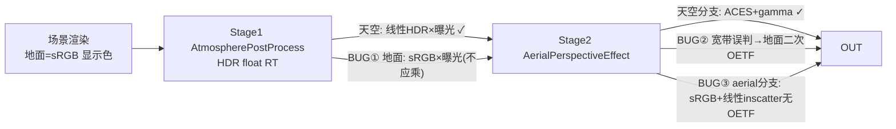

# 2026-08-22 体积云空中透视（aerialStageEnabled）天际线白蒙版修复

- **日期与时间**：2026-08-22
- **任务等级**：L2（渲染管线 shader 逻辑缺陷修复，3 文件协同）
- **版本**：并入 V3.5.27（沿用用户收敛策略，不另增版本号）

---

## 问题分析

- **核心症状**：开启 `aerialStageEnabled` 后，空中透视效果越过天空/地表交界覆盖地面——地平线附近出现一条灰白蒙版带遮蔽地表，交界处过渡突兀难看。
- **根本原因**（三层叠加，均在「几何/地面像素」路径）：
  1. **Stage1 曝光污染直通色**：`AtmospherePostProcess.js` main() 末尾对全帧 `× u_atmosphereExposure`，但 `applyGroundAtmosphere=0` 时地面像素是 **sRGB 显示色直通**（非线性 HDR），被曝光乘数（默认 1.5，可至 30）整体抬亮后送入 Stage2。
  2. **分类宽带把远地表误判为天空**：`aerialPerspectiveEffect.frag` 壳层判定用 `SHELL_SKY_DEPTH_SLOP=0.014` 宽带 + `MU_EXPLICIT_GROUND=-0.065`，log-depth 下大量远距地面像素 depth 落入 `[1-0.014, 1)` 且 muLook 未低于阈值 → 走「天空透传」分支，对 sRGB 地面执行 ACES+gamma = **二次 OETF**，形成一条灰白蒙版带。
  3. **Aerial 分支色彩域混用且缺 OETF 出口**：`finalColor = originalColor(sRGB) * transmittance + inscatter(线性 HDR)` 直接输出、无任何 tonemap/gamma——近地平线大气路径长、inscatter 数值大，线性值直加在 sRGB 上饱和成白；且与相邻天空分支（有 ACES+gamma）出口不一致，交界处形成亮度/对比度突变缝。

### 数据流链路

## 修改内容

1. **Fix A**（`AtmospherePostProcess.js`）：曝光改为按分支施加——`(isSky || applyGround!=0) ? exposure : 1.0`，直通地面不再被抬亮。
2. **Fix B**（`aerialPerspectiveEffect.frag`）：新增 `compositeAerialDisplay()` 统一地面合成——`pow(2.2) 线性化 → ×T×sunT + inscatter → mix(linOriginal, aerialLin, scale) → tonemapDisplay`（与天空分支同一 OETF 出口）；主路径与 eyePos.w 异常兜底路径共 2 处调用点替换。mix 语义使 `scale=0` 严格恒等、强度平滑淡入，物理上消除白蒙版可能。
3. **Fix C**（同 frag）：壳层分类参数与 Stage1 对齐收窄——`SLOP 0.014→0.0016`、`MU -0.065→-0.01`。旧宽带的防闪理由（两分支出口不一致导致翻转闪烁）已被 Fix B 消除。

## 影响范围

- 仅体积云/大气后处理链路（`aerialStageEnabled` / `aerialPerspectiveScale` 消费端）；Cesium 原生 skyAtmosphere 及其它模块不受影响。
- 附带收益：BSM 地面云影经 sunT 进入同一 mix 语义，低强度下不再出现突兀阴影压暗。

## 测试方案

### Agent 已执行
- eslint（JS 改动文件）：通过（.frag 无 lint 配置属正常忽略）
- `npx vite build`：通过（39.7s）
- shader 三处输出点 + 新函数语法目检核对（GLSL 300 es）

### 待用户实机验证
1. 开启体积云 → 面板打开「空中透视 stage」→ 默认 `aerialPerspectiveScale=0` 时画面应严格等同关闭状态（无任何蒙版）。
2. 拉高「空中透视强度」滑杆 → 透视雾仅沿视线方向平滑淡入，天空/地表交界无缝、无灰白带。
3. 相机贴近地平线往返升降 → 无分支翻转闪烁（旧宽带防闪场景回归）。
4. 地面云影（useShadowBuffer）在低强度下随透视同步淡入，无独立突兀压暗。

## 变更文件清单

| 文件 | 说明 |
|---|---|
| frontend/src/domains/cesium/modules/cloud/lib/AtmosphereFromThreeGeospatial/AtmospherePostProcess.js | Fix A：曝光按分支施加 |
| frontend/src/domains/cesium/modules/cloud/lib/AtmosphereFromThreeGeospatial/Shaders/aerialPerspectiveEffect.frag | Fix B+C：compositeAerialDisplay 统一出口 + 分类带收窄 |

## 遗留与风险

- `applyGroundAtmosphere=1` 模式（本管线未启用）仍存在同类色彩域混用，未在本次范围（避免无关回归）。
- pow(2.2) 为 sRGB≈ 近似；如后续接入精确 sRGB 解码可替换为 czm 内置函数（视觉差异可忽略）。
