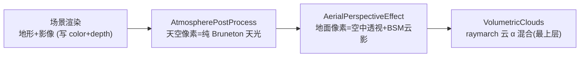

# 2026-08-22 体积云空中透视地形感知分类（地平线黄雾带修复）

- **日期与时间**：2026-08-22 20:41
- **任务等级**：L2（单个 shader 分类块重写 + 三副本同步，无 JS 管线改动）
- **版本**：V3.5.30

---

## 问题分析

### 用户报告

> Fix A/B/C 生效后交界白蒙版已收敛，但分类是沿理想椭圆边切的；开启地形后地平线高低起伏，
> 地平线上方天空边缘那层黄色渐变蒙版会直接遮挡地形和白云——部分云朵被遮蔽后呈黄色。
> （用户直觉判断是「显示图层」问题：黄渐变应最低层 → 地形影像 → 体积云最高。）

### 渲染顺序核查（用户「图层」假设的验证）

后处理链实际顺序（[ThreeGeospatialPipeline.js init 步骤7](../../../../frontend/src/domains/cesium/modules/cloud/lib/ThreeGeospatialPipeline.js)）：

**层级本身没有问题**：地形最先画、云最后合成，不存在「天空层盖住云」。问题出在第二/三棒
对「哪些像素属于地面」的判定。

### 根因链条

1. **分类判据是纯几何的**：`aerialPerspectiveEffect.frag` 旧分类块
   `explicitGround = hitBottom || (hasSceneDepth && muLook < -0.01)`，其中 `hitBottom`
   = 视线前向是否与海平面椭球相交。无地形时它等价于「该像素是地表」；开地形后**山脊之间
   的天空缝隙、切角以下的掠射视线照样在远处擦入椭球**，被误判为地面。
2. **误判后的散射终点是无界的**：深度清空像素走 `czm_windowToEyeCoordinates(depth=1)`
   重建出的是远平面点（~8e8 m），或经 Bruneton `ClampRadius` 被顶到大气层顶；掠射段
   inscatter 积分路径极长且 Mie 前向散射占优 → 过饱和暖黄。
3. **视觉呈现**：一条贴着理想椭圆边、与真实山脊轮廓无关的黄雾带；体积云最后以 α 混合
   叠在其上，半透明云部分透出黄底 → 「云朵被遮蔽变黄」。

### 关键前置事实（决定修法）

- `czm_readDepth` 在 LOG_DEPTH 下已做对数深度反转（Cesium 1.132 实测源码），任何有限
  距离几何的窗口深度都严格 < 1-ε 且 ≈ 1-1/d 收敛；**深度清空 ⇔ 无任何几何** 是可靠的
  二值信号（体积云 stage 早已用 `1-1e-7` 作同款判据）。
- 因此无需引入地形高度查询：深度缓冲本身就是「真实渲染几何」的最权威来源。

## 修改内容

仅改 [Shaders/aerialPerspectiveEffect.frag](../../../../frontend/src/domains/cesium/modules/cloud/lib/AtmosphereFromThreeGeospatial/Shaders/aerialPerspectiveEffect.frag) 分类区：

1. `DEPTH_SKY_EPS` 1e-4 → **1e-7**：远距地形/低分辨率瓦片（反转深度极贴近 1）可靠计入
   几何，不再落入「近似天空」灰区。
2. 删除旧 `SHELL_SKY_DEPTH_SLOP=0.0016` 宽带透传与 `hitBottom` 一票否决，改为
   **深度优先三问**：
   - ① 深度非清空 ⇒ 真实几何（含远距地形）一律地面管线，散射终点 = 深度重建点
     （比椭球切点更短更准；旧宽带把远距几何跳过 aerial 的路径删除）；
   - ② 深度清空且射线不碰 bottom 球 ⇒ 山脊间纯天空缝隙，tonemap 透传；
   - ③ 深度清空但射线命中 bottom 球 ⇒ 掠射大气段，散射终点钳到 bottom 球**近交点**
     （有界临边辉光，与原生行星渲染地平线表现一致）；该锚点不参与 BSM 地面云影，
     防假贴地阴影粘屏（沿用既有兜底分支的同款约束）。
3. bundle/public 镜像由 V3.5.29 自动化再生（vite.config 求值期），dist 随 build 同步。

## 修改原因

用户报告的黄雾带本质是「分类语义在地形场景下失效」，而非图层排序错误。深度缓冲已携带
逐像素真实几何信息，却只被当作阈值比较用；把分类主键从「理想椭球几何」换成「实际渲染
深度 × 射线几何」，即可让大气效果自然贴合任意起伏的地平线，且不需要地形采样/射线步进等
高成本手段。

## 解决方案

备选对比：

- **A. 调整后处理 stage 顺序让"黄层最低"**：不可行——黄雾不是独立 layer，是 aerial pass
  对误判像素的原地改写；调序治标且破坏 BSM/云合成依赖链。
- **B. 对掠射段直接透传**：实现最简，但切角以下的大气辉光物理上存在，全删会让山缝天空
  与临边衔接生硬（贴地相机高度下尤甚）。
- **C. 深度优先三问 + 近交点钳制**（选定）：保留物理正确的临边辉光且数值有界；三问互斥
  完备，无新增 uniform、无性能增量（少算了原来最贵的那条无界积分路径）。
- 未采用：AtmospherePostProcess 同类判据本轮不动（其 isSky 分支对深度清空像素已有
  自洽处理，且其输出正是本 pass 透传分支的输入；动它属双重修改风险）。

## 测试方案

### Agent 已执行

- `npm run shaders`：自动再生 bundle + public 镜像，`skyPocket` 标志三处（源/bundle/
  镜像）确认同步；`vite build` 30.7s 通过，dist 内 aerial frag 含新分类（×2 处标志）
- 双门禁：CheckStructureTree ✅（458=458）/ CheckConfigRegistry ✅（122 key）
- GLSL 结构自查：新增分支全部显式 return，与既有 w 异常兜底分支结构镜像；无新 uniform，
  Cesium stage 材质定义无需变更

### 待用户实机验证

1. 开地形 → 相机平视远山：山脊之间的天空应为干净天色（不再贴椭圆边发黄），山脚无雾墙。
2. 云层压山地平线视角：半透明云缘不再泛黄；BSM 云影/丁达尔光柱不回归。
3. 关闭地形（椭球模式）：整体观感与 V3.5.28 一致（回归项）。
4. 贴地平线升降往返：临边辉光过渡平滑，无闪烁/条带。
5. 「空中透视强度」拉满/归零：归零仍严格恒等（compositeAerialDisplay 语义未动）。

## 变更文件清单

| 文件 | 说明 |
|---|---|
| frontend/src/domains/.../Shaders/aerialPerspectiveEffect.frag | 真源：分类块重写（深度优先三问 + 临边近交点钳制） |
| frontend/src/domains/.../lib/shaders/bundledShaders.js | 自动再生（vite 求值期 / npm run shaders） |
| frontend/public/cloud-atmosphere/shaders/aerialPerspectiveEffect.frag | 镜像自动同步 |
| README.md / Docs/Guide/CHANGELOG.md | 版本号 V3.5.30 三处 + 新条目 |

## 性能指标

净优化方向：深度清空的掠射像素从「无界长路径积分」改为「单次 ray-sphere + 有界短路径
积分」；其余像素路径不变。无新增纹理/uniform/pass。

## 影响范围

- 仅体积云开启时的空中透视观感（aerial 分支）；天空分支、BSM 云影、丁达尔、曝光/OETF
  链路零改动。
- 无 API、配置 key、数据库改动。

## 遗留与风险

- AtmospherePostProcess 内嵌 shader 的同类几何判据（SHELL_SKY_DEPTH_SLOP=0.0005 /
  黑带救援启发式）未同步重构：其对深度清空+擦椭球像素当前输出为透传（黑底星空），
  由本 pass 临边辉光覆盖后观感正常；若后续发现山缝内有星点残留，再评估对其做同款
  深度优先改造（记入观察项，避免一次改动两个 pass 难以归因）。
- 极端情况（地形瓦片未加载完成的空洞）下，③ 分支表现为临边辉光而非底图，属可接受
  的过渡态。
- 上版遗留的 Fix A/B/C 全清单实机回归仍未完成，本轮验证项①②与其重叠，可一并执行。
