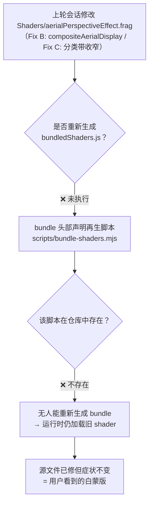

# 2026-08-22 体积云 shader 副本漂移修复（bundle 再生脚本补建 + 重同步）

- **日期与时间**：2026-08-22 19:38
- **任务等级**：L2（新增脚本文件 + shader 副本重生成，跨 3 处副本协同）
- **版本**：V3.5.28

---

## 问题分析

### 背景与发现时机

上一轮会话（同日 [2026-08-22-aerial-perspective-white-veil.md](2026-08-22-aerial-perspective-white-veil.md)）已完成空中透视白蒙版的 Fix A/B/C 源码修复并写了日志。本会话用户报告**症状依旧存在**（交界处覆盖地表、白蒙版遮蔽地面），要求检查逻辑链路。

### 事件逻辑链条

1. **运行时唯一真源是 bundle**：[shaderLoader.js](../../../frontend/src/domains/cesium/modules/cloud/lib/shaderLoader.js) 的 `loadShaderSource` 先查 `BUNDLED_SHADERS` 内联对象，命中即返回；fetch `Shaders/*.frag` 仅作未命中回退。改源 `.frag` 文件对运行时**零影响**。
2. **再生脚本缺失**：`bundledShaders.js` 头部注释写明「重新生成：node scripts/bundle-shaders.mjs」，但仓库内不存在任何同名脚本（根目录与 frontend/scripts/ 均无）。上轮会话改完源文件后无法、也没有执行 bundle 同步。
3. **三处副本漂移确认**（diff 实证）：源 `.frag` 含 `compositeAerialDisplay`/`SLOP=0.0016`/PCF gutter 等 V3.4.x 修复；bundle 中 `aerialPerspectiveEffect.frag` 全部缺失（仍是 `SLOP=0.014`、无统一 OETF 出口、硬阈值 0.35 cascade）；`public/cloud-atmosphere/shaders/` 镜像同样过期。

### 核心症状 → 根因归位

| 用户可见症状 | 旧 bundle 对应缺陷（上轮日志已分析，本轮实证为「未生效」而非「无效」） |
|---|---|
| 天空/地表交界覆盖地表、突兀 | `SHELL_SKY_DEPTH_SLOP=0.014` 宽带把远距地表误判为天空走直通分支，二次 OETF 形成灰白带 |
| 一层白白蒙版遮蔽地面 | 地面合成式把线性域 inscatter 直接加在 sRGB 编码色上 → 加性白雾 |
| 分支出口不一致 | 天空分支过 ACES+gamma、地面分支不过 → 相邻像素亮度突变 |

### 受影响模块

- 体积云/大气后处理链路全部 shader 消费端（AtmospherePostProcess、AerialPerspectiveEffect、sky.glsl）
- 生产构建同理受影响（bundle 随源码打包进 chunk）

## 修改内容

1. **新建再生脚本** [frontend/scripts/bundle-shaders.mjs](../../../frontend/scripts/bundle-shaders.mjs)：递归读取 `lib/AtmosphereFromThreeGeospatial/Shaders/` 下全部 `.glsl/.frag/.vert`（含 bruneton 子目录），CRLF→LF 统一后以 `JSON.stringify` 安全转义写入 `lib/shaders/bundledShaders.js`；头部 banner 更新为真实脚本路径并标注真源目录。
2. **重生成 bundle**：执行脚本，5 个 shader（aerialPerspectiveEffect.frag + sky.glsl + bruneton×3）全量重建；校验 bundle 中 aerial frag 与源文件逐字节一致。
3. **同步 public 镜像**：`public/cloud-atmosphere/shaders/` 5 个文件从真源覆盖（fetch 回退路径一致性）。

## 修改原因

修复代码已存在但被过期副本屏蔽，属于典型的「多副本无同步机制」事故。本次不仅恢复一致性，还**补上了机制缺口**（可再生成的脚本），使后续 shader 改动有明确同步动作可执行。

## 解决方案

方案对比：

- **A. 删除 bundle、只留 fetch 加载**：消除副本问题根源，但引入首屏 shader 网络请求依赖（bundle 内联的初衷是零请求 + SPA fallback 防 HTML 误注入），放弃。
- **B. 手工把修复段落粘贴进 bundle**：一次性生效但无机制保障，下次改源必然再漂移，放弃。
- **C. 补建再生脚本并执行**（选定）：恢复「真源 → 自动打包」单向数据流，脚本可重复执行、可进 CI。

实施步骤：建脚本 → 执行 → node 动态 import 校验 5 key 存在且 aerial frag 与源一致 → public 镜像覆盖 → 再次 diff 校验。

## 测试方案

### Agent 已执行

- `node frontend/scripts/bundle-shaders.mjs`：成功输出 5 个 shader 清单
- node 动态 `import()` bundle：4 个 bruneton/sky key 存在性校验通过
- `diff`（tr -d '\r' 后逐字节比较）：`SOURCE==BUNDLED ✓`（aerialPerspectiveEffect.frag）、`PUBLIC==SOURCE ✓`
- `git diff --stat`：bundledShaders.js 变更仅 aerial frag 条目 + banner，其余 4 个 shader 内容无漂移
- 门禁：CheckStructureTree ✅ / CheckConfigRegistry ✅（见交接块）

### 待用户实机验证

1. 开启体积云 → 默认画质档 → 天空/地表交界应无灰白蒙版带，地面清晰不发雾。
2. 面板拉高「空中透视强度」（groundAerialScale）→ 透视雾沿视线平滑淡入，scale=0 时画面严格等同关闭状态。
3. 相机贴地平线升降往返 → 无分支翻转闪烁。
4. （回归）BSM 云影、丁达尔光柱表现不劣化。

## 变更文件清单

| 文件 | 说明 |
|---|---|
| frontend/scripts/bundle-shaders.mjs | 新增：shader bundle 再生脚本（真源 → bundledShaders.js 单向打包） |
| frontend/src/domains/cesium/modules/cloud/lib/shaders/bundledShaders.js | 重生成：aerial frag 同步至 V3.4.x 修复态 + banner 更新 |
| frontend/public/cloud-atmosphere/shaders/*.frag、*.glsl、bruneton/*（5 文件） | 镜像同步：从 Shaders/ 真源覆盖 |

## 性能指标

不涉及（无运行时代码逻辑变化，仅 shader 副本内容对齐）。

## 影响范围

- 体积云模块空中透视/天空大气/BSM 地面云影/丁达尔渲染表现（向修复态收敛）
- 无 API、配置 key、数据库改动。

## 遗留与风险

- **机制风险仍在**：脚本不会自动执行，后续改 `Shaders/` 源文件若忘记跑 bundle 会复现同类漂移。建议未来接入 prebuild 钩子或 CI 校验（已记入 TODO）。
- `dist/cloud-atmosphere/shaders/` 为构建产物，随下次 build 自然更新，未手动触碰。
- 上轮日志所述 Fix A/B/C 本身未经实机验证（当时跑的是旧 bundle），本轮同步后需一并按其「待用户实机验证」清单回归。
