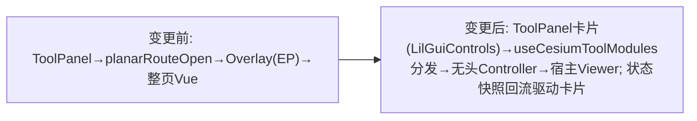

# 2026-08-22 面状航线重构为 toolPanel 模块卡片直驱 + 全量本地化

- **日期与时间**：2026-08-22（会话跨时段时间以提交为准）
- **任务等级**：L2（跨文件功能重构，无新增依赖；方案经用户会话内明确指示：抽参数配置 js + lil-gui 组装，不再保留浮层整页）
- **前置**：上一会话 V3.5.30 已将 planar-wayline 迁入并以「全屏浮层 + Element Plus 配置面板」方案接入（staged）；本会话按用户新范式重做接入层。

---

## 问题分析

- **核心症状**：
  1. 暂存区方案把源工程整页 Vue（PlanarRoute.vue 404 行 + ConfigPanel 711 行 + Element Plus）原样包成浮层，与 toolPanel「参数配置模块 js + LilGuiControls 组装」的既有范式相悖；
  2. 模块内 ~150 处用户可见文案硬编码中文，未接 i18n；
  3. 引入 element-plus/gsap 重依赖仅为一页 UI（vendor-element-plus gzip 252KB）；
  4. （迁移过程中暴露）`planarConfig.ts` 顶层 `Cesium.Cartesian3.fromDegrees(...)` 被新静态导入链拖进启动期求值，CDN 未就绪即抛 `[cesium-shim] window.Cesium 未就绪`，整个 Cesium 页无法打开。
- **根本原因**：浮层方案 = 整页搬运，UI/交互/消息全部绑死 Element Plus 与自有模板；而目标架构的模块层只允许「声明式控件 + 无头运行时」。
- **受影响模块**：toolPanel 模块注册中心、CesiumContainer、planar-route 模块全目录、i18n、vite 分包、依赖清单。

## 解决方案（对比与选型）

| 决策点 | 候选 | 选定 | 理由 |
|---|---|---|---|
| 接入形态 | A. 浮层整页(现状) / B. 面板控件直驱+无头控制器 | **B** | 用户指定范式；去 Element Plus；与 cloud/wind/player 同构 |
| 消息提示 | ElMessage / 项目 useMessage | **useMessage** | 项目统一 toast（@common/shell/useMessage），减重依赖 |
| 替换确认弹窗 | ElMessageBox / window.confirm | **window.confirm(t(...))** | 无头模式零 UI 依赖 |
| KMZ 文件选择 | el-upload / 动态 input[file] | **动态 input** | 控制器自包含，面板无需挂 DOM |
| 保存命名 | SaveAirlineDialog / 面板 text 控件 | **text 控件 + 会话缓存兜底默认名** | lil-gui 默认分支原生支持字符串输入框 |
| 起飞点拾取事件 | 复用 viewer handler+removeInputAction / 专用 handler | **专用 handler** | 共享 Viewer 下防止误删宿主左键逻辑 |

## 修改内容

1. **新增** `composables/toolModules/planarRouteModule.js`：声明式模块定义（12 个控件 + 4 个动作 + 动态 status/description 统计行），读 `globeConfig` 响应式单例 + `planarRouteState` 快照。
2. **新增** `modules/planar-route/planarRouteController.ts`（≈900 行）：承接 PlanarRoute.ts 全部业务——起飞点拾取开关、测区绘制/顶点拖拽/右键删除浮层（自管理 DOM）、recalculateRoute 规划编排、五向切换、KMZ 导入导出、destroy 全量清理；`emitState()` 上报快照。
3. **接线** `useCesiumToolModules.js`：懒创建控制器（Promise 化防丢首次点击）、action/control 分发、cleanupTools 销毁。
4. **接线** `CesiumContainer.vue`：移除 Overlay 挂载/watch/坐标浮层隐藏逻辑。
5. **图标** `CesiumToolPanel.vue`：planarRoute 四动作映射 MapPin/Upload/Download/Trash2。
6. **删除浮层遗留**（22 文件）：PlanarRoute.vue/.ts、PlanarRouteOverlay.vue、planarRouteUI.js、components/*（ConfigPanel/AircraftSelect/SaveAirlineDialog/CesiumMap/Icon）、utils/baseInstance.ts、utils/keyBinding.ts、9 个无用 svg/png；旧 `modules/planar-route/planarRouteModule.js` 一并由新范式取代。
7. **依赖瘦身**：package.json 移除 element-plus/@element-plus/icons-vue/gsap（lock 同步）；vite.config 移除 vendor-element-plus 分包规则（入口预加载清单同步）。
8. **本地化（全部用户可见文案 → `cesium.module.planarRoute.*` 两语言包 ≈150 key）**：模块卡片/控件/选项/提示/动作；utils/composables/config 内全部 throw 错误文案（规划计算 33 条、KMZ 导入 12 条、导出 14 条等）；实体名（拍摄/转场航段、角度指示、导入管线）；测区边长「米」单位；起飞点拾取提示；自相交警告条；导入缺省字段 warnings 9 条。**例外**：wpml/actionCodec 中文为 KMZ 文件格式载荷（司空生态约定），不做 i18n 并在结构树注明。
9. **启动崩溃修复**：planarConfig.ts 去 `import Cesium from 'cesium'`（类型改 `import type { Cartesian3 }`，`position` 字段改 `PLANAR_FALLBACK_POSITION_DEGREES` 运行时惰性转换）；comm.ts 同理（createTextCanvas 函数体内取 window.Cesium）。planarLine.ts 起飞点拾取改专用 ScreenSpaceEventHandler + 提示条挂 viewer.container（去 `.wayMap` 容器依赖）。
10. **文件名规范**：用户建的空文件实际落盘为小写 `planarRouteModule.js`（Windows 大小写不敏感掩盖），import/文档统一对齐 camelCase，避免 Linux 构建断裂。
11. **KMZ 导入接入统一图层管理（用户反馈补齐）**：
    - 新增数据类型 `wayline`：`cesiumLayers.ts` 透明度白名单放行（矢量 per-entity alpha 缩放复用）、ToolPanel 卡片图标（MapPin）与标签 i18n（`cesium.dataFormat.wayline`）。
    - 控制器新增 `onWorkingSetChange` 生命周期钩子：首次生成有效航线（含 KMZ 导入回填）时以固定 id `planar_route_working` 上报 `{present, name, dataSource}`；清除全部 / 控制器销毁时注销。命名取 面板航线名 > 会话缓存 > 本地化默认名。
    - `useCesiumToolModules.js` 注入 `syncPlanarSource` 桥 + 暴露 `detachPlanarWorkingSet`；`CesiumContainer.vue` 实现注册桥（仅增删 loadedDataSources 元数据记录，句柄由控制器自持）并在 adapter.remove 的 wayline 分支先调控制器 `detachForExternalRemoval()` 复位内部状态再走通用移除销毁句柄——从「数据」页签或 TOC 移除后控制器可安全重建全新数据源。
    - 起飞点实体（startPoint / air_start_point）改写入托管数据源 drawDataSource（原散落在 viewer.entities，显隐开关管不到）：planarLine.drawFlyStartLine 优先取同名 DataSource、渲染器 drawStartPoint 增加 container 参数；clearCurrentRouteState 相应收敛为 removeAll。
    - 效果：导入的航线在「数据」页签出现「航线 KMZ」卡片，支持 显隐/透明度（矢量缩放）/重命名/定位(flyTo 通用 DataSource 分支)/移除，且移除联动清空面板状态徽标。
12. **遗留项修复·动态颜色透明度**：`dataSourceDisplay.js` `applyColorScale` 原对 `isConstant=false` 的颜色属性直接跳过。改为包装缩放方案——`createScaledColorProperty` 以 CallbackProperty 包装原始属性，求值时 `withAlpha(alpha)`，保留 CZML 等时间动态语义；快照结构升级 `{constantOriginal|dynamicOriginal}`，包装器带 `__cesiumScaledFrom` 回指标记防二次包裹叠加；常量路径行为不变。
13. **遗留项修复·comm.ts 死代码清理**：删除无调用方的 6 个导出（debounce / createTextCanvas / formatSecondsToShortTime / calculateFOV / downloadJSONEnhanced / resetAirlineToInitialState），文件收敛为 downloadBlobFile / deepClone / getImg / svgToBase64 / generateUUID 五个存活函数；顶层保持零 cesium 导入。
14. **Code review 修复①**：`selectObliqueRoute` 切换五向航线后未 `emitState()`——LilGuiControls 值同步会把下拉弹回旧序号。已补上报。
15. **Code review 修复②**：`pickAndImportKmz` 取消选择时临时 `<input type=file>` 残留 DOM。补 `cancel` 事件监听统一清理。
16. **Review 复盘误删**：清理 comm.ts 时误删仍被 `wpml/orientedShoot.ts` 引用的 `generateUUID`，tsc 抓获后即补回（vite build 不做类型检查，未拦截）。

## 修改原因

对齐仓库工具面板既有「参数配置模块 js + LilGuiControls」范式；消除 Element Plus 重依赖；满足双语界面要求；修复共享 Viewer 架构下的启动期 Cesium 求值崩溃。

## 影响范围

- **鉴权/数据库/URL 参数/底图链路**：无
- **图层管理**：模块实体仍走独立 CustomDataSource，destroy 全量移除
- **构建**：删除 vendor-element-plus chunk（gzip −252KB）；新增 planarRouteController 懒加载 chunk（88KB/gzip 24.7KB）；vendor-planar-route 缩至 14.5KB
- **启动链路**：planar-route 参数层加入启动静态图 → 已加「顶层禁触 Cesium」约束并写入架构文档

## 性能指标

- 入口预加载清单减少一项；Element Plus 相关 chunk 完全消失（此前 gzip 252.29 KB）
- 面状航线功能代码全部位于懒加载 chunk：controller 24.71 KB gzip + vendor-planar-route 5.83 KB gzip

## 测试方案

### Agent 已执行
- `npx tsc --noEmit`：0 报错
- `npx eslint`（模块目录 + 改动文件）：0 error 0 warning
- `npx vite build`：成功（40.9s）
- `python CheckStructureTree.py`：458/458，漏登记 0 幽灵 0
- `python CheckConfigRegistry.py`：通过（无新增配置 key）

### 待用户实机验证
1. `npm run dev` 重启 → 打开 3D 地图（确认启动崩溃已消）→ toolPanel「模块」页签展开「面状航线」卡片。
2. 点「设置参考起飞点」→ 地图出现十字光标与顶部提示 → 单击落点后自动进入测区绘制 → 左键打点/右键结束 → 生成弓字形航线，卡片描述行出现面积/航长/用时/照片统计。
3. 调整控件（高度/速度/角度/重叠率/采集方式/高度模式）→ 航线即时重算；切「倾斜采集」出现云台俯仰角控件且可五向切换下拉（**重点：下拉切换后停留值不再回弹**）。
4. 「保存 KMZ」下载文件；再「导入 KMZ」→ 取消选择一次（确认无残留报错）→ 再确认替换弹窗后回填场景。
5. 数据页签「航线 KMZ」卡片：透明度滑杆拖动（测区填充/航线线应实时变淡）、显隐、双击重命名、定位、移除；移除后面板徽标回「待规划」，再次规划正常重建。
6. 切换 EN 语言 → 卡片与全部提示/错误文案变英文。
7. 回归：其它工具模块左键交互不被面状航线残留监听干扰；销毁后地图无残留实体。

## 变更文件清单

| 文件 | 说明 |
|---|---|
| frontend/src/domains/cesium/composables/toolModules/planarRouteModule.js | 新增：声明式模块定义（lil-gui 控件） |
| frontend/src/domains/cesium/modules/planar-route/planarRouteController.ts | 新增：无头运行时控制器（含工作集生命周期上报与外部删除复位） |
| frontend/src/domains/cesium/stores/cesiumLayers.ts | 透明度白名单 +wayline |
| frontend/src/domains/cesium/composables/toolModules/useCesiumToolModules.js | 注册/分发/清理改造 + syncPlanarSource 桥 |
| frontend/src/domains/cesium/components/CesiumContainer.vue | 移除浮层挂载 + 注册桥实现 + adapter.remove wayline 分支 |
| frontend/src/domains/cesium/modules/planar-route/utils/planarLine.ts、composables/useCesiumRenderer.ts | 起飞点实体收敛入托管数据源 |
| frontend/src/domains/cesium/components/CesiumToolPanel.vue | 四动作图标 + wayline 卡片图标/标签 |
| frontend/src/locales/zh-CN.js / en-US.js | planarRoute 全量键块 + cesium.dataFormat.wayline |
| modules/planar-route/{config,utils,composables}/ 15 个 ts | 本地化 + 去 EP + 启动安全加固 |
| frontend/src/locales/zh-CN.js / en-US.js | planarRoute 全量键块（≈150 key） |
| frontend/package.json / package-lock.json / vite.config.js | 移除 element-plus/gsap 及其分包 |
| 删除 22 文件（PlanarRoute*/components/baseInstance/keyBinding/8 图标等） | 浮层方案清退 |
| Docs/Guide/frontend-structure.md | 结构树同步（含 wpml 载荷说明） |
| Docs/Architecture/cesium-planar-route.md | 重写为面板直驱架构 + 踩坑约束 |
| README.md ×3 / CHANGELOG.md | 增量并入 V3.5.27（用户指令，不新增版本号） |

## 遗留与风险

- `utils/comm.ts` 的 `downloadJSONEnhanced/createTextCanvas` 为无调用方的历史函数（保留未删，遵守不越界清理边界）；已记入后续清理候选。
- `window.miniViewer` 死引用随 addStartPoint 重构一并消除（原 mini 相机分支无触发路径）。
- 仿地（AGL）仍依赖宿主开启地形服务（与源工程一致）。
- ⚠️ 未验证（需实机）：倾斜摄影五向切换下拉在真实 KMZ 导入后的选项回填顺序；EN 文案在窄面板下的换行表现。
