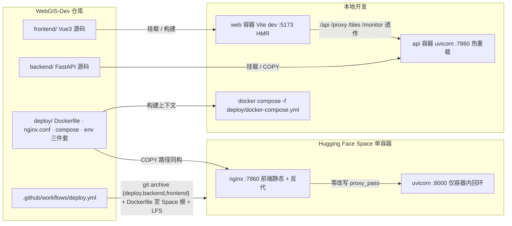

# 2026-08-23 部署架构重构暂存区审查与文档同步（全栈单容器 + deploy/ 收敛）

## 基本信息

- **日期与时间**：2026-08-23 19:25
- **任务等级**：L2（跨文档同步 + 门禁修复；重构主体为用户已完成的暂存区变更，本会话负责审查与收尾）
- **关联变更**：暂存区 18 文件（+552 / -284），部署架构级调整

## 问题分析

- **核心症状**：暂存区包含一次大规模部署架构重构，但配套文档（结构树、配置指南、交接文档、backend README）仍描述旧布局（根 .env*、根 docker-compose.yml、backend/Dockerfile、根目录门禁脚本），且门禁脚本 CheckConfigRegistry.py 报 3 处 F2 违规。
- **根本原因**：重构会话只改了代码与编排文件，未走完 Force_command DoD 的文档同步与门禁环节。
- **受影响模块**：部署链路（CI/HF Space/本地 compose）、配置加载（load.py / vite envDir）、门禁脚本路径、全部引用旧路径的指南文档。

## 重构内容概览（暂存区主体，非本会话产物）

1. **全栈单镜像** deploy/Dockerfile：node22 阶段构建 dist → python3.12-slim 运行时（nginx + uvicorn 同容器）；nginx :7860 对外总入口，后端顶级段（/api /proxy /tiles /monitor /health /docs /redoc /openapi.json）原样透传零改写至 127.0.0.1:8000；保留 cron+asyncio 双层 KeepAlive；HEALTHCHECK 走 nginx 全链路。
2. **环境文件收敛**：根 .env / .env.local / .env.example → deploy/；backend/config/load.py 查找优先级 deploy/ → 仓库根（历史兼容）→ 应用根；frontend/vite.config.js envDir 改指 ../deploy。
3. **本地编排** deploy/docker-compose.yml：api（复用全栈镜像仅跑 uvicorn 热重载）+ web（node 容器 Vite 真 HMR）+ app（--profile prod 生产仿真）。
4. **CI 第五步重写**（.github/workflows/deploy.yml）：git archive 组装 Space 根上下文 → git-lfs track 二进制 → 独立仓库 push 到 HF Space；删除旧的 subtree split + 临时 commit 注入 .env + reset --hard 链路。
5. **脚本归位**：CheckConfigRegistry.py / CheckStructureTree.py / UpdateReadmeTree.py → Scripts/（ROOT 改取 parent.parent）；LocalDev.bat 容器化改造（宿主 Node/npm 不再必需）。

## 架构关系图（变更后）

## 本会话修改内容

### 门禁修复

- deploy/.env.example：新增「开发工具链注入变量」登记段（注释形式）：VITE_DEV_PROXY_TARGET / VITE_WATCH_USEPOLLING / VITE_WATCH_INTERVAL——修复 CheckConfigRegistry [F2] 三处违规；修正头部失效表述「根目录 .env」→「deploy/ .env」、「envDir=仓库根」→「envDir=deploy/」（共 5 处）。

### 文档同步（SSOT 对齐）

| 文件 | 变更 |
|---|---|
| Docs/Guide/project-structure.md | 根级树新增 deploy/（7 项）与 Scripts/（3 项），移除根目录已删的 8 个条目 |
| Docs/Guide/backend-structure.md | 移除 backend 下已删除的 .dockerignore / .env / .env.local / docker-compose.yml / Dockerfile 五行 |
| README.md | 版本号三处（简介 / 版本演进表首行 / 页脚）；配置表与 L1 分层行改指 deploy/；本地镜像说明、配置指南描述更新 |
| Docs/Guide/configuration.md | 权威清单链接、启动命令、HF Secrets 说明、「相关文件」表（删除 frontend/backend env 存根两行——文件已不存在） |
| Docs/Guide/handover.md | 十分钟跑起来、新增 key 流程、门禁命令（Scripts/ 前缀） |
| Docs/Guide/dev-conventions.md | 登记 key 流程、门禁命令、LocalDev 启动说明 |
| backend/README.md | 配置清单链接 x2、容器挂载图与挂载表（../deploy/.env*）、docker compose 命令族（logs 服务名 api/web） |

### 代码审查结论（暂存区）

- 通过 deploy/Dockerfile：分层缓存合理（锁文件先行）、非 root 运行、临时目录指向 /tmp、HEALTHCHECK 经 nginx 全链路。备注：crontab 以 root 安装而脚本归 user——功能等价旧实现，可接受。
- 通过 deploy/nginx.conf：正则 location 与精确 location 优先级正确；^~ /assets/ 先于扩展名规则避免 add_header 覆盖；SSE 兼容参数齐全。
- 通过 deploy/docker-compose.yml：匿名卷隔离 node_modules/.venv；web 服务挂载 README+deploy 满足 vite.config 跨目录依赖；prod profile 与 HF 行为零差异。
- 待实机验证：vite dev 代理改为顶级段透传（/api 不再 rewrite 剥前缀），配合 .env.local 新值 VITE_BACKEND_URL=/ ——前端实际请求路径形态需实机确认（nginx.conf 注释称后端原生含 /api/ 段，理论自洽）。
- 说明：deploy.yml heredoc 生成 Space README 的 front-matter 使用 emoji——属 HF 平台元数据字段，不受 UI 图标规范约束。

## 修改原因

重构后的目录布局使全部旧路径引用失效；按 Force_command 第 4 节 SSOT 表与第 7 节 DoD，结构树、版本号、CHANGELOG、门禁必须同步，否则下一会话将基于错误地图工作。

## 影响范围

部署链路（本地 compose / HF Space / CI，文档层面）、配置体系（deploy/.env.example 登记表）、开发流程（门禁脚本调用路径 Scripts/ 前缀）。

## 解决方案

以 Python 脚本做精确字符串替换（replace_in_file 工具在本环境对中文 UTF-8 匹配不稳定，已降级处理并逐项验证）；所有替换均先 assert 原文存在再写入。

## 性能指标

不适用（无运行时代码改动）。未实测。

## 测试方案

**Agent 已执行**：
- python Scripts/CheckStructureTree.py → 结构树 459 = 459，漂移 0（通过）
- python Scripts/CheckConfigRegistry.py → 七项检查全部通过（修复 F2 后复跑）
- 全部替换脚本带 assert 前置校验，逐文件 grep 复核写入结果

**待用户实机验证**：
1. docker compose -f deploy/docker-compose.yml up -d --build —— 全栈镜像构建与 api/web 双服务启动
2. 浏览器开 http://localhost:5173 —— Vite HMR 生效、/api 代理连通（登录/瓦片/Agent 抽查）
3. docker compose -f deploy/docker-compose.yml --profile prod up -d app —— http://localhost:8080 行为与 HF Space 一致性
4. push 后观察 GitHub Actions sync-to-huggingface job 与 HF Space 构建日志

## 变更文件清单

| 文件 | 说明 |
|---|---|
| deploy/.env.example | 登记 3 个开发工具链注入变量 + 头部 5 处路径表述修正 |
| Docs/Guide/project-structure.md | 根级目录树重写（deploy/ + Scripts/） |
| Docs/Guide/backend-structure.md | 移除 backend 已删的 5 个部署文件行 |
| README.md | 版本号三处 + 配置表/L1 行/镜像说明/导航描述 |
| Docs/Guide/CHANGELOG.md | 顶部追加 V3.5.29 条目 |
| Docs/Guide/configuration.md | 权威清单/启动命令/相关文件表对齐 deploy/ |
| Docs/Guide/handover.md | 快速上手与门禁命令对齐 |
| Docs/Guide/dev-conventions.md | 登记 key 流程与门禁命令对齐 |
| backend/README.md | 配置链接、挂载图/表、compose 命令族对齐 |
| Docs/LLM_record/26-08/2026-08-23/2026-08-23-fullstack-deploy-refactor-review.md | 本日志 |

## 遗留与风险

- 前端请求路径形态（VITE_BACKEND_URL=/ + 无 rewrite 透传）未经实机回归，若后端某路由不含 /api 前缀将 404——实机验证项 2 覆盖。
- Docs/Architecture/cicd-pipeline.md / system-architecture.md / deployment-relationship.md 中关于 HF 后端部署的描述可能仍为 subtree 旧链路，本次未逐一核对（超出本次范围），建议下轮专项刷新。
- README「本地开发镜像」段落引用的 Docker Hub 镜像 negiao/webgis_dev:V3.5 为旧后端单镜像，与新全栈镜像 negiao/webgis 不同名，语义待用户裁决是否更新推送。
