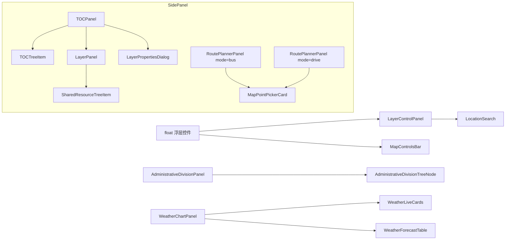

# 2026-08-23 全站 UI 设计语言统一重构 + 暂存区 Code Review

## 日期与时间

2026-08-23 16:40

## 任务等级

L2（跨多组件 UI 重构 + 合并组件 + 文档同步）

## 问题分析

- **核心症状**：全站各面板 UI 风格割裂——TOC 图层树、行政区划树、天气看板、罗盘面板、路线规划双面板、底图控制条、地图控制条各自为政；存在文字字符充当图标（`▾ ▸ ▼ × ••• ▶ ⋮⋮ ok`）、暗色主题残留色值（`#d2c9c9`）、深浅文字混排（LayerControlPanel 深绿容器内白字输入框）、原生 checkbox/select 直出等问题。
- **根本原因**：历史迭代中各面板由不同会话独立实现，无共享设计令牌约束；部分组件甚至未使用 `toc-theme.css` / `theme.css` 中已有的令牌。
- **受影响模块**：图层管理（TOC/共享资源/行政区划）、路线规划（公交+驾车）、天气看板、罗盘工具、地图浮层控件（底图切换/坐标条）。
- **候选方案**：① 引入第三方 UI 库统一重写——侵入性大、包体膨胀，否决；② 以既有 `toc-theme.css` 令牌体系为基准逐面板对齐——改动集中在 `<style>` 与模板图标层，业务逻辑零触碰。
- **选定方案**：方案 ②。以 TOCTreeItem 为图层树基准范式，向其余组件辐射；路线规划双面板按功能合并为单组件 `mode` 驱动。

## 修改内容

### 图层管理族
1. **TOCPanel.vue**：Tab 改滑动胶囊指示器（`--active-index` CSS 变量驱动）+ lucide 图标；绘制面板重构为「磁贴工具格 + 一体式 join-bar 输入条」；样式面板改色卡磁贴 + 渐变填充滑杆；渐变主色令牌 `--brand-gradient` 调亮为同色系 `#5ec773→#35a44f`（蓝主题 `#64b5f6→#1e88e5`）。
2. **TOCTreeItem.vue**：参考 ESRI ArcGIS 图层列表——checkbox 显隐改为行右侧 Eye/EyeOff 开关（文件夹半选态降透明度表达），隐藏行整体淡化；新增类型图标（Folder/FolderOpen/Layers）与拖拽把手；移除箭头占位符（VS Code 惯例）；右键菜单全量图标化（20+ 命令映射）；激活态强调条改伪元素消除布局抖动。
3. **LayerPanel.vue**：标题加渐变徽章 + 计数胶囊；搜索框胶囊化（聚焦柔光圈）；空状态图标化区分「无数据/无匹配」。
4. **SharedResourceTreeItem.vue**：文件行扁平化去描边盒；文件夹动态图标；与 TOC 树同构。

### 路线规划
5. **BusPlannerPanel.vue + DrivingPlannerPanel.vue → RoutePlannerPanel.vue（合并）**：`mode="bus"|"drive"` 双触发模式保留（SidePanel 两 Tab 各渲染一实例）；共享头部/取点卡/策略 join-bar/调试折叠框；差异收敛为配置（策略选项数组、按钮文案、debug 字段子集、结果区形态）；驾车配色接入全局 `--info/--info-rgb` 功能色令牌（原硬编码 `#2563eb/#55a9f2/#2e86dd` 已清除）。

### 天气看板
6. **WeatherChartPanel.vue**：工具栏去卡片化 + 渐变徽章（CloudSun）；刷新钮忙碌时图标旋转；查询改一体式输入条（Hash/MapPin 引导图标）；图表标题改主题色圆点。
7. **WeatherLiveCards.vue / WeatherForecastTable.vue**：全部硬编码绿色换 `--brand-primary-rgb` 令牌；元信息项去边框盒；预报表去网格线改行分隔 + hover 高亮。

### 其他面板
8. **CompassControlPanel.vue**：自绘拨动开关、分段控件替代 select、滑杆渐变填充、半径值智能格式化（m/km）、状态 chip 加圆点。
9. **AdministrativeDivisionTreeNode.vue**：同构对齐 TOC 树（类型图标/引导线/选中强调条/adcode 数值胶囊）；父面板关闭钮 `×` → X 图标。
10. **LayerControlPanel.vue**：深绿容器 → 浅色玻璃拟态；恢复紧凑两行布局（搜索行 + 主行）；全部文字字符图标化；图层显隐 checkbox → Eye/EyeOff；Cesium overlay 原生 checkbox → mini switch。
11. **MapControlsBar.vue**：浅色玻璃拟态换肤；内联 SVG → Copy/ChevronRight/House；主页按钮升级渐变实底圆钮（涟漪保留）；格式菜单小数位激活态渐变填充。
12. **LocationSearch.vue**：搜索图标 Search → Crosshair，去除硬编码色与过粗描边。

### 暂存区附带改动（非本会话产物，静态审查）
13. 后端 Docker 瘦身三件套：`.dockerignore` 增加 `data/`；Dockerfile 移除 `libgdal-dev/libgeos-dev/libgl1` 并加 `pip --no-cache-dir`；`pyproject.toml` 移除 `supabase` 依赖（`uv.lock` −1856 行）。已验证：backend 内无任何 `import supabase`，自研 SupabaseClient 位于 `api/statistics.py`，注释声称属实。⚠️ 运行时行为需实机构建验证。
14. **体积云 / shader 全链路**（补全审查）：① `scripts/bundle-shaders.mjs` 再生脚本逻辑健全——排序遍历保证确定性输出、LF 归一、缺失即漂移、陈旧镜像副本清理、`--check` 漂移 exit 1；② vite.config 求值期自动再生 + deploy.yml Build 前置 `shaders:check` 门禁接线正确；③ **实跑 `shaders:check` 通过：5 个 shader 的源码/bundle/public 镜像零漂移**；④ AtmospherePostProcess.js 曝光分支修复逻辑正确（sRGB 直通分支免乘曝光，仅 HDR 天空/地面合成保留）；⑤ cloudQualityPresets.js 为 layer2 高度/覆盖度参数调优；⑥ aerialPerspectiveEffect.frag 的 DEPTH_SKY_EPS=1e-7、skyPocket 判定、hitBottom 近交点钳制与文档描述一致；⑦ traffic.json 为 GitHub Actions 自动回写的访问统计。⚠️ GLSL 渲染观感（白蒙版/黄雾带收敛）需实机 Cesium 场景验证。

## 修改原因

多会话并行开发导致 UI 风格漂移；设计令牌（toc-theme.css/theme.css）已存在但未被一致引用；文字字符图标跨平台渲染不一致且无法适配主题色（违反 dev-conventions 图标规范的历史债）。

## 影响范围

- 图层管理链路（2D TOC / 共享资源 / 行政区划）
- 路线规划（SidePanel bus/drive 两 Tab 的 props 传递有调整：取点函数统一为 `start-point-pick`）
- 天气看板展示层
- 地图浮层控件（底图切换 / 坐标条）
- 后端镜像构建（非本会话，暂存区附带）

## 解决方案

以令牌体系为 SSOT 逐面板替换硬编码值；交互范式向 TOCTreeItem 收敛；合并重复组件时保留对外回调 prop 名以最小化父组件改动（仅 SidePanel 一处消费方）。

## 组件关系（Mermaid）

变更前后差异：BusPlannerPanel 与 DrivingPlannerPanel 两个平行组件收敛为 RoutePlannerPanel 单组件双实例，MapPointPickerCard 由两者共享复用。

## 性能指标

未实测（纯样式层改动；`uv.lock` 依赖精简由后端会话另行评估，理论减少约 36 个传递依赖 / 61MB 镜像体积）。

## 测试方案

| Agent 已执行 | 待用户实机验证 |
|---|---|
| `npm run lint` 全绿（唯一 warning 为 AdminControlPanel.vue 既有 v-html 提示，与本批无关） | ① 图层管理：Tab 切换滑动胶囊动画、眼睛显隐（含文件夹半选）、右键菜单各命令、绘制/样式面板所有控件 |
| `python CheckStructureTree.py` ✅ 457 文档条目 = 457 实文件，0 缺 0 多 | ② 公交/驾车规划：两地起终点选取→策略→规划→结果列表点击联动地图；驾车概览卡与彩色步骤条 |
| `npx vue-tsc --noEmit` 抽查 RoutePlannerPanel/SidePanel 无新增报错 | ③ 天气看板：刷新旋转、查询条、图表、预报表 hover |
| supabase 依赖清空声明：grep 全 backend 无 import | ④ 底图控制条：下拉选择、历史影像两页签、HD/经纬线开关、拖拽排序、右键菜单透明度；坐标条编辑跳转、复制、格式菜单 |
| | ⑤ 罗盘面板：三开关、模式分段、滑杆、颜色卡、GPS 按钮 |
| | ⑥ 后端：`docker build` 验证瘦身镜像可正常启动并完成一次 GIS 请求 |

## 变更文件清单

| 文件 | 说明 |
|---|---|
| frontend/src/domains/common/layer-tree/components/TOCPanel.vue | Tab 滑动胶囊 + 绘制/样式面板重构 |
| frontend/src/domains/common/layer-tree/components/TOCTreeItem.vue | ESRI 式行重构 + 菜单图标化 |
| frontend/src/domains/common/layer-tree/components/LayerPanel.vue | 标题徽章/搜索胶囊/空状态 |
| frontend/src/domains/common/layer-tree/components/SharedResourceTreeItem.vue | 扁平化 + 动态图标 |
| frontend/src/domains/common/shell/SidePanel.vue | 路线规划消费方切换至 RoutePlannerPanel |
| frontend/src/domains/ol/routing/components/RoutePlannerPanel.vue | 新增：双模式统一规划面板 |
| frontend/src/domains/ol/routing/components/BusPlannerPanel.vue | 删除（并入上者） |
| frontend/src/domains/ol/routing/components/DrivingPlannerPanel.vue | 删除（并入上者） |
| frontend/src/domains/common/weather/components/WeatherChartPanel.vue | 工具栏/查询条/图表标题重构 |
| frontend/src/domains/common/weather/components/WeatherLiveCards.vue | 令牌化 + 微交互 |
| frontend/src/domains/common/weather/components/WeatherForecastTable.vue | 元信息去盒 + 表格现代化 |
| frontend/src/domains/common/compass/components/CompassControlPanel.vue | 整体重写 UI 层 |
| frontend/src/domains/ol/components/AdministrativeDivisionTreeNode.vue | 对齐 TOC 树范式 |
| frontend/src/domains/ol/components/AdministrativeDivisionPanel.vue | 关闭钮图标化 |
| frontend/src/domains/ol/layer/components/LayerControlPanel.vue | 浅色玻璃化 + 图标化 + 紧凑两行布局 |
| frontend/src/domains/ol/search/components/LocationSearch.vue | Crosshair 图标 + 按钮反馈 |
| frontend/src/domains/ol/components/MapControlsBar.vue | 浅色玻璃换肤 + 图标化 |
| frontend/src/assets/theme.css | --brand-gradient 绿/蓝主题调亮 |
| Docs/Guide/frontend-structure.md | routing 组件树同步 |
| backend/.dockerignore / Dockerfile / pyproject.toml / uv.lock | （非本会话）Docker 瘦身，见上文审查 |
| frontend/scripts/bundle-shaders.mjs | （非本会话）新增 shader bundle 再生/校验脚本 |
| frontend/vite.config.js + package.json | （非本会话）求值期自动再生 + shaders/shaders:check 脚本 |
| .github/workflows/deploy.yml | （非本会话）Build 前置 shader 同步门禁 |
| frontend/src/domains/cesium/modules/cloud/**（4 文件）+ public 镜像 | （非本会话）白蒙版曝光修复 / 地形感知分类 / 三副本同步，shaders:check 实跑通过 |

## 遗留与风险

1. 后端 Dockerfile 移除系统级 GDAL/GEOS 后，若未来引入需要编译的 GIS 包可能构建失败——需在 CI/实机 build 时确认（⚠️ 未验证）。
2. `color-mix()` 用于 RoutePlannerPanel 驾车渐变派生，目标浏览器需 Chrome 111+/Safari 16.2+（项目现有 backdrop-filter 用法表明基线满足，但未做旧浏览器回归）。
3. 行政区划/共享资源树的选中/展开逻辑虽未触碰，建议实机点选一轮确认事件链路。
