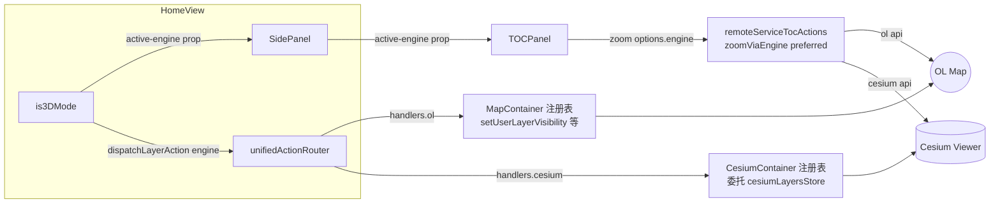

# 2026-08-25 统一图层管理架构重构 P0/P1 实施（V3.5.31）

## 日期与时间

2026-08-25 20:05

## 任务等级

L3（计划文档 `Docs/TODO/unified-layer-management-refactor-plan.md` 已由用户批准执行；P2 拆分批次待后续）

## 问题分析

- **核心症状**：3D 模式下 TOC 对在线服务的操作静默落到 v-show 隐藏的 OL 地图（F1/F2）；HomeView ~15 个 handler 硬编码调 OL。
- **根本原因**：SidePanel→TOCPanel 零引擎上下文（F8）+ 命令式 defineExpose 与 store-adapter 双模式并存（F3）+ zoom 引擎注册表固定 ol 优先。
- **受影响模块**：HomeView / SidePanel / TOCPanel / MapContainer / CesiumContainer / cesiumLayers store / remoteServiceTocActions。

## 架构关系（Mermaid）

变更前：HomeView 四个高频 handler 尾部硬编码 `mapContainerRef.value?.xxx`，3D 下静默落 OL；zoomViaEngine 固定 [ol, cesium] 顺序。变更后：engine 字段决定处理器表，OL/Cesium 各自注册与反注册，隐藏引擎不再被误调度。

## 修改内容

1. **P0-1**：SidePanel/TOCPanel 新增 `activeEngine` prop；HomeView 传 `is3DMode ? 'cesium' : 'ol'`。
2. **P0-2**：`remoteServiceTocActions.handleRemoteServiceTreeAction(evt, store, { engine })`；`zoomViaEngine(serviceId, preferredEngine)` 优先当前引擎、失败回退另一引擎。
3. **P0-3**：核验 identify 常驻绑定已由前置批次落地（轮询 + 无早退守卫），本轮零改动。
4. **P0-4 跳过**：`:L:` 复合 id 移除与现状路由协议冲突，依赖「子图层独立记录」专项先行——依据 Force_command §0 冲突裁决不静默施工。
5. **P1-1**：新增 `common/layer-tree/actions/unifiedActionRouter.js`（registerEngineHandlers / unregisterEngineHandlers / dispatchLayerAction / setCurrentEngine）。
6. **P1-2**：MapContainer 注册 ol 处理器五项（onUnmounted 反注册）；CesiumContainer 注册 cesium 处理器四项（剥 `cesium:` 前缀委托 cesiumLayersStore）并 expose `zoomToRemoteService`（useCesiumLayers 返回 adapter.flyTo 委托）。
7. **P1-3**：HomeView 四个高频 handler 切换 `dispatchLayerAction({ method, payload, engine: is3DMode?'cesium':'ol' })`；rsvc/区划早退分支保持不变。

### 同批审查修复（暂存区三维管线批次）

8. **P0 签名错配**：CesiumContainer adapter 以位置传参调用对象解构签名的 ops 处理器 → 调用空转；改为 `{ id, height }` / `{ id, mode }` 下发。
9. **P1 drag 载荷兼容**：TOCTreeItem drop 载荷变更为 `{ layerId:源, targetId:目标 }` 后，contextActionManager 与 rsvc 分流器两处消费方补 `targetId ?? layerId` 兼容读取，修复用户图层排序与在线服务排序静默失效。
10. **小修**：CesiumToolPanel 模块卡片 active 类重复条件 `success||success` → `success||info`；远程 Ion URL 默认值清空。

## 修改原因

执行已批准的统一图层管理重构计划 P0/P1 阶段：消除双引擎数据流分裂（F1/F2/F8），为 P2 的 TOCPanel 拆分扫清路由层障碍。

## 影响范围

- TOC 动作路由（在线服务 zoom / 用户图层显隐·透明度·移除·定位）
- 双引擎生命周期（router 反注册防 stale closure）
- CesiumToolPanel 模块卡片视觉状态

## 解决方案

见计划文档 §二/§三 与上文 Mermaid 图。选型理由：保留 defineExpose 兼容旧链路，仅将高频路径迁入 router，避免一刀切引发大面积回归。

## 性能指标

未实测（分发层为一等 Map 查找，纳秒级，无可感知差异）。

## 测试方案

### Agent 已执行
- eslint：本轮全部触碰文件 0 error
- vue-tsc --noEmit：0 新增类型错误
- 括号平衡自检脚本：HomeView script 块 final depth = 0

### 待用户实机验证（对应计划 P0/P1 验收清单）
- P0-#1~#6：2D 加载府谷服务 → 切 3D 自动渲染；3D 勾选子层/右键缩放（应飞 Cesium 相机而非隐藏 OL）/右键移除/点击查属性；2D↔3D 来回切状态一致
- P1-#4 回归：2D 模式用户图层显隐/透明度/移除/定位行为不变
- 拖拽回归：用户图层排序 + 在线服务排序（drag 载荷变更受影响面）

## 变更文件清单

- frontend/src/domains/common/shell/SidePanel.vue —— activeEngine prop 透传
- frontend/src/domains/common/layer-tree/components/TOCPanel.vue —— activeEngine prop + 分流器 engine 参数
- frontend/src/domains/common/basemap/remoteServiceTocActions.js —— zoomViaEngine 优先引擎 + 签名扩展 + drag 载荷兼容
- frontend/src/app/HomeView.vue —— SidePanel engine prop；四 handler 切 dispatchLayerAction；zoom rsvc 分支按引擎
- frontend/src/domains/common/layer-tree/actions/unifiedActionRouter.js —— 新增统一路由器
- frontend/src/domains/ol/components/MapContainer.vue —— ol 处理器注册/反注册
- frontend/src/domains/cesium/components/CesiumContainer.vue —— cesium 处理器注册/反注册 + expose zoomToRemoteService + adapter 签名修正
- frontend/src/domains/cesium/composables/layers/useCesiumLayers.js —— 返回 zoomToRemoteService 委托
- Docs/Guide/frontend-structure.md —— unifiedActionRouter.js 登记
- README.md / Docs/Guide/CHANGELOG.md —— V3.5.31 三处版本 + 条目

## 遗留与风险

- **P0-4 未实施**（协议冲突，依赖独立记录专项）：`:L:` 复合 id 维持现状
- **P1 Cesium 侧真实渲染缺口**：上传/绘制产生的数据若未经 dataImport 进入 Cesium，router 会警告 unsupported——3D 上传/绘制渲染属功能开发非路由范畴，记 TODO
- **P2 整批待办**：TOCPanel 拆分五模块 + 死代码清理（LayerPanel 6 props / TOCPanel 3 emits / SidePanel 2 中继）
