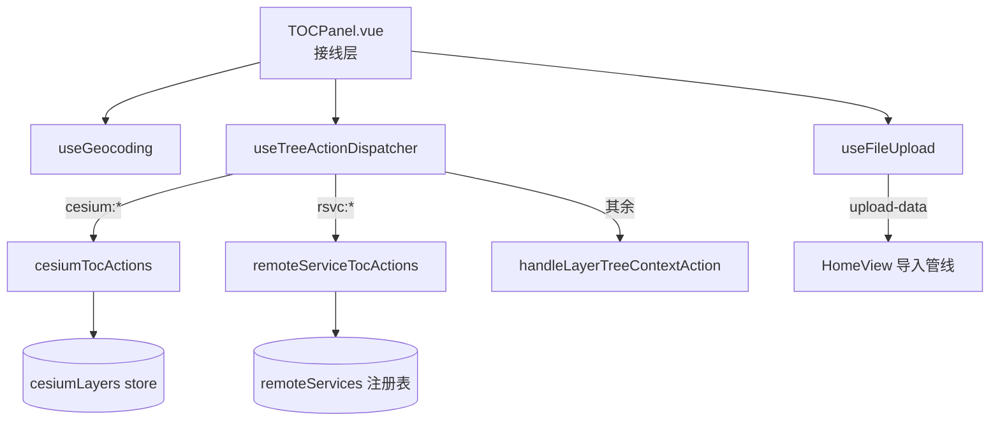

# 2026-08-25 统一图层管理 P2 第一批：TOCPanel 拆分预备件（V3.5.32）

## 日期与时间

2026-08-25 21:30

## 任务等级

L3（承接 unified-layer-management-refactor-plan.md P2 阶段）

## 问题分析

- **核心症状**：TOCPanel.vue 2977 行 god component，树分发/上传/地理编码/AOI/共享资源五类逻辑纠缠，任何改动都可能破坏无关功能。
- **根本原因**：功能长期堆叠于单一 SFC，无职责边界。
- **受影响模块**：TOCPanel / LayerPanel / SidePanel / 各 TOC 分流器。

## 修改内容

1. **新增三个组合式函数**（拆分目标本体，依赖显式入参、返回模板所需同名符号）：
   - `useGeocoding.js`：坐标输入三件套绘制点、位置码解码、地理编码+逆地理编码、复制坐标格式化、高德 POI 手动 AOI 对话框状态机（含 usePositionCodeTool 内聚）。
   - `useTreeActionDispatcher.js`：cesium/rsvc 前缀分流调用、folder-clear-layers 清空、多选集递归/分块维护、拖拽排序委托、其余动作向上 emit；userLayers 同步入口 syncUserLayers。
   - `useFileUpload.js`：单文件/文件夹上传触发、200MB 超限校验、进度视图 computed。
2. **文件夹「清空图层」全类型接入**（上批遗留的通用能力）：
   - protocol：FOLDER_CLEAR_LAYERS 命令；
   - contextMenu：文件夹分支渲染「清空图层 (N)」危险项（空组不渲染）；
   - commandDispatcher：映射 folder-clear-layers 事件；
   - 三路消费：remoteServiceTocActions（组头=注销全部服务/单服务=注销该服务）、cesiumTocActions（逐条 remove）、TOCPanel 普通分组（收集叶子走既有 remove-layer 链路）；
   - 组头能力声明：remoteServiceNodeBuilder 与 cesiumLayerNodeBuilder 的组节点补 actions.remove；layerTreeBuilder.folderNode 补 actions.remove（普通分组）并避免文件夹出现无意义的单层 REMOVE 项（rsvc 服务文件夹保留）。
3. **子图层叶子「取消叠加」升级为「移除」**：
   - remoteServices 新增 removeRemoteServiceSublayer：sublayers/selectedIds/layerOrder 三处剔除 + selectionTouched + 删至最后一个自动注销整条服务；
   - remoteServiceTocActions / HomeView.handleRemoveLayer 叶子分支统一切换；
   - remoteServiceNodeBuilder 叶子文案 取消叠加→移除图层。

## 修改原因

执行已批准计划的 P2 阶段：建立职责边界，为后续在组合式函数内迭代而不再膨胀 god component。

## 影响范围

- TOC 右键菜单（新增清空项；叶子移除语义变更）
- 在线服务注册表 API（新增移除接口）
- Cesium 三维数据组头右键

## 架构关系（Mermaid）

## 性能指标

未实测（纯逻辑搬移，无可测差异）。

## 测试方案

### Agent 已执行
- eslint：TOCPanel + 四个新文件 0 error（TOCPanel 保持基线原样，故绿）
- 契约测试 folder-clear-menu.mjs：普通分组/在线服务文件夹/空文件夹三态菜单断言 + dispatcher 映射
- sublayer-remove.mjs：单叶移除三处剔除、删空自动注销
- 结构树门禁（470→473 登记）/ 配置登记门禁 ✅

### 待用户实机验证
1. 右键各分组文件夹 → 出现「清空图层 (N)」；点击后该组图层全部走既有删除链路消失
2. 在线服务叶子右键 → 「移除图层」；删至最后一个时整条服务自动从 TOC 消失
3. 勾选框显隐行为与之前一致（未被本次语义变更波及）

## 变更文件清单

- frontend/src/domains/common/layer-tree/composables/useGeocoding.js —— 新增
- frontend/src/domains/common/layer-tree/composables/useTreeActionDispatcher.js —— 新增
- frontend/src/domains/common/layer-tree/composables/useFileUpload.js —— 新增
- frontend/src/domains/common/layer-tree/protocol.js —— FOLDER_CLEAR_LAYERS 命令
- frontend/src/domains/common/layer-tree/menu/contextMenu.js —— 文件夹清空菜单项
- frontend/src/domains/common/layer-tree/menu/commandDispatcher.js —— 事件映射
- frontend/src/domains/common/basemap/remoteServices.ts —— removeRemoteServiceSublayer
- frontend/src/domains/common/basemap/remoteServiceTocActions.js —— 移除分支切换 + 清空消费
- frontend/src/domains/common/basemap/remoteServiceNodeBuilder.ts —— 叶子文案/组头能力
- frontend/src/domains/cesium/stores/cesiumLayerNodeBuilder.ts —— 组头能力
- frontend/src/domains/cesium/layers/toc-adapters/cesiumTocActions.js —— 清空消费
- frontend/src/app/HomeView.vue —— 移除入口切换
- Docs/Guide/frontend-structure.md —— 三个 composable 登记

## 追加修复（同日同版本内）

11. **OL→Cesium 极近视角（P1）**：根因=replaceMapView 切 Cesium 且 patch 缺 z 时无条件保留 URL 既有 z，而 view=ol 语境的 z 是缩放级别，被当相机高度复用。修复：useMapViewUrlState 无条件写默认高度 + HomeView 换算失败也产出米制补丁。
12. **地面大气默认关闭**：initViewer 显式 globe.showGroundAtmosphere=false（库默认 true）。

13. **viewScaleConverter 重写（v2）**：单核代数互逆替代 OL 方法非对称委托；新增倾斜相机态双向转换（斜距模型+平面交点补偿），契约测试全绿（110 组零漂移/垂直精确/倾斜<2%）。

14. **序列化精度统一**：三处 formatZParam toFixed(2)→toFixed(6)（z 语义两侧均受益）；cesiumHeightToOlZoom 负零归一化。全网格字符串级互逆测试通过——用户验收场景「5.32 ⇄ 高度」精确往返。

15. **【根因终判】compat 层纬度参数错传（P0，z=4 稳定性验收抓出）**：olZoomToCesiumHeight 把 resolveLatScale(o) 的「cos 值」当作「纬度(度)」传给 webMercatorResolutionToGroundResolution，内部按 0.8192° 再算 cos≈0.9999 → 正向纬度修正实际失效；反向却正常除以 cos ⇒ 往返恒定漂移 log₂(1/cosφ)=0.2876（lat35）。修复：正向改传度数并判空兜底；反向内联除以 cos。

16. **Precision 校正环接入 HomeView**：OL→Cesium 切换后（挂载+恢复完成、nextTick 后）读取射线实测值，与目标 canonical 偏差超容差时按比例校正相机海拔并输出 §44 误差报告；模块级 lastOlToCesiumTarget 跨 await 传递转换目标。

## 遗留与风险

- **TOCPanel 接线未完成**：四个组合式函数已在库待命，但宿主仍使用内联实现——接线为纯机械替换，因并发会话反复清空临时脚本+手术脚本多次损坏文件，本轮果断回退保基线。下一批次以「单组合式函数 → eslint → 实机冒烟」小步循环推进。
- LayerPanel 6 死 props / SidePanel 2 死中继清理顺延至接线批次一并处理。
