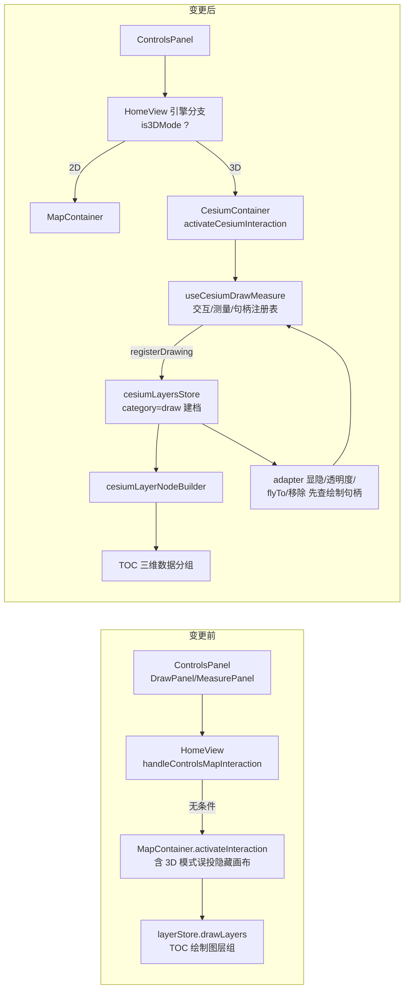

# 2026-08-26 — 绘制/测量引擎感知路由与三维绘制建档（V3.5.32）

- **日期与时间**：2026-08-26 14:20
- **任务等级**:L2

## 问题分析

### 核心症状
侧边栏（ControlsPanel 竖条工具栏）的绘制/测量面板在 3D 模式下依然可点击，但所有交互类型无条件路由到隐藏的 OL 地图（`HomeView.vue:519`），用户在三维场景点击绘制毫无反应；测量结果也只存在于不可见的 2D 画布。

### 根本原因
1. `handleControlsMapInteraction` 仅有 `ReverseGeocodePick` 一个引擎分支（HomeView.vue:509-516），其余类型一律 `mapContainerRef.activateInteraction(nextType)`；
2. Cesium 域不存在任何通用绘制/测距/测面能力（调研确认 toolModules 十个模块无 measure 类）；
3. OL 绘制结果经 `createManagedVectorLayer({sourceType:'draw'})` → user-layers-change → layerStore 进入 TOC「绘制图层」，Cesium 无对应建档链路。

### 受影响模块
`app/HomeView.vue`（路由分支）、`domains/cesium/components/CesiumContainer.vue`（能力暴露）、新增 cesium 绘制管理器、`domains/cesium/stores/cesiumLayers.ts` + `cesiumLayerNodeBuilder.ts`（TOC 建档）、locales。

### 候选方案对比
| 方案 | 说明 | 结论 |
|---|---|---|
| A. UI 门控禁用 | 3D 下隐藏/禁用绘制测量入口 | 不满足需求（用户要求可用并入 TOC），否 |
| B. 引擎感知路由 + 新建 cesium 绘制管理器 + 元数据入店 | 与 ReverseGeocodePick 同模式扩展；基础四类（点/线/面/清空/撤销）+ 测距/测面落地，高级图形明示不支持 | ✅ 选定 |
| C. 全量对齐 OL 高级图形（矩形/椭圆/箭头/军标…） | 工作量数倍且 3D 军标算法独立成体系 | 本期不做，记 TODO |

### 选定方案与实施步骤（B）
1. 新增 `cesium/composables/draw/useCesiumDrawMeasure.js`：ScreenSpaceEventHandler 交互（左击加点/移动预览/双击·右击结束），pickPosition→pickEllipsoid 取点链；测距用 EllipsoidGeodesic 表面距离（对齐 OL 水平距离语义），测面用 ENU 等距投影 shoelace；成品实体（贴地点/线/地面多边形+标签）登记入内存句柄表。
2. `cesiumLayers.ts`：记录增加 `category:'data'|'draw'`；`registerDrawing` 建档动作；syncFromImport 修剪豁免 draw 记录；remove 对 draw 类同步删档。
3. `cesiumLayerNodeBuilder.ts`：type 标签「绘制」、sourceType 区分。
4. `CesiumContainer.vue`：实例化管理器；adapter 五操作（显隐/透明度/flyTo/remove）先查绘制句柄再回落导入数据；expose `activateCesiumInteraction/updateCesiumDrawingStyle`；卸载与 viewer 重建时清理。
5. `HomeView.vue`：三个 handler 增加引擎分支（交互/样式/编辑动作），未支持类型 toast 提示。
6. i18n：新增 `cesium.interaction3dUnsupported`、`cesium.draw3dNoSelectionDelete` 中英文。

## 变更前后模块关系（Mermaid）

## 修改内容

（实施后回填）

## 修改原因

用户指令：绘制/测量需识别地图引擎并进入对应 TOC；消除 3D 下静默误投隐藏 OL 的缺陷。

## 影响范围

绘制/测量交互链路（双引擎）、TOC 三维数据分组、cesiumLayers 元数据店生命周期。

## 解决方案

见上文「选定方案」。

## 性能指标

未实测（交互为事件驱动单例 handler，无逐帧开销；测量计算仅在取点/结束时 O(n) 执行）。

## 测试方案

（收尾时回填）

## 变更文件清单

（收尾时回填）

## 遗留与风险

（收尾时回填）
