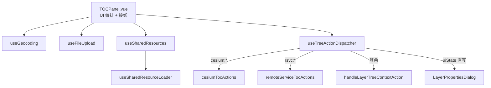

# 2026-08-26 统一图层管理 P2 第二批：TOCPanel 接线 + 死代码清理（V3.5.33）

## 日期与时间

2026-08-26 15:30

## 任务等级

L3（承接 unified-layer-management-refactor-plan.md P2 阶段，收口批次）

## 问题分析

- **核心症状**：V3.5.32 预备的四个组合式函数已在库待命，但 TOCPanel.vue（2977 行）仍使用内联实现；上一会话接线时因并发会话干扰文件多次损坏，果断回退保基线。
- **根本原因**：宿主与组合式函数之间存在语义差异未对齐——useFileUpload 的进度视图模型比模板所需少了 6 个字段且以非响应式快照接收 uploadProgress；dispatcher 内部 watch 与宿主 watch 重复同步。
- **受影响模块**：TOCPanel / LayerPanel / SidePanel / layer-tree composables。

## 修改内容

1. **TOCPanel 宿主接线**（2977 → 2327 行）：
   - 地理编码/AOI → `useGeocoding`；上传触发与进度 → `useFileUpload`；共享资源扫描/加载 → 新增 `useSharedResources`（包装 useSharedResourceLoader）；树分发/多选集/拖拽 → `useTreeActionDispatcher`。
   - 基础定义（emit/t/message/stores/tiandituTk/属性弹窗 refs）前置，composables 按依赖序调用，deps 引用函数声明提升。
   - `openAttributeTable`（RSVC 属性表）、样式编辑、绘制工具等 UI 编排保留于宿主。
2. **组合式函数修正**：
   - `useFileUpload.js`：改收响应式 `props` 对象（原为 `{uploadProgress}` 快照，prop 整体替换即失联）；进度视图还原为模板所需的富模型（phase/total/current/success/failed/warnings/errors/message）；导出 `MAX_FILE_SIZE_MB` 供模板提示文案使用。
   - `useTreeActionDispatcher.js`：移除内部重复 userLayers watch，暴露 `syncUserLayers(layers, overview)` 由宿主 watch 转调，保持「单次同步 + 多选修剪」原语义。
3. **死代码清理**：
   - LayerPanel 删除 7 个死 props（仅保留 selectedLayerIds，实际比计划多 1 个）；
   - TOCPanel 删除 3 个死 emits（show-layer-properties 改由 dispatcher 经 uiState 直写属性弹窗 refs，不 emit）；
   - SidePanel 删除 4 个死事件中继（计划 2 个 download 中继 + 同批顺延的 2 个 base-layer 中继）。
4. **i18n 补齐**：`layer.nothingToClear` / `layer.folderCleared` 中英文案（dispatcher 引用但词表缺失，会渲染裸 key）。

## 修改原因

执行已批准计划的 P2 收口：宿主只留 UI 编排，五类业务逻辑各归其位；接口面收敛（LayerPanel 8→1 props）。

## 影响范围

- TOC 全链路（上传进度条、地理编码三件套、AOI 弹窗、属性弹窗、多选清空）
- LayerPanel 组件接口（仅 TOCPanel 单点消费，无外部调用方）
- HomeView 的 set-base-layer 等监听成为永久静默（本就无触发方），未在本批删除

## 架构关系（Mermaid）

## 性能指标

未实测（纯逻辑搬移 + 死代码剔除；TOCPanel chunk 随源码缩减同步变小）。

## 测试方案

### Agent 已执行
- eslint：TOCPanel / LayerPanel / SidePanel / composables / locales 全部 0 error
- vite build 全量构建通过（模板引用与模块图完整性验证）
- 死 emits 全库 grep 反查：无任何 emit 方；HomeView 监听侧确认后保留不动

### 待用户实机验证
1. 上传文件/文件夹 → 超限提示与进度条（阶段文案、百分比、成功/失败计数）正常
2. 坐标绘制三件套（经纬度/P 参数码/地理编码）+ 高德 POI 自动弹 AOI 对话框
3. 图层右键「属性」→ 属性弹窗打开；「复制坐标」按格式化设置输出
4. 共享资源扫描/加载；文件夹右键「清空图层」；多选与拖拽排序
5. 2D/3D 切换后在线服务显隐/定位不受影响

## 变更文件清单

- frontend/src/domains/common/layer-tree/components/TOCPanel.vue —— 宿主接线 + 死 emits 清理
- frontend/src/domains/common/layer-tree/components/LayerPanel.vue —— 死 props 清理
- frontend/src/domains/common/shell/SidePanel.vue —— 死事件中继清理
- frontend/src/domains/common/layer-tree/composables/useFileUpload.js —— 响应式 props + 富进度视图
- frontend/src/domains/common/layer-tree/composables/useTreeActionDispatcher.js —— 移除内部 watch
- frontend/src/domains/common/layer-tree/composables/useSharedResources.js —— 新增
- frontend/src/locales/zh-CN.js / en-US.js —— 补齐 2 个 key
- Docs/Guide/frontend-structure.md —— composable 登记状态更新
- Docs/Guide/CHANGELOG.md —— V3.5.33 条目
- README.md —— 版本演进表 + 页脚版本号
- Docs/TODO/unified-layer-management-refactor-plan.md —— P2 状态与实施记录

## 遗留与风险

- HomeView 中 handleSetBaseLayer/handleToggleBaseLayerVisibility 已永久无触发方，可在后续批次随底图树专项一并移除。
- AOI 手动对话框组件本体位于 @ol/search/（AmapAoiInjectDialog），如需严格对齐计划的 components/AoiManualDialog.vue 需跨域搬迁，收益低暂缓。

## Code Review 补修（同会话，暂存区审查发现）

| 级别 | 问题 | 修复 |
|---|---|---|
| 🔴 高 | dispatcher 收到解构快照 `activeEngine`，引擎切换后不更新 → TOC 在线服务 zoom 仍优先隐藏 OL 地图（P0-2 回归） | TOCPanel 改传整个响应式 `props` |
| 🔴 高 | HomeView 四个高频操作按当前引擎分发 plain id；但 cesium:*/rsvc:* 已被上游全量消费，plain id 必为 OL 命名空间 → 3D 下操作 2D 遗留图层静默失效 + removeLayerById 造成元数据与地图脱钩 | 四处固定 `engine: 'ol'` 并注释路由依据 |
| 🟡 低 | setCurrentEngine/getCurrentEngine 无调用方；handleZoomLayer rsvc 分支无失败回退；CesiumContainer 注册块引用下方声明的 store（惰性求值安全但欠佳） | 记录在案，随后续批次处理 |

复验：eslint 0 error、vite build 通过、is3DMode 其余 24 处用法不受影响。

## 追加：三维数据图层管理收编统一 TOC（用户决策）

**背景**：用户指出 CesiumToolPanel data tab 内维护着第二套「已导入数据图层管理」（显隐/重命名/定位/移除/透明度/GLTF 重定位/TIF 拉伸/3D Tiles 高程与材质），要求收编到 SidePanel 统一 TOC，data tab 只留导入。

**设计**：节点契约早已预留扩展字段（heightRange/materialMode/actions.setHeight 等），本次补齐消费侧——
1. CesiumToolPanel 删除列表整块（-450 行）与采样链（request-range-sample 本就无人消费）；CesiumContainer 砍对应绑定。
2. TOC 右键菜单新增四项：调整高程（内嵌滑杆，复用 opacity 滑杆模式）、材质模式（内嵌下拉）、调整位置、拉伸至高程；protocol/commandDispatcher/TOCTreeItem 各补映射与渲染分支。
3. 动作落地：cesiumTocActions 空壳 → store 新增 requestReposition/requestStretchHeight → adapter 可选方法 → CesiumContainer 回填 ops 处理器（惰性引用，同 _rsvcSetHeight 先例）→ 既有 dataImport 实现，GLTF 弹窗零新组件。
4. 元数据闭环：record 补 baseHeight；setBaseHeight/setMaterialMode 回写 record；syncFromImport 建档投影高程初值（currentBaseHeight → tilesetGeo.initialBaseHeight/bottomH）与 ±100m 范围。

**遗留**：CesiumToolPanel 中 .data-source-*/.card-* 等死 CSS 约 300 行待专项清理；scene tab 的 noSceneActions 空状态与本任务无关未动。
