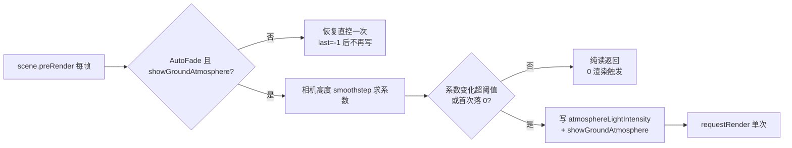

# 暂存区整合 Code Review（性能/逻辑）→ 统一版本 V3.5.34

## 日期和时间

2026-08-28 12:00

## 任务等级

L2（暂存区多批次不规范提交的整合 Code Review + 缺陷修复 + 版本归并 V3.5.35/V3.5.34 → 单一 V3.5.34）

## 问题分析（事件逻辑链条）

- **背景**：暂存区累计了三个批次的不规范提交内容（V3.5.34 天空大气光强修复、V3.5.35 HENU 矢量瓦片修复+服务端样式、未入账的地面大气高度渐隐与 Chat 配置面板改版），需按用户指令整合为统一版本 V3.5.34。
- **核心症状（本次 review 发现）**：见下方「修改内容」逐条。
- **根本原因（重点—Cesium 渲染性能）**：
  1. `updateGroundAtmosphereFade`（scene.preRender 每帧回调）中的节流条件 `if (fadeStep < 0.002 && factor !== 0) return;`——相机低于渐隐下限（市级以下视角，最常见的使用高度）时 factor 恒为 0，该条件**永远不成立**，导致每帧都写入 `globe.atmosphereLightIntensity/showGroundAtmosphere` 并调用 `scene.requestRender()`。在 `requestRenderMode` 按需渲染架构下，这等于**把按需渲染打回连续渲染**：空闲 CPU/GPU 占用回升、功耗上升，直接抵消 `useBrowserRecommendedResolution` 配套的省电兜底。注释本意是"factor=0 强制落盘避免节流吞掉最后一帧"，但缺少"仅首次落 0"的限定，变成了每帧落盘。
  2. `computeGroundAtmosphereBaseIntensity` 的硬钳位 `Math.min(base + moonBoost, 12.0)`：该钳位是在 `atmosphereLightIntensity` 基准值 5.5 时代设计的；本批改动把默认值提到 16 且滑杆 max=25，导致**滑杆 12 以上的全部行程被静默钳回 12**——与 V3.5.34"让参数真实生效"的修复目标自相矛盾。
  3. `vectorTileStyleAdapter` 两处边界：`line-dasharray` 若为 Mapbox 表达式形态（嵌套数组/操作符字符串），`.map(Number)` 会产出 NaN 传入 `Stroke.lineDash`（非法渲染状态）；`==/!=` 用严格 `===` 比较，而 MVT 二进制瓦片属性常以 string 编码（`_symbol: "0"`）与样式 JSON 数值字面量比较不命中 → 要素静默落兜底样式（不丢要素但样式错误）。
- **受影响模块**：Cesium 大气渲染链路（preRender 帧回调 / requestRenderMode）、OL 矢量瓦片样式适配器、底图 source 挂载链路、Chat 配置面板（仅文档归并，代码 review 通过）。

## 修改内容

1. 【性能修复】`CesiumContainer.vue updateGroundAtmosphereFade`：节流条件改为"系数未显著变化直接返回，仅从正系数首次落到 0 时强制落盘"——低空视角不再每帧写属性+requestRender，恢复按需渲染的空闲零开销。
2. 【逻辑修复】`CesiumContainer.vue computeGroundAtmosphereBaseIntensity`：钳位下限随基准值抬升为 `Math.max(base, 12.0)`，滑杆 12~25 行程恢复有效；月光增益仍受钳位控制不过曝。
3. 【健壮性】`vectorTileStyleAdapter.js`：`line-dasharray` 仅接受全有限数值的数组常量，表达式形态安全忽略（回退实线）。
4. 【兼容性】`vectorTileStyleAdapter.js`：新增 `looseEquals()` 宽松相等（类型不同但字符串化相等视为命中），`==/!=` 接入，对齐 Mapbox legacy filter 语义。
5. 【规范】`basemapLayerFactory.js` 补文件末尾换行（eol-last）。
6. 【注释失实】`useCesiumToolModules.js`：`showGroundAtmosphere: true` 的行尾注释仍写"关闭"，改为如实描述。
7. 【版本归并】README 三处 + CHANGELOG：V3.5.35 与 V3.5.34 两条合并为单一 **V3.5.34** 条目（含此前未入账的地面大气高度渐隐、`useBrowserRecommendedResolution: false`、Chat 配置面板折叠改版与模型选择语义修复），演进表补回 V3.5.32 行保持 3 行恒定。

## 修改原因

用户指令：暂存区代码为多次不规范 commit，需整合为统一版本 V3.5.34；重点审查性能与逻辑（尤其 Cesium 渲染性能），修复潜在 bug，同步文档与文件树。

## 影响范围

- Cesium 三维场景：地面大气高度渐隐（preRender 帧回调）、基础大气光强写入。
- OL 矢量瓦片：HENU 边界服务端样式适配（filter 求值 / line-dasharray 编译）。
- 文档：根 README、CHANGELOG、本日志；版本号机器读取源（vite.config.js 正则）同步更新为 V3.5.34。

## 优化解决方案

- 节流修复采用"状态无关幂等"思路：写属性前先比较缓存系数，仅变化超过阈值（或首次落 0）才落盘，保证任何静止视角下 preRender 回调都是纯读、零渲染触发。
- 钳位修复选择"下限抬升"而非"提高上限到固定值"：既尊重用户显式调节（≤25），又保留月光增益叠加时 12 的软顶防过曝语义。
- `looseEquals` 刻意不用 JS `==`（规避 `0 == ""` 陷阱），用字符串化比较并保留 `null/undefined` 不等语义。

### 变更数据流（Mermaid）

## 性能指标

- 修复前（低空静止视角）：preRender 每帧写 2 个 globe 属性 + 1 次 requestRender → 空闲状态下渲染循环持续运行。
- 修复后：同一视角系数恒定 → 每帧早退（几次数值比较），渲染循环按 requestRenderMode 完全休眠。具体 FPS/功耗数据未实测，待用户实机验证。

## 测试方案

**Agent 已执行**：
- `npx eslint`（改动文件：CesiumContainer.vue、vectorTileStyleAdapter.js、basemapLayerFactory.js、useCesiumToolModules.js）无新增错误。
- `python Scripts/CheckStructureTree.py`、`python Scripts/CheckConfigRegistry.py` 门禁通过。

**待用户实机验证**：
1. 3D 视图：相机降到市级以下静止不动 → FPS 面板应回落到空闲低值（修复前会持续满帧渲染）；缓慢拉升过 100~500km 渐隐区间，地面大气平滑出现。
2. 大气面板把「大气光强」调到 20 → 地面大气光晕应明显比 12 时更亮（修复前 12 以上无变化）。
3. 2D 视图切"HENU边界矢量" → 黑主线/紫晕线/未定国界虚线仍正常（filter 宽松相等不改变当前服务的命中结果）。

## 变更文件清单

| 文件 | 说明 |
|---|---|
| `frontend/src/domains/cesium/components/CesiumContainer.vue` | 节流条件修复 + 光强钳位修复 |
| `frontend/src/domains/ol/basemap/composables/vectorTileStyleAdapter.js` | line-dasharray 表达式防护 + 宽松相等 |
| `frontend/src/domains/ol/basemap/composables/basemapLayerFactory.js` | 补 EOF 换行 |
| `frontend/src/domains/cesium/composables/toolModules/useCesiumToolModules.js` | 注释失实修正 |
| `README.md` / `Docs/Guide/CHANGELOG.md` | V3.5.35→并入 V3.5.34 归并 |
| `Docs/LLM_record/26-08/2026-08-28/2026-08-28-feat-vectortile-server-style.md` | 版本号表述同步 |
| `Docs/LLM_record/26-08/2026-08-28/2026-08-28-code-review-staged-v3534.md` | 本日志（新增） |

## 遗留与风险

- `useBrowserRecommendedResolution: false` 在 HiDPI（150%）下交互期像素填充成本约 ×2.25，属"清晰度换性能"的显式取舍；已确认 requestRenderMode 空闲兜底仍在，保留不改。
- `applyBasemapSourceToLayer` 无 map 实例时重建的图层由调用方自行挂载（当前两条调用链均已注入 map，风险低）。
- 本地分支落后 `origin/main` 3 个提交（可 fast-forward），git 操作全部留给用户决策。
