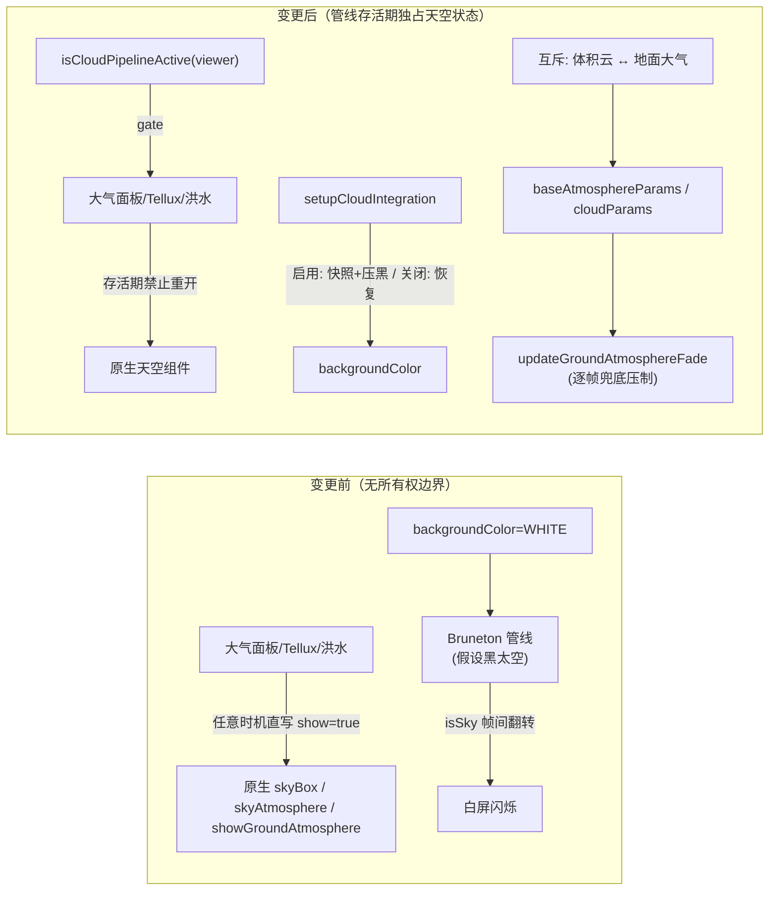

# 2026-08-29 修复体积云天际线白屏闪烁 + 体积云↔地面大气互斥 + 天空状态旁路封堵

**日期和时间**：2026-08-29 09:40

**任务等级**：L2

## 问题分析（阶段一产出）

**事件逻辑链条**：

1. **核心症状**：开启体积云后，近地面/天际线掠射带白屏闪烁；三个关键观察——①关闭 Bruneton sky（`atmosphereStageEnabled=false`）不闪；②（改动前）操控大气面板任意控件后不闪；③手动关闭原生地面大气后不闪。

2. **排查过程**（含红鲱鱼排除）：
   - 初步假设"双地面大气叠加"（Bruneton Aerial + Cesium 原生 `globe.showGroundAtmosphere`），实施互斥开关后实测**仍闪**——该假设被证伪（互斥逻辑保留，属用户明确要求的独立行为规范）；
   - 关键线索③"操控面板就不闪"为**红鲱鱼**：真实机制是 `applyBaseAtmosphereParams` 的副作用——面板任何参数变动都会写 `scene.skyBox.show = params.skyBoxShow`（默认 true），星空盒重开把画布背景从纯白换成暗色，闪烁不可见；治好的从来不是地面大气开关；
   - 关键线索①"关 Bruneton sky 不闪"定位翻转发生在 AtmospherePostProcess/Aerial stage 的天空/地面像素分类启发式。

3. **根本原因**：应用启动时设 `scene.backgroundColor = WHITE` + `skyBox.show = false`（CesiumContainer.vue `initViewer`），而 Bruneton 管线（移植自 three-geospatial）全部启发式假设太空是黑的：
   - AtmospherePostProcess 掠射带 `eyePos.z` 深度抖动 → `hasScene`/`isSky` 帧间翻转 → Bruneton 天空辉光 ↔ 白底透传交替 = 白屏闪烁；
   - 其"天际线黑带救援"分支（`lum < 0.04` 拉回天空）在白背景下永不命中——原库设计中该救援依赖透传像素为黑色。

4. **受影响模块**：体积云管线（cloud/lib）、CesiumContainer 初始化与大气参数应用、大气面板参数链、Tellux 大气（cesiumAtmosphere.js / CesiumAdvancedEffects.vue）、洪水模拟（FluidSimulationPanel.vue）、体积云面板参数分发。

5. **候选方案对比**：
   - A. 改管线 shader 启发式适配白背景——侵入移植库核心逻辑，后续同步上游困难，否决；
   - B. 管线存活期间压黑画布背景 + 恢复设计假设——最小侵入、命中根因，**选定**；
   - C. 仅靠互斥开关——已实测无效，否决。

6. **附带发现（旁路排查）**：管线存活期间存在 3 类旁路会把原生天空组件重新打开（面板副作用、Tellux 启用/恢复、洪水模拟启动/恢复），均会复现白闪或双大气，需一并封堵。

## 修改内容

1. **根因修复（背景色接管）**：`setupCloudIntegration.js` 的 `applySkyOwnedByPipeline` 在管线启用时把 `scene.backgroundColor` 压黑（Bruneton 设计假设）；`captureSkyState` 快照增加 `backgroundColor`；`restoreSkyState` 关闭/卸载时恢复原色。

2. **体积云 ↔ 地面大气双向互斥**（`useCesiumToolModules.js`）：
   - `handleCloudsEnabledToggle`：开体积云 → 记录 `showGroundAtmosphere` 当前值并关闭（面板开关同步熄灭）；关体积云 → 恢复开启前状态；
   - `handleGroundAtmosphereToggle`：手动开地面大气 → 自动关闭体积云；
   - Tellux 主开关 `atmosphereEnabled` 纳入互斥（其启用路径硬写 `globe.showGroundAtmosphere = true` 等效开地面大气）。

3. **逐帧兜底**（CesiumContainer.vue `updateGroundAtmosphereFade`）：体积云存活期间，任何旁路直写 `globe.showGroundAtmosphere = true` 均被 preRender 回调压制回 false（UI 参数不动，关体积云后自动放行）。

4. **天空状态旁路封堵**（`isCloudPipelineActive(viewer)` 查询接口，WeakSet 实现，管线就绪/销毁/失败路径同步 add/delete）：
   - `CesiumContainer.vue` `applyBaseAtmosphereParams`：管线存活期间跳过 `skyBox.show` 写入（面板高频路径）；
   - `cesiumAtmosphere.js`：`configureSolarLighting`（skyBox）、`configureRealisticAtmosphere`（skyBox + skyAtmosphere.show + showGroundAtmosphere）、`restoreRealisticAtmosphere`（skyBox/skyAtmosphere show 类写入）全部门控；
   - `CesiumAdvancedEffects.vue` `restoreAtmosphereState`：Tellux 恢复路径的 skyAtmosphere/skyBox show 写入门控（色调/亮度等纯渲染参数不门控，无副作用）；
   - `FluidSimulationPanel.vue`：`prepareScene` 与 `restoreScene` 的 skyAtmosphere.show 写入门控；
   - **整合 Review 补强**：`restoreScene` 的 `showGroundAtmosphere` 快照恢复补 `!isCloudPipelineActive(viewer)` 门控（原实现遗漏，与同函数 skyAtmosphere 守卫不对称；洪水模拟期间开启体积云后结束模拟会把快照旧值写回，存在单帧双大气窗口，此前仅靠 preRender 逐帧兜底压制）。

5. **注释标注**：`cloudQualityPresets.js` 流畅档 `aerialStageEnabled` 处补一行用户排查标注注释。

## 修改原因

- 白屏闪烁为用户可感知的严重视觉缺陷，且首因修复（背景压黑）前所有面板操作都偶发触发/消除，行为不可预期；
- 体积云与原生地面大气双开属架构性双重渲染（两套大气模型处理同一批地面像素），用户明确要求互斥为长期行为规范；
- 旁路不封堵则任何修复都会被偶发重开击穿——天空状态的所有权必须在管线存活期间归管线独占。

## 影响范围

- 体积云管线（cloud/lib）生命周期与天空所有权；
- 大气面板全部参数应用链路（CesiumContainer）；
- Tellux 大气启用/恢复链路（cesiumAtmosphere.js、CesiumAdvancedEffects.vue）；
- 洪水模拟场景准备/恢复链路（FluidSimulationPanel.vue）；
- 云面板参数分发（useCesiumToolModules.js handleToolControlChange cloud/atmosphere 分支）。

## 解决方案

**方案**：B（背景接管）+ 互斥规范 + 穷举旁路门控，三层防御：

```
第一层（根因）：管线存活 → backgroundColor 压黑（匹配 Bruneton 黑太空假设）
第二层（规范）：体积云 ↔ 地面大气/Tellux 双向互斥（参数层，面板 UI 同步）
第三层（兜底）：preRender 逐帧压制 + isCloudPipelineActive 门控全部旁路写入点
```

**架构关系（变更前后对比）**：



**实施步骤**：① setupCloudIntegration 背景快照/压黑/恢复 + isCloudPipelineActive 导出 → ② useCesiumToolModules 互斥函数与分发接线 → ③ CesiumContainer 渐隐回调兜底 + applyBaseAtmosphereParams 门控 → ④ cesiumAtmosphere/CesiumAdvancedEffects/FluidSimulationPanel 旁路门控 → ⑤ node --check 逐文件语法验证。

## 性能指标

- 未实测（无前后可比对数据）。理论影响：preRender 回调新增一个布尔判断（WeakSet.has）+ 条件赋值，可忽略；背景压黑无额外渲染开销。

## 测试方案

- **Agent 已执行**：
  1. `node --check` 语法校验通过：useCesiumToolModules.js、setupCloudIntegration.js、cloud/index.js、cesiumAtmosphere.js（4/4 OK）；
  2. IDE 诊断核查：FluidSimulationPanel/CesiumAdvancedEffects 新增 import 后无 Error 级（仅既有 JS 无声明文件 Hint，与全文件既有情况一致）；
  3. 全域 grep 复核：`showGroundAtmosphere = true` / `skyBox.show = true` / `skyAtmosphere.show = true` 写入点全部带 `isCloudPipelineActive` 门控（剩余命中均为已门控行）；
  4. `cloudsEnabled` 全项目写入点唯一性确认（仅面板分发一处，互斥闭环无竞态）。
- **待用户实机验证**：
  1. 开启体积云 → 大气面板「地面大气」开关自动熄灭，近地面/天际线不再白屏闪烁（核心验收）；
  2. 关闭体积云 → 地面大气恢复开启前状态；
  3. 体积云开启状态下：拖动大气面板任意滑杆、开/关洪水模拟、切 Tellux 大气开关——均不触发白闪复现或天空叠加；
  4. 手动开地面大气 → 体积云自动关闭（面板开关即时反映）；
  5. 关闭体积云后背景恢复纯白（与改动前关闭状态一致）。

## 修改的文件路径

- `frontend/src/domains/cesium/modules/cloud/setupCloudIntegration.js` — 背景色快照/压黑/恢复；`isCloudPipelineActive` 导出（WeakSet 注册/注销）
- `frontend/src/domains/cesium/modules/cloud/index.js` — 出口追加 `isCloudPipelineActive`
- `frontend/src/domains/cesium/composables/toolModules/useCesiumToolModules.js` — 体积云↔地面大气双向互斥 + Tellux 开关纳入互斥
- `frontend/src/domains/cesium/components/CesiumContainer.vue` — import 查询接口；`applyBaseAtmosphereParams` skyBox 门控；渐隐回调逐帧兜底压制
- `frontend/src/domains/cesium/composables/scene/cesiumAtmosphere.js` — configureSolarLighting / configureRealisticAtmosphere / restoreRealisticAtmosphere 天空写入点门控
- `frontend/src/domains/cesium/components/CesiumAdvancedEffects.vue` — Tellux 恢复路径天空 show 门控
- `frontend/src/domains/cesium/modules/fluid-simulation/FluidSimulationPanel.vue` — 洪水 prepareScene/restoreScene skyAtmosphere 门控；整合 Review 补强 showGroundAtmosphere 恢复门控
- `frontend/src/domains/cesium/modules/cloud/cloudQualityPresets.js` — aerialStageEnabled 排查标注注释（1 行）

## 文档同步说明

- **版本归并（2026-08-29 整合 Code Review）**：本批次原临时编号 V3.5.36，与下拉修复（V3.5.35）同属暂存区多批次，经审查归并为**单一版本 V3.5.35**（先例：V3.5.34 归并模式）；
- 根 README：项目简介当前版本 → V3.5.35；「版本演进」V3.5.36 与 V3.5.35 两行归并为单行、保留最近三个版本（V3.5.35/34/33）；页脚版本行同步；
- `Docs/Guide/CHANGELOG.md`：V3.5.36 条目并入 V3.5.35 单一条目（含归并说明与审查日志链接）；
- 整合审查日志：`Docs/LLM_record/26-08/2026-08-29/2026-08-29-code-review-staged-v3535.md`；
- 无代码文件新增/删除、无目录调整，结构树无需同步；无新增配置 key，登记表无需改动。

## 遗留与风险

- **Bruneton 管线黑背景下视觉变化**：体积云开启期间深空为纯黑（与原生白背景观感不同），属 Bruneton 物理大气的设计语义（太空即黑），如需星空需后续在管线内叠加星空渲染（未实现，仅记录）；
- **互斥为参数层约定**：若未来新增直接写 `cloudsEnabled`/`showGroundAtmosphere` 的代码路径（绕过 handleToolControlChange），需同步接入互斥或 `isCloudPipelineActive` 门控——已记入 memory；
- ⚠️ 未验证：WebGL 实机渲染效果（Agent 无实机环境），核心验收项待用户回归。
