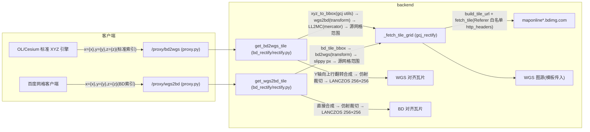

# 2026-09-02 百度 BD-09 瓦片纠偏代理（/proxy/bd2wgs、/proxy/wgs2bd）

- **日期与时间**：2026-09-02（跨会话任务，本会话完成数学修复与实施）
- **任务等级**：L2
- **版本**：V3.5.37

## 问题分析

**核心症状**：初版实现（临时验证脚本）按「球面墨卡托 + res=2^(18-z)」计算百度瓦片索引，z16 天安门瓦片实际内容为土井村/中关村公园西区（~116.27E, 40.03N），系统性偏西北约 12 km；z12 四邻瓦片复核同样偏移（沙河水库/高丽营/蟒山等地物全部西北偏移）。

**根本原因**：百度 BD09MC **不是精确球面墨卡托**，而是 JS API v2.0 中的 LL2MC/MC2LL 分段多项式拟合（按 |lat| / |mercator_y| 分带，每带一条六阶多项式；x 方向 111320.7 m/度而非球面 R·π/180=111194.93）。北京纬度（37.5≤lat<52.5 带）下，球面公式与官方多项式的偏差约 x +15 km / y −23 km，与实测偏移方向、量级吻合。瓦片网格数学本身（`tile = floor(mc/(256·2^(18-z)))`，Y 轴向上）正确，无需改动。

**受影响模块**：`backend/bd_rectify/`（新增）、`backend/api/proxy.py`（新增路由）、`backend/utils/http_headers.py`（Referer 白名单）。

**候选方案对比**：
1. 逆向拟合偏移补偿 → 治标不治本，不同纬度偏差非定值，放弃；
2. 采用开源权威实现 `CntChen/tile-lnglat-transform`（自百度 JS API v2.0 抽取的 LL2MC/MC2LL 多项式，含官方确认的南半球分带 bug 修正）→ **选定**；
3. 引入 Python 库（如 bd py SDK）→ 增加依赖且无瓦片网格数学，放弃。

**关键几何结论**：BD 网格与标准 XYZ 网格既不平移等价也不分辨率等价——BD `res(z)=2^(18-z)` 真米/像素，标准 XYZ `res(z)=156543.03·cosφ/2^z`（赤道米/像素），北京地区 `z_bd ≈ z_out+1`、`z_src ≈ z_out−1` 时分辨率对齐。因此**双向纠偏都必须跨网格**：拉源网格 → 拼接 → 像素级仿射框裁切 → LANCZOS 缩放 256×256。这与 gcj 纠偏（两网格共形、同索引直接换 bbox）有本质差异。

## 修改内容

1. **新增 `backend/bd_rectify/mercator.py`**：官方 LL2MC/MC2LL 系数表与多项式求值；`bd_res`、`bd_lonlat_to_px`、`bd_lonlat_to_tile_px`、`bd_tile_bbox`。
2. **新增 `backend/bd_rectify/rectify.py`**：`get_bd2wgs_tile`（输出标准 XYZ 瓦片 ← 百度源网格，Y 轴向上行翻转合成 + 仿射裁切缩放）、`get_wgs2bd_tile`（输出百度网格瓦片 ← 标准 XYZ 源）；复用 `gcj_rectify` 的 `_fetch_tile_grid`（并发/重试/字节护栏/瓦片文件缓存）、`_tile_cache_path`、`_save_tile_bytes`、`_merge_tiles`；bbox 转换采用四角逐点取极值。
3. **新增 `backend/bd_rectify/__init__.py`**。
4. **`backend/api/proxy.py`**：新增 `/proxy/bd2wgs/{target_url:path}` 与 `/proxy/wgs2bd/{target_url:path}`，完全镜像 gcj 路由模式（内存 TTL 缓存、SSRF/限流依赖、异常分级 400/502/504），注册在通用代理路由之前。
5. **`backend/utils/http_headers.py`**：Referer 白名单新增 `"bdimg.com": "https://map.baidu.com/"`（百度瓦片防盗链，此前临时脚本实测必须携带）。

## 修改原因

前端需要原生百度底图时，BD-09 瓦片与 WGS84 数据层存在整体偏移与网格差异；需后端代理在瓦片级完成 BD09MC ↔ 标准 XYZ 的跨网格重采样，与既有 gcj2wgs/wgs2gcj 体系对齐，保持「URL 前缀式纠偏代理」统一契约。

## 影响范围

- 后端代理路由（新增 2 条，不影响既有路由匹配顺序）；
- 瓦片出站面（bdimg.com 域名新增 Referer 附加，仅影响出站百度请求）；
- 磁盘缓存（复用 `gcj_rectify_cache` 目录，新增 `bd2wgs`/`wgs2bd`/`source-bd` 分类子目录）；
- 配置面：**无新增配置 key**（资源护栏沿用 `GCJRE_*` 既有配置，经 `gcj_rectify.rectify` 共享）。

## 解决方案

数学修复先行：重写临时验证脚本改用官方多项式 → 往返自洽（<1e-7°）→ z16 地标对齐（天安门城楼落于预测像素位 (117.4, 38.2)，金水河/长安街/端门/广场全部就位；此前会话取的 z12 (790,296/297) 实为偏北 2 格，正确索引为 (790,294)）→ 再实施后端 → 函数级 E2E 双向目视验证。

跨网格纠偏数据流：

## 性能指标

未实测（单瓦片纠偏涉及 z+1 级 2×2~3×3 网格拉取 + 一次 LANCZOS 重采样，量级与 gcj 纠偏相当；带内存 TTL + 磁盘双层缓存）。

## 测试方案

**Agent 已执行**：
- 官方多项式往返自洽校验（误差 <1e-7 度）；z12/z16 瓦片索引与 bbox 数值核对；
- z16 直连百度瓦片地标验证（qt=tile 与 qt=vtile 双模板，天安门城楼落于预测像素位）；
- `python -m py_compile` 全部新增/改动文件通过；
- 函数级 E2E（真实网络）：`get_bd2wgs_tile` 天安门标准瓦片 (53956,24832,16) 出图正确（端门/天安门/金水桥/长安街对齐）；`get_wgs2bd_tile` 百度瓦片 (12654,4712,16) 出图正确（西长安街/广场东西侧路对齐；源为 Carto voyager）。

**待用户实机验证**：
1. 启动后端后访问：
   `GET /proxy/bd2wgs/https://maponline0.bdimg.com/tile/?qt=vtile&x=53956&y=24832&z=16&styles=pl&scaler=1&from=jsapi2_0` → 应返回天安门居中的 WGS 对齐瓦片；
   `GET /proxy/wgs2bd/https://a.basemaps.cartocdn.com/rastertiles/voyager/16/12654/4712.png` → 应返回对齐百度网格的天安门区域瓦片。
2. 前端接入：`new XYZ({url: '<后端>/proxy/bd2wgs/https://maponline0.bdimg.com/tile/?qt=vtile&x={x}&y={y}&z={z}&styles=pl&scaler=1&from=jsapi2_0'})`，叠加 WGS 矢量核对对齐。

## 变更文件清单

| 文件 | 说明 |
|---|---|
| `backend/bd_rectify/__init__.py` | 新增：BD 纠偏模块入口 |
| `backend/bd_rectify/mercator.py` | 新增：官方 LL2MC/MC2LL 多项式 + 百度瓦片网格数学 |
| `backend/bd_rectify/rectify.py` | 新增：BD↔标准 XYZ 跨网格重采样纠偏 |
| `backend/api/proxy.py` | 新增 /proxy/bd2wgs、/proxy/wgs2bd 路由（镜像 gcj 模式） |
| `backend/utils/http_headers.py` | Referer 白名单新增 bdimg.com → map.baidu.com |
| `Docs/Guide/backend-structure.md` | 结构树登记 bd_rectify/ |
| `Docs/Architecture/basemap-source-system.md` | 路由表与模块清单补 BD 代理 |
| `README.md` / `Docs/Guide/CHANGELOG.md` | 版本号 → V3.5.37 |

## 零散修补（同日追加）

- **2026-09-02（会话二）wgs2bd 复测与越界校验**：实机联调中发现 `/proxy/wgs2bd` 对
  `(x=53956, y=24878, z=16)` 返回 334 字节透明瓦片。排查确认**纠偏代码本身正确**——根因是
  测试脚本用错索引空间：`wgs2bd` 契约要求客户端按**百度网格索引**填 `{x}{y}{z}`，而该索引是
  标准 XYZ 索引，在百度网格中换算为经度 496°/纬度 88°（极地），属"垃圾进垃圾出"。
  用正确百度索引（天安门 z16 → 12654/4712）复测，返回 86KB 瓦片，目视核验
  西长安街/广场西侧路/广场东侧路街区吻合 ✅。
  暴露的真实缺陷是**索引越界时静默返回透明瓦片**（违反禁止静默降级），已在
  `bd_rectify/rectify.py` 的 `get_wgs2bd_tile` 中增加 BD09 世界范围校验
  （|lon|>180 或 |lat|>85 抛 `ValueError` → 路由映射 400）。离线验证：越界索引正确拒绝、
  合法索引正常出图。测试图：`tmp_bd_live_wgs2bd_v2.png`（会话临时目录，未入库）。

## 遗留与风险

- 百度 z>18 未验证（`_BD_MAX_ZOOM` 钳制 18）；低层级（z≤9）**不能**像 gcj 那样直通返回源瓦片（网格根本不同），已全程纠偏；
- `parse_tile_url` 正则不匹配负数瓦片索引（百度海外区域为负索引，中国境内不受影响，沿用既有局限）；
- 客户端模板若为 z/y/x 路径序图源（如 ArcGIS），模板槽位按 z/x/y 解析会错位——**与 gcj 代理同源局限**，wgs2bd 使用时需传标准 z/x/y 模板；
- E2E 使用 Carto 公共底图出现"API KEY REQUIRED"水印，属图源策略，不影响对齐验证；
- 前端 basemapConfig 尚未添加百度底图预设项（后续任务，不扩 scope）。
