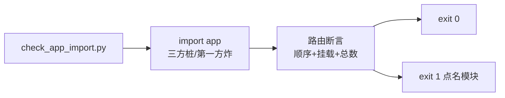

# 2026-09-03 门禁脚本固化 + 重构收尾（config 搬迁取消）

- **日期与时间**：2026-09-03
- **任务等级**：L3（重构收尾；用户指令"继续下一步"，依据 Force §0 优先级 1）
- **版本**：V3.5.43

## 问题分析

**核心症状**：V3.5.42 的 P0（搬迁漏改 import 直到 Docker 启动才爆炸）暴露门禁缺口：
本地 `import app` 因缺三方库本来就跑不通，搬迁验证只能覆盖子集。

**根本原因**：缺一个"在依赖不全环境也能全量验证 import + 路由表"的仓库内脚本。

**受影响模块**：`backend/scripts/check_app_import.py`（新建）、`Docs/TODO/backend-reorg-plan.md`
（Phase 2 关账）、`Docs/Guide/backend-structure.md`（scripts 树）。

**候选方案对比**：config 搬迁（24 文件 churn + 门禁脚本重写 + 17 处 canonical 文档失效
+ Force SSOT 表需另行批准 + `config/runtime.py` 反向依赖 api.auth 搬后更丑）
vs 取消（config 是干净小包，留顶层最优）→ **取消重构，转收尾**。

## 修改内容

1. **新建 `backend/scripts/check_app_import.py`**（stdlib only）：
   迭代导入 `app`，三方缺件（sqlmodel/rasterio/apscheduler/shapely/pyproj，
   均为 uv.lock 实有依赖）自动建桩重试；第一方顶层包
   （app/api/config/core/domains/services/tests/scripts）缺失立即 loud 失败；
   通过后断言路由表（6 瓦片路由齐全 + 纠偏先于通配 + download 挂载 + 总数下限）。
2. **方案文档关账**：`config/` 搬迁由"递延"改为"取消"，理由见上。
3. **结构树**：scripts 节登记新脚本。

## 修改原因

把 P0 的教训变成仓库资产；给三期重构一个明确的终点，避免为搬而搬。

## 影响范围

- 新增 1 个运维脚本；生产行为零变化。

## 解决方案

## 性能指标

非性能任务，未实测（脚本本地运行约 2s）。

## 测试方案

**Agent 已执行**：

- 脚本正常态：exit 0（桩 5 个三方顶层包，127 路由，纠偏先于通配）；
- **负向自证**：临时移走 `transform.py` → exit 1 且点名
  `第一方模块缺失……domains.tiles.rectify.common.transform`；恢复后 exit 0；
- GBK 控制台 `UnicodeEncodeError`（emoji 打印）已修为 ASCII；
- `pytest backend/tests/` 42 passed；`CheckStructureTree.py` exit 0；
  `CheckConfigRegistry.py` ✅（无新增配置项）。

**待用户实机验证**：无（纯 dev 工具 + 文档；下次目录搬迁时跑一次即是验证）。

## 变更文件清单

| 文件 | 说明 |
|---|---|
| `backend/scripts/check_app_import.py` | 新建：全量 import 门禁 + 路由断言 |
| `Docs/TODO/backend-reorg-plan.md` | Phase 2 关账：config 取消三理由 |
| `Docs/Guide/backend-structure.md` | scripts 树登记 |
| `README.md` / `Docs/Guide/CHANGELOG.md` | V3.5.43 |

## 遗留与风险

- `MAX_CONCURRENCY` 文档值旧账（仍未改，待立 L1）。
- index 暂存条目 + 根目录乱码 `stubs.txt` 误建文件（此前交接块已报，提交前处理）。

## 零散修补（同日追加，L1）

- **杂散缓存目录未被 ignore**：`backend/domains/tiles/rectify/data/gcj_rectify_cache/`
  （V3.5.42 误删失败——`rm` 的 workdir 多写了一层 `backend/`，实际删了个寂寞）。
  处理：正确删除该目录；`.gitignore` 加通用规则 `gcj_rectify_cache/`（任意层级生效，
  `backend/data/` 原规则保留）。已验证：重建杂散目录 + 放入 PNG 后 `git status` 依然干净。
  无版本号（L1 微改，记入本日志）。
