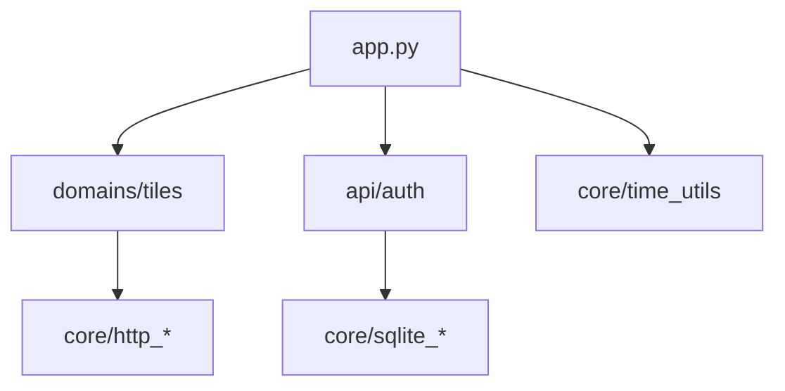

# 2026-09-03 启动崩溃修复 + Phase 2（utils→core、tests 分组）

- **日期与时间**：2026-09-03
- **任务等级**：L3（目录调整延续；用户指令"先修复bug……然后继续实施下一步"，
  依据 Force §0 优先级 1）
- **版本**：V3.5.42

## 问题分析

**核心症状（P0 启动崩溃）**：Phase 1 部署到 Docker（`/app/.venv` Python 3.12）后
uvicorn worker 在 `import_from_string` 阶段崩溃，`importlib.import_module` 失败，
后端完全起不来。用户贴的日志在真正的异常行之前被截断。

**根本原因**：`backend/api/location.py:28` 仍是 Phase 0 的旧 import
（`from tile_rectify.common.transform import wgs2gcj`），Phase 1 把 `tile_rectify/`
搬进 `domains/tiles/rectify/` 时漏改这一处 → `ModuleNotFoundError: No module named
'tile_rectify'` → `import app` 整链失败。本地未暴露的原因：本机 conda 缺三方库，
`import app` 在此环境本来就跑不通，Phase 1 只验证了 tiles 路由子集。

**受影响模块**：`api/location.py`（1 行）；Phase 2 新增 `backend/core/*`、
`backend/tests/tiles/*`。

**候选方案对比**：修 import（唯一正解，无备选；教训见"遗留"）。

## 修改内容

1. **启动修复**：`api/location.py:28` → `from domains.tiles.rectify import wgs2gcj`；
   另顺手修正 5 处被搬迁带 stale 的注释（`core/http_headers.py`×2、
   `core/net_guard.py`、`api/agent_chat/utils.py`、`domains/tiles/download/download.py` 各 1 处；
   `/proxy/**` 等 URL 语义引用保持不动）。
2. **缓存根目录误指修复（同轮发现的真 bug）**：`get_cache_dir` 用
   `__file__.parents[1]` 硬编码 backend 根，Phase 0 搬包后实际指向
   `domains/tiles/rectify/`，已在该处误建 `data/gcj_rectify_cache/` 杂散目录
   （本地实测残留，已删除；Docker 若 `GCJRE_CACHE` 未设置同样中招）。
   改为按 `pyproject.toml` 标记向上查找（找不到回退四级父目录），搬到哪里都不怕。
2. **Phase 2（部分）**：`backend/utils/` → `backend/core/` 原样下沉 5 文件
   （`http_headers/net_guard/sqlite_maintenance/sqlite_recovery/time_utils`），
   11 处 import 位点跟进；`backend/tests/tiles/` 分组（`test_tiles_router` +
   `test_url_template`，`sys.path` 改 `parents[2]`，子目录刻意无 `__init__` 保持既有导入模式）。
3. **递延**：`config/` 顶层包搬迁递延——40+ 文件 churn、零功能收益、实质回归风险，
   待其内部有实质改动时再顺手搬。

## 修改原因

先止血（P0 启动崩溃），再按三期规划继续 Phase 2。

## 影响范围

- 全后端 import 前缀（`utils.*` → `core.*`）；URL、行为、缓存零变化。
- `config` 包零改动。

## 解决方案

复现方法论（本次关键改进）：本机缺三方库时，用"迭代式精确桩" harness
（缺一件桩一件：sqlmodel/rasterio/apscheduler/shapely/pyproj，均为 Docker 实有依赖）
完整跑通 `import app` + 路由表断言。此前只验子集是漏网的直接原因——
**以后任何目录搬迁必须以全量 `import app` 为门禁**（harness 脚本在会话临时目录，
未入库；建议后续将其固化为 `backend/scripts/check_app_import.py`，见遗留）。

## 性能指标

纯重组任务，未实测。

## 测试方案

**Agent 已执行**：

- 桩 harness 下 `import app` → `APP_IMPORT_OK`，110 路由（6 瓦片 + download 6 条均挂载，
  纠偏先于通配顺序正确）；
- `_find_backend_root()` 实测指向 `backend/`，缓存目录回归 `backend/data/gcj_rectify_cache`，
  杂散 `domains/tiles/rectify/data/` 已删；
- `pytest backend/tests/` **42 passed**；
- `py_compile` 全量新/改文件通过；
- 残留扫描：`from utils.` import 零剩余；`tile_rectify|download_xyz|api.proxy` 模块引用零剩余
  （仅剩运行时契约名与出处注释）；
- 门禁 `CheckStructureTree.py` exit 0、`CheckConfigRegistry.py` ✅（无新增配置项）。

**待用户实机验证**：

1. Docker/HF 重新部署，确认 uvicorn worker 正常启动（本次崩溃的直接验证）；
2. 纠偏瓦片 + 下载任务各点一次。

## 变更文件清单

| 文件 | 说明 |
|---|---|
| `backend/api/location.py` | 启动崩溃根因：旧 import 修正 |
| `backend/core/*`（5 文件，原 `utils/`） | 原样下沉 |
| `backend/tests/tiles/*` | 瓦片测试分组 |
| 11 处 `utils.*` import + 5 处注释 | 跟进新路径 |
| `Docs/TODO/backend-reorg-plan.md` | Phase 2 状态更新 |
| `Docs/Guide/backend-structure.md` | `utils/` → `core/` 树 + tests 分组 |
| `README.md` / `Docs/Guide/CHANGELOG.md` | V3.5.42 |

## 遗留与风险

- 建议将桩 harness 固化为仓库脚本（`backend/scripts/check_app_import.py`），作为目录搬迁的
  强制门禁；本次未做（脚本在会话临时目录）。
- `config/` 递延（见上）；`MAX_CONCURRENCY` 文档值旧账仍未改。
- index 暂存条目问题延续上一交接块（非本会话写入，提交前请核对）。
