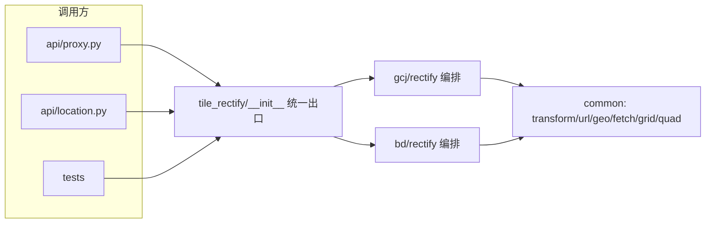

# 2026-09-03 后端瓦片纠偏域重组（bd/gcj_rectify → tile_rectify）

- **日期与时间**：2026-09-03
- **任务等级**：L3（跨模块目录调整；方案文档 `Docs/TODO/backend-reorg-plan.md` 先行，用户已批准按方案逐步执行）
- **版本**：V3.5.40

## 问题分析

**核心症状**：改一个"瓦片"需求要同时摸 5 处
（`api/proxy.py`、`api/external_proxy.py`、`download_xyz/`、`bd|gcj_rectify/`、`utils/http_headers.py`），
而前端同类需求收拢在 `domains/` 一处。

**根本原因**：后端按技术层组织、前端按业务域组织；`bd_rectify` 反向 import `gcj_rectify`
（包依赖方向歪）；`CoordinateRectify/` 只剩无源 pycache（历史改名尝试残留）；
前端注释指向不存在的 `backend/CoordinateRectify/bd/`（悬空引用）。

**受影响模块**：`backend/tile_rectify/*`（新建）、`backend/api/{proxy,location}.py`、
`backend/utils/http_headers.py`（注释）、`backend/tests/test_url_template.py`、
`frontend/.../basemapConfig.ts`（1 行注释）、`Docs/{Guide/backend-structure.md,
Architecture/basemap-source-system.md, Architecture/utility-tools.md}`。

**候选方案对比**：见 `Docs/TODO/backend-reorg-plan.md` §1（A 分步合并 ✅ / B 一步到位 ❌ / C 维持现状 ❌）。
包名弃 `CoordinateRectify` 大驼峰、取全小写 `tile_rectify`（Python 惯例 + 前车残留证据）。

## 修改内容

1. **新建 `backend/tile_rectify/`**：`common/{transform,url_template,fetch,geo,grid,quad}.py`
  （`transform/url_template/fetch/geo` 纯移动；`grid/quad` 从旧 `gcj_rectify/rectify.py` 逐字拆出，
   `_quad_warp` 改为必须显式传重采样核）、`gcj/rectify.py`（编排 + `_GCJ_RESAMPLE=BILINEAR`）、
   `bd/{rectify,mercator}.py`（仅改 import，`_BD_RESAMPLE=BICUBIC`）。
   依赖铁律 `bd → common ← gcj`；`__init__.py` 为域统一出口（15 个公开名）。
2. **删除**旧 `backend/{bd_rectify,gcj_rectify}/` 与无源 `CoordinateRectify/**/__pycache__`。
3. **调用方**：`api/proxy.py`（4 行 import → `tile_rectify`）、`api/location.py`（1 行）、
   `tests/test_url_template.py`（import + 首行 docstring）。
4. **注释/文档**：`api/proxy.py:567`、`http_headers.py` 两处注释、`basemapConfig.ts:1405` 悬空引用、
   `backend-structure.md` 结构树、`basemap-source-system.md` + `utility-tools.md` 路径引用。
   历史日志与 CHANGELOG 旧条目按规范保持不动。

## 修改原因

包依赖方向纠正 + 瓦片域收拢第一步（总体三期规划见方案文档 §2；本期只做 Phase 0）。

## 影响范围

- 纠偏四路由（`gcj2wgs/wgs2gcj/bd2wgs/wgs2bd`）的 import 前缀；运行时行为零变化（字节级验证通过）。
- 磁盘缓存目录名（`data/gcj_rectify_cache`）与内存/文件分类名刻意保持不变，不迁移数据。
- 前端零逻辑改动（1 行注释）。

## 解决方案

实施步骤：纯移动文件（`mv`，非 git）→ 写 `grid/quad/gcj-rectify/__init__` →
改调用方 import → 注释文档 → 删旧包 → 验证（下节）。

## 性能指标

纯重组任务：重采样耗时不变（BILINEAR 2.6ms / BICUBIC 4.6ms，既有数据）。

## 测试方案

**Agent 已执行**：

- `python -m py_compile` 新包 + 调用方全通过；
- `pytest backend/tests/` 40 passed；
- 新包 E2E 全量重算（bd2wgs 高德/百度 z16 天安门各 1 片，独立新缓存目录）与搬迁前输出**逐字节一致**
 （bd 43388B、gcj 54728B 均 `==`）；
- `import api.proxy`、`import tile_rectify`（15 公开名）通过；
- 门禁 `CheckStructureTree.py` exit 0、`CheckConfigRegistry.py` ✅（无新增配置项）；
- 残留扫描：`bd_rectify|gcj_rectify` 仅剩运行时契约名（`gcj_rectify_cache_dir`、
  `data/gcj_rectify_cache`，刻意保留）与"搬自旧…"出处注释。

**待用户实机验证**：

1. 重启后端，访问 `/proxy/bd2wgs/…天安门…` 与 `/proxy/gcj2wgs/…高德…` 各一张瓦片，确认正常出图；
2. `import app` 在本机 conda 直跑因缺 `sqlmodel` 失败（**与本次改动无关**的既有环境缺口，
   后端正常用 `uv`/Docker 环境运行；失败点在 `download_xyz` import 链，早于任何瓦片代码）——
   请在你常用后端环境确认 `app` 启动正常。

## 变更文件清单

| 文件 | 说明 |
|---|---|
| `backend/tile_rectify/*`（新建 11 文件） | 瓦片纠偏域：common 6 + gcj 2 + bd 3（含 `__init__`） |
| `backend/{bd_rectify,gcj_rectify}/` | 删除（含无源 `CoordinateRectify/**/__pycache__` 残留） |
| `backend/api/proxy.py` | import 切 `tile_rectify` + 1 行注释 |
| `backend/api/location.py` | 1 行 import |
| `backend/utils/http_headers.py` | 2 行注释 |
| `backend/tests/test_url_template.py` | import + docstring |
| `frontend/.../basemapConfig.ts` | 悬空注释指向新路径 |
| `Docs/TODO/backend-reorg-plan.md` | L3 方案文档（含 Mermaid） |
| `Docs/Guide/backend-structure.md` | 结构树同步新包 |
| `Docs/Architecture/basemap-source-system.md` | 8 处路径引用更新 |
| `Docs/Architecture/utility-tools.md` | 4 处路径引用更新 |
| `README.md` / `Docs/Guide/CHANGELOG.md` | V3.5.40 |

## 遗留与风险

- 后续分期（Phase 1 瓦片域收拢 proxy/download_xyz、Phase 2 `core/` 下沉）未启动，方向见方案文档。
- 顺带发现（未改，按规范仅记录）：`basemap-source-system.md:396` 的 `MAX_CONCURRENCY` 值（100）
  与代码实际（16）不符；可单独立 L1 修正。
- `backend/README.md` 无旧路径引用，无需改动。
