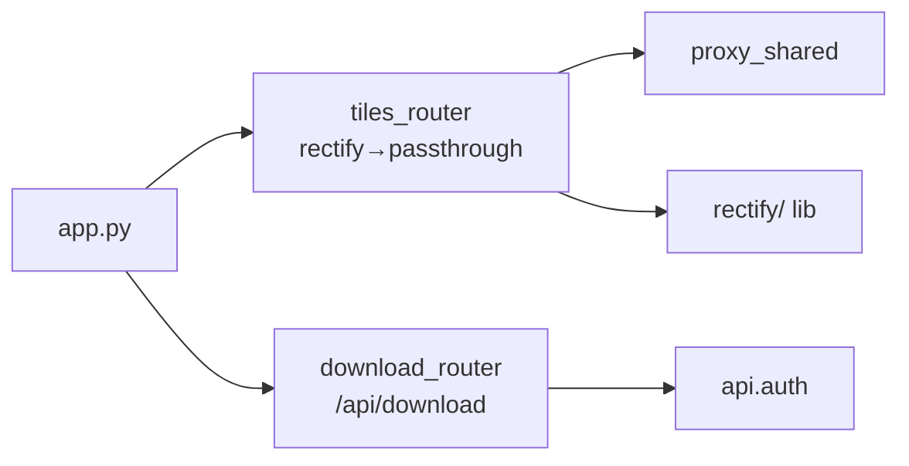

# 2026-09-03 瓦片域收拢 Phase 1（proxy 拆分 + download/rectify 归域）

- **日期与时间**：2026-09-03
- **任务等级**：L3（目录调整 + 跨模块；延续 `Docs/TODO/backend-reorg-plan.md`，
  用户指令"开始下一步"即批准执行，依据 Force §0 优先级 1）
- **版本**：V3.5.41

## 问题分析

**核心症状**：`api/proxy.py` 738 行混装三类职责（纠偏路由 / 直通代理 / 通用 infra），
`download_xyz/` 孤立于顶层，刚建好的 `tile_rectify/` 与 HTTP 层分居两处。

**根本原因**：后端按技术层组织；瓦片相关代码散在 4 个顶层位置。

**受影响模块**：`backend/domains/tiles/*`（新建）、`backend/app.py`（接线）、
`backend/api/proxy.py` + `backend/download_xyz/` + `backend/tile_rectify/`（删除）、
`backend/tests/`（1 改 1 增）、`Docs` 活文档 4 处。

**候选方案对比**：
`external_proxy.py`（高德/Nominatim/EPSG/IP 的 JSON/文本代理）经研判**不是瓦片**，
保持不动——只搬真正的瓦片三件套（纠偏路由/直通路由/下载）+ 底座库。

## 修改内容

1. **`api/proxy.py` 按节注释字节级拆分**（拆分脚本见会话临时目录，未入库；
   拆后经 AST 校验：旧文件全部函数/类在新文件中恰出现一次且 `ast.dump` 一致）：
   `domains/tiles/proxy_shared.py`（内存缓存/限流/出站客户端/SSRF/请求头/PROXY_* 配置）、
   `domains/tiles/routes_rectify.py`（4 纠偏端点 + `_resolve_gcj_*`）、
   `domains/tiles/routes_passthrough.py`（ships66 + 通配）。
2. **`download_xyz/` → `domains/tiles/download/`、`tile_rectify/` → `domains/tiles/rectify/`**
   纯移动；删旧顶层三处（无 shim，同仓原子发布）。
3. **`domains/tiles/__init__.py`** 聚合 `tiles_router`（纠偏先于通配，顺序即正确性，
   模块文档 + `tests/test_tiles_router.py` 双锁定）；下载路由 intentionally 不聚合
   （重依赖隔离），`app.py` 维持 keepalive → tiles → external → … → download 挂载顺序，
   URL 零变化（前端零改动）。
4. **文档**：`backend-structure.md` 结构树（删 `api/proxy.py`、`download_xyz/`、`tile_rectify/` 条目，
   新增 `domains/tiles/` 树）、`basemap-source-system.md`（5 组引用）、`utility-tools.md`（4 组引用）、
   方案文档 §4（Phase 1 细化 + Mermaid）；`download.py:612` 注释更新。

## 修改原因

总体三期规划 Phase 1（方案文档 §2）：瓦片域收拢，改瓦片需求只进 `domains/tiles/` 一处。

## 影响范围

- 纠偏 4 路由 + ships66 + 通用代理 + `/api/download/*`：URL 与行为零变化（路由表实测 + 输出字节一致）。
- `app.py` import 前缀；`download/` 内部 `api.auth` 引用保持绝对路径不变。

## 解决方案

实施步骤：读透三块 → 拆分脚本切片 → AST 等价校验 → 挪目录改前缀 →
聚合出口 → 删旧包 → 路由表/字节验证 → 文档门禁。

## 性能指标

纯重组任务，未实测（重采样耗时沿用既有数据）。

## 测试方案

**Agent 已执行**：

- 新三文件 `py_compile` + 全后端 `py_compile` 通过；
- AST 等价：旧 `proxy.py` 全部函数/类在新文件中恰出现一次且逻辑一致；
- `pytest backend/tests/` **42 passed**（含新增 `test_tiles_router.py` 2 项：6 路由齐全 + 纠偏先于通配）；
- 路由表实测：`['/proxy/gcj2wgs/…', '/proxy/wgs2gcj/…', '/proxy/bd2wgs/…', '/proxy/wgs2bd/…',
  '/tiles/ships66/…', '/proxy/{target_url:path}']`，顺序正确；download 6 路由；
- E2E（新包路径全量重算，独立新缓存目录）：bd/gcj z16 天安门输出与 Phase 0 参照**逐字节一致**
  （缓存命中 10 文件中同时含两参照哈希）；
- 门禁 `CheckStructureTree.py` exit 0、`CheckConfigRegistry.py` ✅（无新增配置项）。

**待用户实机验证**：

1. 常用后端环境（uv/Docker，非本机缺 `sqlmodel`/`rasterio` 的 conda）启动 `app`，
   确认路由表与 HF 行为正常；
2. 前端底图（百度 WGS/高德纠偏/海图/下载任务）各点一张，确认 URL 零变化生效。

## 变更文件清单

| 文件 | 说明 |
|---|---|
| `backend/domains/tiles/{__init__,proxy_shared,routes_rectify,routes_passthrough}.py` | 新建：聚合出口 + infra + 纠偏路由 + 直通路由 |
| `backend/domains/tiles/{rectify,download}/` | 由 `tile_rectify/`、`download_xyz/` 纯移动（含 `__init__` 补齐） |
| `backend/domains/__init__.py` | 新建占位 |
| `backend/api/proxy.py` 等三处顶层旧包 | 删除 |
| `backend/app.py` | 接线改 `domains.tiles`（挂载顺序/变量名不变）+ 头注释 |
| `backend/tests/test_url_template.py` | import 跟进 |
| `backend/tests/test_tiles_router.py` | 新增：路由顺序回归锁定 |
| `Docs/TODO/backend-reorg-plan.md` | §4 Phase 1 细化 + Mermaid |
| `Docs/Guide/backend-structure.md` 等 3 活文档 | 树与路径引用同步 |
| `README.md` / `Docs/Guide/CHANGELOG.md` | V3.5.41 |

## 遗留与风险

- 本机 conda 缺 `sqlmodel`/`rasterio`（无包索引不可装）：`domains.tiles` 全量 import 与
  `import app` 在此环境无法直跑，已用桩模块验证路由表 + 真实 E2E 走 lib 层；
  用户须在常用后端环境做一次启动确认（上条待验证 1）。
- Phase 2（`core/` 下沉、tests 分组）未启动。
- 先前遗留（`MAX_CONCURRENCY` 文档值 100 vs 代码 16）仍未改。
