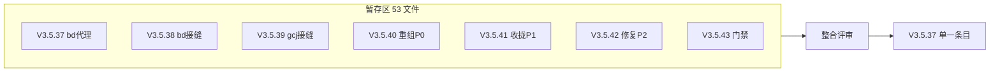

# 2026-09-03 暂存区整合评审与单版本压合（V3.5.37）

- **日期与时间**：2026-09-03
- **任务等级**：L2（评审 + 修 bug + 文档版本整理；用户可改判）
- **版本**：V3.5.37（压合后单一版本；依据 §0 优先级 1，用户明确指令豁免 §5"不合并"条款，仅本次生效）

## 问题分析

**核心症状**：暂存区积压 53 个文件（+2384/−499），名义横跨 V3.5.37→V3.5.43 共 7 个版本；
用户要求 code review 后压成一个统一版本 V3.5.37 并给出 commit message。

**根本原因**：多会话连续施工、边做边暂存，未及时提交，导致 7 个微版本堆积在 index 中。
经核查暂存区与工作区完全一致（无未暂存改动、无 untracked 文件），压合是安全的。

**受影响模块**：`backend/domains/tiles/`、`backend/core/`、`backend/app.py`、
`backend/api/location.py`、前端底图 3 文件、README/CHANGELOG/结构树/架构文档。

## 修改内容

1. **评审发现并修复 2 处问题**（逻辑零 bug）：
   - BUG-1：`domains/tiles/rectify/bd/rectify.py:16` docstring 仍写旧路径
     `utils/http_headers.py`（Phase 2 已搬 `core/`）→ 已改；
   - BUG-2：`scripts/check_app_import.py:14` docstring typo "bawchron" → "覆盖"。
2. **版本压合**：CHANGELOG 的 7 个条目合并为 1 个 `### V3.5.37 (2026-09-03)`（三节：
   代理上线 / 接缝修复 / 瓦片域重组，附 6 个分项日志链接）；README 三处改 V3.5.37，
   演进表缩为单行，注与"更早版本"行同步回 V3.5.36；`check_app_import.py` 与
   `.gitignore` 中悬空的 "V3.5.42" 字样改中性表述。
3. **保留**：6 个分项 LLM 日志与 `backend-reorg-plan.md` 原样不动（审计链）；
   历史条目（含 08-25 的 V3.5.38 追认条目）不动；内部缓存分类名（`*2`）不动。

## 修改原因

用户明确指令：多次不规范暂存整合为一个统一版本 V3.5.37（有 V3.5.35 归并先例）。

## 影响范围

版本叙事层（README/CHANGELOG）+ 2 处注释 typo；运行时行为零变化。

## 解决方案

先全量评审（stale 引用扫描 / 已删路径引用 / 结构树一致性 / AST 拆分无损复核 /
pytest + tsc + 双门禁 / 路由顺序与接线复核），修 2 处文字问题，再做版本压合，
最后重跑验证。候选方案（保留 7 版本 vs 压合）经提问由用户定夺为压合。

## 性能指标

非性能任务，未实测。

## 测试方案

**Agent 已执行**：`pytest` 42 passed；`tsc --noEmit` exit 0（暂存 .ts 内容未动，结论有效）；
`CheckStructureTree.py` exit 0；`CheckConfigRegistry.py` ✅；
旧 `api/proxy.py` 24 函数 + 常量在新三分文件中恰出现一次（AST 复核）；
路由挂载顺序（纠偏先于通配）与单挂载复核通过。

**待用户实机验证**：Docker 重启后点一张百度纠偏瓦片 + 一张高德纠偏瓦片 + 下单一个下载任务；
`git commit`（message 见交接块）+ `push` 由用户执行。

## 变更文件清单

本次会话实际改动（其余 53-5=48 个暂存文件仅评审、未动）：

| 文件 | 说明 |
|---|---|
| `backend/domains/tiles/rectify/bd/rectify.py` | BUG-1：docstring 旧路径修正 |
| `backend/scripts/check_app_import.py` | BUG-2：typo 修正 + 去悬空版本号 |
| `.gitignore` | 去悬空版本号（规则本身不变） |
| `Docs/Guide/CHANGELOG.md` | 7 条目合并为单一 V3.5.37 |
| `README.md` | 三处版本号 + 演进表缩为单行 |
| 本日志 | L2 会话记录 |

## 遗留与风险

- HEAD 历史中已提交的不规范 message（`后端监控调整域名` 等）无法通过本次 squash 修复，
  改写历史需 rebase（规范禁止），如需整理请用户自行决定。
- 历史遗留的 08-25 `V3.5.38` 追认条目与本次 V3.5.37 单一条目在数字上不连续，
  属仓库既有编号混乱，保持原样，仅此注明。
- 6 个分项日志内部仍写各自 "V3.5.4x" 版本号，属会话审计原貌，刻意保留。
