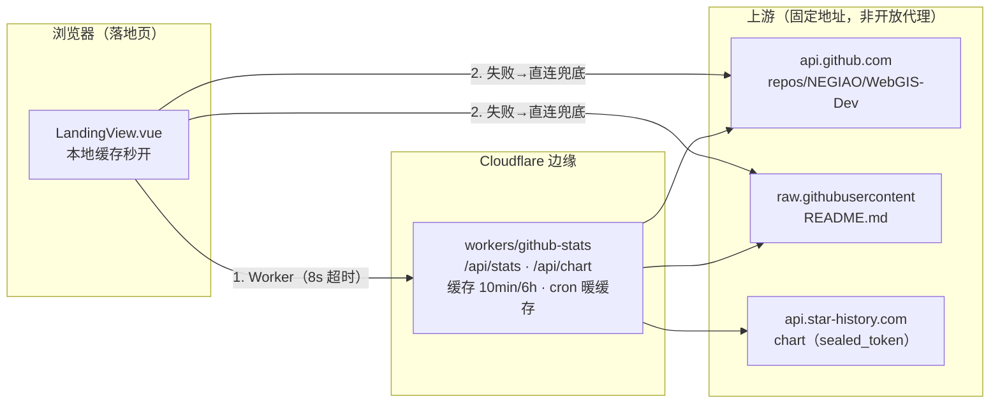

# V3.5.38 落地页开源认可区 + Cloudflare Worker 边缘数据接口

- **日期与时间**：2026-09-10 11:40（北京时间）
- **任务等级**：L2 常规（功能开发 + 新增文件 `workers/github-stats/`，未动架构与依赖）
- **规范依据**（§0）：用户明确指令（P1，Worker 方案、自定义域名、`api.negiao.cn` 均为用户逐项确认）
  + 本文件流程（P2）。§11 合规性专项分析见「遗留与风险」末尾。

## 问题分析

- **核心症状**：落地页（面试简历入口）无社区认可展示；且 `api.github.com` /
  `raw.githubusercontent.com` 在国内直连不稳定、匿名限流 60 次/小时/IP。
- **根本原因**：浏览器直连 GitHub 公共 API 的链路质量不可控；版本号曾写死在文案里，
  与 README 唯一源脱节。
- **受影响模块**：落地页首屏（`LandingView.vue`）、首屏 i18n 同步包（`core.js`）、
  前端公开配置（`publicRuntime.ts` + `deploy/.env*`）、新增边缘服务（`workers/`）。

## 修改内容

1. 落地页 Hero 首屏 Stars/Forks 实时 pills（含实时/缓存呼吸灯）；技术栈下方新增
   「开源认可」独立区块（大数字 + 更新日期 + 白底 Star History 趋势图限宽 760px +
   项目渊源说明 + README 动态版本号 `{version}` 插值）。
2. 新增 `workers/github-stats/`：`GET /api/stats`（Stars/Forks/版本号一次拿全，边缘缓存
   10 分钟）、`GET /api/chart`（趋势图 SVG 代理，缓存 6 小时）、cron 每 15 分钟暖缓存；
   已部署 `webgis-github-stats.negiao.workers.dev`，自定义域名 `api.negiao.cn` 已绑生效；
   `GITHUB_TOKEN` 已由用户设为 wrangler secret（限额 60/h → 5000/h）。
3. 前端数据链路：**本地缓存秒开 → Worker（8s 超时）→ 直连 GitHub → 占位**；
   `VITE_GITHUB_STATS_WORKER_URL` 为空自动降级，零配置风险。
4. 版本 V3.5.37 → V3.5.38（README 三处 + CHANGELOG 条目 + 本日志）；
   `catalog.py` 登记新 key；`project-structure.md` 根树补 `workers/` 条目。

## 修改原因

预推免面试（9.16）在即，项目将放入简历，落地页是考官可能点击的线上入口，
必须首屏即见实时社区认可，且在国内网络下稳定可达。版本号以 README 为唯一来源，
发布新版时落地页自动跟进、零额外操作。

## 影响范围

- 落地页（`/#/`）：新增网络请求（Worker/直连二选一）与本地缓存读写，失败永不白屏；
  其余路由零影响。
- 构建产物：新增 `GITHUB_STATS_WORKER_URL` 常量（`deploy/.env` 已填 `https://api.negiao.cn`）。
- 外部依赖：新增 Cloudflare Worker（独立服务，与 HF Space 无交互）；GitHub 公共读 API。
- 后端：零改动（仅 `catalog.py` 登记一个前端 L1 key，无读取代码）。

## 解决方案

- 选型对比：①前端直连 GitHub（现状，国内不稳定）②后端代理（后端在 HF Space，
  自身在国内同样不可达，且增加后端负载）③ **Cloudflare Worker 边缘聚合+缓存（采用）**：
  境外抓源极稳、边缘缓存抗限流、cron 暖缓存保面试零等待、自定义域名国内连通好。
- 版本号解析前后端同构三档：①"当前版本 Vx.y.z"声明 → ②版本演进表首行
  （避开正文 Docker 旧版本号，实测删声明行仍正确）→ ③页脚 ``；全失败用无版本号兜底文案。
- sealed_token 内置 Worker 默认值：该 token 已在 README 公开，安全等级无变化，仅为开箱即用，
  轮换走 `wrangler secret put STAR_HISTORY_SEALED_TOKEN`，无需改代码。

## 性能指标

未实测（非性能任务）。定性：首屏本地缓存同步渲染零等待；Worker 命中时一次请求替代原来
两次直连；cron 暖缓存使面试时段缓存必热。线上实测 `/api/stats` 200（`X-Cache-Status: HIT`），
`/api/chart` 200（`image/svg+xml`，65KB）。

## 测试方案

### Agent 已执行

- `node --check workers/github-stats/src/index.js`：通过。
- 版本解析函数对照本地 README 实测：正常 `V3.5.37`；删"当前版本"行仍 `V3.5.37`
  （旧实现曾误命中 Docker `V3.5.10`，已修正为版本表首行优先）。
- 线上 `/api/stats`（workers.dev 与 `api.negiao.cn` 双域名）返回
  `{"stars":29,"forks":10,"updatedAt":"2026-09-10T00:40:20Z","version":"V3.5.37"}`；
  `/api/chart` 200/65KB 真图。
- `npx eslint src/app/LandingView.vue src/config/publicRuntime.ts src/locales/core.js`：零报错。
- `npm run build`：通过（28~34s），产物确认含 `https://api.negiao.cn`。
- `npx tsc --noEmit`：零报错（EXIT 0）。
- `python Scripts/CheckConfigRegistry.py`：7 项全绿（catalog 124 key，含新增）。
- `python Scripts/CheckStructureTree.py`：EXIT 0（481 文件零漂移； workers/ 属根树，已手同步）。
- §11.2 红线自查四条：REDLINE-1/2 仅二进制瓦片缓存与 `maxRayDistance`（体积云射线 march 术语）
  子串误报、REDLINE-3 仅 `__pycache__` 陈旧字节码误报——**本次新增/改动内容零命中**；
  REDLINE-4 生产基线（`ALLOW_PRIVATE_HOSTS`/`RATE_LIMIT`）CLEAN。

### 待用户实机验证

1. `commit + push` 后等 CI 部署完，用手机流量打开线上落地页：首屏秒出 29★/10 forks
   （数字允许正常增长），下滑趋势图为白底图，点击跳 star-history 交互页。
2. DevTools Network 确认落地页请求的是 `https://api.negiao.cn/api/stats`（而非直连 GitHub）。
3. 发新版时只改 README"当前版本"，15 分钟后验证落地页版本号自动跟进。

## 变更文件清单

- `frontend/src/app/LandingView.vue`：开源认可区模板/样式 + Worker 优先三级数据链路。
- `frontend/src/locales/core.js`：`landing.oss*` 中英 13 条（含 `{version}` 插值与 fallback）。
- `frontend/src/config/publicRuntime.ts`：新增 `GITHUB_STATS_WORKER_URL` 导出。
- `workers/github-stats/src/index.js`（新增）：边缘函数。
- `workers/github-stats/wrangler.toml`（新增）：部署配置 + 15 分钟暖缓存 cron。
- `deploy/.env` / `deploy/.env.local` / `deploy/.env.example`：新增 `VITE_GITHUB_STATS_WORKER_URL`
  （生产值 `https://api.negiao.cn`，本地留空即直连）。
- `backend/config/catalog.py`：登记 `VITE_GITHUB_STATS_WORKER_URL`（L1 非密）。
- `README.md`：三处版本号 V3.5.37 → V3.5.38（简介/演进表新增首行/页脚）。
- `Docs/Guide/CHANGELOG.md`：顶部追加 V3.5.38 条目。
- `Docs/Guide/project-structure.md`：根树补 `workers/` 条目。
- `.gitignore`：新增 `.wrangler/` 忽略（wrangler 本机状态，不入库）。

## 零散修补（L1，不单独立版本）

- 2026-09-10 12:00（北京时间）：README 顶部徽章行追加 Stars/Forks shields 徽章
  （`github/stars` + `github/forks`，链接到 stargazers/forks 页，URL 实测 200）。
  版本徽章未加：版本号 SSOT 在正文"当前版本"行，静态徽章需手改，违反单一来源。
  改动文件：`README.md`（+2 行）。
- 2026-09-10 12:10（北京时间）：README「版本演进」章节顶部追加 Star History 趋势图
  （用户提供的 sealed_token 深浅色自适应 snippet，标题降为 `###` 归入章节内）。
  解析安全性复核：新增 HTML 块不含"当前版本"/`| **Vx.y.z** |` 表格行/`‹sub›V`，
  不干扰构建期与运行期三档版本号解析（首行仍为 V3.5.38）。改动文件：`README.md`。
- 2026-09-10 12:20（北京时间）：国内可达性加固——趋势图补图片双链路容错
  （Worker 图床 `@error` → 降级直连 star-history 再试 → 全断则隐藏裂图、
  显示虚线占位文案 `ossChartUnavailable`）。改动文件：`LandingView.vue`、
  `src/locales/core.js`（中英各 +1 key）。构建通过，ESLint 零报错。

## 遗留与风险

1. **§11 合规性说明（已评估，无违反）**：①本 Worker 上游地址全部硬编码
   （GitHub 公共读 API + star-history 图表），无用户可控目标，属封闭边缘 API，
   非"转发/隧道/内网穿透"类工具，与 HF Space 无任何交互，不触碰封号风险源；
   仓库既有实践（`publicRuntime.ts` 注释）本就使用 Cloudflare 边缘缓存托管 Cesium 资产。
   ②Worker cron 仅暖自身边缘缓存，不访问 HF Space，不属"防休眠"项。
   ③`GITHUB_TOKEN` 为 GitHub PAT，经 wrangler secret 存 Cloudflare 侧，未入仓库，
   非 L3 入库项。④sealed_token 已在 README 公开，内置 Worker 未降低安全等级。
2. `sealed_token` 背后的 fine-grained PAT 会过期：图表变 "restricted" 提示图时，
   去 star-history.com 重新生成并 `wrangler secret put STAR_HISTORY_SEALED_TOKEN`。
3. `GITHUB_TOKEN` 有效期 90 天：过期前 GitHub 会邮件提醒，重新生成再 `put` 一次；
   过期未换的最坏情况 = 回退到本次改动前的直连行为，不白屏。
4. `api.negiao.cn` 主机名现归本 Worker 独占；后续其他 Worker 需用它时走 Routes 路径分发。
5. 未做事项：star-history 深色模式已按用户要求固定白底；如需恢复自适应另起 L1。
6. ⚠️ commit 前用户必做：`workers/github-stats/.wrangler/`（wrangler 本机状态，
   部署时自动生成）当前处已暂存/未忽略状态——`.gitignore` 已补规则，但已暂存项不受
   新规则影响，commit 前必须执行
   `git restore --staged workers/github-stats/.wrangler`（或 `git rm -r --cached` 同路径）
   将其移出暂存区。已核验该文件仅含账号 ID 无 token，但仍不许入库。

## 后续增补（用户 P1 指令：不新开版本，全并入 V3.5.38）

- 用户否决 §5 顺延方案：已 push 的 `84b95f52`（标题 V3.5.38，HF 合规整改）与本批次
  同号共存，不另开 V3.5.39/V3.5.40。该 38 commit 未做 README/CHANGELOG 仪式，
  缺口已知并经用户确认接受，不回填。
- 求 Star/Fork 引导（实现 + 两次改款：实心绿渐变→浅底卡→标题下无框独立条，均未嵌卡片保和谐）并入本版：
  `LandingView.vue`（`.oss-support*` 模板样式）+ `core.js`（`ossSupportText/StarBtn/ForkBtn`
  中英）；README 38 行与 CHANGELOG 38 条目已追加横幅描述。
- 异常记录：本批次独立日志 `2026-09-10-landing-star-support-cta.md` 在创建成功后离奇消失，
  另 README/CHANGELOG 在 11:58 及 12:02 出现非本会话改写痕迹（含一次换行符翻转）。
  用户确认无其他 AI 会话，极可能是其本地编辑器/同步行为所致。为防互踩，
  相关横幅记录折叠于本节，不再重建独立文件；后续文档改动改为用户主笔、Agent 只验不写。
