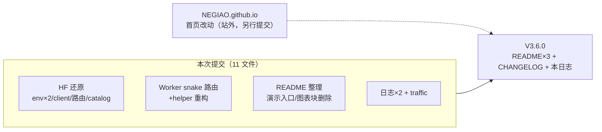

# V3.6.0 暂存区 Code Review + 版本进入

- **日期与时间**：2026-09-11（UTC）
- **任务等级**：L2（code review + 版本仪式；目标版本由用户指定为 V3.6.0 minor bump，
  覆盖默认 +1 修订）
- **规范依据**（§0）：用户明确指令（P1）+ 本文件流程（P2）。

## 问题分析

- **核心症状**：暂存区 11 文件待提交，需在版本进入前审查每项改动是否正确、安全、可提交。
- **根本原因**：多会话并行 + 用户本地 co-edit 导致三类风险——①版本号撞车
  （已 push 的 `84b95f52` 标题亦为 V3.5.38）；②已提交内容被误删入暂存
  （README Star History 图表块）；③ `.wrangler` 本机状态险些入库。
- **受影响模块**：落地页入口链路、后端 API 客户端、Worker 路由、版本文档线。

## 修改内容（本任务新增，非 staged 复述）

1. README 三处进入 V3.6.0（简介/演进表新增首行/页脚，演进表恒定 3 行）。
2. CHANGELOG 顶部追加 V3.6.0 条目（含 38 同号共存注释）。
3. 本日志文件。

## 审查结论（逐项）

- ✅ `client.js` 负缓存删除：精确逆操作，无残留符号（grep 零命中）。
- ✅ `LandingView.vue` 3× `to="/register"`：精确逆操作。
- ✅ `publicRuntime.ts` 缺省归零 + `catalog.py` 同步：缺 env 构建不再静默旁路鉴权。
- ✅ `.env` / `.env.local` 置 0：与注释"后端恢复后置 0"一致。
- ✅ Worker 重构 + snake 路由：`slice(5)` 取 variant 正确；已线上实测 200；
  固定上游，非开放代理，无红线触碰。
- ✅ `.wrangler` 未在暂存区（用户已移出）。
- ⚠️ README Star History 图表块被删：已向用户确认，**明确删除**（非误删）。
- ⚠️ README 演示链接回到根域名（用户手改，忠于封号前原文）：接受。
- ✅ 无新增文件/新 key：结构树与 catalog 无需变更。

## 修改原因

用户指令：审查暂存区并进入 V3.6.0。minor bump 理由：自 V3.5.38 起累积了 Worker 新服务、
HF 还原等面向用户的行为变更，patch 位已不足以表达。

## 影响范围

- 前端行为：未登录访问恢复进登录注册页；后端抖动不再触发 30s 熔断。
- Worker 线上已是 snake 新版（含本次 staged 内容——用户要求代 deploy 已执行，
  与本次提交解耦，提交仅为代码归档）。
- NEGIAO.github.io 首页改动不在本仓提交内，需用户在该仓单独提交。

## 解决方案

- 撞版本：以 V3.6.0 消解，不改写已 push 历史；CHANGELOG 注记共存事实。
- 图表块删除：用户明确确认后接受，记入本日志。

## 性能指标

未实测（review + 文档任务；代码改动性能影响为零或正向：删除熔断逻辑减少分支）。

## 测试方案

### Agent 已执行

- `git diff --cached` 全量 11 文件逐项审查（结论见上）。
- `node --check workers/github-stats/src/index.js`：通过（重构后）。
- 线上 snake 双路由 + stats 复测：200（部署时已验证）。
- `npm run build` + `tsc --noEmit` + ESLint + 双门禁 + §11.2 红线：
  终验全绿——ESLint 零报错；build ✓（24.91s）；tsc 零报错；
  CheckConfigRegistry 7 项全绿；CheckStructureTree 481 文件零漂移；
  红线 R1/R4 全净，R2/R3 仅历史存量子串误报（`PROXY_*_KEEPALIVE_*` 键名、
  体积云 `maxRayDistance` 术语、陈旧 `__pycache__`），本次新增内容零命中。

### 待用户实机验证

1. `git add -A`（含本任务新增 3 文件）后复核 `git status` 无 `.wrangler`，按 message 提交推送。
2. 上线后：无痕窗口确认落到登录页；落地页 Star/Fork 数据正常；NEGIAO.github.io
   另仓提交后验证贪吃蛇随主题切换。

## 变更文件清单

- `README.md`：简介/演进表/页脚 → V3.6.0（+ 演进表首行）。
- `Docs/Guide/CHANGELOG.md`：顶部追加 V3.6.0 条目。
- `Docs/LLM_record/26-09/2026-09-11/2026-09-11-code-review-v360.md`：本文件。
- 其余 11 个 staged 文件：见审查结论（不复述）。

## 遗留与风险

1. `84b95f52` 与本仓 README 的 V3.5.38 行同号：历史遗留，用户接受，自 V3.6.0 起消解。
2. 保活全套永不恢复（§11），已在 hf-restore 日志与本 entry 注明。
3. NEGIAO.github.io 的 index.html 改动（snake URL + 主题同步 JS）尚未提交——提醒用户。
4. Worker 线上版本先于代码提交生效：顺序倒置但内容一致（`git diff` 已核对），下不为例；
   建议以后先提交再 deploy。
