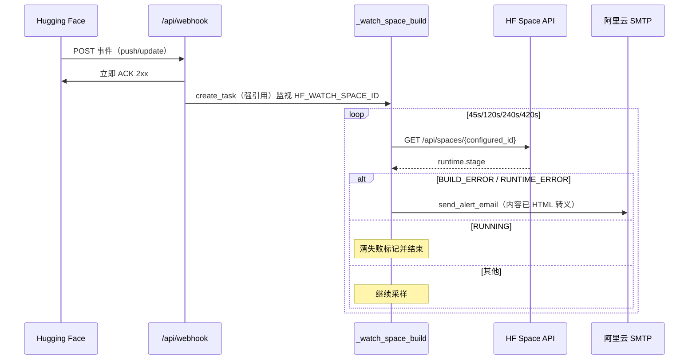

# 2026-09-12 V3.6.1 统一版本：HF Webhook 告警 + Cesium 移动端导航/欢迎语

## 日期与时间

2026-09-12 09:39（初稿）· 2026-09-12 10:20（code review 修复与版本归并）

## 任务等级

L2（新增后端文件 + 功能 + 配置；并归并前端 debug 改动进同一修订号）

## 问题分析

- **核心症状**：
  1. HF 邮件：`https://negiao-webgis.hf.space/api/webhook` 24h 内连续 3 次失败，webhook 被禁用。
  2. 需要 Space **构建/运行失败时邮件通知**。
  3. 本地工作区另含前端改动（欢迎语 + Cesium 导航移动端适配），origin 已有 `dd9b47ba` debug 提交，与 webhook 任务混在暂存区，版本叙事分裂。
- **根本原因**：
  1. 后端无 `/api/webhook` 路由 → 404。
  2. HF Webhook **只在 push/update 投递**，不推构建结果；须事后查 Space API `runtime.stage`。
  3. 多批次未规范变更堆在暂存区（§2.5 范围污染 + 分支落后 origin 1 commit）。
- **受影响模块**：后端 webhook/邮件/配置、启动 allowlist、前端 OL 欢迎语、Cesium navigation 样式、文档/版本号。
- **候选方案**：A 仅空 ACK（不满足告警）；**B ACK + 后台轮询 stage + SMTP（选定）**；C 仅 CI 发信（盖不住 HF 镜像构建失败）。
- **选定理由**：兼容 HF 事件模型，复用阿里云 SMTP；前端改动按用户要求 **归并进同一 V3.6.1**，避免 V3.6.1 与 `dd9b47ba` 双轨。

## 修改内容

### 后端 Webhook（V3.6.1 主体）

1. 新增 `backend/api/webhook.py`：`GET/POST /api/webhook`；可选 L3 `HF_WEBHOOK_SECRET`；ACK 后后台轮询。
2. `email_service.py`：`send_alert_email` / `_build_alert_html`（title 强制 `html.escape`）。
3. `app.py`：挂载路由；allowlist 加 `/api/webhook`。
4. 配置：`HF_WEBHOOK_SECRET`（L3）、`HF_ALERT_EMAIL`、`HF_WATCH_SPACE_ID`（L1）已登记 catalog + example + `.env` + `.env.local`。
5. 结构树 + 单测 + README 三处版本号 + CHANGELOG 摘要链接。

### Code Review 修复（同版本内）

| 问题 | 处理 |
|---|---|
| 邮件 HTML 未转义 | `space_id`/`stage`/日志 URL 在拼装前 `html.escape`；`_build_alert_html` 对 title 转义 |
| payload 可驱动任意 Space 查询/刷信 | **监视目标只读 `HF_WATCH_SPACE_ID`**，不信任 event.repo.name；`_SPACE_ID_RE` 校验配置值 |
| 死代码 `key = ...` | 已删除 |
| `create_task` 无强引用 | `_watch_tasks` set + done 回调 |
| 监视任务异常被静默 discard | `_on_watch_done` 记录 `task.exception()` |
| 应用关闭未取消监视任务 | 新增 `shutdown_webhook_watches()`，`app.py` lifespan 末尾调用 |
| 测试断言过弱 / 与新语义不符 | 改为「忽略 payload repo」「正则拒绝注入」「shutdown 空跑」用例 |
| CHANGELOG 过长（违反 §4 SSOT） | 收成摘要 + 日志链接 |
| 暂存区混入前端 / 与 origin 双轨 | 用户要求合并为统一 V3.6.1；前端三项纳入本版本文档与 README 摘要 |

### 前端（归并进 V3.6.1，原 debug 内容）

1. `MapContainer.vue`：运维中提示 → 「欢迎使用NEGIAO的WebGIS!」
2. `cesium-navigation.css`：小屏不再 `display:none`，罗盘/缩放栏 `scale(0.8)` + 触控命中放宽
3. `CesiumContainer.vue`：注释指向 navigation css，避免重复定义

## 修改原因

- 恢复 webhook 可用性并落地失败邮件告警。
- 合并分散变更，单一版本号 V3.6.1，文档与提交范围一致。
- 安全加固：开放端点不得被任意 payload 驱动。

## 影响范围

- 公开路由 `/api/webhook`；SMTP 告警通道；配置 3 key。
- 前端：登录后欢迎文案；Cesium 移动端导航可见性与布局。
- 启动降级时 webhook 仍可 ACK。

## 解决方案

## 性能指标

未实测（ACK 路径无阻塞 IO；轮询与发信均在后台）。

## 测试方案

| Agent 已执行 | 待用户实机验证 |
|---|---|
| `py_compile` webhook / email_service | `git pull --ff-only` 后 commit + push，CI 五 Job 全绿 |
| `backend/tests/test_webhook_helpers.py` 全过 | `curl -i https://negiao-webgis.hf.space/api/webhook` → 200 |
| `CheckConfigRegistry.py` / `CheckStructureTree.py` 通过 | HF Webhooks 重新启用 |
| 平台红线 11.2 等价检索 CLEAN（无 rg，见下） | 移动端打开 Cesium 页确认导航控件；登录欢迎语正常 |
| review P0/P1 项已改代码 | 告警邮件（需 SMTP + 人为 BUILD_ERROR 或等真实失败） |

### 平台红线自查结果（11.2）

| 命令意图 | 结果 |
|---|---|
| REDLINE-1 浏览器自动化/VNC | backend、deploy 无命中 → CLEAN |
| REDLINE-2 代理/VPN/隧道 | backend、deploy 无命中 → CLEAN |
| REDLINE-3 防休眠/keepalive/telegram | backend、deploy 无命中 → CLEAN |
| REDLINE-4 生产基线 | `deploy/.env` 无破坏项 → CLEAN |

## 变更文件清单

| 路径 | 说明 |
|---|---|
| `backend/api/webhook.py` | Webhook + 安全监视告警 |
| `backend/api/auth/email_service.py` | 告警邮件 + title 转义 |
| `backend/app.py` | 路由与 allowlist |
| `backend/config/catalog.py` | 3 key 登记 |
| `deploy/.env` / `.env.example` / `.env.local` | env 同步 |
| `backend/tests/test_webhook_helpers.py` | 单测 |
| `frontend/src/domains/ol/components/MapContainer.vue` | 欢迎语 |
| `frontend/src/domains/cesium/vendors/cesium-navigation/styles/cesium-navigation.css` | 移动端导航 |
| `frontend/src/domains/cesium/components/CesiumContainer.vue` | 样式归属注释 |
| `Docs/Guide/backend-structure.md` | 后端树 |
| `Docs/Guide/CHANGELOG.md` | V3.6.1 摘要 |
| `README.md` | 版本三处 + 摘要 |
| 本文件 | 维护日志 |

## 遗留与风险

1. HF 不推构建结果；仅 push 触发观察；窗口约 420s。
2. 进程内去重，容器重启可能重发。
3. 本机无 `rg`，红线用等价检索。
4. **Git**：本地曾落后 origin 1 commit（`dd9b47ba`）。用户须先 `git pull --ff-only`；前端内容与该 commit 一致，拉取后 diff 自然收敛为 webhook/文档，版本叙事仍以本 V3.6.1 日志为准。
5. `check_app_import` 在缺三方依赖环境会误报瓦片路由，需完整环境复验。

## 遗留与风险（越权顺带发现）

无额外越权改动。
