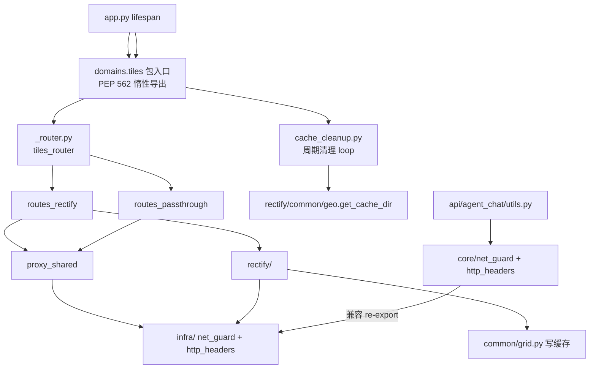

# 2026-09-12 瓦片域高聚合 + 磁盘缓存自动清理（V3.6.4）

## 日期与时间

2026-09-12 12:40（缓存清理批并入约 16:20）

## 任务等级

L2（同批合并为一次：infra 高聚合 + GCJRE_CACHE 磁盘清理；修订号 +1 → V3.6.4）

## 问题分析

### 批次 A：瓦片域高聚合

- **核心诉求**：为将来把瓦片代理/纠偏整夹迁到独立服务（含 VPS）做准备——先高聚合，**HTTP 接口零变化**。
- **现状**：纠偏/直通路由已在 `domains/tiles/`，但 SSRF 与出站头实现在 `core/`，迁移时要改多处 import。
- **受影响模块**：`domains/tiles/**`、`core/net_guard.py`、`core/http_headers.py`、`api/agent_chat/utils.py`（经 shim）。

### 批次 B：磁盘缓存自动清理

- **核心症状**：`rectify/common/grid.py` 两级文件缓存只写不删，`GCJRE_CACHE` 目录随使用无限增长。
- **根本原因**：缺 TTL/容量治理；HF Space 与小盘 VPS 上会吃满磁盘。
- **受影响模块**：`domains/tiles/cache_cleanup.py`（新）、`app.py` lifespan、`config/catalog.py`、`deploy/.env(.example)`、架构文档配置表。

## 修改内容

1. 新增 `domains/tiles/infra/`：`net_guard.py`、`http_headers.py`（自 `core/` 迁入实现）。
2. 瓦片面改为 `from ...infra import ...`：`proxy_shared`、`rectify/common/fetch`、`download/tile_engine`、`download/download`。
3. `core/net_guard.py`、`core/http_headers.py` → **兼容 re-export**（agent 等非瓦片调用方零改动）。
4. `domains/tiles/__init__.py`：PEP 562 惰性导出 +「一次性迁移（整夹拷走、排除 download/）」清单。
5. 新增 `domains/tiles/_router.py`：纠偏→通配聚合，保持 `__init__` 轻量。
6. 新增 `domains/tiles/cache_cleanup.py`：按龄删过期 → 按容量删最旧 → 剪空目录；lifespan 周期 loop（`asyncio.to_thread`）。
7. 新增配置 L1：`GCJRE_CACHE_MAX_AGE_DAYS=7`、`GCJRE_CACHE_MAX_MB=2048`、`GCJRE_CACHE_CLEANUP_INTERVAL_S=3600`（单维 0=关）；登记 catalog + `.env.example` + `.env`。
8. `app.py` lifespan：启动 `cache_cleanup_loop`，关闭 cancel。
9. 结构树 `backend-structure.md`：登记 `infra/`、`_router.py`、`cache_cleanup.py`、`scripts/test_tiles_import_order.py`、`tests/tiles/test_cache_cleanup.py`。
10. 测试：`tests/tiles/test_cache_cleanup.py`；导入顺序烟雾 `scripts/test_tiles_import_order.py`。
11. README / CHANGELOG / 架构文档配置表 → **V3.6.4**。

## 修改原因

- 用户要求：不立刻拆仓，但迁移时「移动整个文件夹 + 微小调整」即可；并要求瓦片相关代码高内聚。
- 磁盘缓存无自动回收，为后续 VPS/长期运行补齐治理。

## 影响范围

- 后端 import 路径；对外 `/proxy/*`、`/tiles/*`、`/api/download` **URL 与行为不变**。
- 磁盘：`GCJRE_CACHE` 下过期/超限瓦片文件会被周期删除（默认 7 天 / 2GB / 每小时）。
- 配置面：3 个新 L1 key；生产默认不改限流/内网放行红线。

## 解决方案

### 模块关系（变更后）

### 缓存清理策略

1. 龄：mtime 早于 `GCJRE_CACHE_MAX_AGE_DAYS` 的普通文件删除（0=关）。
2. 容：总字节仍超 `GCJRE_CACHE_MAX_MB` 时按 mtime 从旧到新删（0=关）。
3. 剪空目录；`os.walk(followlinks=False)` + `lstat`/`S_ISREG`，不删符号链接、不逃出 cache 根。

### 高聚合迁移

实现进 `domains/tiles/infra`；`core.*` 仅 re-export。迁移步骤见 `domains/tiles/__init__.py`。

## 性能指标

未实测（模块搬迁 + 文件清理；清理 I/O 走线程池，不阻塞事件循环）。

## 测试方案

| Agent 已执行 | 待用户实机验证 |
|---|---|
| `py_compile` infra / proxy_shared / download / fetch / core shims / cache_cleanup / app | 本地拉一张纠偏瓦片仍 200 |
| `from domains.tiles import tiles_router, cache_cleanup_loop`（惰性导出） | `/proxy/gcj2wgs/...` 与 `/proxy/{url}` 通配仍按序命中 |
| `from core.net_guard import ...` 兼容路径可用；agent 五符号齐 | agent 代理主机校验不回归 |
| `unittest tests.tiles.test_cache_cleanup`：9 passed / 1 skipped | 启动后约 30s 日志出现清理任务；`data/gcj_rectify_cache` 超龄文件被清 |
| `scripts/test_tiles_import_order.py` PASS | — |
| CheckConfigRegistry ✅ | — |
| 平台红线 rg 自查：1/3/4 干净；2 为 `maxRayDistance` 子串误报，无真实代理工具 | — |

**门禁说明（勿误读）**：`Scripts/CheckStructureTree.py` **只覆盖 `frontend/src` ↔ `frontend-structure.md`**，对后端结构树零覆盖。本批后端结构树为**人工核对**登记，不以该脚本绿作为后端依据。

## 变更文件清单

| 路径 | 说明 |
|---|---|
| `backend/domains/tiles/infra/*` | 新增 SSRF + 出站头实现包 |
| `backend/domains/tiles/_router.py` | 路由聚合（纠偏→通配） |
| `backend/domains/tiles/cache_cleanup.py` | 磁盘缓存按龄+按容量清理 + loop |
| `backend/domains/tiles/proxy_shared.py` 等 | import 改为 infra |
| `backend/domains/tiles/__init__.py` | 惰性导出 + 迁移清单 |
| `backend/core/net_guard.py` / `http_headers.py` | 兼容 re-export |
| `backend/app.py` | lifespan 挂/停清理任务 |
| `backend/config/catalog.py` | 3 个 GCJRE_CACHE_* L1 |
| `backend/tests/tiles/test_cache_cleanup.py` | 清理单测 |
| `backend/scripts/test_tiles_import_order.py` | 导入顺序烟雾 |
| `deploy/.env` / `.env.example` | 同步 3 键 |
| `Docs/Guide/backend-structure.md` | 结构树 |
| `Docs/Architecture/tile-rectify-system.md` | 模块表 + 配置表 |
| README / CHANGELOG | V3.6.4 |

## 遗留与风险

1. **写缓存 vs 清理竞态**：`grid.py` 落盘瞬间 cleanup 可能 unlink 同路径；属 best-effort，失败记 warning，下次命中重拉。未做文件锁。
2. 下载域 `download/` 仍依赖 `api.auth` 配额——迁出时若整包带走 download，需再剥离鉴权；**纯代理/纠偏**只带 `routes_*` + `proxy_shared` + `rectify` + `infra` + `cache_cleanup`。
3. `location.py` 仍 `from domains.tiles.rectify import wgs2gcj`——迁移后可保留 `rectify` 作依赖或复制 transform。
4. 与 V3.6.3 批次均未 push；用户 pull 后需一并整理提交。
5. `core.net_guard` shim 未导出 `normalize_host`（当前无调用方；若外部脚本依赖旧导出需补）。

## Code Review 整改（提交前）

| 问题 | 处置 |
|---|---|
| 日志未覆盖 cache_cleanup | 本文件扩为合并 L2 全章节 |
| backend-structure 漏登记 | 已补 cache_cleanup / import-order / test_cache_cleanup |
| CheckStructureTree 误标 ✅ | 改为如实说明门禁仅覆盖前端 |
| L2 缺 Mermaid | 已补模块关系图 |
| `stat_is_regular` 半公开 | 改为 `_stat_is_regular` |
| 写/清竞态未记录 | 已写入遗留与风险 #1 |
| 版本 | 合并为一次 L2，保持 **V3.6.4**（用户裁定） |
