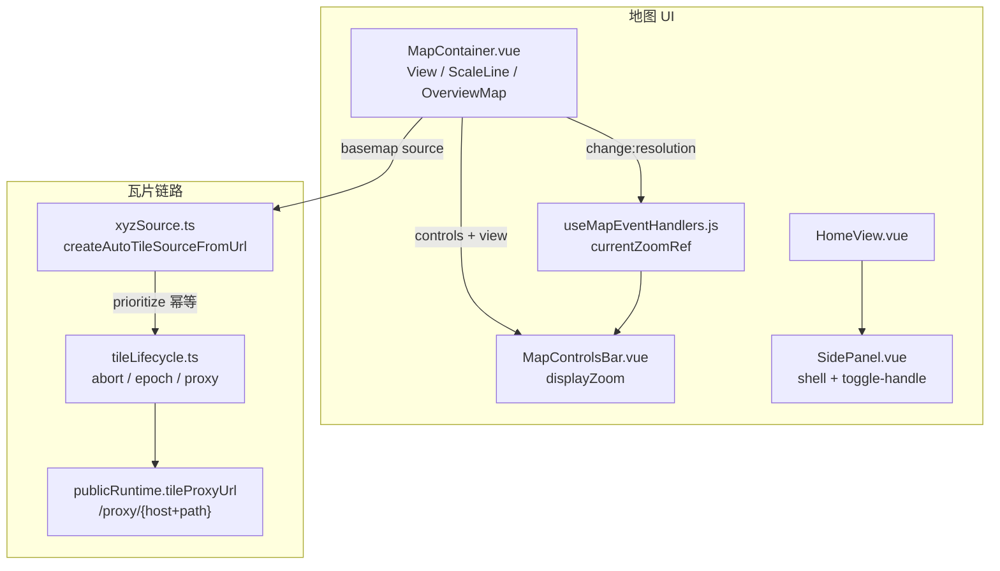

# 2026-09-19 暂存区 Code Review → V3.6.7

## 日期与时间

2026-09-19（会话内执行）

## 任务等级

**L2**（用户明确指定按 Force_command 对暂存区做 Review + 修 bug + 文档 + 整合版本 V3.6.7）

> 依据 Force_command §0 优先级 1：用户指令「不准动 git / 不准擅自 add」「整合为 V3.6.7」。Agent **未**执行任何 Git 写操作。

## 问题分析

### 核心症状

暂存区混有多次不规范提交痕迹（控件 UI、瓦片生命周期、侧栏壳层、缩放策略），需在提交前统一为 **V3.6.7**，并消除潜在 bug。

### 根本原因

1. **SidePanel 模板多一层 `
`**：shell 分层改造时闭合标签多余，Vue SFC 可能告警/结构异常。
2. **移动端侧栏收起**：对 `.info-panel-shell.collapsed` 做 `translateY(100%)`，折叠手柄与 shell 一并推出屏外，无法再次展开。
3. **鹰眼按钮底色**：注释写「浅白绿」，默认态却退化成近纯白单色渐变，与比例尺/主题不一致。
4. **tileLifecycle 代理 URL**：拼接逻辑与 `publicRuntime.tileProxyUrl` 重复；`canProxyTileUrl` 在 `TILE_PROXY_BASE_URL` 非绝对 URL 时 `new URL()` 抛错导致**整段不可代理**。
5. **缩放策略**：原 `minZoom/maxZoom` 与 `multiWorld` 默认导致难以到达 z=1；显示层 `ceil` 使低层级恒显 ≥3。

### 受影响模块

| 模块 | 文件 |
|---|---|
| OL 地图控件 / View | `MapContainer.vue`、`MapControlsBar.vue`、`useMapEventHandlers.js` |
| 瓦片请求生命周期 | `tile-source/tileLifecycle.ts`、`tile-source/xyzSource.ts` |
| 侧栏壳层 UI | `SidePanel.vue`、`HomeView.vue` |
| 文档 SSOT | `README.md`、`CHANGELOG.md`、本日志 |

### 候选方案对比

| 方案 | 说明 | 结论 |
|---|---|---|
| A. 仅改文案/版本号 | 不修模板与移动端手柄 | 否决：暂存区含真实缺陷 |
| B. Review + 最小修复 + 文档 | 修 5 类问题，不动 git | **选定** |
| C. 大范围重构 MapContainer | 抽 CSS/业务 | 否决：Force_command §3 只出不进，非本次范围 |

### 选定方案与理由

**方案 B**：在用户已暂存的功能上做 Code Review 级修复，行为与主题意图不变，只消除缺陷与文档漂移；版本号按用户指定 **V3.6.7**。

## 修改内容

1. **SidePanel.vue**：删除多余 `
`；移动端改为「只下移 `.info-panel` + shell 高度 0 + 手柄贴底 `pointer-events:auto`」。
2. **MapContainer.vue**：鹰眼折叠按钮默认背景恢复浅白绿三段渐变；比例尺末端标注注释与 `top:2px` 对齐（step `-18` + inner padding `20`）。
3. **tileLifecycle.ts**：`buildTileProxyUrl` 改用 `publicRuntime.tileProxyUrl`；`canProxyTileUrl` 兼容非绝对基址。
4. **文档**：README 三处版本 → V3.6.7；CHANGELOG 顶部条目；本日志。
5. **暂存区既有功能（Review 确认保留）**：ScaleLine/OverviewMap 主题化、View `1–22`+`multiWorld`、缩放显示 round/ceil 分层、tileLifecycle 幂等/超时/epoch、xyzSource 去二次包装、HomeView 侧栏 padding。

## 修改原因

用户要求按规范整合暂存区为统一版本，并修复潜在 bug，便于一次 commit。

## 影响范围

- 前端 OL 地图 UI（比例尺、鹰眼、缩放显示）
- 瓦片请求兜底与中断
- 右侧信息栏（含移动端）
- 版本文档 SSOT（README / CHANGELOG）

## 解决方案

见「修改内容」。代理 URL 契约与 `publicRuntime.tileProxyUrl` / VPS `/proxy/{host+path}` 一致（本仓 Space **不再**挂瓦片中转，见 app.py 注释）。

## 性能指标

未实测（无前后对比数据）。

## 测试方案

### Agent 已执行

- 通读 `Docs/Force_command.md` 全文
- `git status` / `git diff --cached --stat` / 分文件 staged diff
- 阅读 `tileLifecycle.ts`、`publicRuntime.ts`、`SidePanel.vue` 模板与移动端样式、`MapContainer.vue` 控件样式
- 文档更新：README×3、CHANGELOG、本日志
- 门禁：见下方「门禁结果」
- 平台红线 rg 自查（见交接块）

### 待用户实机验证

1. 2D 地图：比例尺三段标注（左/中/右）随缩放动态；`1 : N` 居中；缩放级别可显示 **1**，最高 **22**
2. 鹰眼 `«`/`»`：浅白绿底、内容居中；展开/折叠正常
3. 瓦片：断网或切源时 toast 仅在代理成功后出现；网络面板请求 `/proxy/{host+path}`（无协议重复）
4. 侧栏：桌面折叠手柄伸出；**移动端**收起后底部手柄仍可点、地图不被透明层挡住
5. 硬刷新（Ctrl+F5）确认 CSS/JS 生效

## 变更文件清单

| 路径 | 说明 |
|---|---|
| `frontend/src/domains/ol/components/MapContainer.vue` | ol.css、View 缩放、ScaleLine/OverviewMap 主题化、Review 微调 |
| `frontend/src/domains/ol/components/MapControlsBar.vue` | 缩放显示 low-zoom round；移动端 bottom 微调 |
| `frontend/src/domains/ol/composables/useMapEventHandlers.js` | currentZoom 取整策略（HDR + low-zoom） |
| `frontend/src/domains/ol/tile-source/tileLifecycle.ts` | 幂等包装、超时 abort、代理 URL/SSOT、canProxy 兼容 |
| `frontend/src/domains/ol/tile-source/xyzSource.ts` | XYZ 优先包装幂等化 |
| `frontend/src/domains/common/shell/SidePanel.vue` | shell 分层 + Review 修复 |
| `frontend/src/app/HomeView.vue` | 侧栏包装 padding |
| `.github/traffic.json` | 自动流量统计（非业务） |
| `README.md` | 版本三处 → V3.6.7 |
| `Docs/Guide/CHANGELOG.md` | V3.6.7 条目 |
| `Docs/LLM_record/26-09/2026-09-19/2026-09-19-staged-review-v367.md` | 本日志 |

> 本次 **无新增/删除** 源码文件 → `frontend-structure.md` 文件树无需增删条目（控件样式与生命周期仍落在既有文件内）。

## 模块关系（L2 ≥3 文件）

## 遗留与风险

- `.github/traffic.json` 为自动统计，是否纳入本 commit 由用户决定。
- 比例尺/鹰眼为视觉定制，**未**在本机浏览器实测（禁止谎报）；需用户实机验证。
- 分支落后 `origin/main` 1 commit，commit 前建议用户自行 `pull`/`rebase`（Agent 不操作 git）。
- 顺带发现（未改）：MapContainer 仍为巨型组件，样式继续堆叠与「只出不进」张力仍在，见 `Docs/TODO/bugfix-optimization-plan.md` 既有条目。

## 门禁

- CheckStructureTree / CheckConfigRegistry：见会话执行结果（交接块同步）。
- 未执行 git add/commit/push。
